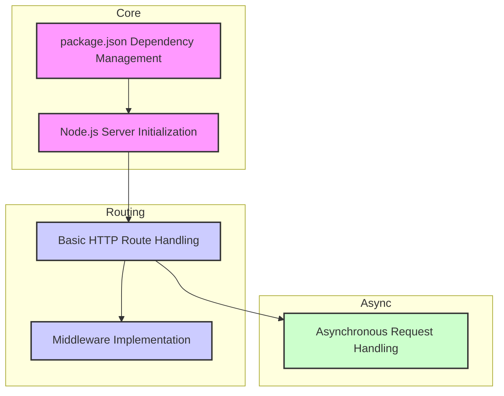
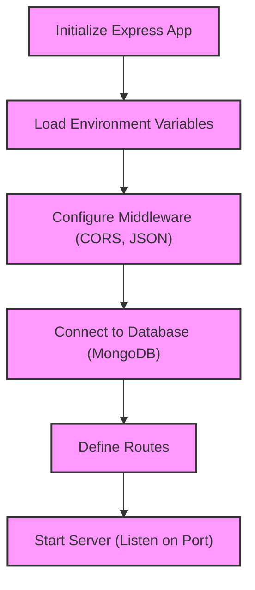
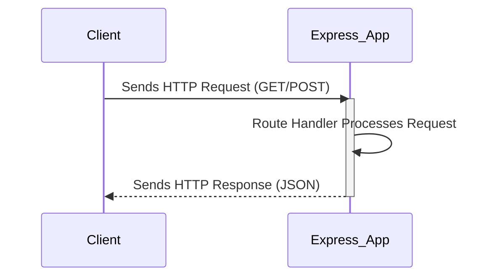
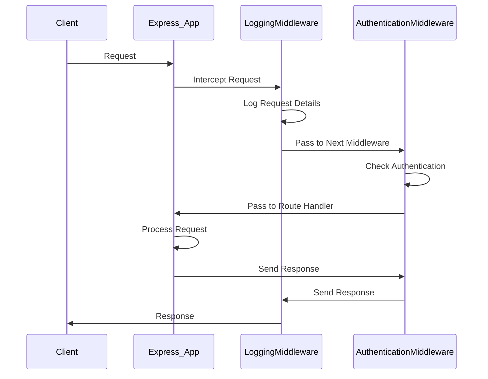
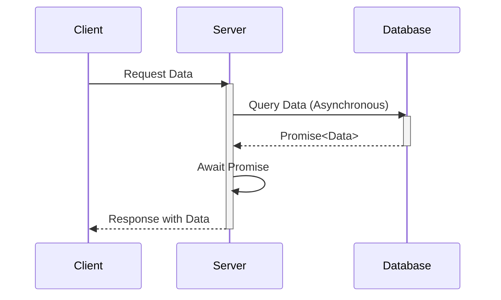
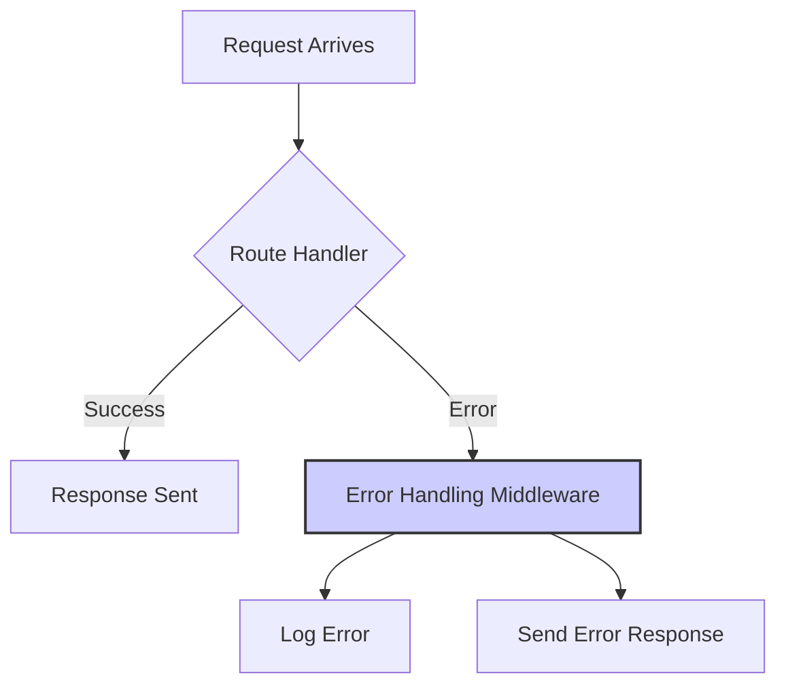
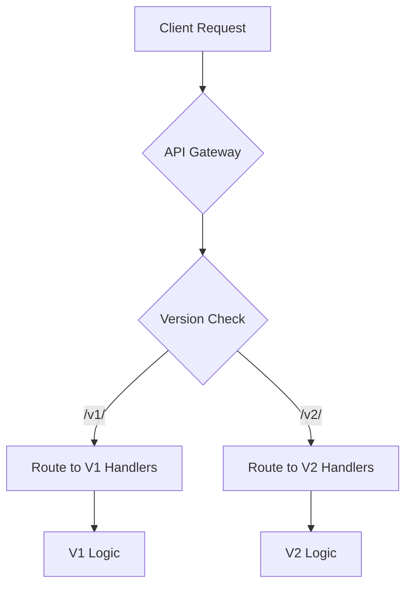

# Tutorial: Understanding the Repository

---


# 🚀 Welcome to Your Comprehensive Codebase Tutorial!

## What You'll Achieve
By the end of this 8-chapter journey, you'll have **deep, practical understanding** of this codebase and be ready to contribute effectively from day one. This isn't just documentation - it's your complete onboarding experience.

## ⏱️ Time Investment
**Total Time:** 285-290 minutes (approximately 4.0-4.0 hours)
**Recommended Pace:** 1-2 chapters per study session for optimal learning

## 🎯 Learning Path Overview
We've carefully designed this tutorial using proven instructional design principles:

**🏗️ Foundation (2 chapters):** Essential concepts and mental models
**⚙️ Core Functionality (3 chapters):** Primary features and patterns  
**🔬 Advanced Topics (1 chapters):** Complex integrations and optimizations

## 📚 What Makes This Tutorial Special
- **Hands-on Learning:** Every chapter includes practical exercises you can try immediately
- **Visual Learning:** Interactive Mermaid diagrams illustrate concepts, architecture, and workflows
- **Real-world Focus:** Learn patterns and practices actually used in this codebase
- **Progressive Building:** Each chapter builds naturally on previous knowledge
- **Immediate Value:** Gain practical skills you can apply right away

## 🗺️ Your Learning Journey
We'll start with **"Project Overview"** to build your foundation, then progressively advance through the architecture until we reach **"Evolving Your API: Implementing Versioning Strategies"** where you'll see how everything integrates.

Each chapter follows a proven structure:
- 🎯 **Clear Learning Objectives** - Know exactly what you'll accomplish
- 🔍 **Real-world Context** - Understand why this matters for your work
- 🎨 **Visual Overview** - Mermaid diagrams showing concepts and relationships
- 💻 **Code Walkthroughs** - Deep dives into actual implementation
- 🚀 **Hands-on Practice** - Immediate application of concepts
- ✅ **Success Validation** - Confirm your understanding before moving on

## 💡 How to Get the Most Value
1. **Set aside focused time** - Each chapter deserves your full attention
2. **Actually try the exercises** - Passive reading won't build real skills
3. **Connect concepts** - Notice how each chapter builds on previous learning
4. **Experiment beyond the examples** - The best learning happens when you explore

## 🎯 Your Success Goal
After completing this tutorial, you'll be able to:
- Navigate the codebase confidently
- Understand the architectural decisions and patterns
- Implement new features following established conventions
- Debug issues using your deep system knowledge
- Contribute meaningfully to the project

**Ready to become an expert in this codebase? Let's dive in!** 🚀


---

# Table of Contents
- [Chapter 1: Project Overview](#chapter-1-project-overview)
- [Chapter 2: Node.js Project Kickstart: Setting Up Your Development Environment](#chapter-2-node.js-project-kickstart:-setting-up-your-development-environment)
- [Chapter 3: Launching Your Node.js Server: Basic Initialization and Configuration](#chapter-3-launching-your-node.js-server:-basic-initialization-and-configuration)
- [Chapter 4: Defining Your First API Endpoints: Handling HTTP Requests with Express.js](#chapter-4-defining-your-first-api-endpoints:-handling-http-requests-with-express.js)
- [Chapter 5: Adding Functionality with Middleware: Intercepting and Modifying Requests](#chapter-5-adding-functionality-with-middleware:-intercepting-and-modifying-requests)
- [Chapter 6: Handling Asynchronous Operations: Preventing Blocking with Promises and Async/Await](#chapter-6-handling-asynchronous-operations:-preventing-blocking-with-promises-and-async/await)
- [Chapter 7: Ensuring Application Stability: Implementing Error Handling Middleware](#chapter-7-ensuring-application-stability:-implementing-error-handling-middleware)
- [Chapter 8: Evolving Your API: Implementing Versioning Strategies](#chapter-8-evolving-your-api:-implementing-versioning-strategies)

---

<a name="chapter-1-project-overview"></a>

---

# Project Overview

## 🎯 Chapter Objective
Understand the overall architecture and key components of Project

**Time to Complete:** 15-20 minutes

---

## 🏗️ Project Architecture

Understanding the big picture is crucial before diving into specifics. Here's how Project is structured:



## 📊 System Overview

This project consists of **8 key components** that work together to deliver its functionality. The architecture follows modern software engineering principles with clear separation of concerns and modular design.

### 🎯 Key Architectural Patterns

Based on the codebase analysis, this project demonstrates several important patterns:

- **Modular Architecture**: Components are organized into distinct, focused modules
- **Separation of Concerns**: Different aspects of functionality are cleanly separated
- **Dependency Management**: Clear relationships between components prevent circular dependencies
- **Scalable Design**: Structure supports growth and modification

## 🗺️ Navigation Guide

As you progress through this tutorial, you'll explore each component in detail:

1. **Foundation Concepts** - Essential patterns and structures
2. **Core Components** - Main functional elements
3. **Integration Patterns** - How components work together
4. **Advanced Topics** - Optimization and advanced features

## 🛠️ What You'll Build Understanding Of

By the end of this tutorial series, you'll have comprehensive knowledge of:

- **System Architecture**: How all pieces fit together
- **Component Interactions**: Data flow and dependencies
- **Development Patterns**: Coding standards and best practices
- **Extension Points**: Where and how to add new features

## 🎯 Hands-On Activity

**Exercise: Project Exploration**

Explore the project structure and identify key components

**Steps:**
1. Clone or download the project repository
2. Explore the directory structure using your preferred file explorer or IDE
3. Identify the main entry points and configuration files
4. Map what you see to the architecture diagram above

**Success Check:** Can explain the main architectural layers and component interactions

## 🔗 How This Connects

This overview chapter provides the foundation for all subsequent chapters. Each following chapter will dive deep into specific components you see in the architecture diagram above.

## ✅ Chapter Summary

- ✅ **Architecture Understanding**: You now know the high-level structure
- ✅ **Component Awareness**: You can identify the main building blocks  
- ✅ **Navigation Skills**: You know how to explore the codebase effectively
- ✅ **Learning Path**: You understand what's coming in the tutorial series

## 👉 Up Next

In the next chapter, we'll dive into the foundational components that everything else builds upon. You'll get hands-on experience with the core patterns that make this system work.

---

*Ready to dive deeper? Let's explore the building blocks that make this system tick!* 🚀


---

<a name="chapter-2-node.js-project-kickstart:-setting-up-your-development-environment"></a>

---

# Node.js Project Kickstart: Setting Up Your Development Environment

## 🎯 Chapter Objective
After this chapter, you will be able to install Node.js, initialize a `package.json` file, and install project dependencies.

**Time to Complete:** 30 minutes

## 💡 Why This Matters

Setting up your development environment correctly is the foundation for any successful Node.js project. A well-configured environment ensures smooth development, consistent builds, and efficient dependency management. Imagine trying to build a house on a shaky foundation – it's the same with software! Incorrect setup can lead to version conflicts, missing dependencies, and ultimately, a lot of wasted time debugging environment-related issues instead of focusing on your application's logic. Using `package.json` to manage dependencies allows for reproducible builds across different environments (development, staging, production), ensuring that your application behaves as expected wherever it's deployed.

## 🎨 Visual Overview
```mermaid
flowchart TD
    A[Install Node.js and npm] --> B{Create Project Directory}
    B --> C[Initialize package.json (npm init)]
    C --> D[Install Dependencies (npm install)]
    D --> E[Start Coding!]
    style A fill:#ccf,stroke:#333,stroke-width:2px
    style B fill:#ccf,stroke:#333,stroke-width:2px
    style C fill:#ccf,stroke:#333,stroke-width:2px
    style D fill:#ccf,stroke:#333,stroke-width:2px
    style E fill:#ccf,stroke:#333,stroke-width:2px
```

## 🧠 Core Concepts

*   **Node.js:** A JavaScript runtime built on Chrome's V8 JavaScript engine. It allows you to run JavaScript on the server-side. Think of it as the engine that powers your server-side JavaScript code.
*   **npm (Node Package Manager):** The default package manager for Node.js. It allows you to easily install, manage, and share JavaScript packages (libraries and tools).  npm comes bundled with Node.js.
*   **`package.json`:** A JSON file that contains metadata about your project, including its name, version, description, scripts, and dependencies.  It's like a blueprint for your project, telling npm what it needs to build and run your application.
*   **Dependencies:** External libraries or modules that your project relies on. For example, `express` is a popular dependency for creating web servers in Node.js. The `package.json` file lists these dependencies, making it easy to install them all at once.
*   **`node_modules`:**  A directory where npm installs all the project's dependencies.  This directory is usually quite large and should not be committed to your version control system (like Git).
*   **`package-lock.json`:** A file that records the exact versions of dependencies used in your project. This ensures that everyone working on the project uses the same versions, preventing compatibility issues.

## 💻 Code Deep Dive

Let's examine how these concepts manifest in the `package.json` and `package-lock.json` files provided.

**`package.json`:**

```json
{
  "dependencies": {
    "@google/generative-ai": "^0.24.0",
    "bcryptjs": "^3.0.2",
    "cors": "^2.8.5",
    "dotenv": "^16.4.7",
    "express": "^5.1.0",
    "jsonwebtoken": "^9.0.2",
    "mongoose": "^8.13.2",
    "serverless-http": "^3.2.0"
  },
  "name": "server",
  "version": "1.0.0",
  "description": "",
  "main": "server.js",
  "scripts": {
    "start": "node server.js"
  },
  "author": "",
  "license": "ISC"
}
```

*   `"dependencies"`:  This section lists all the packages your project depends on.  For example, `"express": "^5.1.0"` means this project relies on the `express` package, version 5.1.0 or higher (but less than 6.0.0, due to the `^` symbol).
*   `"name"`: The name of your project (e.g., `"server"`).
*   `"version"`: The current version of your project (e.g., `"1.0.0"`).
*   `"main"`: Specifies the entry point of your application (e.g., `"server.js"`).  This is the file that Node.js will execute when you start your application.
*   `"scripts"`: Defines commands that you can run using `npm`.  For instance, `"start": "node server.js"` allows you to start your server by running `npm start`.

**`package-lock.json`:**

This file is much larger and more complex. It provides a snapshot of the exact versions of all dependencies (including transitive dependencies – dependencies of your dependencies). This ensures consistent builds across different environments.  You generally don't need to manually edit this file; npm manages it for you. Here's a snippet:

```json
"node_modules/express": {
      "version": "5.1.0",
      "resolved": "https://registry.npmjs.org/express/-/express-5.1.0.tgz",
      "integrity": "sha512-DT9ck5YIRU+8GYzzU5kT3eHGA5iL+1Zd0EutOmTE9Dtk+Tvuzd23VBU+ec7HPNSTxXYO55gPV/hq4pSBJDjFpA==",
      "license": "MIT",
      "dependencies": {
        "accepts": "^2.0.0",
        "body-parser": "^2.2.0",
        "content-disposition": "^1.0.0",
        "content-type": "^1.0.5",
        "cookie": "^0.7.1",
        "cookie-signature": "^1.2.1",
        "debug": "^4.4.0",
        "encodeurl": "^2.0.0",
        "escape-html": "^1.0.3",
        "etag": "^1.8.1",
        "finalhandler": "^2.1.0",
        "fresh": "^2.0.0",
        "http-errors": "^2.0.0",
        "merge-descriptors": "^2.0.0",
        "mime-types": "^3.0.0",
        "on-finished": "^2.4.1",
        "once": "^1.4.0",
        "parseurl": "^1.3.3",
        "proxy-addr": "^2.0.7",
        "qs": "^6.14.0",
        "range-parser": "^1.2.1",
        "router": "^2.2.0",
        "send": "^1.1.0",
        "serve-static": "^2.2.0",
        "statuses": "^2.0.1",
        "type-is": "^2.0.1",
        "vary": "^1.1.2"
      },
      "engines": {
        "node": ">= 18"
      },
      "funding": {
        "type": "opencollective",
        "url": "https://opencollective.com/express"
      }
    },
```

Notice how it specifies the exact version, resolved URL, and integrity hash for the `express` package and all of its dependencies.

## 🧑‍💻 Hands-On Practice

**Exercise: Install Node.js, create a new project directory, initialize `package.json` using `npm init`, and install the `express` package.**

**Steps:**

1.  **Install Node.js:** Download and install the latest LTS (Long Term Support) version of Node.js from [https://nodejs.org/](https://nodejs.org/). This will also install npm.

2.  **Verify Installation:** Open your terminal or command prompt and run the following commands to verify that Node.js and npm are installed correctly:

    ```bash
    node -v
    npm -v
    ```

    You should see the version numbers of Node.js and npm printed in the terminal.

3.  **Create a New Project Directory:**  Choose a location on your computer and create a new directory for your project.  For example:

    ```bash
    mkdir my-node-project
    cd my-node-project
    ```

4.  **Initialize `package.json`:**  Inside your project directory, run the following command:

    ```bash
    npm init -y
    ```

    The `-y` flag automatically accepts the default values for all the prompts.  This will create a `package.json` file in your project directory. You can open it in a text editor to see its contents.

5.  **Install the `express` Package:**  Run the following command to install `express` as a dependency:

    ```bash
    npm install express
    ```

    This will download and install the `express` package and add it to the `dependencies` section of your `package.json` file.  It will also create the `node_modules` directory and the `package-lock.json` file.

6.  **Examine `package.json`:** Open your `package.json` file again. You should now see `express` listed as a dependency.

**Success Check:** Successfully install Node.js, initialize `package.json`, and install a dependency. You should have a `node_modules` folder and a `package-lock.json` file in your project directory.

## ✅ Chapter Summary

In this chapter, you learned how to set up your Node.js development environment. You installed Node.js and npm, created a new project directory, initialized a `package.json` file, and installed the `express` package. You now understand the importance of dependency management and how `package.json` and `package-lock.json` contribute to reproducible builds. You are now equipped with the foundational knowledge to start building your own Node.js applications.

## 👉 Up Next

In the next chapter, we will dive into creating a simple "Hello, World!" server using Express.js.

---

<a name="chapter-3-launching-your-node.js-server:-basic-initialization-and-configuration"></a>

---

# Launching Your Node.js Server: Basic Initialization and Configuration

## 🎯 Chapter Objective
After this chapter, you will be able to initialize a basic Node.js server and load configuration settings from environment variables.

**Time to Complete:** 30 minutes

## 💡 Why This Matters
Understanding how to initialize and configure a Node.js server is fundamental to building any web application. It allows you to set up the foundation for handling requests, defining routes, and connecting to databases.  Specifically, loading configuration from environment variables is crucial for deploying your application to different environments (development, staging, production) without modifying the code itself. This promotes code reusability and enhances security by keeping sensitive information like API keys and database passwords out of your codebase. Imagine you're deploying to AWS, Azure, or Google Cloud - environment variables are the standard way to configure your application.

## 🎨 Visual Overview


## 🧠 Core Concepts

*   **Node.js:** A JavaScript runtime built on Chrome's V8 JavaScript engine. It allows you to run JavaScript on the server-side.
*   **Express.js:** A minimal and flexible Node.js web application framework that provides a robust set of features for web and mobile applications. It simplifies the process of creating routes, handling requests, and managing middleware.
*   **Environment Variables:** Dynamic-named values that can affect the way running processes will behave on a computer. They are used to configure application settings without modifying the code directly. This is especially important for sensitive data like API keys and database passwords.
*   **Middleware:** Functions that have access to the request object (req), the response object (res), and the next middleware function in the application’s request-response cycle. Middleware functions can perform tasks such as parsing request bodies, adding headers, and authenticating users.
*   **CORS (Cross-Origin Resource Sharing):** A browser security feature that restricts web pages from making requests to a different domain than the one which served the web page. CORS middleware allows you to configure which origins are allowed to make requests to your server.

## 💻 Code Deep Dive

Let's analyze the provided `server.js` code snippet:

```javascript
require('dotenv').config({ path: './.env' });
const express = require('express');
const mongoose = require('mongoose');
const cors = require('cors');
const v1Router = require('./v1/v1');
const PORT = process.env.PORT || 5000;
const app = express();

// Middleware
app.use(cors({
  origin: '*',
  methods: ['GET', 'POST', 'PUT', 'DELETE', 'OPTIONS'],
  allowedHeaders: ['Content-Type', 'Authorization', 'ngrok-skip-browser-warning']
}));
app.use(express.json());

// MongoDB Connection
mongoose.connect(process.env.MONGODB_URI)
  .then(() => console.log('Connected to MongoDB'))
  .catch(err => {
    console.error('MongoDB connection error:', err);
    process.exit(1);
  });

// Routes
app.use('/api/v1', v1Router);

// Error handling middleware
app.use((err, req, res, next) => {
  console.error(err.stack);
  res.status(500).json({ error: 'Something went wrong!' });
});

app.listen(PORT, () => {
  console.log(`Server running on port ${PORT}`);
});

module.exports = app;
```

**Line-by-Line Explanation:**

1.  `require('dotenv').config({ path: './.env' });`: This line loads environment variables from a `.env` file located in the current directory. The `dotenv` package allows you to define configuration settings in a separate file, which is then loaded into `process.env`.
2.  `const express = require('express');`: Imports the Express.js framework.
3.  `const mongoose = require('mongoose');`: Imports the Mongoose library, used for MongoDB object modeling.
4.  `const cors = require('cors');`: Imports the CORS middleware for handling cross-origin requests.
5.  `const v1Router = require('./v1/v1');`: Imports a router module for handling API version 1 routes.
6.  `const PORT = process.env.PORT || 5000;`: Defines the port number the server will listen on. It first tries to read the `PORT` environment variable. If it's not defined, it defaults to 5000.
7.  `const app = express();`: Creates an instance of the Express application.
8.  `app.use(cors({...}));`:  Configures CORS middleware.  `origin: '*'` allows requests from any origin (use with caution in production). It also specifies allowed HTTP methods and headers.
9.  `app.use(express.json());`:  Adds middleware to parse incoming requests with JSON payloads. This allows you to access the request body as a JavaScript object.
10. `mongoose.connect(process.env.MONGODB_URI)...`: Connects to a MongoDB database using the URI specified in the `MONGODB_URI` environment variable. The `.then()` and `.catch()` blocks handle successful connection and connection errors, respectively.
11. `app.use('/api/v1', v1Router);`: Mounts the `v1Router` middleware at the `/api/v1` path. This means that all routes defined in `v1Router` will be prefixed with `/api/v1`.
12. `app.use((err, req, res, next) => {...});`: Defines an error-handling middleware. This middleware catches any errors that occur during the request-response cycle and sends a 500 Internal Server Error response.
13. `app.listen(PORT, () => {...});`: Starts the server and listens for incoming connections on the specified `PORT`. The callback function is executed when the server starts successfully.
14. `module.exports = app;`: Exports the Express app instance so it can be used in other modules (e.g., for testing).

## 🧑‍💻 Hands-On Practice
**Exercise: Create a `server.js` file, initialize an Express.js server, configure the server to listen on a port read from an environment variable, and start the server.**

**Steps:**

1.  **Create a Project Directory:** Create a new directory for your project (e.g., `my-node-server`) and navigate into it using your terminal:
    ```bash
    mkdir my-node-server
    cd my-node-server
    ```
2.  **Initialize a Node.js Project:** Initialize a new Node.js project using `npm`:
    ```bash
    npm init -y
    ```
3.  **Install Dependencies:** Install the necessary packages: `express` and `dotenv`.
    ```bash
    npm install express dotenv cors mongoose
    ```
4.  **Create a `.env` File:** Create a file named `.env` in your project directory and add the following line:
    ```
    PORT=3000
    MONGODB_URI=mongodb://localhost:27017/your_database_name
    ```
    Replace `your_database_name` with the actual name of your MongoDB database.
5.  **Create `server.js`:** Create a file named `server.js` in your project directory and paste the code from the Code Deep Dive section into it.
6.  **Create `v1/v1.js`:** Create a directory named `v1` and inside it create a file named `v1.js`. Add the following minimal content:
    ```javascript
    const express = require('express');
    const router = express.Router();

    router.get('/', (req, res) => {
        res.json({ message: 'Hello from v1 API!' });
    });

    module.exports = router;
    ```
7.  **Run the Server:** Start the server using the command:
    ```bash
    node server.js
    ```

**Success Check:** Successfully initialize and start a Node.js server that reads configuration from environment variables. You should see the message "Server running on port 3000" (or the port you specified in your `.env` file) in the console.  Additionally, if MongoDB is running, you should see "Connected to MongoDB". You can verify the API route by navigating to `http://localhost:3000/api/v1` in your browser, which should display `{"message": "Hello from v1 API!"}`.

## ✅ Chapter Summary

In this chapter, you learned how to initialize a basic Node.js server using Express.js. You also learned how to load configuration settings from environment variables using the `dotenv` package, which is crucial for managing different environments and keeping sensitive data secure. You now know how to configure middleware like CORS and JSON body parsing, and how to define routes.

## 👉 Up Next

In the next chapter, we'll dive deeper into routing and middleware, exploring how to handle different types of requests and implement more complex middleware functions.

---

<a name="chapter-4-defining-your-first-api-endpoints:-handling-http-requests-with-express.js"></a>

---

# Defining Your First API Endpoints: Handling HTTP Requests with Express.js

## 🎯 Chapter Objective
After this chapter, you will be able to define HTTP routes (GET, POST) using Express.js and handle basic requests.

**Time to Complete:** 30 minutes

## 💡 Why This Matters

Understanding how to define API endpoints is fundamental to building web applications. Express.js simplifies this process, allowing you to handle different types of HTTP requests (GET, POST, PUT, DELETE, etc.) and define how your server responds to them. This skill is crucial for creating APIs that allow different parts of your application, or even entirely separate applications, to communicate and exchange data. For example, a mobile app might use your API to fetch user data or submit new information. Without well-defined endpoints, your application would be unable to receive and process requests from clients.

## 🎨 Visual Overview


## 🧠 Core Concepts

*   **HTTP Methods:** These define the type of action a client wants to perform. Common methods include:
    *   **GET:** Used to retrieve data from the server.
    *   **POST:** Used to send data to the server to create or update a resource.
    *   **PUT:** Used to update an existing resource.
    *   **DELETE:** Used to delete a resource.

*   **Routes:** In Express.js, a route defines how the application responds to a client request to a specific endpoint (URL) with a specific HTTP request method (GET, POST, etc.).

    *   **Example:** `app.get('/users', (req, res) => { ... });` handles GET requests to the `/users` endpoint.

*   **Request (`req`) Object:** Contains information about the incoming request, such as headers, query parameters, and body data.

*   **Response (`res`) Object:** Used to send data back to the client. Common methods include:
    *   `res.send()`: Sends a simple response (text, HTML).
    *   `res.json()`: Sends a JSON response.
    *   `res.status()`: Sets the HTTP status code of the response.

## 💻 Code Deep Dive

Let's explore how to define GET and POST routes in Express.js. We'll add these routes inside the `v1Router` from the `server.js` file.

First, create a file named `v1.js` inside the `v1` directory:

```javascript
// v1/v1.js
const express = require('express');
const router = express.Router();

// GET route
router.get('/hello', (req, res) => {
  res.json({ message: 'Hello from the API!' });
});

// POST route
router.post('/data', (req, res) => {
  const receivedData = req.body;
  console.log('Received data:', receivedData);
  res.status(201).json({ message: 'Data received successfully', data: receivedData });
});

module.exports = router;
```

**Explanation:**

1.  **`const express = require('express');`**: Imports the Express.js library.
2.  **`const router = express.Router();`**: Creates a new router instance.  This allows us to define routes modularly.
3.  **`router.get('/hello', (req, res) => { ... });`**: Defines a GET route for the `/hello` endpoint.
    *   When a client sends a GET request to `/api/v1/hello`, this function is executed.
    *   `req` represents the request object (incoming data).
    *   `res` represents the response object (outgoing data).
    *   `res.json({ message: 'Hello from the API!' });` sends a JSON response with a message.
4.  **`router.post('/data', (req, res) => { ... });`**: Defines a POST route for the `/data` endpoint.
    *   When a client sends a POST request to `/api/v1/data`, this function is executed.
    *   `const receivedData = req.body;` extracts the data sent in the request body.  This requires the `express.json()` middleware to be enabled, as it parses the body as JSON.
    *   `res.status(201).json({ message: 'Data received successfully', data: receivedData });` sends a JSON response with a success message and the received data. Setting the status code to 201 indicates a resource was successfully created.
5.  **`module.exports = router;`**: Exports the router so that it can be used in `server.js`.

Now, update your `server.js` to include the new routes:

```javascript
// server.js
require('dotenv').config({ path: './.env' });
const express = require('express');
const mongoose = require('mongoose');
const cors = require('cors');
const v1Router = require('./v1/v1'); // Ensure the path is correct
const PORT = process.env.PORT || 5000;
const app = express();

// Middleware
app.use(cors({
  origin: '*',
  methods: ['GET', 'POST', 'PUT', 'DELETE', 'OPTIONS'],
  allowedHeaders: ['Content-Type', 'Authorization', 'ngrok-skip-browser-warning']
}));
app.use(express.json());

// MongoDB Connection
mongoose.connect(process.env.MONGODB_URI)
  .then(() => console.log('Connected to MongoDB'))
  .catch(err => {
    console.error('MongoDB connection error:', err);
    process.exit(1);
  });

// Routes
app.use('/api/v1', v1Router);

// Error handling middleware
app.use((err, req, res, next) => {
  console.error(err.stack);
  res.status(500).json({ error: 'Something went wrong!' });
});

app.listen(PORT, () => {
  console.log(`Server running on port ${PORT}`);
});

module.exports = app;
```

## 🧑‍💻 Hands-On Practice

**Exercise: Define GET and POST routes in `server.js` that respond with simple JSON messages. Test the endpoints using `curl` or a browser.**

**Steps:**

1.  **Create the `v1/v1.js` file:** If you haven't already, create a new directory named `v1` and inside it, create a file named `v1.js`.
2.  **Add the route definitions:** Copy the code for the GET and POST routes provided above into `v1/v1.js`.
3.  **Update `server.js`:** Ensure that `v1Router` is properly required in `server.js` and the route is mounted using `app.use('/api/v1', v1Router);`.
4.  **Start the server:** Run your server using `node server.js`.
5.  **Test the GET route:** Open your browser or use `curl` to make a GET request to `http://localhost:5000/api/v1/hello`.  You should see the JSON response: `{"message": "Hello from the API!"}`.
6.  **Test the POST route:** Use `curl` to make a POST request to `http://localhost:5000/api/v1/data` with a JSON payload. For example:

    ```bash
    curl -X POST -H "Content-Type: application/json" -d '{"name": "John Doe", "age": 30}' http://localhost:5000/api/v1/data
    ```

    You should see a JSON response similar to: `{"message": "Data received successfully", "data": {"name": "John Doe", "age": 30}}`.  Check your server's console to see the logged data.

**Success Check:** Successfully define and test GET and POST routes that return JSON responses.

## ✅ Chapter Summary

You've learned how to define basic API endpoints using Express.js. You can now:

*   Define routes for different HTTP methods (GET, POST).
*   Access request data using the `req` object.
*   Send responses using the `res` object.
*   Understand the importance of middleware like `express.json()` for parsing request bodies.
*   Test API endpoints using `curl` or a browser.

## 👉 Up Next

In the next chapter, we'll explore how to work with middleware for authentication and authorization.

---

<a name="chapter-5-adding-functionality-with-middleware:-intercepting-and-modifying-requests"></a>

---

# Adding Functionality with Middleware: Intercepting and Modifying Requests

## 🎯 Chapter Objective
After this chapter, you will be able to implement and use middleware functions to intercept and modify requests or responses.

**Time to Complete:** 30 minutes

## 💡 Why This Matters

Middleware functions are the backbone of request handling in Express.js applications. They allow you to intercept and modify incoming requests or outgoing responses *before* they reach your route handlers or *after* they've been processed. This is incredibly useful for tasks like authentication, logging, data validation, request modification, and more. Imagine you want to log every incoming request to your server. Instead of adding logging code to *every* route handler, you can create a single middleware function that handles this task globally. This improves code reusability, maintainability, and separation of concerns, leading to cleaner and more efficient applications. Without middleware, you'd be repeating code across multiple routes, making your application harder to manage and scale.

## 🎨 Visual Overview


## 🧠 Core Concepts

*   **Middleware:** A function that has access to the request object (`req`), the response object (`res`), and the next middleware function in the application’s request-response cycle. Middleware functions can:
    *   Execute any code.
    *   Make changes to the request and the response objects.
    *   End the request-response cycle.
    *   Call the next middleware function in the stack.

*   **`req` (Request Object):** Contains information about the HTTP request, such as headers, query parameters, and body data.

*   **`res` (Response Object):** Used to send the HTTP response back to the client.

*   **`next()`:** A function that, when invoked, executes the next middleware in the stack. If `next()` is not called, the request-response cycle will be halted.

*   **Application-level Middleware:** Bound to the app object using `app.use()` and executed for every request to the application or a specific path.

*   **Route-specific Middleware:** Applied only to specific routes.

**Example:**

```javascript
// A simple middleware function
const myMiddleware = (req, res, next) => {
  console.log('Middleware executed!');
  // You can modify the request or response here
  req.customProperty = 'Hello from middleware!';
  next(); // Pass control to the next middleware
};
```

## 💻 Code Deep Dive

Let's examine how middleware is used in the provided `server.js` file:

```javascript
const express = require('express');
const cors = require('cors');
const v1Router = require('./v1/v1');
const app = express();

// Middleware
app.use(cors({
  origin: '*',
  methods: ['GET', 'POST', 'PUT', 'DELETE', 'OPTIONS'],
  allowedHeaders: ['Content-Type', 'Authorization', 'ngrok-skip-browser-warning']
}));
app.use(express.json());

// Routes
app.use('/api/v1', v1Router);

// Error handling middleware
app.use((err, req, res, next) => {
  console.error(err.stack);
  res.status(500).json({ error: 'Something went wrong!' });
});
```

*   **`cors()` Middleware:**  This middleware handles Cross-Origin Resource Sharing (CORS). It allows requests from any origin (`origin: '*'`) and specifies the allowed HTTP methods and headers.
*   **`express.json()` Middleware:**  This middleware parses incoming requests with JSON payloads.  It populates `req.body` with the parsed JSON data, making it available to your route handlers.
*   **Error Handling Middleware:** This is a special type of middleware that handles errors that occur during the request-response cycle. It's defined by having four arguments: `(err, req, res, next)`.  It logs the error stack trace and sends a 500 Internal Server Error response to the client.

**Order Matters:** The order in which middleware is applied is crucial. Middleware functions are executed in the order they are defined using `app.use()`. For example, `express.json()` must be used *before* any route handlers that expect to receive JSON data.

## 🧑‍💻 Hands-On Practice

**Exercise: Implement a logging middleware that logs the HTTP method and URL for each incoming request. Apply the middleware to all routes.**

**Steps:**

1.  **Create a new middleware function:**  In your `server.js` file, create a function named `requestLogger` that takes `req`, `res`, and `next` as arguments. Inside this function, log the request method and URL to the console.

    ```javascript
    const requestLogger = (req, res, next) => {
      console.log(`${req.method} ${req.url}`);
      next(); // Don't forget to call next()!
    };
    ```

2.  **Apply the middleware to all routes:** Use `app.use()` to apply the `requestLogger` middleware to all incoming requests.  Place this `app.use()` call *before* your route definitions (`app.use('/api/v1', v1Router);`).

    ```javascript
    app.use(requestLogger); // Apply the middleware to all routes
    app.use('/api/v1', v1Router);
    ```

3.  **Test your middleware:** Start your server and send a few requests to different routes.  Check your console output to verify that the request method and URL are being logged for each request.

**Example of complete `server.js` with logging middleware:**

```javascript
require('dotenv').config({ path: './.env' });
const express = require('express');
const mongoose = require('mongoose');
const cors = require('cors');
const v1Router = require('./v1/v1');
const PORT = process.env.PORT || 5000;
const app = express();

// Middleware
const requestLogger = (req, res, next) => {
  console.log(`${req.method} ${req.url}`);
  next(); // Don't forget to call next()!
};

app.use(cors({
  origin: '*',
  methods: ['GET', 'POST', 'PUT', 'DELETE', 'OPTIONS'],
  allowedHeaders: ['Content-Type', 'Authorization', 'ngrok-skip-browser-warning']
}));
app.use(express.json());
app.use(requestLogger); // Apply the middleware to all routes

// Routes
app.use('/api/v1', v1Router);

// Error handling middleware
app.use((err, req, res, next) => {
  console.error(err.stack);
  res.status(500).json({ error: 'Something went wrong!' });
});

app.listen(PORT, () => {
  console.log(`Server running on port ${PORT}`);
});

module.exports = app;
```

**Success Check:** Successfully implement and use middleware to log request information. You should see the HTTP method and URL of each request printed to the console.

## ✅ Chapter Summary

In this chapter, you learned about middleware functions in Express.js and how they can be used to intercept and modify requests. You now understand:

*   What middleware functions are and their role in the request-response cycle.
*   How to create and apply middleware using `app.use()`.
*   The importance of the `next()` function.
*   How to use middleware for common tasks like logging.
*   The significance of middleware order.

You can now implement middleware to handle tasks such as logging, authentication, and data validation, making your Express.js applications more modular and maintainable.

## 👉 Up Next

In the next chapter, we'll explore how to implement authentication and authorization middleware to secure your API endpoints.

---

<a name="chapter-6-handling-asynchronous-operations:-preventing-blocking-with-promises-and-async/await"></a>

---

# Handling Asynchronous Operations: Preventing Blocking with Promises and Async/Await

## 🎯 Chapter Objective
After this chapter, you will be able to handle asynchronous operations within request handlers using Promises or async/await.

**Time to Complete:** 45 minutes

## 💡 Why This Matters

Imagine your e-commerce application. When a user places an order, several things happen: the order is saved to the database, payment is processed, inventory is updated, and a confirmation email is sent. Each of these operations takes time. If your server waits for each operation to complete before moving on to the next, your application becomes slow and unresponsive. This is called blocking.

Asynchronous operations allow your server to start a task and then move on to other tasks without waiting for the first one to finish. Promises and async/await are modern JavaScript features that make it easier to manage these asynchronous operations, resulting in faster and more responsive applications. Without them, your application will become slow and unresponsive, providing a poor user experience. This is particularly important when dealing with database queries, external API calls, or any operation that takes a significant amount of time.

## 🎨 Visual Overview


## 🧠 Core Concepts

*   **Asynchronous Operations:** Operations that don't block the main thread of execution. This means the server can continue processing other requests while waiting for the asynchronous operation to complete.

*   **Promises:** An object representing the eventual completion (or failure) of an asynchronous operation. A Promise has three states:
    *   *Pending:* Initial state, neither fulfilled nor rejected.
    *   *Fulfilled:* Operation completed successfully.
    *   *Rejected:* Operation failed.

    ```javascript
    const myPromise = new Promise((resolve, reject) => {
      setTimeout(() => {
        // Simulate an asynchronous operation
        const success = true;
        if (success) {
          resolve("Operation completed successfully!");
        } else {
          reject("Operation failed!");
        }
      }, 1000);
    });

    myPromise
      .then(result => console.log(result)) // Handle successful resolution
      .catch(error => console.error(error)); // Handle rejection
    ```

*   **Async/Await:** Syntactic sugar built on top of Promises that makes asynchronous code look and behave a bit more like synchronous code. `async` is used to define an asynchronous function, and `await` is used to pause the execution of the function until a Promise is resolved.

    ```javascript
    async function fetchData() {
      try {
        const result = await myPromise;
        console.log(result);
        return result;
      } catch (error) {
        console.error(error);
      }
    }

    fetchData();
    ```

## 💻 Code Deep Dive

Let's analyze how asynchronous operations are handled within the provided `server.js` file.

1.  **MongoDB Connection:**

    ```javascript
    mongoose.connect(process.env.MONGODB_URI)
      .then(() => console.log('Connected to MongoDB'))
      .catch(err => {
        console.error('MongoDB connection error:', err);
        process.exit(1);
      });
    ```

    `mongoose.connect()` returns a Promise. The `.then()` block is executed when the connection is successful, and the `.catch()` block handles any connection errors. This prevents the server from crashing if it cannot connect to the database.

2.  **Error Handling Middleware:**

    ```javascript
    app.use((err, req, res, next) => {
      console.error(err.stack);
      res.status(500).json({ error: 'Something went wrong!' });
    });
    ```

    This middleware catches any errors that occur during request processing. It logs the error stack trace and sends a 500 error response to the client. This is crucial for handling unexpected errors that might occur during asynchronous operations.

Now, let's explore how to use `async/await` within a route handler (assuming `v1Router` is handling routes):

```javascript
// Sample route handler using async/await (inside v1Router)
v1Router.get('/data', async (req, res) => {
  try {
    // Simulate an asynchronous database query
    const data = await new Promise((resolve) => {
      setTimeout(() => {
        resolve({ message: 'Data fetched successfully!' });
      }, 500); // Simulate a 500ms delay
    });

    res.json(data);
  } catch (error) {
    console.error(error);
    res.status(500).json({ error: 'Failed to fetch data' });
  }
});
```

In this example:

*   `async (req, res) => { ... }` defines an asynchronous route handler.
*   `await new Promise(...)` pauses the execution of the handler until the Promise resolves.
*   The `try...catch` block handles any errors that might occur during the asynchronous operation.

## 🧑‍💻 Hands-On Practice

**Exercise: Simulate an asynchronous database query using `setTimeout` within a route handler and handle the result using async/await. Return the result in the response.**

**Steps:**

1.  **Access your route file:** Open the file where your routes are defined (likely in `v1/v1.js` or a similar location, based on `app.use('/api/v1', v1Router);` in `server.js`).

2.  **Create a new route:** Add a new route handler to simulate an asynchronous operation.

    ```javascript
    // Example route in v1/v1.js
    const express = require('express');
    const router = express.Router();

    router.get('/async-data', async (req, res) => {
      try {
        // Simulate an asynchronous database query
        const data = await new Promise((resolve) => {
          setTimeout(() => {
            const simulatedData = { message: 'Asynchronous data fetched!' };
            resolve(simulatedData);
          }, 1000); // Simulate a 1-second delay
        });

        res.json(data);
      } catch (error) {
        console.error(error);
        res.status(500).json({ error: 'Failed to fetch asynchronous data' });
      }
    });

    module.exports = router;
    ```

3.  **Explain the code:**
    * We create a new route `/async-data`.
    * The route handler is declared as `async` to allow the use of `await`.
    * Inside the `try` block, we create a new `Promise` that resolves after a 1-second delay using `setTimeout`. This simulates an asynchronous operation like a database query.
    * The `await` keyword pauses the execution of the route handler until the `Promise` resolves.
    * Once the `Promise` resolves, the simulated data is sent back to the client as a JSON response.
    * The `catch` block handles any errors that occur during the asynchronous operation.

4.  **Test the route:** Use a tool like `curl` or Postman to send a GET request to `/api/v1/async-data`.

    ```bash
    curl http://localhost:5000/api/v1/async-data
    ```

    (Remember to replace `5000` with your server's port if it's different).

**Success Check:** Successfully handle an asynchronous operation and return the result in a route handler. You should see a 1-second delay before the response is returned. The response should be similar to:

```json
{
  "message": "Asynchronous data fetched!"
}
```

## ✅ Chapter Summary

You've learned how to handle asynchronous operations in Node.js using Promises and async/await. This includes:

*   Understanding the importance of asynchronous operations for preventing blocking.
*   Creating and using Promises.
*   Using async/await to simplify asynchronous code.
*   Handling errors in asynchronous operations.

You can now create more responsive and efficient Node.js applications by effectively managing asynchronous tasks.

## 👉 Up Next

In the next chapter, we'll explore how to implement middleware to handle authentication and authorization in your API.

---

<a name="chapter-7-ensuring-application-stability:-implementing-error-handling-middleware"></a>

---

# Ensuring Application Stability: Implementing Error Handling Middleware

## 🎯 Chapter Objective
After this chapter, you will be able to implement error handling middleware to catch and process errors that occur during request processing.

**Time to Complete:** 45 minutes

## 💡 Why This Matters

Error handling is crucial for building robust and user-friendly applications. Without proper error handling, unexpected errors can crash your application, expose sensitive information, or provide a poor user experience. Implementing error handling middleware allows you to gracefully catch errors, log them for debugging, and return meaningful error messages to the client. This prevents application crashes, aids in debugging, and improves the overall reliability and maintainability of your code. Imagine a user trying to place an order on an e-commerce site and encountering a cryptic error message or a blank page. Proper error handling ensures the user receives a helpful message, and the developers are alerted to the issue, allowing for a swift resolution. This directly impacts user satisfaction and business continuity.

## 🎨 Visual Overview


## 🧠 Core Concepts

*   **Middleware:** Middleware functions are functions that have access to the request object (req), the response object (res), and the next middleware function in the application’s request-response cycle. Middleware functions can:

    *   Execute any code.
    *   Make changes to the request and the response objects.
    *   End the request-response cycle.
    *   Call the next middleware function in the stack.
*   **Error Handling Middleware:** Error-handling middleware functions are defined in the same way as other middleware functions, except error-handling functions have four arguments instead of three: `(err, req, res, next)`. Express distinguishes error-handling middleware functions by the number of arguments. You define error-handling middleware last, after other `app.use()` and route calls; otherwise, the middleware functions you define after it won’t be executed.
*   **Error Propagation:**  When an error occurs within a route handler or other middleware, it's important to pass the error to the next error-handling middleware.  This is done using the `next(err)` function.  Without proper propagation, the error might go unhandled, leading to unexpected behavior.
*   **Centralized Error Handling:** Using middleware provides a centralized location to handle all errors within your application. This promotes code reusability and simplifies debugging.
*   **Logging:** Logging errors is a crucial aspect of error handling. It allows you to track down issues, identify patterns, and monitor the overall health of your application.

## 💻 Code Deep Dive

Let's analyze the provided `server.js` file and focus on the error handling middleware:

```javascript
// Error handling middleware
app.use((err, req, res, next) => {
  console.error(err.stack);
  res.status(500).json({ error: 'Something went wrong!' });
});
```

**Explanation:**

1.  **`app.use((err, req, res, next) => { ... });`**: This line registers a middleware function with Express. The presence of the `err` parameter indicates that this is an error-handling middleware.

2.  **`console.error(err.stack);`**: This line logs the error stack trace to the console. The stack trace provides detailed information about the error, including the file name, line number, and call stack. This is extremely helpful for debugging.

3.  **`res.status(500).json({ error: 'Something went wrong!' });`**: This line sends a JSON response to the client with a 500 status code (Internal Server Error) and a user-friendly error message.  It's important to avoid exposing sensitive error details to the client.

**Step-by-Step Breakdown:**

1.  **Error Occurs:** An error occurs in a route handler or another middleware function.
2.  **`next(err)`:** The error is passed to the next middleware function using `next(err)`.
3.  **Error Handling Middleware Invoked:** Express recognizes the error and invokes the error-handling middleware.
4.  **Error Logging:** The error stack trace is logged to the console.
5.  **Error Response:** A JSON response with a 500 status code and a generic error message is sent to the client.

## 🧑‍💻 Hands-On Practice

**Exercise: Simulate an error in a route handler (e.g., throwing an exception). Implement error handling middleware to catch the error, log it, and return a user-friendly error message.**

**Steps:**

1.  **Create a Route:** Add a new route to your `v1Router` (or any other route) that intentionally throws an error.  This will simulate an error occurring during request processing.

2.  **Simulate Error:** Within the route handler, use `throw new Error('Simulated error');` to trigger an error.

3.  **Verify Error Handling:**  Send a request to the route you created. Observe the server console for the error log and the client's response for the user-friendly error message.

**Clear, actionable tasks:**

1.  **Modify `v1Router` (or any route file):**

    ```javascript
    // Example inside v1Router.js
    const express = require('express');
    const router = express.Router();

    router.get('/test-error', (req, res, next) => {
      try {
        throw new Error('Simulated error in test-error route');
      } catch (error) {
        next(error); // Pass the error to the error handling middleware
      }
    });

    module.exports = router;
    ```

2.  **Send a Request:** Use `curl http://localhost:5000/api/v1/test-error` (or a similar tool like Postman) to send a GET request to the `/api/v1/test-error` endpoint.

3.  **Observe the Results:**

    *   **Server Console:** You should see the error stack trace logged in your server's console.
    *   **Client Response:** The client should receive a JSON response with a 500 status code and the message `"Something went wrong!"`.

**Success Check:** Successfully implement error handling middleware that catches and processes errors. You should see the error logged in the console and a user-friendly message returned to the client.

## ✅ Chapter Summary

In this chapter, you learned about the importance of error handling middleware for application stability. You learned how to implement error-handling middleware to catch errors, log them, and return user-friendly error messages. You now know how to:

*   Define error-handling middleware with four arguments: `(err, req, res, next)`.
*   Log error stack traces for debugging.
*   Send appropriate error responses to the client.
*   Simulate errors in route handlers to test your error handling.

## 👉 Up Next

Next, we will explore advanced middleware techniques for authentication and authorization.

---

<a name="chapter-8-evolving-your-api:-implementing-versioning-strategies"></a>

---

# Evolving Your API: Implementing Versioning Strategies

## 🎯 Chapter Objective
After this chapter, you will be able to implement a basic API versioning strategy using URL-based versioning.

**Time to Complete:** 60 minutes

## 💡 Why This Matters

API versioning is crucial for maintaining backward compatibility as your application evolves. Without it, changes to your API could break existing clients, leading to application downtime and frustrated users. Imagine a scenario where you update your e-commerce API to include new product attributes. Without versioning, older mobile app versions that don't expect these new attributes might crash or display incorrect information. Versioning allows you to introduce new features and changes while ensuring older clients continue to function correctly by accessing previous API versions. This minimizes disruption and enables a smoother transition for your users. Implementing versioning is a professional necessity.

## 🎨 Visual Overview


## 🧠 Core Concepts

API versioning is the practice of introducing distinct versions of your API to manage changes and maintain compatibility with existing clients. Here's a breakdown of key concepts:

*   **Versioning:** The process of creating and managing different versions of your API.
*   **Backward Compatibility:** Ensuring that older clients can still function correctly even after the API is updated.
*   **URL-based Versioning:** A common versioning strategy where the API version is included in the URL path (e.g., `/v1/resource`, `/v2/resource`). This is the focus of this chapter.
*   **Header-based Versioning:** Another versioning strategy where the API version is specified in the request headers (e.g., `Accept: application/vnd.example.v1+json`).
*   **Semantic Versioning (SemVer):** A widely adopted versioning scheme using a three-part version number (MAJOR.MINOR.PATCH) to indicate the significance of changes.

**Example of URL-based Versioning:**

Let's say you have an endpoint to retrieve user data:

*   **Version 1:** `/api/v1/users/{id}`
*   **Version 2:** `/api/v2/users/{id}` (might include additional user attributes or a different data format)

Clients using the older version of your application would continue to use `/api/v1/users/{id}`, while newer clients would use `/api/v2/users/{id}`.

## 💻 Code Deep Dive

Let's examine how URL-based versioning can be implemented using Express middleware and route handlers. We'll analyze the provided `server.js` file and how it integrates with versioned routes.

The `server.js` file sets up the Express application, connects to MongoDB, and mounts the `v1Router`.

```javascript
// server.js
require('dotenv').config({ path: './.env' });
const express = require('express');
const mongoose = require('mongoose');
const cors = require('cors');
const v1Router = require('./v1/v1'); // Imports the v1 router
const PORT = process.env.PORT || 5000;
const app = express();

// Middleware
app.use(cors({
  origin: '*',
  methods: ['GET', 'POST', 'PUT', 'DELETE', 'OPTIONS'],
  allowedHeaders: ['Content-Type', 'Authorization', 'ngrok-skip-browser-warning']
}));
app.use(express.json());

// MongoDB Connection
mongoose.connect(process.env.MONGODB_URI)
  .then(() => console.log('Connected to MongoDB'))
  .catch(err => {
    console.error('MongoDB connection error:', err);
    process.exit(1);
  });

// Routes
app.use('/api/v1', v1Router); // Mounts the v1 router at /api/v1

// Error handling middleware
app.use((err, req, res, next) => {
  console.error(err.stack);
  res.status(500).json({ error: 'Something went wrong!' });
});

app.listen(PORT, () => {
  console.log(`Server running on port ${PORT}`);
});

module.exports = app;
```

To implement URL-based versioning, you would create separate routers for each version (e.g., `v1Router`, `v2Router`) and mount them at different URL prefixes (e.g., `/api/v1`, `/api/v2`).  Let's assume `v1Router` is already created. We'll focus on creating a `v2Router`. You'd create a `v2` directory and a `v2.js` file:

```javascript
// v2/v2.js
const express = require('express');
const router = express.Router();

// Define routes for version 2
router.get('/users/:id', (req, res) => {
  // Logic to retrieve user data (version 2)
  const userId = req.params.id;
  const userData = {
    id: userId,
    name: 'User ' + userId,
    email: `user${userId}@example.com`,
    version: "v2",
    profilePicture: "https://example.com/image.jpg" //New field in V2
  };
  res.json(userData);
});

module.exports = router;
```

Then, in `server.js`, you'd import and mount the `v2Router`:

```javascript
// server.js
const v1Router = require('./v1/v1');
const v2Router = require('./v2/v2'); // Import the v2 router

// Routes
app.use('/api/v1', v1Router);
app.use('/api/v2', v2Router); // Mount the v2 router at /api/v2
```

Now, requests to `/api/v1/users/:id` will be handled by the `v1Router`, and requests to `/api/v2/users/:id` will be handled by the `v2Router`.

## 🧑‍💻 Hands-On Practice

**Exercise: Implement URL-based versioning (e.g., `/v1/resource`, `/v2/resource`) using middleware to route requests to different route handlers based on the API version. Create different versions of a simple resource.**

**Steps:**

1.  **Create a `v1` directory and a `v1.js` file.** This file will contain the route handlers for version 1 of your API.  For this example, let's assume it contains a simple `/users/:id` endpoint.

    ```javascript
    // v1/v1.js
    const express = require('express');
    const router = express.Router();

    // Define routes for version 1
    router.get('/users/:id', (req, res) => {
      // Logic to retrieve user data (version 1)
      const userId = req.params.id;
      const userData = {
        id: userId,
        name: 'User ' + userId,
        email: `user${userId}@example.com`,
        version: "v1"
      };
      res.json(userData);
    });

    module.exports = router;
    ```

2.  **Create a `v2` directory and a `v2.js` file.** This file will contain the route handlers for version 2 of your API.  Modify the `/users/:id` endpoint to include a new field, such as `profilePicture`. (See example in Code Deep Dive above)

3.  **In `server.js`, import both `v1Router` and `v2Router`.**

    ```javascript
    const v1Router = require('./v1/v1');
    const v2Router = require('./v2/v2');
    ```

4.  **Mount the routers at `/api/v1` and `/api/v2` respectively.**

    ```javascript
    app.use('/api/v1', v1Router);
    app.use('/api/v2', v2Router);
    ```

5.  **Test your API endpoints.** Use tools like `curl` or Postman to send requests to `/api/v1/users/123` and `/api/v2/users/123`. Verify that the responses are different and reflect the changes you made in version 2.

**Success Check:** Successfully implement URL-based API versioning and route requests to the correct versioned endpoint. When you hit `/api/v1/users/123`, you should see the version 1 response. When you hit `/api/v2/users/123`, you should see the version 2 response, including the new `profilePicture` field.

## ✅ Chapter Summary

In this chapter, you learned about the importance of API versioning and how to implement a basic URL-based versioning strategy. You now know how to create separate route handlers for different API versions and mount them at different URL prefixes. This allows you to evolve your API while maintaining backward compatibility for existing clients.

## 👉 Up Next

In the next chapter, we'll explore Header-based API Versioning, an alternative approach where the API version is specified in the request headers.
