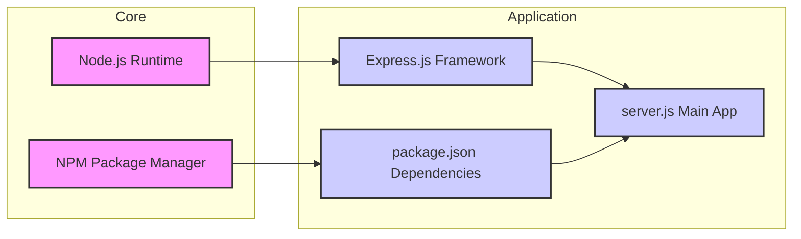
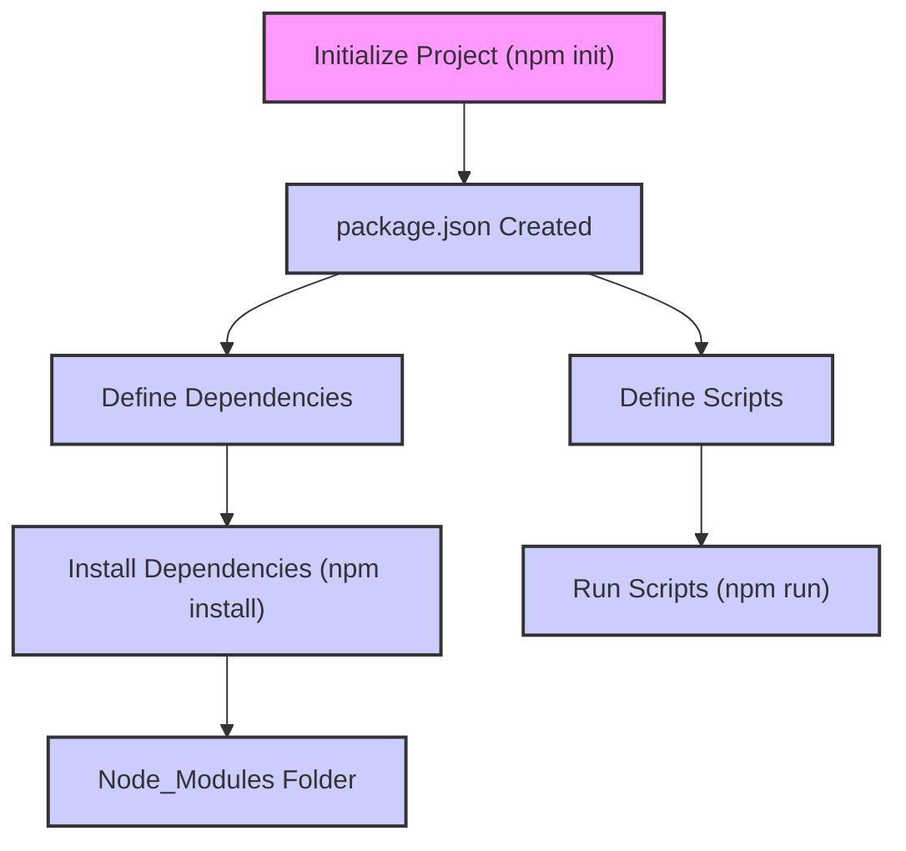
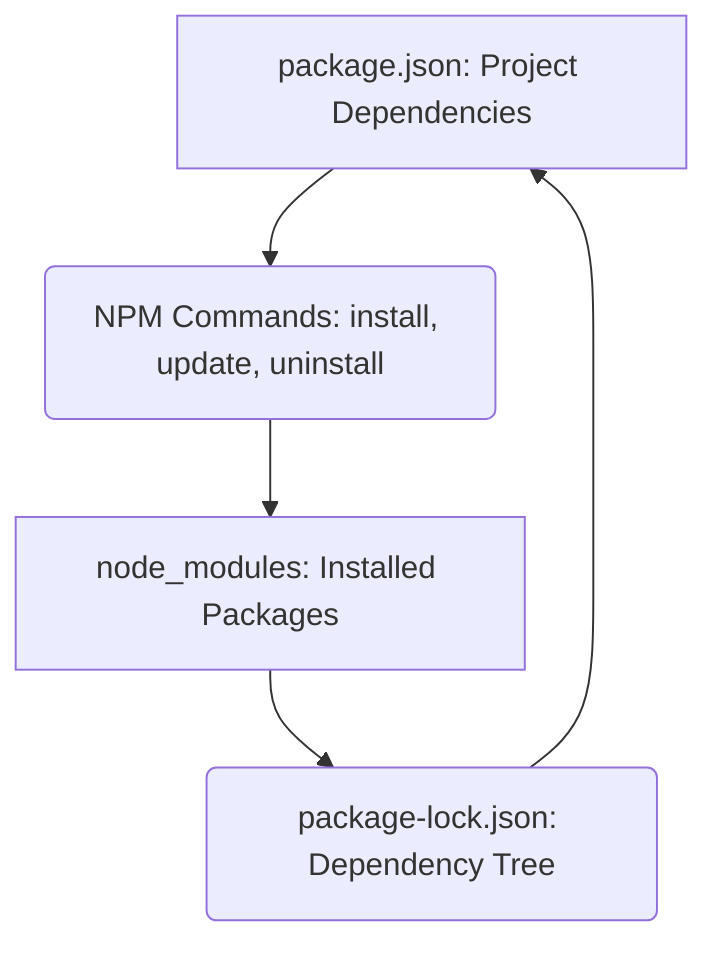
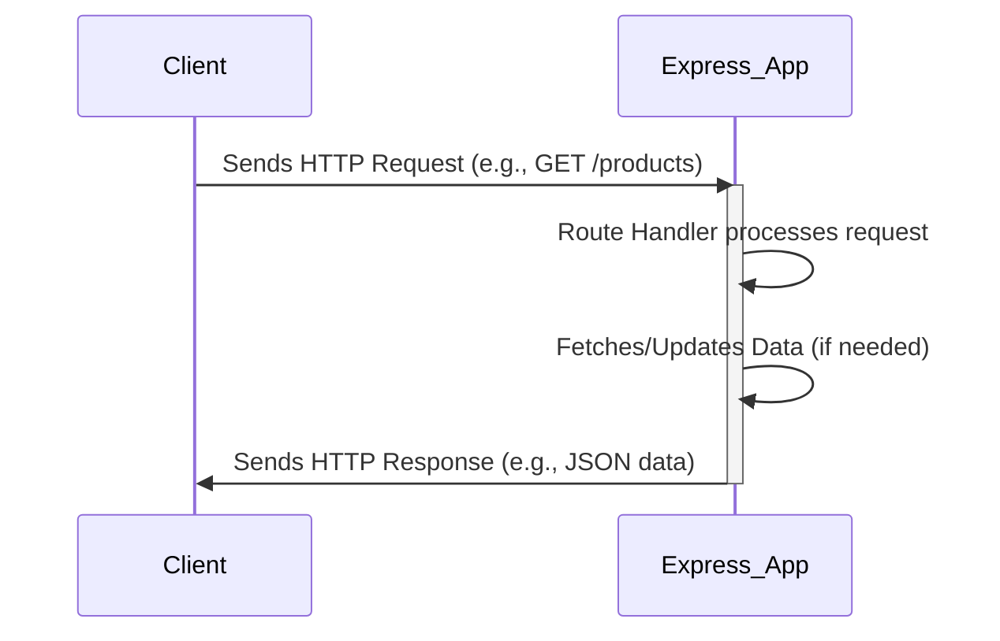
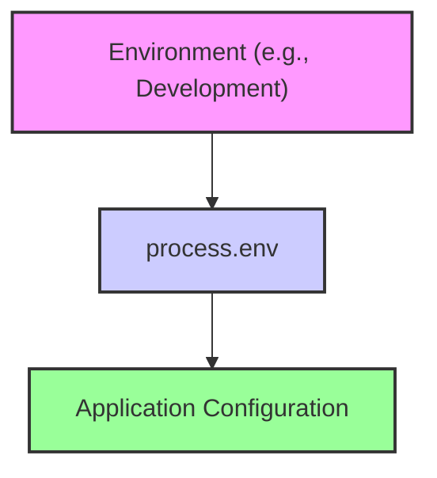
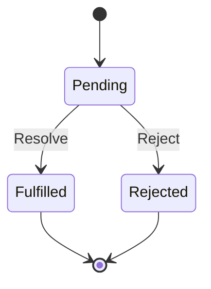
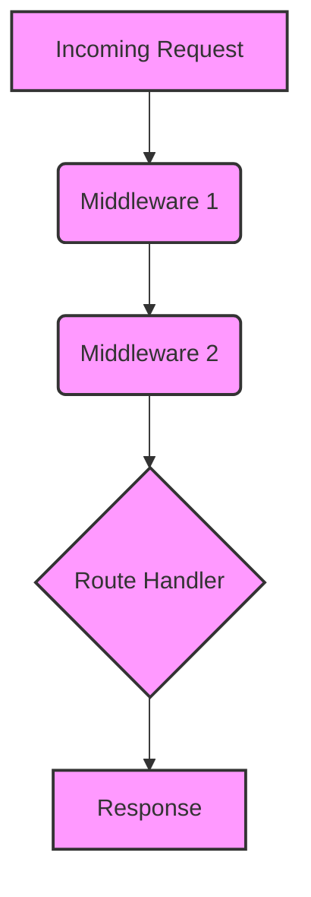
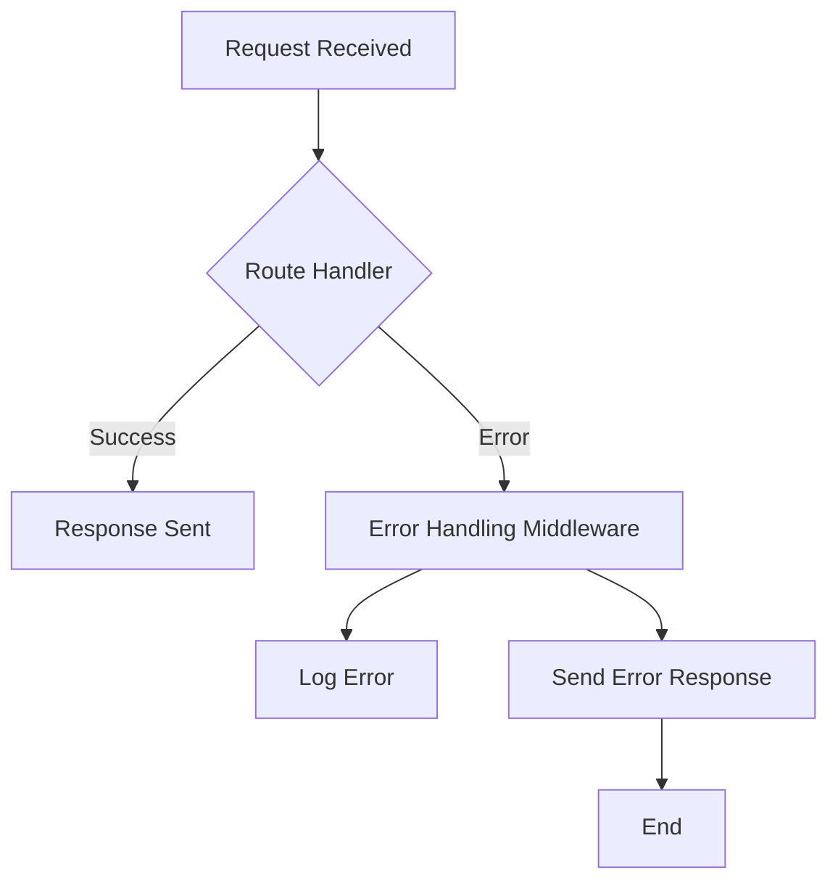

# Tutorial: Understanding the Repository

---


# 🚀 Welcome to Your Comprehensive Codebase Tutorial!

## What You'll Achieve
By the end of this 9-chapter journey, you'll have **deep, practical understanding** of this codebase and be ready to contribute effectively from day one. This isn't just documentation - it's your complete onboarding experience.

## ⏱️ Time Investment
**Total Time:** 275-280 minutes (approximately 4.0-4.0 hours)
**Recommended Pace:** 1-2 chapters per study session for optimal learning

## 🎯 Learning Path Overview
We've carefully designed this tutorial using proven instructional design principles:

**🏗️ Foundation (2 chapters):** Essential concepts and mental models
**⚙️ Core Functionality (3 chapters):** Primary features and patterns  
**🔬 Advanced Topics (0 chapters):** Complex integrations and optimizations

## 📚 What Makes This Tutorial Special
- **Hands-on Learning:** Every chapter includes practical exercises you can try immediately
- **Visual Learning:** Interactive Mermaid diagrams illustrate concepts, architecture, and workflows
- **Real-world Focus:** Learn patterns and practices actually used in this codebase
- **Progressive Building:** Each chapter builds naturally on previous knowledge
- **Immediate Value:** Gain practical skills you can apply right away

## 🗺️ Your Learning Journey
We'll start with **"Project Overview"** to build your foundation, then progressively advance through the architecture until we reach **"Building Robust Applications: Implementing Error Handling in Express.js"** where you'll see how everything integrates.

Each chapter follows a proven structure:
- 🎯 **Clear Learning Objectives** - Know exactly what you'll accomplish
- 🔍 **Real-world Context** - Understand why this matters for your work
- 🎨 **Visual Overview** - Mermaid diagrams showing concepts and relationships
- 💻 **Code Walkthroughs** - Deep dives into actual implementation
- 🚀 **Hands-on Practice** - Immediate application of concepts
- ✅ **Success Validation** - Confirm your understanding before moving on

## 💡 How to Get the Most Value
1. **Set aside focused time** - Each chapter deserves your full attention
2. **Actually try the exercises** - Passive reading won't build real skills
3. **Connect concepts** - Notice how each chapter builds on previous learning
4. **Experiment beyond the examples** - The best learning happens when you explore

## 🎯 Your Success Goal
After completing this tutorial, you'll be able to:
- Navigate the codebase confidently
- Understand the architectural decisions and patterns
- Implement new features following established conventions
- Debug issues using your deep system knowledge
- Contribute meaningfully to the project

**Ready to become an expert in this codebase? Let's dive in!** 🚀


---

# Table of Contents
- [Chapter 1: Project Overview](#chapter-1-project-overview)
- [Chapter 2: Kickstart Your Node.js Project: Managing Dependencies with package.json](#chapter-2-kickstart-your-node.js-project:-managing-dependencies-with-package.json)
- [Chapter 3: Structuring Node.js Applications: Mastering the Module System](#chapter-3-structuring-node.js-applications:-mastering-the-module-system)
- [Chapter 4: Managing Node.js Dependencies: Unleashing the Power of NPM](#chapter-4-managing-node.js-dependencies:-unleashing-the-power-of-npm)
- [Chapter 5: Building RESTful APIs with Express.js: Handling Incoming Requests](#chapter-5-building-restful-apis-with-express.js:-handling-incoming-requests)
- [Chapter 6: Configuring Your Node.js Application: Managing Environments with `process.env`](#chapter-6-configuring-your-node.js-application:-managing-environments-with-`process.env`)
- [Chapter 7: Handling Asynchronous Operations: Mastering Promises in JavaScript](#chapter-7-handling-asynchronous-operations:-mastering-promises-in-javascript)
- [Chapter 8: Enhancing Request Handling: Building Express.js Middleware Pipelines](#chapter-8-enhancing-request-handling:-building-express.js-middleware-pipelines)
- [Chapter 9: Building Robust Applications: Implementing Error Handling in Express.js](#chapter-9-building-robust-applications:-implementing-error-handling-in-express.js)

---

<a name="chapter-1-project-overview"></a>

---

# Project Overview

## 🎯 Chapter Objective
Understand the overall architecture and key components of Project

**Time to Complete:** 15-20 minutes

---

## 🏗️ Project Architecture

Understanding the big picture is crucial before diving into specifics. Here's how Project is structured:



## 📊 System Overview

This project consists of **8 key components** that work together to deliver its functionality. The architecture follows modern software engineering principles with clear separation of concerns and modular design.

### 🎯 Key Architectural Patterns

Based on the codebase analysis, this project demonstrates several important patterns:

- **Modular Architecture**: Components are organized into distinct, focused modules
- **Separation of Concerns**: Different aspects of functionality are cleanly separated
- **Dependency Management**: Clear relationships between components prevent circular dependencies
- **Scalable Design**: Structure supports growth and modification

## 🗺️ Navigation Guide

As you progress through this tutorial, you'll explore each component in detail:

1. **Foundation Concepts** - Essential patterns and structures
2. **Core Components** - Main functional elements
3. **Integration Patterns** - How components work together
4. **Advanced Topics** - Optimization and advanced features

## 🛠️ What You'll Build Understanding Of

By the end of this tutorial series, you'll have comprehensive knowledge of:

- **System Architecture**: How all pieces fit together
- **Component Interactions**: Data flow and dependencies
- **Development Patterns**: Coding standards and best practices
- **Extension Points**: Where and how to add new features

## 🎯 Hands-On Activity

**Exercise: Project Exploration**

Explore the project structure and identify key components

**Steps:**
1. Clone or download the project repository
2. Explore the directory structure using your preferred file explorer or IDE
3. Identify the main entry points and configuration files
4. Map what you see to the architecture diagram above

**Success Check:** Can explain the main architectural layers and component interactions

## 🔗 How This Connects

This overview chapter provides the foundation for all subsequent chapters. Each following chapter will dive deep into specific components you see in the architecture diagram above.

## ✅ Chapter Summary

- ✅ **Architecture Understanding**: You now know the high-level structure
- ✅ **Component Awareness**: You can identify the main building blocks  
- ✅ **Navigation Skills**: You know how to explore the codebase effectively
- ✅ **Learning Path**: You understand what's coming in the tutorial series

## 👉 Up Next

In the next chapter, we'll dive into the foundational components that everything else builds upon. You'll get hands-on experience with the core patterns that make this system work.

---

*Ready to dive deeper? Let's explore the building blocks that make this system tick!* 🚀


---

<a name="chapter-2-kickstart-your-node.js-project:-managing-dependencies-with-package.json"></a>

---

# Kickstart Your Node.js Project: Managing Dependencies with package.json

## 🎯 Chapter Objective
After this chapter, you will be able to initialize a Node.js project, define dependencies in `package.json`, and run basic scripts.

**Time to Complete:** 20 minutes

## 💡 Why This Matters

The `package.json` file is the heart of any Node.js project. It's like a blueprint that tells Node.js everything it needs to know about your project, including its name, version, dependencies, and how to run it. Without it, you'd be managing dependencies manually, which is a nightmare! Imagine deploying a project to production and realizing you forgot to install a crucial library. `package.json` prevents this and makes collaboration much easier. It ensures everyone on the team is using the same versions of dependencies, avoiding compatibility issues. Understanding `package.json` is crucial for building robust and maintainable Node.js applications.

## 🎨 Visual Overview


## 🧠 Core Concepts

*   **`package.json`:** A JSON file that describes your Node.js project. It contains metadata like the project's name, version, description, author, license, dependencies, and scripts.
*   **Dependencies:** External libraries or modules that your project relies on. `package.json` lists these dependencies and their required versions.
    *   Example: `"express": "^5.1.0"` means your project depends on the `express` library, version 5.1.0 or higher (but less than 6.0.0). The `^` symbol indicates a compatible range.
*   **Scripts:**  Shortcuts for running common tasks, like starting the server, running tests, or building the project. You define these in the `scripts` section of `package.json`.
    *   Example: `"start": "node server.js"` defines a script named "start" that runs the command `node server.js`.  You can then run this script using `npm start`.
*   **npm (Node Package Manager):** The default package manager for Node.js. It's used to install, update, and manage dependencies.
    *   `npm init`: Initializes a new Node.js project and creates a `package.json` file.
    *   `npm install`: Installs the dependencies listed in `package.json`.
    *   `npm install <package-name>`: Installs a specific package and adds it to `package.json`.
    *   `npm run <script-name>`: Executes a script defined in the `scripts` section of `package.json`.
*   **node_modules:** A directory where npm installs all the project's dependencies.  It's typically excluded from version control.

## 💻 Code Deep Dive

Let's analyze the provided `package.json` file:

```json
{
  "dependencies": {
    "@google/generative-ai": "^0.24.0",
    "bcryptjs": "^3.0.2",
    "cors": "^2.8.5",
    "dotenv": "^16.4.7",
    "express": "^5.1.0",
    "jsonwebtoken": "^9.0.2",
    "mongoose": "^8.13.2",
    "serverless-http": "^3.2.0"
  },
  "name": "server",
  "version": "1.0.0",
  "description": "",
  "main": "server.js",
  "scripts": {
    "start": "node server.js"
  },
  "author": "",
  "license": "ISC"
}
```

*   **`dependencies`:** This section lists all the packages the project needs to run.
    *   `"@google/generative-ai": "^0.24.0"`:  Uses Google's Generative AI library.
    *   `"bcryptjs": "^3.0.2"`: Used for password hashing.  Important for security.
    *   `"cors": "^2.8.5"`: Enables Cross-Origin Resource Sharing, useful for APIs.
    *   `"dotenv": "^16.4.7"`: Loads environment variables from a `.env` file.
    *   `"express": "^5.1.0"`: A popular web framework for Node.js.
    *   `"jsonwebtoken": "^9.0.2"`: Used for creating and verifying JSON Web Tokens (JWTs) for authentication.
    *   `"mongoose": "^8.13.2"`: An Object Data Modeling (ODM) library for MongoDB.
    *   `"serverless-http": "^3.2.0"`: Wraps an Express app for serverless deployment.
*   **`name`:**  The name of the project ("server").
*   **`version`:** The current version of the project ("1.0.0").
*   **`description`:**  A brief description of the project (empty in this case, but good practice to fill in).
*   **`main`:** Specifies the entry point of the application (`server.js`).
*   **`scripts`:** Defines commands that can be run using `npm run`.
    *   `"start": "node server.js"`: This is the most common script. It tells Node.js to execute the `server.js` file, which likely starts the server.
*   **`author`:** The author of the project (empty).
*   **`license`:** The license under which the project is distributed (ISC).

## 🧑‍💻 Hands-On Practice

**Exercise: Create a `package.json` file, add a dependency (e.g., `lodash`), and define a script to run a simple command using that dependency.**

**Steps:**

1.  **Create a Project Directory:**
    *   Open your terminal and create a new directory for your project:
        ```bash
        mkdir my-lodash-project
        cd my-lodash-project
        ```

2.  **Initialize the Project:**
    *   Run `npm init -y` to create a `package.json` file with default values. The `-y` flag automatically accepts all the default settings.
        ```bash
        npm init -y
        ```

3.  **Install `lodash`:**
    *   Install the `lodash` library using npm:
        ```bash
        npm install lodash
        ```
        This command downloads and installs `lodash` and adds it as a dependency in your `package.json` file.

4.  **Create `index.js`:**
    *   Create a file named `index.js` in your project directory.

5.  **Add Lodash Code:**
    *   Add the following code to `index.js`:
        ```javascript
        const _ = require('lodash');

        const numbers = [1, 2, 2, 3, 4, 4, 5];
        const uniqueNumbers = _.uniq(numbers);

        console.log("Original array:", numbers);
        console.log("Unique array:", uniqueNumbers);
        ```

6.  **Add a Script to `package.json`:**
    *   Open your `package.json` file and add a script to the `scripts` section to run `index.js`.  It should look like this:
        ```json
        {
          "name": "my-lodash-project",
          "version": "1.0.0",
          "description": "",
          "main": "index.js",
          "scripts": {
            "start": "node index.js"
          },
          "keywords": [],
          "author": "",
          "license": "ISC",
          "dependencies": {
            "lodash": "^4.17.21"
          }
        }
        ```

7.  **Run the Script:**
    *   In your terminal, run the `start` script:
        ```bash
        npm start
        ```

**Success Check:** You should see the original and unique arrays printed to your console, demonstrating that `lodash` is correctly installed and being used.

## ✅ Chapter Summary

You've learned how to:

*   Initialize a Node.js project using `npm init`.
*   Define project dependencies in the `package.json` file.
*   Install dependencies using `npm install`.
*   Define and run custom scripts using `npm run`.
*   Understand the importance of `package.json` for dependency management and project reproducibility.

## 👉 Up Next

Next, we'll dive into using environment variables with the `dotenv` package for managing configuration settings.

---

<a name="chapter-3-structuring-node.js-applications:-mastering-the-module-system"></a>

---

# Structuring Node.js Applications: Mastering the Module System

## 🎯 Chapter Objective
After this chapter, you will be able to organize code into reusable modules using `require` and `module.exports` in Node.js.

**Time to Complete:** 25 minutes

## 💡 Why This Matters

Imagine building a large application with thousands of lines of code all in one file. It would be incredibly difficult to navigate, understand, and maintain. The Node.js module system allows you to break down your application into smaller, manageable, and reusable pieces. This promotes code organization, reusability, and maintainability. For example, you can create a separate module for database interactions, another for user authentication, and another for handling API requests. This makes your code easier to test, debug, and collaborate on, ultimately leading to faster development and fewer bugs.

## 🎨 Visual Overview
```mermaid
flowchart TD
    A[server.js] --> B{require('./my_module.js')}
    B --> C[my_module.js]
    C --> D{module.exports = ...}
    style A fill:#f9f,stroke:#333,stroke-width:2px
    style B fill:#ccf,stroke:#333,stroke-width:2px
    style C fill:#ccf,stroke:#333,stroke-width:2px
    style D fill:#cfc,stroke:#333,stroke-width:2px
```

## 🧠 Core Concepts

*   **Module:** A module is a self-contained unit of code that encapsulates related functionality. It can be a single file or a directory containing multiple files.

*   **`require()`:** This function is used to import modules into your code. It takes the module's file path as an argument and returns the exported values from that module.

    ```javascript
    const myModule = require('./my_module');
    ```

*   **`module.exports`:** This object is used to export values (functions, objects, variables) from a module, making them available for other modules to import.

    ```javascript
    // my_module.js
    function greet(name) {
      return `Hello, ${name}!`;
    }

    module.exports = greet; // Exporting the function
    ```

    You can also export multiple values as an object:

    ```javascript
    // my_module.js
    function add(a, b) {
      return a + b;
    }

    function subtract(a, b) {
      return a - b;
    }

    module.exports = {
      add: add,
      subtract: subtract
    };
    ```

*   **File Paths:** When using `require()`, you can specify the file path relative to the current file.
    *   `./my_module` refers to a file in the same directory.
    *   `../utils/my_module` refers to a file in the parent directory, inside the `utils` folder.
    *   You can also `require` built-in modules like `fs` or `http` without specifying a path.  Node.js knows where to find these.

## 💻 Code Deep Dive

Let's analyze how the module system is used in the provided `server.js` file:

```javascript
require('dotenv').config({ path: './.env' }); // Importing the dotenv module
const express = require('express'); // Importing the express module
const mongoose = require('mongoose'); // Importing the mongoose module
const cors = require('cors'); // Importing the cors module
const v1Router = require('./v1/v1'); // Importing a custom module
const PORT = process.env.PORT || 5000;
const app = express();

// ... rest of the code
```

1.  **`require('dotenv').config({ path: './.env' });`**: This line imports the `dotenv` module. The `dotenv` module is used to load environment variables from a `.env` file into `process.env`. The `.config()` method then configures `dotenv` to read from the `.env` file located in the current directory.

2.  **`const express = require('express');`**: This imports the `express` module, which is a popular framework for building web applications in Node.js.

3.  **`const mongoose = require('mongoose');`**: This imports the `mongoose` module, which provides a way to interact with MongoDB databases in a structured manner.

4.  **`const cors = require('cors');`**: This imports the `cors` module, which is used to enable Cross-Origin Resource Sharing (CORS) for the application.  CORS is important for allowing requests from different domains.

5.  **`const v1Router = require('./v1/v1');`**: This line imports a custom module located at `./v1/v1.js` (or a directory with an `index.js` file inside). This is a key example of modularizing your own code. The `v1Router` likely contains the routes and logic for version 1 of the API.

The `server.js` file demonstrates how `require()` is used to import both third-party modules (like `express` and `mongoose`) and custom modules (`./v1/v1`). This allows the code to be organized into logical components.

## 🧑‍💻 Hands-On Practice

**Exercise: Create two files: `module.js` (containing a function) and `server.js`. Export the function from `module.js` and import/use it in `server.js`.**

**Steps:**

1.  **Create `module.js`:** Create a new file named `module.js` in your project directory.

2.  **Add a function to `module.js`:** Add the following code to `module.js`:

    ```javascript
    function add(a, b) {
      return a + b;
    }

    module.exports = add;
    ```

3.  **Create `server.js`:** Create a new file named `server.js` in the same directory as `module.js`.

4.  **Import the module in `server.js`:** Add the following code to `server.js`:

    ```javascript
    const add = require('./module');

    const result = add(5, 3);
    console.log(`The sum is: ${result}`);
    ```

5. **Run `server.js`:** Open your terminal, navigate to the project directory, and run the command `node server.js`.

**Success Check:** Successfully created and imported a module, and used its exported functionality in another file.  You should see "The sum is: 8" printed in your console.

**Bonus:** Modify `module.js` to export multiple functions (e.g., `add`, `subtract`, `multiply`) as an object, and then import and use them in `server.js`.

## ✅ Chapter Summary

In this chapter, you learned how to structure Node.js applications using the module system. You now understand:

*   The importance of modularizing code for organization and reusability.
*   How to use `require()` to import modules.
*   How to use `module.exports` to export values from modules.
*   How to organize code into separate files and import them into your main application.

## 👉 Up Next

In the next chapter, we'll dive deeper into the Node.js Package Manager (npm) and learn how to install and manage external dependencies.

---

<a name="chapter-4-managing-node.js-dependencies:-unleashing-the-power-of-npm"></a>

---

# Managing Node.js Dependencies: Unleashing the Power of NPM

## 🎯 Chapter Objective
After this chapter, you will be able to use NPM to install, update, and manage project dependencies effectively.

**Time to Complete:** 30 minutes

## 💡 Why This Matters

Managing dependencies is crucial for any Node.js project. NPM (Node Package Manager) simplifies this process, allowing you to easily install, update, and remove libraries and frameworks your project relies on. Without proper dependency management, you might face issues like:

*   **Version conflicts:** Different parts of your application might require different versions of the same library.
*   **Security vulnerabilities:** Outdated dependencies can contain security flaws, making your application vulnerable to attacks.
*   **Deployment issues:** Ensuring all required dependencies are present and compatible on the deployment environment can be challenging without a package manager.
*   **Inconsistent builds:** Different environments might have different versions of dependencies, leading to inconsistent behavior.

By mastering NPM, you ensure your project remains stable, secure, and maintainable. For example, the `package.json` file included in the context, along with the `package-lock.json` file, are essential for ensuring that all developers and deployment environments use the exact same versions of dependencies like `express`, `mongoose`, and `@google/generative-ai`.

## 🎨 Visual Overview


## 🧠 Core Concepts

*   **NPM (Node Package Manager):** A package manager for Node.js that allows you to install, share, and manage dependencies. It's the default package manager for Node.js.
*   **Package:** A module or library that can be installed and used in your Node.js project. Examples from the provided `package.json` include `express`, `mongoose`, `cors`, and `@google/generative-ai`.
*   **`package.json`:** A file at the root of your project that contains metadata about your project, including a list of its dependencies. It defines the packages your project needs.
    *   **`dependencies`:** Lists the packages your application needs to run in production.
    *   **`devDependencies`:** Lists packages needed for development, like testing frameworks or build tools (not shown in the example).
    *   **`scripts`:** Defines command-line scripts that can be run using `npm run <script-name>`. The example shows a "start" script: `"start": "node server.js"`.
*   **`node_modules`:** A directory where NPM installs all the project's dependencies.
*   **`package-lock.json`:** A file that records the exact versions of all dependencies and their sub-dependencies. This ensures consistent installs across different environments.
*   **Semantic Versioning (SemVer):** A versioning scheme (MAJOR.MINOR.PATCH) used by packages to indicate the type of changes included in a new release.
    *   **MAJOR:** Incompatible API changes.
    *   **MINOR:** Added functionality in a backwards compatible manner.
    *   **PATCH:** Bug fixes in a backwards compatible manner.

## 💻 Code Deep Dive

Let's analyze the provided `package.json` and `package-lock.json` files:

**`package.json`:**

```json
{
  "dependencies": {
    "@google/generative-ai": "^0.24.0",
    "bcryptjs": "^3.0.2",
    "cors": "^2.8.5",
    "dotenv": "^16.4.7",
    "express": "^5.1.0",
    "jsonwebtoken": "^9.0.2",
    "mongoose": "^8.13.2",
    "serverless-http": "^3.2.0"
  },
  "name": "server",
  "version": "1.0.0",
  "description": "",
  "main": "server.js",
  "scripts": {
    "start": "node server.js"
  },
  "author": "",
  "license": "ISC"
}
```

*   This file specifies the dependencies for a Node.js server application.
*   It lists packages like `express` for building the web server, `mongoose` for interacting with MongoDB, `@google/generative-ai` for using Google's generative AI models, and others for various functionalities like security (`bcryptjs`, `jsonwebtoken`), environment variables (`dotenv`), and cross-origin resource sharing (`cors`).
*   The `"start"` script allows you to run the server using `npm start`.

**`package-lock.json`:**

This file is much larger and contains detailed information about each dependency, including its exact version, location, and dependencies. It ensures that everyone working on the project uses the same versions of all packages. It's automatically generated and managed by NPM.

**Key NPM Commands:**

*   **`npm install`:** Installs the dependencies listed in `package.json`. If a `package-lock.json` exists, it will install the exact versions specified in that file.
    *   `npm install`: Installs all dependencies.
    *   `npm install <package-name>`: Installs a specific package and adds it to `package.json`.
    *   `npm install -g <package-name>`: Installs a package globally (accessible from any project).
    *   `npm install --save-dev <package-name>` or `npm install -D <package-name>`: installs a package as a development dependency
*   **`npm update`:** Updates packages to the latest versions allowed by the version ranges specified in `package.json`.  It will also update the `package-lock.json` file.
    *   `npm update`: Updates all packages.
    *   `npm update <package-name>`: Updates a specific package.
*   **`npm uninstall <package-name>`:** Removes a package from `node_modules` and updates `package.json` and `package-lock.json`.
    *   `npm uninstall <package-name>`: Uninstalls a specific package.
    *   `npm uninstall -g <package-name>`: Uninstalls a globally installed package.
*   **`npm outdated`:** Lists outdated packages.
*   **`npm audit`:** Scans your project for security vulnerabilities in dependencies.
*   **`npm audit fix`:** Attempts to automatically fix detected security vulnerabilities.

## 🧑‍💻 Hands-On Practice

**Exercise: Install a package globally using NPM (e.g., nodemon), use it to run your `server.js` file, and then update the package to the latest version.**

**Steps:**

1.  **Install nodemon globally:** Open your terminal and run the following command:

    ```bash
    npm install -g nodemon
    ```

    This installs `nodemon` globally, allowing you to use it in any Node.js project.

2.  **Use nodemon to run your server:**  Modify your `package.json` file to use `nodemon` in your "start" script. Change the `"start"` script to:

    ```json
    "scripts": {
        "start": "nodemon server.js"
    }
    ```

3.  **Run the server:** Execute the start script with:

    ```bash
    npm start
    ```

    `nodemon` will now watch your `server.js` file and automatically restart the server whenever you make changes to it.

4.  **Update nodemon to the latest version:** To update `nodemon` globally, run:

    ```bash
    npm update -g nodemon
    ```

    This will update `nodemon` to the newest version available.

**Success Check:** Successfully installed `nodemon` globally, configured it to run your `server.js` file, and updated it to the latest version using NPM. You should see `nodemon` restarting your server automatically when you save changes to `server.js` or any other file it's watching.

## ✅ Chapter Summary

In this chapter, you learned how to manage Node.js dependencies using NPM. You now understand:

*   The importance of dependency management for project stability and security.
*   The roles of `package.json` and `package-lock.json`.
*   How to install, update, and uninstall packages using NPM commands.
*   How to install packages globally.

You can now effectively manage your project's dependencies, ensuring consistency and reducing the risk of version conflicts and security vulnerabilities.

## 👉 Up Next

Next, we'll explore how to configure environment variables using the `dotenv` package, as seen in the `package.json`, to manage sensitive information and different environments.

---

<a name="chapter-5-building-restful-apis-with-express.js:-handling-incoming-requests"></a>

---

# Building RESTful APIs with Express.js: Handling Incoming Requests

## 🎯 Chapter Objective
After this chapter, you will be able to define routes and handle HTTP requests using Express.js to create basic API endpoints.

**Time to Complete:** 35 minutes

## 💡 Why This Matters
Understanding how to handle incoming requests is fundamental to building any API. It's the gateway through which your application interacts with the outside world. Imagine you're building an e-commerce platform. You'll need to handle `POST` requests to create new orders, `GET` requests to retrieve product information, `PUT` requests to update user profiles, and `DELETE` requests to remove items from a shopping cart. Without mastering this, you can't build a functional API. Properly handling requests also ensures data integrity, security, and a smooth user experience.

## 🎨 Visual Overview


## 🧠 Core Concepts

*   **Routes:** Routes define how the application responds to client requests to a particular endpoint, which is a URI (or path) and a specific HTTP request method (GET, POST, PUT, DELETE, etc.).  For example, `/products` might be a route for fetching all products.

*   **HTTP Methods:** These are the verbs that define the type of action the client wants to perform.
    *   `GET`: Used to retrieve data.
    *   `POST`: Used to create new data.
    *   `PUT`: Used to update existing data.
    *   `DELETE`: Used to remove data.

*   **Request Object (`req`):** This object contains information about the incoming request, such as headers, query parameters, and the request body.

*   **Response Object (`res`):** This object is used to send data back to the client, including the status code, headers, and the response body.

*   **Middleware:** Functions that have access to the request object (`req`), the response object (`res`), and the next middleware function in the application’s request-response cycle.  `express.json()` is a middleware that parses incoming requests with JSON payloads.

## 💻 Code Deep Dive

Let's analyze parts of the `server.js` file to understand how requests are handled.

```javascript
const express = require('express');
const app = express();

// Middleware
app.use(express.json());

// Routes
app.use('/api/v1', v1Router);
```

*   **`const app = express();`**: This line creates an instance of the Express application.  This `app` object is what we use to define routes and handle requests.

*   **`app.use(express.json());`**: This line uses the `express.json()` middleware. This middleware parses the body of incoming requests that have a JSON payload and makes it available in `req.body`.  Without this, you wouldn't be able to access data sent in the body of a `POST` or `PUT` request.

*   **`app.use('/api/v1', v1Router);`**: This line mounts the `v1Router` at the `/api/v1` path. This means that any routes defined in `v1Router` will be accessible under the `/api/v1` prefix. This is how the application delegates routing responsibilities to different modules.  Assuming `v1Router` is defined elsewhere (e.g., in `./v1/v1.js`), it might contain route definitions like this:

```javascript
// Example v1Router (in v1/v1.js)
const express = require('express');
const router = express.Router();

router.get('/products', (req, res) => {
  res.json({ message: 'GET request to /api/v1/products' });
});

router.post('/products', (req, res) => {
  const newProduct = req.body; // Access the parsed JSON body
  res.status(201).json({ message: 'POST request to /api/v1/products', data: newProduct });
});

module.exports = router;
```

In this example:

*   `router.get('/products', ...)` defines a route that handles `GET` requests to `/api/v1/products`. When a client sends a `GET` request to this endpoint, the provided callback function is executed.
*   `router.post('/products', ...)` defines a route that handles `POST` requests to `/api/v1/products`. The `req.body` contains the data sent by the client.  The `res.status(201)` sets the HTTP status code to 201 (Created), indicating that the request was successful and a new resource was created.

## 🧑‍💻 Hands-On Practice

**Exercise: Create a simple Express.js server with routes for GET, POST, PUT and DELETE requests. Each route should return a JSON response.**

**Steps:**

1.  **Set up your project:**
    *   Create a new directory for your project.
    *   Navigate into the directory in your terminal.
    *   Run `npm init -y` to create a `package.json` file.
    *   Install Express: `npm install express`
    *   Create a file named `app.js`.

2.  **Write the code in `app.js`:**

```javascript
const express = require('express');
const app = express();
const PORT = 3000;

app.use(express.json()); // Middleware to parse JSON bodies

// GET request
app.get('/api/items', (req, res) => {
  res.json({ message: 'GET request received for items' });
});

// POST request
app.post('/api/items', (req, res) => {
  const newItem = req.body;
  console.log('Received item:', newItem);
  res.status(201).json({ message: 'POST request received for items', data: newItem });
});

// PUT request
app.put('/api/items/:id', (req, res) => {
  const itemId = req.params.id;
  const updatedItem = req.body;
  console.log(`Received PUT request for item with ID: ${itemId}`, updatedItem);
  res.json({ message: `PUT request received for item with ID: ${itemId}`, data: updatedItem });
});

// DELETE request
app.delete('/api/items/:id', (req, res) => {
  const itemId = req.params.id;
  console.log(`Received DELETE request for item with ID: ${itemId}`);
  res.json({ message: `DELETE request received for item with ID: ${itemId}` });
});

app.listen(PORT, () => {
  console.log(`Server listening on port ${PORT}`);
});
```

3.  **Run the server:**
    *   In your terminal, run `node app.js`.  You should see "Server listening on port 3000" in the console.

4.  **Test the endpoints using a tool like Postman or `curl`:**

    *   **GET:** `curl http://localhost:3000/api/items`
    *   **POST:** `curl -X POST -H "Content-Type: application/json" -d '{"name": "Test Item"}' http://localhost:3000/api/items`
    *   **PUT:** `curl -X PUT -H "Content-Type: application/json" -d '{"name": "Updated Item"}' http://localhost:3000/api/items/123`
    *   **DELETE:** `curl -X DELETE http://localhost:3000/api/items/123`

**Success Check:** Successfully created an Express.js server and defined routes to handle common HTTP methods, returning appropriate JSON responses. Verify the responses in Postman or your chosen testing tool. Also, check the server console for the logged messages.

## ✅ Chapter Summary

You've learned how to:

*   Define routes using `app.get`, `app.post`, `app.put`, and `app.delete`.
*   Access request parameters using `req.params`.
*   Access the request body using `req.body` (after using the `express.json()` middleware).
*   Send JSON responses using `res.json()`.
*   Set HTTP status codes using `res.status()`.

You can now create basic API endpoints that handle different types of HTTP requests.

## 👉 Up Next

In the next chapter, we'll dive deeper into middleware and learn how to use it for authentication and authorization.

---

<a name="chapter-6-configuring-your-node.js-application:-managing-environments-with-`process.env`"></a>

---

# Configuring Your Node.js Application: Managing Environments with `process.env`

## 🎯 Chapter Objective
After this chapter, you will be able to configure application behavior for different environments (development, staging, production) using `process.env`.

**Time to Complete:** 25 minutes

## 💡 Why This Matters

Environment variables are crucial for managing configuration settings in your Node.js applications. Imagine deploying your application to different environments like development, staging, and production. Each environment might require different database connection strings, API keys, or feature flags. Hardcoding these values directly into your code is a bad practice because it's not secure, and you'd have to modify and redeploy your code every time you move between environments. `process.env` allows you to dynamically configure your application based on the environment it's running in, making your code more flexible, maintainable, and secure. For example, in a production environment, you might want to use a real database and enable certain security features, while in development, you might use a mock database and disable those features for easier debugging. Using `process.env` allows you to manage these differences seamlessly.

## 🎨 Visual Overview


## 🧠 Core Concepts

*   **Environment Variables:** These are key-value pairs that store configuration settings outside of your application's code. They are accessible to your application through the `process.env` object in Node.js.

*   **`process.env` Object:** A global object in Node.js that provides access to the environment variables set in the system where the Node.js process is running.

*   **Configuration:** The process of setting up your application's behavior based on the environment it's running in. This includes things like database connection strings, API keys, ports, and feature flags.

*   **`.env` Files:**  A common way to manage environment variables during development. You store your environment variables in a `.env` file in the root of your project.  You'll need a package like `dotenv` to load these variables into `process.env`.

**Example:**

Let's say you have a database connection string that's different for development and production.

*   **Development:** `MONGODB_URI=mongodb://localhost:27017/dev_db`
*   **Production:** `MONGODB_URI=mongodb://prod_server:27017/prod_db`

You would store these in your `.env` file (or set them directly in your server environment) and access them in your code using `process.env.MONGODB_URI`.

## 💻 Code Deep Dive

Let's analyze the provided `server.js` code snippet:

```javascript
require('dotenv').config({ path: './.env' });
const express = require('express');
const mongoose = require('mongoose');
const cors = require('cors');
const v1Router = require('./v1/v1');
const PORT = process.env.PORT || 5000;
const app = express();

// Middleware
app.use(cors({
  origin: '*',
  methods: ['GET', 'POST', 'PUT', 'DELETE', 'OPTIONS'],
  allowedHeaders: ['Content-Type', 'Authorization', 'ngrok-skip-browser-warning']
}));
app.use(express.json());

// MongoDB Connection
mongoose.connect(process.env.MONGODB_URI)
  .then(() => console.log('Connected to MongoDB'))
  .catch(err => {
    console.error('MongoDB connection error:', err);
    process.exit(1);
  });

// Routes
app.use('/api/v1', v1Router);

// Error handling middleware
app.use((err, req, res, next) => {
  console.error(err.stack);
  res.status(500).json({ error: 'Something went wrong!' });
});

app.listen(PORT, () => {
  console.log(`Server running on port ${PORT}`);
});

module.exports = app;
```

**Explanation:**

1.  **`require('dotenv').config({ path: './.env' });`**: This line loads environment variables from a `.env` file located in the same directory as `server.js`. The `dotenv` package makes these variables accessible via `process.env`.

2.  **`const PORT = process.env.PORT || 5000;`**: This line retrieves the value of the `PORT` environment variable.  If `process.env.PORT` is not set (e.g., not defined in the `.env` file or as a system environment variable), it defaults to `5000`. This is a common pattern for providing default values.

3.  **`mongoose.connect(process.env.MONGODB_URI)`**: This line uses the `MONGODB_URI` environment variable to connect to the MongoDB database.  This allows you to specify a different database connection string for each environment (development, staging, production) by setting the `MONGODB_URI` environment variable accordingly.

**Key Takeaways:**

*   The code demonstrates how to access environment variables using `process.env`.
*   It shows how to provide a default value if an environment variable is not set using the `||` (OR) operator.
*   It highlights how environment variables can be used to configure different aspects of the application, such as the port and the database connection string.

## 🧑‍💻 Hands-On Practice

**Exercise: Set an environment variable (e.g., `PORT=3001`) and access it in your `server.js` file to configure the port the Express.js server listens on. Define default value if the environment variable is not set.**

**Steps:**

1.  **Create a `.env` file (if you don't have one):** In the root directory of your project, create a file named `.env`.

2.  **Add the `PORT` variable to your `.env` file:**
    ```
    PORT=3001
    ```
    Save the file.

3.  **Modify your `server.js` file (if needed):** Ensure your `server.js` file includes the following line to load environment variables from the `.env` file:
    ```javascript
    require('dotenv').config({ path: './.env' });
    ```
    Also, ensure you have the line that uses the `PORT` environment variable:
     ```javascript
     const PORT = process.env.PORT || 5000;
     ```

4.  **Run your application:** Execute the command `node server.js` (or whatever command you use to start your server).

5.  **Verify the port:** Check the console output. You should see: `Server running on port 3001`.

6.  **Test the default value:** Remove or comment out the `PORT=3001` line in your `.env` file. Run your application again. You should now see: `Server running on port 5000`. This confirms that the default value is being used when the environment variable is not set.

**Success Check:** Successfully set and accessed environment variables to configure the application's behavior. Demonstrate the ability to set defaults.

## ✅ Chapter Summary

In this chapter, you learned how to use `process.env` to configure your Node.js application for different environments. You now know how to:

*   Understand the importance of environment variables for managing configuration.
*   Access environment variables using the `process.env` object.
*   Use the `dotenv` package to load environment variables from a `.env` file.
*   Provide default values for environment variables if they are not set.
*   Apply these concepts to configure your application's port and database connection.

## 👉 Up Next

In the next chapter, we'll explore logging in Node.js and how to implement effective logging strategies for debugging and monitoring your application.

---

<a name="chapter-7-handling-asynchronous-operations:-mastering-promises-in-javascript"></a>

---

# Handling Asynchronous Operations: Mastering Promises in JavaScript

## 🎯 Chapter Objective
After this chapter, you will be able to handle asynchronous operations using Promises for non-blocking execution in Node.js.

**Time to Complete:** 40 minutes

## 💡 Why This Matters

Asynchronous operations are fundamental to modern JavaScript, especially in Node.js. Without proper handling, these operations can lead to blocking code, resulting in slow and unresponsive applications. Promises provide a clean and efficient way to manage asynchronous tasks, ensuring your application remains responsive and performs optimally. For instance, in the `server.js` file provided, connecting to MongoDB using `mongoose.connect()` is an asynchronous operation.  Using Promises allows the server to continue executing other tasks while the database connection is being established, preventing the application from freezing.  Properly handling asynchronous operations with Promises enables you to build scalable and maintainable Node.js applications.

## 🎨 Visual Overview


## 🧠 Core Concepts

*   **Asynchronous Operations:** Tasks that don't immediately return a result. Examples include network requests, file system operations, and database queries. They allow your code to continue executing without waiting for the operation to complete.

*   **Promises:** Objects that represent the eventual completion (or failure) of an asynchronous operation and its resulting value. A Promise can be in one of three states:

    *   **Pending:** The initial state; the operation is still in progress.
    *   **Fulfilled:** The operation completed successfully, and the Promise has a value.
    *   **Rejected:** The operation failed, and the Promise has a reason for the failure (usually an error).

*   **`resolve()`:** A function used to transition a Promise from the `pending` state to the `fulfilled` state. It's called when the asynchronous operation is successful, and it typically passes the result of the operation.

*   **`reject()`:** A function used to transition a Promise from the `pending` state to the `rejected` state. It's called when the asynchronous operation fails, and it typically passes an error object.

*   **`.then()`:** A method attached to a Promise that is called when the Promise is fulfilled. It allows you to handle the result of the asynchronous operation.

*   **`.catch()`:** A method attached to a Promise that is called when the Promise is rejected. It allows you to handle errors that occur during the asynchronous operation.

*   **`.finally()`:** A method attached to a Promise that is called regardless of whether the Promise is fulfilled or rejected. It's often used for cleanup tasks.

**Example:**

```javascript
const myPromise = new Promise((resolve, reject) => {
  setTimeout(() => {
    const randomNumber = Math.random();
    if (randomNumber > 0.5) {
      resolve("Success! Random number was greater than 0.5");
    } else {
      reject("Error! Random number was less than or equal to 0.5");
    }
  }, 1000);
});

myPromise
  .then((result) => {
    console.log("Result:", result); // This will be logged if the promise is resolved
  })
  .catch((error) => {
    console.error("Error:", error); // This will be logged if the promise is rejected
  })
  .finally(() => {
    console.log("Promise finished"); // This will always be logged
  });

console.log("This will run before the promise resolves or rejects");
```

## 💻 Code Deep Dive

Let's analyze how Promises are used in the provided `server.js` file, specifically in the MongoDB connection:

```javascript
mongoose.connect(process.env.MONGODB_URI)
  .then(() => console.log('Connected to MongoDB'))
  .catch(err => {
    console.error('MongoDB connection error:', err);
    process.exit(1);
  });
```

1.  **`mongoose.connect(process.env.MONGODB_URI)`:** This function initiates the connection to the MongoDB database. It returns a Promise.

2.  **`.then(() => console.log('Connected to MongoDB'))`:** This is the success handler. If the connection is successful, the code inside `.then()` will execute. In this case, it logs a message to the console confirming the connection.

3.  **`.catch(err => { ... })`:** This is the error handler. If the connection fails (e.g., invalid URI, database offline), the code inside `.catch()` will execute.  It logs the error message and then exits the Node.js process using `process.exit(1)`.  Exiting the process is a common practice in critical startup failures to prevent the application from running without a database connection.

**Step-by-step Explanation:**

*   The `mongoose.connect()` function returns a Promise representing the asynchronous connection attempt.
*   If the connection succeeds, the Promise resolves, and the `.then()` callback is executed.
*   If the connection fails, the Promise rejects, and the `.catch()` callback is executed.
*   The `.catch()` block ensures that any connection errors are handled gracefully, preventing the application from crashing.

## 🧑‍💻 Hands-On Practice

**Exercise: Wrap a synchronous function (e.g., reading a file from disk) in a Promise and handle its resolution and rejection using `.then()` and `.catch()`.**

**Steps:**

1.  **Create a file named `promiseExample.js`:** This file will contain your code.

2.  **Import the `fs` module:** This module allows you to interact with the file system.

    ```javascript
    const fs = require('fs');
    ```

3.  **Create a function that reads a file and wraps it in a Promise:**

    ```javascript
    function readFilePromise(filePath) {
      return new Promise((resolve, reject) => {
        fs.readFile(filePath, 'utf8', (err, data) => {
          if (err) {
            reject(err); // Reject the Promise if there's an error
            return;
          }
          resolve(data); // Resolve the Promise with the file content if successful
        });
      });
    }
    ```

4.  **Call the `readFilePromise` function and handle the Promise:**

    ```javascript
    const filePath = 'myFile.txt'; // Replace with the actual path to your file

    readFilePromise(filePath)
      .then((content) => {
        console.log('File content:', content);
      })
      .catch((error) => {
        console.error('Error reading file:', error);
      });
    ```

5.  **Create a file named `myFile.txt` (or whatever you named it in the `filePath` variable) and add some text to it.**

6.  **Run the `promiseExample.js` file:**

    ```bash
    node promiseExample.js
    ```

**Clear, actionable tasks:**

1.  Create the `promiseExample.js` file with the code provided.
2.  Create the `myFile.txt` file with some text content.
3.  Execute the `promiseExample.js` file using Node.js.
4.  Observe the output in the console. If the file is read successfully, the content will be displayed. If there's an error (e.g., file not found), the error message will be displayed.

**Success Check:** Successfully wrapped a synchronous operation in a Promise, handled its successful resolution, and caught potential errors.

## ✅ Chapter Summary

You've learned how to use Promises to manage asynchronous operations in JavaScript. You now understand the different states of a Promise (pending, fulfilled, rejected) and how to use `.then()` and `.catch()` to handle the results and errors of asynchronous tasks. You also practiced wrapping a synchronous file reading operation in a Promise to make it asynchronous and handle its outcome. This knowledge will help you write more efficient and responsive Node.js applications.

## 👉 Up Next

In the next chapter, we'll explore `async/await`, a more modern syntax for working with Promises that makes asynchronous code even easier to read and write.

---

<a name="chapter-8-enhancing-request-handling:-building-express.js-middleware-pipelines"></a>

---

# Enhancing Request Handling: Building Express.js Middleware Pipelines

## 🎯 Chapter Objective
After this chapter, you will be able to create and chain middleware functions to process HTTP requests before they reach route handlers in Express.js.

**Time to Complete:** 40 minutes

## 💡 Why This Matters
Middleware functions are the backbone of request processing in Express.js. They allow you to intercept and modify incoming requests before they reach your route handlers. This is crucial for tasks like authentication, authorization, logging, data validation, and error handling. By using middleware, you can keep your route handlers clean and focused on the core business logic, improving code maintainability and reusability. Think of it as an assembly line for your HTTP requests, where each middleware performs a specific task. For instance, `cors` middleware in the `server.js` file handles cross-origin requests, allowing your frontend to communicate with your backend. Without it, your application might face CORS-related errors, preventing data exchange between different domains.

## 🎨 Visual Overview


## 🧠 Core Concepts

*   **Middleware:** Functions that have access to the request object (`req`), the response object (`res`), and the `next()` middleware function in the application’s request-response cycle. Middleware functions can perform the following tasks:
    *   Execute any code.
    *   Make changes to the request and the response objects.
    *   End the request-response cycle.
    *   Call the next middleware function in the stack.

*   **Request-Response Cycle:** The journey of an HTTP request from the client to the server and back. Middleware functions are executed in sequence during this cycle.

*   **`next()` Function:** A function that, when invoked, passes control to the next middleware function in the stack. If the current middleware function does not call `next()`, the request-response cycle is terminated.

*   **Application-level Middleware:** Bound to the app instance using `app.use()` and executed for every request to your application.

*   **Route-specific Middleware:** Applied only to specific routes, providing granular control over request processing.

*   **Error-handling Middleware:** Special middleware functions that handle errors. They have four arguments: `(err, req, res, next)`.

**Example:**

```javascript
// Application-level middleware
const logger = (req, res, next) => {
  console.log(`${new Date().toISOString()} - ${req.method} ${req.originalUrl}`);
  next(); // Pass control to the next middleware
};

// Apply the middleware to the app
app.use(logger);
```

## 💻 Code Deep Dive

Let's examine the `server.js` file to see how middleware is used in a real Express.js application.

```javascript
// Middleware
app.use(cors({
  origin: '*',
  methods: ['GET', 'POST', 'PUT', 'DELETE', 'OPTIONS'],
  allowedHeaders: ['Content-Type', 'Authorization', 'ngrok-skip-browser-warning']
}));
app.use(express.json());
```

*   **`cors()` Middleware:** This middleware handles Cross-Origin Resource Sharing (CORS) issues. It allows requests from any origin (`origin: '*'`) to access the server's resources. It also configures the allowed HTTP methods and headers. If this middleware wasn't present, browsers might block requests from different domains for security reasons.

*   **`express.json()` Middleware:** This built-in middleware parses incoming requests with JSON payloads. It populates `req.body` with the parsed JSON data, making it accessible to route handlers. Without it, `req.body` would be undefined for JSON requests.

```javascript
// Error handling middleware
app.use((err, req, res, next) => {
  console.error(err.stack);
  res.status(500).json({ error: 'Something went wrong!' });
});
```

*   **Error-handling Middleware:** This middleware is defined with four arguments (`err`, `req`, `res`, `next`). It's used to catch errors that occur during request processing. In this example, it logs the error stack trace and sends a 500 status code with a JSON error message to the client.  It's crucial for providing graceful error handling and preventing application crashes.

## 🧑‍💻 Hands-On Practice

**Exercise: Create a custom middleware function that logs request information (e.g., timestamp, IP address, requested URL) and apply it to all routes or a specific route.**

**Steps:**

1.  **Create a new middleware function:** In your `server.js` file (or a separate middleware file), define a function named `requestLogger`. This function should accept `req`, `res`, and `next` as arguments.

    ```javascript
    const requestLogger = (req, res, next) => {
      const timestamp = new Date().toISOString();
      const ip = req.ip;
      const url = req.originalUrl;
      console.log(`[${timestamp}] IP: ${ip} - URL: ${url}`);
      next(); // Important: Call next() to pass control to the next middleware/route handler
    };
    ```

2.  **Apply the middleware to the application:** Use `app.use()` to apply the `requestLogger` middleware to all routes. This will log request information for every incoming request.

    ```javascript
    app.use(requestLogger);
    ```

    Alternatively, apply it to a specific route:

    ```javascript
    app.get('/api/v1/someRoute', requestLogger, (req, res) => {
      // Route handler logic
      res.send('Route with request logging');
    });
    ```

3.  **Test the middleware:** Send requests to your server and observe the console output. You should see log entries containing the timestamp, IP address, and requested URL for each request.

**Success Check:** Successfully created and implemented a middleware function that logs request information for each incoming request. Verify by sending requests to your server and checking the console output for the logged information.

## ✅ Chapter Summary
In this chapter, you learned about middleware functions and their role in request processing in Express.js. You now understand how to create custom middleware, apply it to your application, and use the `next()` function to control the flow of execution. You also explored the importance of error-handling middleware for building robust and reliable applications. You're now equipped to enhance your Express.js applications with powerful middleware pipelines.

## 👉 Up Next
In the next chapter, we will explore how to implement authentication and authorization using middleware to secure your API endpoints.

---

<a name="chapter-9-building-robust-applications:-implementing-error-handling-in-express.js"></a>

---

# Building Robust Applications: Implementing Error Handling in Express.js

## 🎯 Chapter Objective
After this chapter, you will be able to implement robust error handling mechanisms to gracefully handle exceptions and prevent application crashes in Express.js.

**Time to Complete:** 45 minutes

## 💡 Why This Matters

Error handling is crucial for building stable and user-friendly applications. Without proper error handling, your Express.js application might crash unexpectedly, leading to a poor user experience and potential data loss. Imagine a scenario where a user is trying to place an order on an e-commerce site, and a database connection error occurs. Without error handling, the application might crash, and the user would see a generic error message or no response at all. Implementing robust error handling allows you to gracefully catch these exceptions, log them for debugging, and provide informative error messages to the user, ensuring a smoother and more reliable experience. Furthermore, good error handling prevents security vulnerabilities by avoiding exposing sensitive information in error messages.

## 🎨 Visual Overview


## 🧠 Core Concepts

Error handling in Express.js involves catching and managing errors that occur during the request-response cycle. Here are the key concepts:

*   **Error-First Callbacks:** Node.js traditionally uses error-first callbacks, where the first argument of a callback function is reserved for an error object. If no error occurred, this argument is `null` or `undefined`.

    ```javascript
    fs.readFile('/file/that/does/not/exist', (err, data) => {
      if (err) {
        console.error('There was an error reading the file!', err);
        return;
      }
      console.log(data);
    });
    ```

*   **`try...catch` Blocks:** You can use `try...catch` blocks to catch synchronous errors within your route handlers.

    ```javascript
    app.get('/example', (req, res) => {
      try {
        // Code that might throw an error
        const result = someFunctionThatMightFail();
        res.send(result);
      } catch (error) {
        console.error(error);
        res.status(500).send('An error occurred');
      }
    });
    ```

*   **Middleware:** Express.js allows you to define middleware functions that handle errors. Error-handling middleware functions have four arguments: `(err, req, res, next)`.  Express recognizes these middleware functions by the number of arguments, treating them differently than regular middleware.

    ```javascript
    app.use((err, req, res, next) => {
      console.error(err.stack);
      res.status(500).send('Something broke!');
    });
    ```

*   **`next()` Function:** Within route handlers or other middleware, you can pass an error to the `next()` function to delegate error handling to the error-handling middleware.

    ```javascript
    app.get('/example', (req, res, next) => {
      someAsyncFunction((err, result) => {
        if (err) {
          return next(err); // Pass the error to the error-handling middleware
        }
        res.send(result);
      });
    });
    ```

*   **Asynchronous Error Handling:** For asynchronous operations (e.g., database queries, API calls), you need to handle errors using `try...catch` with `async/await` or by passing the error to `next()`.

*   **Centralized Error Handling:**  A best practice is to have a centralized error-handling middleware to manage errors consistently across your application.

## 💻 Code Deep Dive

Let's analyze the error handling middleware provided in `server.js`:

```javascript
// Error handling middleware
app.use((err, req, res, next) => {
  console.error(err.stack);
  res.status(500).json({ error: 'Something went wrong!' });
});
```

*   `app.use()`: This registers the middleware function with the Express application.
*   `(err, req, res, next)`: This signature identifies the function as an error-handling middleware.  The `err` parameter will contain the error object passed from a route handler or other middleware.
*   `console.error(err.stack)`: This logs the error stack trace to the console. The stack trace provides valuable information about where the error originated.
*   `res.status(500).json({ error: 'Something went wrong!' })`: This sends a JSON response with a 500 status code (Internal Server Error) and an error message to the client.

Now, let's see how to use this middleware in a route:

```javascript
app.get('/simulate-error', (req, res, next) => {
  try {
    throw new Error('This is a simulated error!');
  } catch (error) {
    next(error); // Pass the error to the error-handling middleware
  }
});
```

In this route, we simulate an error using `throw new Error()`.  The `catch` block then calls `next(error)` to pass the error to the error-handling middleware. The middleware will then log the error and send the error response to the client.

## 🧑‍💻 Hands-On Practice

**Exercise: Create a middleware function to catch and handle errors, logging the error and sending an appropriate error response to the client. Simulate an error in one of your routes.**

**Steps:**

1.  **Create a new route:** Add a new route to your `server.js` file (or within your `v1Router` if you want to keep your routes modular). This route will simulate an error.

    ```javascript
    // In server.js or v1/v1.js
    app.get('/api/v1/test-error', (req, res, next) => {
      try {
        // Simulate an error - for example, accessing an undefined variable
        const myVar = undefinedVariable; // This will cause a ReferenceError
        res.send('This should not be reached');
      } catch (error) {
        next(error); // Pass the error to the error handling middleware
      }
    });
    ```

2.  **Ensure the error handling middleware is in place:** The `server.js` file already includes an error-handling middleware. Ensure it's still there and correctly placed *after* all other route handlers:

    ```javascript
    // Error handling middleware (should be placed after all routes)
    app.use((err, req, res, next) => {
      console.error("Error occurred:", err.message); // Log the error message
      console.error("Stack trace:", err.stack);      // Log the stack trace
      res.status(500).json({
        message: "An error occurred on the server.",
        error: err.message, // Send the error message to the client
      });
    });
    ```

3.  **Test the Route:** Use a tool like `curl` or Postman to send a GET request to `/api/v1/test-error`.

    ```bash
    curl http://localhost:5000/api/v1/test-error
    ```

**Success Check:** Successfully created an error handling middleware and handled a simulated error, ensuring the application doesn't crash and returns a meaningful error response. You should see the error logged in your console, and the client should receive a JSON response with a 500 status code and an error message. The application should continue running after the error is handled.

## ✅ Chapter Summary

In this chapter, you learned how to implement robust error handling in Express.js. You now understand the importance of error handling for application stability and user experience. You learned about error-first callbacks, `try...catch` blocks, error-handling middleware, and the `next()` function. You practiced creating an error-handling middleware and simulating errors in your routes. You can now gracefully handle exceptions, log errors, and provide informative error responses to the client, preventing application crashes and improving the overall reliability of your Express.js applications.

## 👉 Up Next

In the next chapter, we will explore how to implement authentication and authorization in your Express.js applications.
