# Tutorial: Understanding the Repository

---


# 🚀 Welcome to Your Comprehensive Codebase Tutorial!

## What You'll Achieve
By the end of this 11-chapter journey, you'll have **deep, practical understanding** of this codebase and be ready to contribute effectively from day one. This isn't just documentation - it's your complete onboarding experience.

## ⏱️ Time Investment
**Total Time:** 315-320 minutes (approximately 5.0-5.0 hours)
**Recommended Pace:** 1-2 chapters per study session for optimal learning

## 🎯 Learning Path Overview
We've carefully designed this tutorial using proven instructional design principles:

**🏗️ Foundation (2 chapters):** Essential concepts and mental models
**⚙️ Core Functionality (6 chapters):** Primary features and patterns  
**🔬 Advanced Topics (1 chapters):** Complex integrations and optimizations

## 📚 What Makes This Tutorial Special
- **Hands-on Learning:** Every chapter includes practical exercises you can try immediately
- **Real-world Focus:** Learn patterns and practices actually used in this codebase
- **Progressive Building:** Each chapter builds naturally on previous knowledge
- **Immediate Value:** Gain practical skills you can apply right away

## 🗺️ Your Learning Journey
We'll start with **"Project Overview"** to build your foundation, then progressively advance through the architecture until we reach **"Accelerating Development with Shadcn UI: Leveraging Pre-Built Components for Rapid Prototyping"** where you'll see how everything integrates.

Each chapter follows a proven structure:
- 🎯 **Clear Learning Objectives** - Know exactly what you'll accomplish
- 🔍 **Real-world Context** - Understand why this matters for your work
- 💻 **Code Walkthroughs** - Deep dives into actual implementation
- 🚀 **Hands-on Practice** - Immediate application of concepts
- ✅ **Success Validation** - Confirm your understanding before moving on

## 💡 How to Get the Most Value
1. **Set aside focused time** - Each chapter deserves your full attention
2. **Actually try the exercises** - Passive reading won't build real skills
3. **Connect concepts** - Notice how each chapter builds on previous learning
4. **Experiment beyond the examples** - The best learning happens when you explore

## 🎯 Your Success Goal
After completing this tutorial, you'll be able to:
- Navigate the codebase confidently
- Understand the architectural decisions and patterns
- Implement new features following established conventions
- Debug issues using your deep system knowledge
- Contribute meaningfully to the project

**Ready to become an expert in this codebase? Let's dive in!** 🚀


---

# Table of Contents
- [Chapter 1: Project Overview](#chapter-1-project-overview)
- [Chapter 2: Configuring Your Next.js Environment: Unleashing Development Flexibility](#chapter-2-configuring-your-next.js-environment:-unleashing-development-flexibility)
- [Chapter 3: Navigating Your Next.js App: Mastering Page Routing for Seamless User Experience](#chapter-3-navigating-your-next.js-app:-mastering-page-routing-for-seamless-user-experience)
- [Chapter 4: Crafting Consistent UI with Next.js Layouts: Building a Foundation for Scalable Design](#chapter-4-crafting-consistent-ui-with-next.js-layouts:-building-a-foundation-for-scalable-design)
- [Chapter 5: Unlocking Dynamic Content: Mastering Dynamic Route Parameters in Next.js](#chapter-5-unlocking-dynamic-content:-mastering-dynamic-route-parameters-in-next.js)
- [Chapter 6: Harnessing the Power of URL Utilities: Enhancing Code Maintainability and Reducing Redundancy](#chapter-6-harnessing-the-power-of-url-utilities:-enhancing-code-maintainability-and-reducing-redundancy)
- [Chapter 7: Styling with Tailwind CSS: Rapid UI Development with Utility-First Approach](#chapter-7-styling-with-tailwind-css:-rapid-ui-development-with-utility-first-approach)
- [Chapter 8: Building Reusable Components: Mastering UI Component Composition for Consistent Interfaces](#chapter-8-building-reusable-components:-mastering-ui-component-composition-for-consistent-interfaces)
- [Chapter 9: Centralized State Management with Zustand: Simplifying Data Flow and Component Interactions](#chapter-9-centralized-state-management-with-zustand:-simplifying-data-flow-and-component-interactions)
- [Chapter 10: Boosting Performance with React Server Components: Rendering on the Server for Improved SEO and Speed](#chapter-10-boosting-performance-with-react-server-components:-rendering-on-the-server-for-improved-seo-and-speed)
- [Chapter 11: Accelerating Development with Shadcn UI: Leveraging Pre-Built Components for Rapid Prototyping](#chapter-11-accelerating-development-with-shadcn-ui:-leveraging-pre-built-components-for-rapid-prototyping)

---

<a name="chapter-1-project-overview"></a>

---

# Project Overview

## 🎯 Chapter Objective
Understand the overall architecture and key components of Project

**Time to Complete:** 15-20 minutes

---

## 🏗️ Project Architecture

Understanding the big picture is crucial before diving into specifics. Here's how Project is structured:

```mermaid
flowchart TD
    subgraph App_Directory
        layout_tsx["layout.tsx"]
        root_layout_tsx["app/(root)/layout.tsx"]
        page_tsx["app/page.tsx"]
        code_editor_id_page_tsx["app/code-editor/[id]/page.tsx"]
        discussion_page_tsx["app/discussion/page.tsx"]
        profile_page_tsx["app/profile/page.tsx"]
        progress_page_tsx["app/progress/page.tsx"]
        code_editor_tsx["app/code-editor/code-editor.tsx"]
    end

    subgraph Components_Directory
        subgraph Shared_Components
            appbar_tsx["appbar.tsx"]
            chatcardbot_tsx["chatcardbot.tsx"]
            chatcarduser_tsx["chatcarduser.tsx"]
            discussion_card_tsx["discussion-card.tsx"]
            footer_tsx["footer.tsx"]
            infobox_tsx["infobox.tsx"]
            LeftBelowDiv_tsx["LeftBelowDiv.tsx"]
            LeftDiv_tsx["LeftDiv.tsx"]
            MiddleBottomDiv_tsx["MiddleBottomDiv.tsx"]
            MiddleTopDiv_tsx["MiddleTopDiv.tsx"]
            RightDiv_tsx["RightDiv.tsx"]
        end
        subgraph UI_Components
        button_tsx["button.tsx"]
            input_tsx["input.tsx"]
            textarea_tsx["textarea.tsx"]
            dialog_tsx["dialog.tsx"]
            calendar_tsx["calendar.tsx"]
            command_tsx["command.tsx"]
            label_tsx["label.tsx"]
            popover_tsx["popover.tsx"]
            _3d_marquee_tsx["3d-marquee.tsx"]
            background_boxes_tsx["background-boxes.tsx"]
            background_lines_tsx["background-lines.tsx"]
        end
    end

    subgraph State_Management
        codeEditorStore_js["codeEditorStore.js"]
        userStore_js["userStore.js"]
    end

    subgraph Configuration
        next_config_ts["next.config.ts"]
    end

    subgraph Utilities
        url_js["url.js"]
        utils_ts["utils.ts"]
    end

    App_Directory --> Components_Directory
    App_Directory --> State_Management
    App_Directory --> Utilities

    code_editor_id_page_tsx --> codeEditorStore_js
    code_editor_id_page_tsx --> userStore_js
    page_tsx --> userStore_js
    profile_page_tsx --> userStore_js
    progress_page_tsx --> userStore_js

    subgraph Abstractions
        NextJS_Page_Routing["Next.js Page Routing"]
        React_Server_Components["React Server Components (RSC) Structure"]
        UI_Component_Composition["UI Component Composition"]
        State_Management_Zustand["State Management with Zustand"]
        NextJS_Layout_System["Next.js Layout System"]
        Dynamic_Route_Parameters["Dynamic Route Parameters"]
        Environment_Variables["Environment Variables Configuration"]
        URL_Utility_Functions["URL Utility Functions"]
        Tailwind_CSS_Styling["Tailwind CSS Styling"]
        Shadcn_UI_Integration["Shadcn UI Integration"]
    end

    NextJS_Page_Routing --> React_Server_Components
    React_Server_Components --> UI_Component_Composition
    UI_Component_Composition --> State_Management_Zustand
    NextJS_Page_Routing --> NextJS_Layout_System
    NextJS_Page_Routing --> Dynamic_Route_Parameters
    Tailwind_CSS_Styling --> UI_Component_Composition
    UI_Component_Composition --> Shadcn_UI_Integration
    Tailwind_CSS_Styling --> Shadcn_UI_Integration
    Environment_Variables --> React_Server_Components
    Environment_Variables --> next_config_ts

    classDef appfill fill:#f0f4c3,stroke:#333,stroke-width:2px;
    classDef componentfill fill:#c8e6c9,stroke:#333,stroke-width:2px;
    classDef statefill fill:#bbdefb,stroke:#333,stroke-width:2px;
    classDef configfill fill:#ffcc80,stroke:#333,stroke-width:2px;
    classDef utilfill fill:#d1c4e9,stroke:#333,stroke-width:2px;
    classDef abstractionfill fill:#ffab91,stroke:#333,stroke-width:2px;

    class App_Directory appfill;
    class Components_Directory componentfill;
    class State_Management statefill;
    class Configuration configfill;
    class Utilities utilfill;
    class Abstractions abstractionfill;
```



## 📊 System Overview

This project consists of **10 key components** that work together to deliver its functionality. The architecture follows modern software engineering principles with clear separation of concerns and modular design.

### 🎯 Key Architectural Patterns

Based on the codebase analysis, this project demonstrates several important patterns:

- **Modular Architecture**: Components are organized into distinct, focused modules
- **Separation of Concerns**: Different aspects of functionality are cleanly separated
- **Dependency Management**: Clear relationships between components prevent circular dependencies
- **Scalable Design**: Structure supports growth and modification

## 🗺️ Navigation Guide

As you progress through this tutorial, you'll explore each component in detail:

1. **Foundation Concepts** - Essential patterns and structures
2. **Core Components** - Main functional elements
3. **Integration Patterns** - How components work together
4. **Advanced Topics** - Optimization and advanced features

## 🛠️ What You'll Build Understanding Of

By the end of this tutorial series, you'll have comprehensive knowledge of:

- **System Architecture**: How all pieces fit together
- **Component Interactions**: Data flow and dependencies
- **Development Patterns**: Coding standards and best practices
- **Extension Points**: Where and how to add new features

## 🎯 Hands-On Activity

**Exercise: Project Exploration**

Explore the project structure and identify key components

**Steps:**
1. Clone or download the project repository
2. Explore the directory structure using your preferred file explorer or IDE
3. Identify the main entry points and configuration files
4. Map what you see to the architecture diagram above

**Success Check:** Can explain the main architectural layers and component interactions

## 🔗 How This Connects

This overview chapter provides the foundation for all subsequent chapters. Each following chapter will dive deep into specific components you see in the architecture diagram above.

## ✅ Chapter Summary

- ✅ **Architecture Understanding**: You now know the high-level structure
- ✅ **Component Awareness**: You can identify the main building blocks  
- ✅ **Navigation Skills**: You know how to explore the codebase effectively
- ✅ **Learning Path**: You understand what's coming in the tutorial series

## 👉 Up Next

In the next chapter, we'll dive into the foundational components that everything else builds upon. You'll get hands-on experience with the core patterns that make this system work.

---

*Ready to dive deeper? Let's explore the building blocks that make this system tick!* 🚀


---

<a name="chapter-2-configuring-your-next.js-environment:-unleashing-development-flexibility"></a>

---

# Configuring Your Next.js Environment: Unleashing Development Flexibility

## 🎯 Chapter Objective
After this chapter, you will be able to configure environment variables in your Next.js application and access them securely in your code.

**Time to Complete:** 15 minutes

## ⚙️ Why This Matters

Environment variables are crucial for managing configuration settings that vary across different environments (development, staging, production). They allow you to:

*   **Avoid Hardcoding Sensitive Data:** Keep API keys, database credentials, and other sensitive information out of your codebase.
*   **Customize Behavior per Environment:** Configure your application's behavior based on the environment it's running in (e.g., using different API endpoints for development vs. production).
*   **Simplify Deployment:** Easily deploy your application to different environments without modifying the code itself.
*   **Increase Security:** By separating configuration from code, you reduce the risk of exposing sensitive data.

Using environment variables is a best practice for building robust, maintainable, and secure Next.js applications.

## 🎨 Visual Overview

Imagine a switchboard controlling different aspects of your application. Each switch represents an environment variable that can be flipped to change the application's behavior.

[Imagine a simple visual here: A switchboard with labels like "API_URL", "DATABASE_URL", "DEBUG_MODE" and switches in different positions]

## 🧠 Core Concepts

1.  **Environment Variables:** Key-value pairs that store configuration settings outside of your code.

2.  **`.env` Files:** Next.js automatically loads environment variables from `.env`, `.env.local`, `.env.development`, `.env.production` files at build time.

    *   `.env`: General environment variables.
    *   `.env.local`: Local overrides (not committed to version control).  Ideal for local development.
    *   `.env.development`: Environment variables specific to the development environment.
    *   `.env.production`: Environment variables specific to the production environment.

    Specific environment files take precedence, with `.env.local` overriding `.env`, and environment-specific files overriding both.

3.  **`process.env`:** A global object in Node.js that provides access to environment variables.

4.  **`next.config.js` (or `next.config.ts`):**  Allows you to expose environment variables to the browser (client-side) using the `publicRuntimeConfig` or `env` properties.  **Important:** Only variables prefixed with `NEXT_PUBLIC_` will be exposed to the browser.  Other variables are only available on the server-side.

5. **Security Considerations**: Avoid storing sensitive information directly in your `next.config.js` file. Use environment variables and manage them securely. `NEXT_PUBLIC_` variables are exposed to the client, so avoid putting sensitive data in them.

## 💻 Code Deep Dive

Let's look at a simple example.

First, create a `.env.local` file in the root of your Next.js project:

```
NEXT_PUBLIC_APP_NAME=My Awesome App
API_URL=http://localhost:3000/api
```

Now, let's examine how to access these variables.

*   **Server-side:**

    You can directly access environment variables using `process.env` within your Next.js API routes or server-side rendering functions (e.g., `getServerSideProps`).

    ```javascript
    // pages/api/hello.js
    export default function handler(req, res) {
      const apiUrl = process.env.API_URL;
      res.status(200).json({ message: `Hello from the API!  API URL is: ${apiUrl}` });
    }
    ```

*   **Client-side:**

    To expose variables to the client-side, you need to configure them in `next.config.ts`.  Only variables prefixed with `NEXT_PUBLIC_` will be available on the client.

    ```typescript
    // next.config.ts
    import type { NextConfig } from "next";

    const nextConfig: NextConfig = {
      env: {
        appName: process.env.NEXT_PUBLIC_APP_NAME, // Expose NEXT_PUBLIC_APP_NAME as appName
      },
    };

    export default nextConfig;
    ```

    Then, you can access the variable client-side:

    ```jsx
    // pages/index.js
    import { useEffect, useState } from 'react';

    export default function Home() {
      const [appName, setAppName] = useState('');

      useEffect(() => {
        setAppName(process.env.appName || 'Default App Name');
      }, []);

      return (
        <div>
          <h1>Welcome to {appName}!</h1>
        </div>
      );
    }
    ```

**Explanation:**

*   In `next.config.ts`, we use the `env` property to define client-side accessible variables.  We assign the value of `process.env.NEXT_PUBLIC_APP_NAME` to a new variable called `appName`.
*   On the client-side (in `pages/index.js`), we access this variable using `process.env.appName`.  We use `|| 'Default App Name'` as a fallback in case the environment variable is not set (e.g., during development).
*   The `useEffect` hook is used to ensure that the component re-renders when the environment variable is loaded.  This is important because environment variables are often not immediately available when the component initially renders.

**Important Considerations:**

*   **Build Time vs. Runtime:** Next.js replaces environment variables at build time. This means that if you change an environment variable after building your application, you need to rebuild it for the changes to take effect.
*   **Security:** Never store sensitive information directly in your codebase or expose it to the client-side unless absolutely necessary. If you must expose sensitive information to the client, consider encrypting it.  Prefer server-side access whenever possible.
*   **Prefixing:** Always prefix client-side variables with `NEXT_PUBLIC_`. This is a Next.js convention that ensures that only these variables are exposed to the browser.
*   **Vercel Deployment:** When deploying to Vercel, you can configure environment variables directly in the Vercel dashboard. These variables will override any variables defined in your `.env` files.

## 🧑‍💻 Hands-On Practice

**Exercise: Add a new environment variable (e.g., `NEXT_PUBLIC_APP_NAME`) to `next.config.ts` and display its value in a component.**

**Steps:**

1.  **Add the environment variable to `.env.local`:**

    ```
    NEXT_PUBLIC_APP_NAME=My Super Cool App
    ```

2.  **Modify `next.config.ts`:**

    ```typescript
    // next.config.ts
    import type { NextConfig } from "next";

    const nextConfig: NextConfig = {
      env: {
        appName: process.env.NEXT_PUBLIC_APP_NAME,
      },
    };

    export default nextConfig;
    ```

3.  **Update `pages/index.js` (or another page) to display the variable:**

    ```jsx
    // pages/index.js
    import { useEffect, useState } from 'react';

    export default function Home() {
      const [appName, setAppName] = useState('');

      useEffect(() => {
        setAppName(process.env.appName || 'Default App Name');
      }, []);

      return (
        <div>
          <h1>Welcome to {appName}!</h1>
          <p>This app is brought to you by {appName}</p>
        </div>
      );
    }
    ```

4.  **Restart your Next.js development server:** This is crucial for the changes to take effect.

5.  **Verify:** Open your browser and navigate to your Next.js application. You should see "Welcome to My Super Cool App!" displayed.

**Success Check:** Successfully define, access, and modify environment variables within your Next.js application.

## ✅ Chapter Summary

In this chapter, you learned about:

*   The importance of environment variables for managing configuration in different environments.
*   How to use `.env` files to store environment variables.
*   How to access environment variables on both the server-side and client-side using `process.env`.
*   The `next.config.ts` file and how to use it to expose variables to the client-side.
*   Security considerations when working with environment variables.

## 👉 Up Next

In the next chapter, we will explore how to implement basic routing and navigation within your Next.js application. You'll learn how to create different pages and link them together.

---

<a name="chapter-3-navigating-your-next.js-app:-mastering-page-routing-for-seamless-user-experience"></a>

---

# Navigating Your Next.js App: Mastering Page Routing for Seamless User Experience

## 🎯 Chapter Objective
After this chapter, you will be able to create new pages in your Next.js application and navigate between them using the file-system based router and the `<Link>` component for client-side navigation.

**Time to Complete:** 20 minutes

## 🤔 Why This Matters

In any web application, effective navigation is crucial for a positive user experience. Users need to be able to move seamlessly between different sections and pages of your application. Next.js provides a powerful and intuitive file-system based routing system that simplifies this process. Understanding how to create and link pages is fundamental for building any Next.js application beyond the most basic example. It allows you to organize your application's structure, create logical pathways for users to explore content, and ultimately deliver a smooth and engaging user journey. Without proper routing, your application would be limited to a single page, making it impossible to build anything complex or interactive.

## 🎨 Visual Overview

Imagine your Next.js application as a well-organized library. Each section (e.g., homepage, about us, contact) is a different room. The routing system acts as the signage and pathways that guide users from one room to another effortlessly.

*   **File System:** Each folder and file within the `app` directory (or `pages` directory in older Next.js versions) represents a route.
*   **Navigation:** The `<Link>` component allows users to click on links and seamlessly transition between these routes (rooms).
*   **Result:** A cohesive and user-friendly experience, allowing users to explore the library (your application) with ease.

## 🧠 Core Concepts

*   **File-System Based Router:** Next.js uses the file system within the `app` directory (or `pages` directory in older Next.js versions) to define routes. Each file placed directly inside the `app` directory becomes a route based on its filename. For example, a file named `about.js` or `about.jsx` will create a route `/about`.

*   **`app` Directory (or `pages` Directory):**  The core directory where your application's routes are defined. Next.js automatically recognizes files within this directory as routes.  Newer versions of Next.js use the `app` directory, while older versions use the `pages` directory. This chapter will assume you are using the `app` directory.

*   **`page.js` (or `page.jsx`, `index.js`, `index.jsx`):** A special filename that Next.js recognizes as the page component for a particular route.  For example, if you have a directory `app/about`, the file `app/about/page.js` would define the content for the `/about` route. The `index.js` or `index.jsx` file in the `app` directory represents the root route `/`.

*   **`<Link>` Component:**  A component provided by Next.js for client-side navigation. It allows you to link between pages in your application without a full page reload, resulting in a faster and smoother user experience.  Import it using `import Link from 'next/link';`.

*   **Client-Side Navigation:** Using `<Link>` for navigation performs client-side navigation. Instead of the browser requesting a new page from the server, Next.js dynamically updates the current page, leading to faster navigation and a more responsive user experience.

## 💻 Code Deep Dive

Let's analyze how these concepts translate into actual code:

**1. Creating a New Page:**

Assume you want to create an "About" page at the `/about` route.

1.  Inside the `app` directory, create a new folder named `about`.

2.  Inside the `app/about` folder, create a new file named `page.js` (or `page.jsx`).

3.  Add the following code to `app/about/page.js`:

    ```javascript
    // app/about/page.js
    export default function AboutPage() {
      return (
        <div>
          <h1>About Us</h1>
          <p>This is the about page.</p>
        </div>
      );
    }
    ```

    *   This code defines a React component called `AboutPage`.  It exports this component as the default export, making it the page component for the `/about` route.  Next.js automatically renders this component when a user navigates to `/about`.

**2. Linking to the New Page:**

Now, let's link to the `/about` page from the home page (`/`).

1.  Open the `app/page.js` (or `app/page.jsx` or `pages/index.js` or `pages/index.jsx`, depending on your Next.js version and initial project setup) file. This file represents your home page.

2.  Import the `Link` component from `next/link`.

3.  Add a `<Link>` component to your home page that links to the `/about` route.

    ```javascript
    // app/page.js (or pages/index.js)
    import Link from 'next/link';

    export default function HomePage() {
      return (
        <div>
          <h1>Welcome to the Home Page!</h1>
          <p>This is the main page of our application.</p>
          <Link href="/about">
            <a>Go to About Page</a> {/* The <a> tag is important for accessibility */}
          </Link>
        </div>
      );
    }
    ```

    *   `import Link from 'next/link';` imports the `Link` component.
    *   `<Link href="/about">` specifies the destination route as `/about`.
    *   `<a>Go to About Page</a>` is the actual link that the user will click.  It's best practice to wrap your link text with an `<a>` tag inside the `<Link>` component for accessibility and semantic HTML.  The `Link` component handles the client-side navigation when the user clicks on this `<a>` tag.

**Explanation:**

When the user clicks on the "Go to About Page" link, Next.js intercepts the navigation and performs a client-side transition to the `/about` route.  This means that only the necessary parts of the page are updated, resulting in a much faster and smoother experience compared to a traditional full page reload.

## 🙌 Hands-On Practice

**Exercise: Create a new page (e.g., `/contact`) and link to it from the home page (`/`) using the `<Link>` component.**

**Steps:**

1.  Create a new folder named `contact` inside the `app` directory.
2.  Create a new file named `page.js` inside the `app/contact` directory.
3.  Add some content to `app/contact/page.js` (e.g., a heading and a paragraph).
4.  Import the `Link` component in `app/page.js` (or `pages/index.js`).
5.  Add a `<Link>` component to `app/page.js` (or `pages/index.js`) that links to the `/contact` route.

**Example `app/contact/page.js`:**

```javascript
// app/contact/page.js
export default function ContactPage() {
  return (
    <div>
      <h1>Contact Us</h1>
      <p>Please fill out the form below to contact us.</p>
      {/* Add a contact form here later */}
    </div>
  );
}
```

**Example modified `app/page.js`:**

```javascript
// app/page.js
import Link from 'next/link';

export default function HomePage() {
  return (
    <div>
      <h1>Welcome to the Home Page!</h1>
      <p>This is the main page of our application.</p>
      <Link href="/about">
        <a>Go to About Page</a>
      </Link>
      <br /> {/* Adding a line break for better readability */}
      <Link href="/contact">
        <a>Contact Us</a>
      </Link>
    </div>
  );
}
```

**Success Check:** Successfully create the `/contact` page, and verify that clicking the "Contact Us" link on the home page navigates you to the new page without a full page reload.

## ✅ Chapter Summary

In this chapter, you learned how to:

*   Leverage Next.js's file-system based router to define routes.
*   Create new pages by placing files in the `app` directory.
*   Use the `<Link>` component to navigate between pages with client-side navigation.
*   Understand the importance of the `page.js` (or `page.jsx`, `index.js`, `index.jsx`) file.

These are fundamental concepts for building any Next.js application that goes beyond a single page.  Mastering these concepts allows you to create well-structured and user-friendly web applications.

## 👉 Up Next

In the next chapter, we'll dive deeper into dynamic routing, allowing you to create routes that handle parameters and display dynamic content based on user input or data. This will enable you to build more complex and interactive applications.

---

<a name="chapter-4-crafting-consistent-ui-with-next.js-layouts:-building-a-foundation-for-scalable-design"></a>

---

# Crafting Consistent UI with Next.js Layouts: Building a Foundation for Scalable Design

## 🎯 Chapter Objective
After this chapter, you will be able to create and apply layouts in your Next.js application to maintain a consistent UI across multiple pages.

**Time to Complete:** 25 minutes

## 💡 Why This Matters

Maintaining a consistent user interface (UI) is crucial for creating a positive user experience. A consistent UI improves usability, reduces cognitive load for users, and strengthens brand recognition.  Without layouts, you'd have to duplicate common UI elements like headers, footers, and navigation menus on every page, leading to code duplication, increased maintenance effort, and a higher risk of inconsistencies. Next.js layouts provide a powerful and efficient way to define shared UI structures across your application, promoting code reusability and simplifying UI management. They are a cornerstone of building scalable and maintainable web applications.

## 🎨 Visual Overview

Imagine a website with a header containing a logo and navigation links, and a footer with copyright information and social media links. These elements should appear on every page. A layout component in Next.js allows you to define this common structure once and apply it to multiple pages, ensuring consistency and reducing code duplication. Think of it as a template that wraps around your individual page content.

## 🧠 Core Concepts

*   **Layouts as React Components:** In Next.js, layouts are simply React components. This means you can leverage all the power and flexibility of React to create complex and dynamic layouts.
*   **`app/layout.tsx`:** The `app/layout.tsx` (or `app/layout.jsx` for JavaScript) file is a special file within the `app` directory. It defines the root layout for your entire application. This layout wraps around all routes in your application.
*   **`children` Prop:**  The layout component receives a `children` prop, which represents the content of the specific page being rendered. This is where the magic happens – the layout component renders the common UI elements alongside the unique content of each page.
*   **Nesting Layouts:** Next.js supports nested layouts. This means you can create layouts for specific sections of your application, allowing for even greater flexibility and control over your UI.  For example, you might have a root layout with the basic HTML structure and a separate layout for an e-commerce section with a specific sidebar.
*   **Route Groups:** Route groups, denoted by `(group-name)`, allow you to organize your routes without affecting the URL structure. They can also have their own `layout.tsx` files to apply layouts to specific groups of pages.

## 💻 Code Deep Dive

Let's analyze the provided code snippets:

**`app/(root)/layout.tsx`:**

```typescript
import AppBar from "@/components/shared/appbar";

export default function RootLayout({
  children,
}: Readonly<{
  children: React.ReactNode;
}>) {
  return (
    <main className="h-screen flex flex-col">
      <AppBar />
      <div className="flex-1 overflow-auto">
        {children}
      </div>
    </main>
  );
}
```

*   **`import AppBar from "@/components/shared/appbar";`**: This line imports a custom `AppBar` component, likely representing a navigation bar.  The `@` symbol usually indicates an alias configured in your `tsconfig.json` file to simplify imports.
*   **`export default function RootLayout(...)`**: This defines the `RootLayout` component, which is the default export.  This component will be used as the layout for the routes within the `(root)` route group.
*   **`{ children }`**: This destructures the `children` prop from the component's props.  The `children` prop will contain the content of the page being rendered.
*   **`<main className="h-screen flex flex-col">`**: This is the main container for the layout.  The classes `h-screen flex flex-col` are Tailwind CSS classes that set the height to the full screen, enable flexbox layout, and arrange the content in a column.
*   **`<AppBar />`**: This renders the imported `AppBar` component at the top of the layout.
*   **`<div className="flex-1 overflow-auto"> {children} </div>`**: This `div` contains the page content (`children`). The `flex-1` class makes this div take up the remaining vertical space, and `overflow-auto` enables scrolling if the content overflows.

**`app/layout.tsx`:**

```typescript
import type { Metadata } from "next";
import { Work_Sans } from "next/font/google";
import "./globals.css";

const geistSans = Work_Sans({
  weight: '400',
  subsets: ["latin"],
});

export const metadata: Metadata = {
  title: "CodeVibe",
  description: "CodeVibe- Leetcode Killer",
};

export default function RootLayout({
  children,
}: Readonly<{
  children: React.ReactNode;
}>) {
  return (
    <html lang="en">
      <body
        className={`${geistSans.className} h-screen text-white bg-black max-w-full`}
      >
        {children}
      </body>
    </html>
  );
}
```

*   **`import type { Metadata } from "next";`**: Imports the `Metadata` type from Next.js, which allows you to define metadata (title, description, etc.) for your pages.
*   **`import { Work_Sans } from "next/font/google";`**: Imports the `Work_Sans` font from Google Fonts.
*   **`import "./globals.css";`**: Imports the global CSS file, which likely contains styles that apply to the entire application.
*   **`const geistSans = Work_Sans({...});`**:  Configures and loads the `Work_Sans` font using `next/font/google`.
*   **`export const metadata: Metadata = {...};`**: Defines the metadata for the application, including the title and description.
*   **`export default function RootLayout(...)`**: This defines the root layout component, similar to the previous example.
*   **`<html lang="en">`**: The root HTML element.
*   **`<body className="...">`**: The body element, which contains the main content of the page. The classes `geistSans.className h-screen text-white bg-black max-w-full` apply the `Work_Sans` font, set the height to the full screen, set the text color to white, set the background color to black, and ensure the content doesn't exceed the screen width.
*   **`{children}`**: This renders the content of the specific page within the layout.

**Key Observation:**  The `app/layout.tsx` file provides the fundamental HTML structure (including `<html>` and `<body>` tags) and global styles.  The `app/(root)/layout.tsx` file defines the application-specific layout, including the `AppBar` and the main content area. This structure allows for clear separation of concerns.

## 🧑‍💻 Hands-On Practice

**Exercise: Modify the main layout (`app/layout.tsx`) to add a common header and footer that appear on every page.**

**Instructions:**

1.  **Create a `components/shared` directory:** If it doesn't already exist, create a `components/shared` directory in your project.
2.  **Create `Header.tsx` and `Footer.tsx`:** Inside the `components/shared` directory, create two new files: `Header.tsx` and `Footer.tsx`.
3.  **Implement the `Header` component:** In `Header.tsx`, add the following code:

    ```typescript
    // components/shared/Header.tsx
    const Header = () => {
      return (
        <header className="bg-gray-800 text-white p-4">
          <h1>My Awesome App</h1>
          <nav>
            <a href="/" className="mr-4">Home</a>
            <a href="/about">About</a>
          </nav>
        </header>
      );
    };

    export default Header;
    ```

4.  **Implement the `Footer` component:** In `Footer.tsx`, add the following code:

    ```typescript
    // components/shared/Footer.tsx
    const Footer = () => {
      return (
        <footer className="bg-gray-800 text-white p-4 text-center">
          <p>&copy; {new Date().getFullYear()} My Company. All rights reserved.</p>
        </footer>
      );
    };

    export default Footer;
    ```

5.  **Modify `app/layout.tsx`:** Update your `app/layout.tsx` file to include the `Header` and `Footer` components:

    ```typescript
    import type { Metadata } from "next";
    import { Work_Sans } from "next/font/google";
    import "./globals.css";
    import Header from "@/components/shared/Header";
    import Footer from "@/components/shared/Footer";

    const geistSans = Work_Sans({
      weight: '400',
      subsets: ["latin"],
    });

    export const metadata: Metadata = {
      title: "CodeVibe",
      description: "CodeVibe- Leetcode Killer",
    };

    export default function RootLayout({
      children,
    }: Readonly<{
      children: React.ReactNode;
    }>) {
      return (
        <html lang="en">
          <body
            className={`${geistSans.className} h-screen text-white bg-black max-w-full flex flex-col`}
          >
            <Header />
            <div className="flex-1 overflow-auto">
              {children}
            </div>
            <Footer />
          </body>
        </html>
      );
    }
    ```

6.  **Observe the changes:** Run your Next.js application (`npm run dev` or `yarn dev`) and navigate to any page. You should now see the header and footer appearing consistently on every page.

**Success Check:** Implement and customize layouts to ensure a uniform look and feel throughout your application.

## ✅ Chapter Summary

In this chapter, you learned about Next.js layouts and their importance in maintaining a consistent UI. You explored the `app/layout.tsx` file, understood the role of the `children` prop, and practiced creating and applying layouts to add a common header and footer to your application. Mastering layouts is crucial for building scalable and maintainable Next.js applications.

## 👉 Up Next

In the next chapter, we'll dive into routing and navigation in Next.js, learning how to create links between pages and handle dynamic routes.

---

<a name="chapter-5-unlocking-dynamic-content:-mastering-dynamic-route-parameters-in-next.js"></a>

---

# Unlocking Dynamic Content: Mastering Dynamic Route Parameters in Next.js

## 🎯 Chapter Objective
After this chapter, you will be able to create dynamic routes in Next.js to handle data-driven content and unique URLs.

**Time to Complete:** 30 minutes

## 💡 Why This Matters

Dynamic route parameters are crucial for building web applications that display unique content based on a specific identifier in the URL. Imagine a blog where each post has its own page. Instead of creating separate pages for each post (which is impractical), you can use a dynamic route like `/blog/[id]` where `[id]` is a parameter that changes based on the specific blog post being viewed. This allows you to fetch and display content dynamically, making your application more scalable, maintainable, and user-friendly. Without dynamic routes, you would be stuck with static content, severely limiting the functionality and user experience of your application. This approach is fundamental for e-commerce sites (product pages), content management systems (article pages), and many other data-driven applications.

## 🎨 Visual Overview

Imagine a website with blog posts.

*   **Normal Route:** `/blog/about-nextjs` (static URL, always shows the same content)
*   **Dynamic Route:** `/blog/[slug]` (the `[slug]` part can change based on the blog post, e.g., `/blog/getting-started`, `/blog/advanced-features`)

Visually, think of a single "template" page for blog posts. The dynamic route parameter (`slug` in this case) acts as a key. This key is used to fetch the specific blog post data from a database or file system. The template then uses that data to render the unique content for that specific URL. Each unique slug renders different content within the same page layout.

## 🧠 Core Concepts

1.  **Dynamic Route Segments:** In Next.js, dynamic route segments are defined by enclosing a parameter name in square brackets, e.g., `[id]`. This tells Next.js that this part of the URL is dynamic and can vary.

2.  **`params` Object:** When a user navigates to a dynamic route, Next.js passes an object named `params` to the page component. This object contains key-value pairs where the key is the name of the dynamic segment (e.g., `id`) and the value is the actual value from the URL (e.g., `123`).

3.  **Page Component:** The page component is a React component located within the dynamic route directory (e.g., `app/blog/[id]/page.tsx`). This component receives the `params` object as a prop and uses it to fetch and display the appropriate content.

4.  **Route Groups:** A route group allows you to organize routes without affecting the URL structure. This is often used with parentheses. For example, `app/(group)/blog/[id]/page.tsx` would still result in a URL like `/blog/[id]`.

5. **`generateStaticParams` (Optional):** For statically generated pages, you can use `generateStaticParams` to pre-render specific dynamic routes at build time. This is useful when you know the possible values of the dynamic parameter ahead of time.

## 💻 Code Deep Dive

Let's analyze a typical example of a dynamic route in Next.js.

**File Structure:**

```
app/
└── blog/
    └── [id]/
        └── page.tsx
```

**`app/blog/[id]/page.tsx`:**

```tsx
import React from 'react';

interface Props {
  params: {
    id: string;
  };
}

const BlogPostPage: React.FC<Props> = ({ params }) => {
  const { id } = params;

  // In a real application, you would use the 'id'
  // to fetch the blog post data from a database or API.

  return (
    <div>
      <h1>Blog Post ID: {id}</h1>
      <p>This is the content for blog post with ID: {id}</p>
    </div>
  );
};

export default BlogPostPage;
```

**Explanation:**

1.  **Interface Definition:** The `Props` interface defines the shape of the `params` prop that the page component receives. It specifies that `params` is an object with a property `id` of type `string`.

2.  **Component Definition:** `BlogPostPage` is a functional React component that takes the `params` prop as an argument.

3.  **Destructuring:**  `const { id } = params;` destructures the `id` property from the `params` object.

4.  **Usage:** The `id` value is then used to display the blog post ID in the `<h1>` and `<p>` elements.  In a real-world scenario, you would use this `id` to fetch the actual blog post data from a database or an external API.

**Example URL:**

If you navigate to `/blog/123`, the `params` object passed to the `BlogPostPage` component will be:

```json
{
  "id": "123"
}
```

The page will then render:

```html
<div>
  <h1>Blog Post ID: 123</h1>
  <p>This is the content for blog post with ID: 123</p>
</div>
```

## 🧑‍💻 Hands-On Practice

**Exercise: Modify the code editor page (`app/code-editor/[id]/page.tsx`) to display the `id` parameter from the URL.**

**Instructions:**

1.  Navigate to the `app/code-editor/[id]/page.tsx` file in your Next.js project.

2.  Modify the component to accept the `params` prop and extract the `id` from it.

3.  Display the `id` parameter in the component's JSX.

**Starter Code (app/code-editor/[id]/page.tsx):**

```tsx
import React from 'react';

const CodeEditorPage = () => {
  return (
    <div>
      <h1>Code Editor</h1>
      <p>This is the code editor page.</p>
    </div>
  );
};

export default CodeEditorPage;
```

**Solution (app/code-editor/[id]/page.tsx):**

```tsx
import React from 'react';

interface Props {
  params: {
    id: string;
  };
}

const CodeEditorPage: React.FC<Props> = ({ params }) => {
  const { id } = params;

  return (
    <div>
      <h1>Code Editor ID: {id}</h1>
      <p>This is the code editor page for ID: {id}</p>
    </div>
  );
};

export default CodeEditorPage;
```

**How to run:**

1. Make sure your Next.js development server is running (usually `npm run dev` or `yarn dev`).
2. Navigate to a URL like `http://localhost:3000/code-editor/123`.  Replace `123` with any ID you want.
3. You should see the text "Code Editor ID: 123" (or whatever ID you used) displayed on the page.

**Success Check:** Successfully extract and use dynamic parameters from URLs to render content. If you see the ID from the URL displayed on the page, you've successfully implemented dynamic route parameters!

## ✅ Chapter Summary

In this chapter, you learned how to create dynamic routes in Next.js using dynamic route segments enclosed in square brackets (e.g., `[id]`). You also learned how to access the dynamic parameter values using the `params` object passed to the page component. This allows you to build dynamic web applications that can display unique content based on the URL, making your application more scalable and user-friendly.  Key takeaways include:

*   Dynamic route segments are defined using square brackets: `[paramName]`.
*   The `params` object contains the values of the dynamic segments.
*   The page component receives the `params` object as a prop.
*   You can use the dynamic parameters to fetch and display content dynamically.

## 👉 Up Next

In the next chapter, we will explore how to handle different types of data fetching in Next.js, including fetching data on the client-side, server-side, and at build time. This will allow you to create even more dynamic and interactive web applications.

---

<a name="chapter-6-harnessing-the-power-of-url-utilities:-enhancing-code-maintainability-and-reducing-redundancy"></a>

---

# Harnessing the Power of URL Utilities: Enhancing Code Maintainability and Reducing Redundancy

## 🎯 Chapter Objective
After this chapter, you will be able to create and use URL utility functions to simplify URL manipulation and improve code readability.

**Time to Complete:** 20 minutes

## 💡 Why This Matters

As your applications grow, you'll inevitably deal with URLs in various contexts: constructing API endpoints, handling redirects, creating links, and more. Directly embedding URLs as strings throughout your codebase leads to several problems:

*   **Repetition:** The same base URL or URL patterns might be scattered across multiple files. Changing the base URL requires tedious find-and-replace operations, increasing the risk of errors.
*   **Typos and Inconsistencies:**  Small typos in URLs can break functionality and are difficult to track down. Using a consistent approach via utility functions minimizes these errors.
*   **Readability:**  Complex URL constructions become difficult to understand when mixed directly into component or function logic.
*   **Maintainability:** Refactoring or updating URL structures becomes a nightmare across a large codebase.

URL utility functions solve these problems by centralizing URL logic, promoting consistency, and making your code more readable and maintainable. They act as a single source of truth for URL-related operations. This chapter introduces you to this powerful technique.

## 🎨 Visual Overview

Imagine your application as a city. Instead of having every building directly connect to the power grid individually (hardcoded URLs), you have a central power station (URL utility functions) that provides electricity to all the buildings.  If the power source changes (e.g., switching to renewable energy, changing the base URL), you only need to update the power station, and all the buildings benefit automatically.

[Ideally, this section would include a diagram visually representing the concept described above.  A simple diagram with "Components" -> "URL Utility Functions" -> "Backend API" would suffice.]

## 🧠 Core Concepts

*   **URL Utility Functions:**  These are JavaScript functions that encapsulate URL-related logic. They can construct URLs, parse URLs, validate URLs, or perform any other operation related to URLs.
*   **Base URL:** The foundation upon which other URLs are built.  It's often the root URL of your backend API.
*   **Relative Path:** A path relative to the base URL.  For example, `/users` or `/products/123`.
*   **Absolute URL:** A complete URL, including the protocol, domain, and path.  For example, `https://codevibe-backend.onrender.com/users`.
*   **DRY (Don't Repeat Yourself):**  A fundamental principle of software development. URL utility functions help you adhere to DRY by centralizing URL logic.
*   **Single Source of Truth:** Having one place to define the base URL and URL construction logic makes it easy to update and reduces the risk of inconsistencies.

## 💻 Code Deep Dive

Let's analyze the existing `lib/url.js` file and see how we can improve it:

```javascript
// --- FILE: lib/url.js ---

const BaseURL = 'https://codevibe-backend.onrender.com'
const LocalURL = 'http://localhost:5001' //Consider using environment variables for this
module.exports = {
  BASE_URL: BaseURL,
}
```

**Explanation:**

1.  **`BaseURL`:**  This constant stores the base URL of the backend API.  It's a good starting point, but we can do more.
2.  **`LocalURL`:** This is great for local development, but currently unused.  We should consider using environment variables to switch between `BaseURL` and `LocalURL` based on the environment (development vs. production).
3.  **`module.exports`:** This exports the `BASE_URL` constant, making it available for use in other modules.

**Enhancements:**

Let's add a utility function to construct absolute URLs from relative paths:

```javascript
// --- FILE: lib/url.js ---

const BaseURL = 'https://codevibe-backend.onrender.com'
const LocalURL = 'http://localhost:5001' //Consider using environment variables for this

const getAbsoluteURL = (path) => {
  return `${BaseURL}${path}`;
};

module.exports = {
  BASE_URL: BaseURL,
  getAbsoluteURL: getAbsoluteURL,
}
```

**Explanation of Changes:**

1.  **`getAbsoluteURL(path)` function:**
    *   Takes a `path` (relative URL) as an argument.
    *   Concatenates the `BaseURL` with the provided `path`.
    *   Returns the resulting absolute URL.
2.  **`module.exports` update:** The `getAbsoluteURL` function is now also exported, making it available for use in other modules.

## 🧑‍💻 Hands-On Practice

**Exercise: Add a new utility function to `lib/url.js` that generates an absolute URL based on a relative path and use it in a component.**

**Steps:**

1.  **Modify `lib/url.js`:**  Ensure your `lib/url.js` file contains the `getAbsoluteURL` function as defined in the "Code Deep Dive" section above.

2.  **Create or Modify a Component:** Choose any component in your application that uses a URL (e.g., an API call, an image source, a link).  For demonstration purposes, let's assume you have a component called `UserProfile.js`:

    ```javascript
    // --- FILE: UserProfile.js ---
    import React, { useEffect, useState } from 'react';
    import { getAbsoluteURL } from '../lib/url'; // Adjust path as needed

    const UserProfile = ({ userId }) => {
      const [profileData, setProfileData] = useState(null);

      useEffect(() => {
        const fetchProfile = async () => {
          try {
            const url = getAbsoluteURL(`/users/${userId}`); // Use the utility function!
            const response = await fetch(url);
            const data = await response.json();
            setProfileData(data);
          } catch (error) {
            console.error('Error fetching user profile:', error);
          }
        };

        fetchProfile();
      }, [userId]);

      if (!profileData) {
        return <p>Loading user profile...</p>;
      }

      return (
        <div>
          <h2>{profileData.name}</h2>
          <p>Email: {profileData.email}</p>
          {/* Display other profile information */}
        </div>
      );
    };

    export default UserProfile;
    ```

**Explanation of Changes in `UserProfile.js`:**

*   **Import `getAbsoluteURL`:** We import the `getAbsoluteURL` function from `lib/url.js`.  Make sure the path to the import is correct based on your project structure.
*   **Use `getAbsoluteURL`:**  Inside the `fetchProfile` function, we use `getAbsoluteURL(`/users/${userId}`)` to construct the complete URL for fetching the user profile.  This ensures that the correct base URL is used consistently.

**Success Check:** Successfully create and use URL utility functions to handle URL-related tasks.

After completing these steps, run your application and verify that the `UserProfile` component correctly fetches and displays user data.  Check your browser's developer tools (Network tab) to confirm that the API request is made to the correct URL.

## ✅ Chapter Summary

In this chapter, you learned how to create and use URL utility functions to:

*   Centralize URL logic.
*   Reduce code duplication.
*   Improve code readability and maintainability.
*   Promote consistency in URL construction.
*   Make it easier to update base URLs.

By adopting this approach, you'll write cleaner, more robust, and easier-to-maintain code.

## 👉 Up Next

In the next chapter, we'll explore how to use environment variables to manage different configurations for different environments (development, staging, production), including different base URLs.

---

<a name="chapter-7-styling-with-tailwind-css:-rapid-ui-development-with-utility-first-approach"></a>

---

# Styling with Tailwind CSS: Rapid UI Development with Utility-First Approach

## 🎯 Chapter Objective
After this chapter, you will be able to style components using Tailwind CSS to create visually appealing and responsive user interfaces.

**Time to Complete:** 30 minutes

## 🤔 Why This Matters

In modern web development, styling is crucial for creating engaging and user-friendly interfaces. Tailwind CSS offers a utility-first approach that significantly speeds up the styling process. Instead of writing custom CSS for every element, you can compose styles by applying pre-defined utility classes directly in your HTML (or, in our case, JSX) code. This approach promotes consistency, reduces CSS bloat, and enables rapid prototyping and iteration. Understanding Tailwind CSS is essential for any developer aiming to build modern, responsive web applications efficiently. It allows you to focus on the structure and functionality of your application while quickly applying and modifying styles.

## 🎨 Visual Overview

Imagine styling a button. Instead of writing CSS rules like:

```css
.my-button {
  background-color: blue;
  color: white;
  padding: 10px 20px;
  border-radius: 5px;
}
```

With Tailwind CSS, you would apply classes directly to the button element:

```html
<button class="bg-blue-500 text-white py-2 px-4 rounded">Click me</button>
```

You see the visual result instantly and can easily tweak the styling by modifying the classes directly in your markup.  This eliminates the need to switch between CSS files and HTML, making the styling process more intuitive and faster.

## 🧠 Core Concepts

*   **Utility-First:** Tailwind CSS provides a comprehensive set of pre-defined utility classes, each targeting a specific CSS property. You compose styles by combining these utility classes directly in your HTML.

*   **Atomic CSS:** Each utility class typically controls a single CSS property. This promotes reusability and consistency across your application.

*   **Responsive Design:** Tailwind CSS incorporates responsive modifiers, allowing you to apply different styles based on screen size. For example, `md:text-lg` applies a larger text size on medium-sized screens and above.

*   **Customization:** Tailwind CSS is highly customizable. You can configure the theme, add custom styles, and even purge unused styles to optimize your production build.

*   **`class-variance-authority` (cva):** The `class-variance-authority` library helps manage the different variants of a component. It provides a type-safe way to define and apply conditional styles based on props.  This is especially useful for creating reusable UI components with different appearances.

*   **`cn` utility function:** A utility function, often named `cn` (short for "classnames"), is used to conditionally apply CSS classes. It simplifies the process of combining static classes with dynamic classes based on component props or state.  We are using it here to combine the base button styles with the styles defined by `class-variance-authority`.

## 💻 Code Deep Dive

Let's examine the provided code snippets to understand how Tailwind CSS is used in a Next.js application.

**`components/shared/appbar.tsx`**

```typescript
// AppBar.js
'use client'
import useUserStore from '@/store/userStore';
import Link from 'next/link'
import React, { useEffect } from 'react'


const AppBAr = () => {
  const { user, logout, initialize } = useUserStore();

  useEffect(() => {
    initialize();
  }, [initialize]);

  return (
    <div className='p-4 px-10 bg-slate-900 flex justify-between items-center'>
      <div className='flex items-center space-x-6'>
        <svg xmlns="http://www.w3.org/2000/svg" fill="none" viewBox="0 0 24 24" strokeWidth="1.5" stroke="currentColor" className="h-8 w-8 text-purple-500">
          <path strokeLinecap="round" strokeLinejoin="round" d="M17.25 6.75 22.5 12l-5.25 5.25m-10.5 0L1.5 12l5.25-5.25m7.5-3-4.5 16.5" />
        </svg>
        <Link href={'/'} className='text-2xl font-extrabold'>CodeVibe</Link>
        <Link href={'/contest'} className='text-white'>Contest</Link>
        <Link href={'/discussion'} className='text-white'>Discussion</Link>
        <Link href={'/progress'} className='text-white'>Progress</Link>
      </div>

      {user ?
            <div className='flex items-center space-x-6'>
              <button onClick={logout} className='text-white bg-purple-500 p-2 rounded-lg'>Logout</button>
              <Link href={"/profile"} className='text-white p-2 rounded-full'>Hello!! {user.name}</Link>
            </div>
            :
            <svg xmlns="http://www.w3.org/2000/svg" fill="none" viewBox="0 0 24 24" strokeWidth="1.5" stroke="currentColor" className="h-10 w-10">
              <path strokeLinecap="round" strokeLinejoin="round" d="M17.982 18.725A7.488 7.488 0 0 0 12 15.75a7.488 7.488 0 0 0-5.982 2.975m11.963 0a9 9 0 1 0-11.963 0m11.963 0A8.966 8.966 0 0 1 12 21a8.966 8.966 0 0 1-5.982-2.275M15 9.75a3 3 0 1 1-6 0 3 3 0 0 1 6 0Z" />
            </svg>
        }
    </div>
  )
}

export default AppBAr
```

*   **`className='p-4 px-10 bg-slate-900 flex justify-between items-center'`**: This `div` element uses Tailwind CSS classes to define its styling.
    *   `p-4`: Adds padding of 1rem (4 * 0.25rem) to all sides.
    *   `px-10`: Adds horizontal padding of 2.5rem (10 * 0.25rem).
    *   `bg-slate-900`: Sets the background color to a dark slate color.
    *   `flex`:  Enables flexbox layout.
    *   `justify-between`: Distributes items along the main axis with space between them.
    *   `items-center`: Aligns items vertically to the center.
*   **`<button onClick={logout} className='text-white bg-purple-500 p-2 rounded-lg'>Logout</button>`**: This button uses Tailwind CSS classes for styling.
    *   `text-white`: Sets the text color to white.
    *   `bg-purple-500`: Sets the background color to a purple shade.
    *   `p-2`: Adds padding of 0.5rem (2 * 0.25rem) to all sides.
    *   `rounded-lg`: Adds a large border radius for rounded corners.

**`components/ui/button.tsx`**

```typescript
import * as React from "react"
import { Slot } from "@radix-ui/react-slot"
import { cva, type VariantProps } from "class-variance-authority"

import { cn } from "@/lib/utils"

const buttonVariants = cva(
  "inline-flex items-center justify-center gap-2 whitespace-nowrap rounded-md text-sm font-medium transition-[color,box-shadow] disabled:pointer-events-none disabled:opacity-50 [&_svg]:pointer-events-none [&_svg:not([class*='size-'])]:size-4 shrink-0 [&_svg]:shrink-0 outline-none focus-visible:border-ring focus-visible:ring-ring/50 focus-visible:ring-[3px] aria-invalid:ring-destructive/20 dark:aria-invalid:ring-destructive/40 aria-invalid:border-destructive",
  {
    variants: {
      variant: {
        default:
          "bg-primary text-primary-foreground shadow-xs hover:bg-primary/90",
        destructive:
          "bg-destructive text-white shadow-xs hover:bg-destructive/90 focus-visible:ring-destructive/20 dark:focus-visible:ring-destructive/40",
        outline:
          "border border-input bg-background shadow-xs hover:bg-accent hover:text-accent-foreground",
        secondary:
          "bg-secondary text-secondary-foreground shadow-xs hover:bg-secondary/80",
        ghost: "hover:bg-accent hover:text-accent-foreground",
        link: "text-primary underline-offset-4 hover:underline",
      },
      size: {
        default: "h-9 px-4 py-2 has-[>svg]:px-3",
        sm: "h-8 rounded-md gap-1.5 px-3 has-[>svg]:px-2.5",
        lg: "h-10 rounded-md px-6 has-[>svg]:px-4",
        icon: "size-9",
      },
    },
    defaultVariants: {
      variant: "default",
      size: "default",
    },
  }
)

function Button({
  className,
  variant,
  size,
  asChild = false,
  ...props
}: React.ComponentProps<"button"> &
  VariantProps<typeof buttonVariants> & {
    asChild?: boolean
  }) {
  const Comp = asChild ? Slot : "button"

  return (
    <Comp
      data-slot="button"
      className={cn(buttonVariants({ variant, size, className }))}
      {...props}
    />
  )
}

export { Button, buttonVariants }
```

*   **`cva(...)`**: This function from `class-variance-authority` defines the base styles and variants for the button component.
    *   The first argument is a string containing the base Tailwind CSS classes that apply to all button variants.
    *   The second argument is an object defining the variants and their corresponding styles. In this case, it defines `variant` and `size` variants.
*   **`variants: { ... }`**:  This defines the different styles a button can have (e.g., `default`, `destructive`, `outline`). Each variant is associated with a set of Tailwind CSS classes.
*   **`size: { ... }`**: This defines the different sizes a button can have (e.g., `default`, `sm`, `lg`, `icon`).  Again, each size is associated with a set of Tailwind CSS classes.
*   **`defaultVariants: { ... }`**: This sets the default values for the `variant` and `size` props.
*   **`cn(...)`**: This function, likely from the `classnames` library or a similar utility, combines the base classes, variant-specific classes, and any additional classes passed through the `className` prop. This ensures that all relevant styles are applied to the button.

## 🖐️ Hands-On Practice

**Exercise: Modify the styling of the button component (`components/ui/button.tsx`) using Tailwind CSS classes to change its appearance.**

Here are a few specific tasks you can try:

1.  **Change the default button color:** Modify the `default` variant in the `buttonVariants` definition to use a different background color (e.g., `bg-green-500`).

2.  **Add a hover effect:** Add a `hover:` class to the `default` variant to change the background color on hover (e.g., `hover:bg-green-700`).

3.  **Adjust the padding:** Change the padding of the `default` size variant by modifying the `px-4` and `py-2` classes.

4.  **Add a shadow:** Add a `shadow-md` class to the base button styles to add a medium-sized shadow to all buttons.

5.  **Create a new variant:** Add a new variant called "primary" with a specific color scheme (e.g., `bg-blue-500 text-white hover:bg-blue-700`).  Then, use this variant in your application.

**Example Modification (Changing the default button color and adding a hover effect):**

```typescript
const buttonVariants = cva(
  "inline-flex items-center justify-center gap-2 whitespace-nowrap rounded-md text-sm font-medium transition-[color,box-shadow] disabled:pointer-events-none disabled:opacity-50 [&_svg]:pointer-events-none [&_svg:not([class*='size-'])]:size-4 shrink-0 [&_svg]:shrink-0 outline-none focus-visible:border-ring focus-visible:ring-ring/50 focus-visible:ring-[3px] aria-invalid:ring-destructive/20 dark:aria-invalid:ring-destructive/40 aria-invalid:border-destructive",
  {
    variants: {
      variant: {
        default:
          "bg-green-500 text-white shadow-xs hover:bg-green-700", // Modified here
        destructive:
          "bg-destructive text-white shadow-xs hover:bg-destructive/90 focus-visible:ring-destructive/20 dark:focus-visible:ring-destructive/40",
        outline:
          "border border-input bg-background shadow-xs hover:bg-accent hover:text-accent-foreground",
        secondary:
          "bg-secondary text-secondary-foreground shadow-xs hover:bg-secondary/80",
        ghost: "hover:bg-accent hover:text-accent-foreground",
        link: "text-primary underline-offset-4 hover:underline",
      },
      size: {
        default: "h-9 px-4 py-2 has-[>svg]:px-3",
        sm: "h-8 rounded-md gap-1.5 px-3 has-[>svg]:px-2.5",
        lg: "h-10 rounded-md px-6 has-[>svg]:px-4",
        icon: "size-9",
      },
    },
    defaultVariants: {
      variant: "default",
      size: "default",
    },
  }
)
```

**Success Check:** Successfully style components using Tailwind CSS classes and understand its utility-first approach. After completing these exercises, you should be comfortable modifying existing styles and adding new styles using Tailwind CSS. You should also understand how `cva` helps manage component variants and the role of the `cn` utility function.

## ✅ Chapter Summary

*   Tailwind CSS is a utility-first CSS framework that enables rapid UI development.
*   It promotes consistency and reduces CSS bloat by using pre-defined utility classes.
*   Responsive design is easily achieved using responsive modifiers.
*   Libraries like `class-variance-authority` (`cva`) help manage component variants in a type-safe manner.
*   Utility functions like `cn` simplify the process of combining CSS classes conditionally.

## 👉 Up Next

In the next chapter, we will explore how to manage application state effectively using Zustand, a simple and powerful state management library for React applications.

---

<a name="chapter-8-building-reusable-components:-mastering-ui-component-composition-for-consistent-interfaces"></a>

---

# Building Reusable Components: Mastering UI Component Composition for Consistent Interfaces

## 🎯 Chapter Objective
After this chapter, you will be able to create and compose reusable UI components to build consistent and maintainable user interfaces.

**Time to Complete:** 35 minutes

## 🤔 Why This Matters

In the world of web development, building user interfaces (UIs) can be a complex and time-consuming task. Imagine building the same button, input field, or navigation bar from scratch every single time you need it. This would lead to:

*   **Increased Development Time:** Spending valuable time rewriting code instead of focusing on core features.
*   **Inconsistent UI:** Variations in styling and functionality across different parts of your application, leading to a poor user experience.
*   **Difficult Maintenance:** Making changes to a common element requires updating it in multiple places, increasing the risk of errors and inconsistencies.
*   **Code Duplication:** Bloated codebase that is hard to read, understand, and maintain.

Reusable components solve these problems by allowing you to create modular, self-contained pieces of UI that can be used throughout your application. This promotes code reuse, ensures consistency, simplifies maintenance, and ultimately leads to a more efficient and enjoyable development process. Component composition takes this a step further, allowing you to build complex UIs by combining simpler, reusable components.

## 🎨 Visual Overview

Imagine building a house. Instead of crafting every brick and window from raw materials, you use pre-fabricated components: walls, doors, windows, etc. Each component has a specific purpose and can be assembled in various ways to create different house designs.

Similarly, in UI development:

*   **Reusable Components:** Are like pre-fabricated walls or windows - self-contained units with specific styling and functionality (e.g., a button, an input field).
*   **Component Composition:** Is like assembling the walls and windows to build a house. You combine these individual components to create more complex UI elements (e.g., a form, a navigation bar, a modal).

## 🧠 Core Concepts

Let's define the key concepts involved in building reusable components:

1.  **Component:** A self-contained, reusable piece of UI. It encapsulates its own logic, styling, and rendering. Think of it as a Lego brick.

2.  **Props (Properties):** Inputs that are passed to a component to customize its appearance and behavior. Props allow you to make a component dynamic and adaptable to different contexts. They are like instructions you give to a Lego brick - like "use this color" or "display this text".

3.  **Composition:** The act of combining multiple components to create a more complex UI. This is how you build larger features from smaller, manageable pieces. It's like assembling Lego bricks to build a spaceship.

4.  **Abstraction:** Hiding the internal implementation details of a component from the outside world. Users of the component only need to know how to use its props, not how it works internally. This simplifies the process of using and maintaining components.

5.  **Single Responsibility Principle:** Each component should have a single, well-defined purpose. This makes components easier to understand, test, and reuse.

6.  **Consistent Interfaces:** Ensure that components have a consistent and predictable way of interacting with each other. This makes it easier to compose components and build complex UIs. Using a UI library like Radix UI, Tailwind CSS, or Material UI can assist in providing this consistency.

## 💻 Code Deep Dive

Let's analyze the provided code snippets to understand how these concepts are implemented in practice.

**1. `components/ui/button.tsx`**

```typescript
import * as React from "react"
import { Slot } from "@radix-ui/react-slot"
import { cva, type VariantProps } from "class-variance-authority"

import { cn } from "@/lib/utils"

const buttonVariants = cva(
  "inline-flex items-center justify-center gap-2 whitespace-nowrap rounded-md text-sm font-medium transition-[color,box-shadow] disabled:pointer-events-none disabled:opacity-50 [&_svg]:pointer-events-none [&_svg:not([class*='size-'])]:size-4 shrink-0 [&_svg]:shrink-0 outline-none focus-visible:border-ring focus-visible:ring-ring/50 focus-visible:ring-[3px] aria-invalid:ring-destructive/20 dark:aria-invalid:ring-destructive/40 aria-invalid:border-destructive",
  {
    variants: {
      variant: {
        default:
          "bg-primary text-primary-foreground shadow-xs hover:bg-primary/90",
        destructive:
          "bg-destructive text-white shadow-xs hover:bg-destructive/90 focus-visible:ring-destructive/20 dark:focus-visible:ring-destructive/40",
        outline:
          "border border-input bg-background shadow-xs hover:bg-accent hover:text-accent-foreground",
        secondary:
          "bg-secondary text-secondary-foreground shadow-xs hover:bg-secondary/80",
        ghost: "hover:bg-accent hover:text-accent-foreground",
        link: "text-primary underline-offset-4 hover:underline",
      },
      size: {
        default: "h-9 px-4 py-2 has-[>svg]:px-3",
        sm: "h-8 rounded-md gap-1.5 px-3 has-[>svg]:px-2.5",
        lg: "h-10 rounded-md px-6 has-[>svg]:px-4",
        icon: "size-9",
      },
    },
    defaultVariants: {
      variant: "default",
      size: "default",
    },
  }
)

function Button({
  className,
  variant,
  size,
  asChild = false,
  ...props
}: React.ComponentProps<"button"> &
  VariantProps<typeof buttonVariants> & {
    asChild?: boolean
  }) {
  const Comp = asChild ? Slot : "button"

  return (
    <Comp
      data-slot="button"
      className={cn(buttonVariants({ variant, size, className }))}
      {...props}
    />
  )
}

export { Button, buttonVariants }
```

*   **Component:** This code defines a `Button` component.
*   **Props:** The `Button` component accepts several props:
    *   `className`: Allows you to add custom CSS classes.
    *   `variant`: Controls the visual style of the button (e.g., "default", "destructive", "outline").
    *   `size`: Controls the size of the button (e.g., "default", "sm", "lg", "icon").
    *   `asChild`:  A boolean prop that uses Radix UI's `Slot` component to allow the button to be rendered as a child of another component. This gives more control over the rendered HTML.
    *   `...props`:  Allows you to pass any other standard HTML button attributes (e.g., `onClick`, `disabled`).
*   **`cva` (Class Variance Authority):** This utility function allows you to define different CSS classes based on the `variant` and `size` props. This makes it easy to create different button styles without writing a lot of repetitive code.
*   **Reusability:** You can reuse this `Button` component throughout your application, simply by changing the `variant` and `size` props.

**2. `components/ui/input.tsx`**

```typescript
import * as React from "react"
import { cn } from "@/lib/utils"

type InputProps = React.ComponentProps<"input"> & {
  fieldName?: "examples" | "testcases"
}

function Input({ className, type, fieldName, ...props }: InputProps) {
  const isNumber = type === "number"
  const isExamples = fieldName === "examples"
  const isTestcases = fieldName === "testcases"

  const constraints =
    isNumber && isExamples
      ? { min: 1, max: 5, defaultValue: 1 }
      : isNumber && isTestcases
      ? { min: 1, max: 10, defaultValue: 1 }
      : {}

  return (
    <input
      type={type}
      data-slot="input"
      className={cn(
        "file:text-foreground placeholder:text-muted-foreground selection:bg-primary selection:text-primary-foreground dark:bg-input/30 border-input flex h-9 w-full min-w-0 rounded-md border bg-transparent px-3 py-1 text-base shadow-xs transition-[color,box-shadow] outline-none file:inline-flex file:h-7 file:border-0 file:bg-transparent file:text-sm file:font-medium disabled:pointer-events-none disabled:cursor-not-allowed disabled:opacity-50 md:text-sm",
        "focus-visible:border-ring focus-visible:ring-ring/50 focus-visible:ring-[3px]",
        "aria-invalid:ring-destructive/20 dark:aria-invalid:ring-destructive/40 aria-invalid:border-destructive",
        className
      )}
      {...constraints}
      {...props}
    />
  )
}

export { Input }
```

*   **Component:** This code defines an `Input` component.
*   **Props:**
    *   `className`: Allows you to add custom CSS classes.
    *   `type`:  Sets the type of input field (e.g., "text", "number", "email").
    *   `fieldName`: a custom prop that allows you to add custom constraints to number fields.
    *   `...props`:  Allows you to pass any other standard HTML input attributes (e.g., `placeholder`, `onChange`, `value`).
*   **Reusability:** This component can be reused for different types of input fields throughout the application. The `type` prop allows you to create text fields, number fields, email fields, etc., using the same component.  The `fieldName` prop allows you to add custom constraints to number fields.

**3. `components/shared/appbar.tsx`**

```typescript
'use client'
import useUserStore from '@/store/userStore';
import Link from 'next/link'
import React, { useEffect } from 'react'


const AppBAr = () => {
  const { user, logout, initialize } = useUserStore();
  
  useEffect(() => {
    initialize();
  }, [initialize]);
  
  return (
    <div className='p-4 px-10 bg-slate-900 flex justify-between items-center'>
      <div className='flex items-center space-x-6'>
        <svg xmlns="http://www.w3.org/2000/svg" fill="none" viewBox="0 0 24 24" strokeWidth="1.5" stroke="currentColor" className="h-8 w-8 text-purple-500">
          <path strokeLinecap="round" strokeLinejoin="round" d="M17.25 6.75 22.5 12l-5.25 5.25m-10.5 0L1.5 12l5.25-5.25m7.5-3-4.5 16.5" />
        </svg>
        <Link href={'/'} className='text-2xl font-extrabold'>CodeVibe</Link>
        <Link href={'/contest'} className='text-white'>Contest</Link>
        <Link href={'/discussion'} className='text-white'>Discussion</Link>
        <Link href={'/progress'} className='text-white'>Progress</Link>
      </div>

      {user ?
            <div className='flex items-center space-x-6'>
              <button onClick={logout} className='text-white bg-purple-500 p-2 rounded-lg'>Logout</button>
              <Link href={"/profile"} className='text-white p-2 rounded-full'>Hello!! {user.name}</Link>
            </div>
            :
            <svg xmlns="http://www.w3.org/2000/svg" fill="none" viewBox="0 0 24 24" strokeWidth="1.5" stroke="currentColor" className="h-10 w-10">
              <path strokeLinecap="round" strokeLinejoin="round" d="M17.982 18.725A7.488 7.488 0 0 0 12 15.75a7.488 7.488 0 0 0-5.982 2.975m11.963 0a9 9 0 1 0-11.963 0m11.963 0A8.966 8.966 0 0 1 12 21a8.966 8.966 0 0 1-5.982-2.275M15 9.75a3 3 0 1 1-6 0 3 3 0 0 1 6 0Z" />
            </svg>
        }
    </div>
  )
}

export default AppBAr
```

*   **Component:** This code defines an `AppBar` component.
*   **Composition:** The `AppBar` component is composed of:
    *   `Link` components from `next/link` (for navigation).
    *   Potentially a `Button` component (though a standard `<button>` is used here, a reusable `Button` component would be preferable).
    *   An SVG icon.
*   **Reusability:** The `AppBar` component can be reused on every page of your application, ensuring a consistent navigation experience.

**4. `components/shared/chatcardbot.tsx`**

```typescript
import React from 'react'

const ChatCardBot = ({comment}) => {
  return (
    <div className='bg-slate-800 p-4 rounded-lg mb-4'>
      <p>{comment}</p>
    </div>
  )
}

export default ChatCardBot
```

*   **Component:** This code defines a `ChatCardBot` component.
*   **Props:**  The `ChatCardBot` component accepts the `comment` prop, which is the text to be displayed in the chat bubble.
*   **Reusability:** This component can be reused to display bot messages in a chat interface.

## 🖐️ Hands-On Practice

**Exercise: Create a new UI component (e.g., a custom input field with a label) and use it in multiple pages of the application.**

**Steps:**

1.  **Create a new file:** Create a new file in your `components/ui` directory called `LabeledInput.tsx`.

2.  **Define the component:** Add the following code to `LabeledInput.tsx`:

```typescript
import React from 'react';
import { Input } from './input'; // Import the existing Input component

interface LabeledInputProps {
    label: string;
    id: string;
    type?: string;
    placeholder?: string;
    value?: string;
    onChange?: (e: React.ChangeEvent<HTMLInputElement>) => void;
    fieldName?: "examples" | "testcases"
}

const LabeledInput: React.FC<LabeledInputProps> = ({ label, id, type = 'text', placeholder, value, onChange, fieldName }) => {
    return (
        <div>
            <label htmlFor={id} className="block text-sm font-medium text-gray-700">{label}</label>
            <Input
                type={type}
                id={id}
                placeholder={placeholder}
                value={value}
                onChange={onChange}
                className="mt-1"
                fieldName={fieldName}
            />
        </div>
    );
};

export default LabeledInput;

```

3.  **Explanation:**
    *   This component takes a `label` prop, an `id` prop, a `type` prop (defaulting to 'text'), a `placeholder` prop, a `value` prop, and an `onChange` prop.  It also takes the `fieldName` prop that is passed to the `Input` component.
    *   It renders a `<label>` element and an `Input` component.
    *   The `Input` component is reused here, demonstrating component composition.

4.  **Import and use the component:** Import the `LabeledInput` component into a page where you want to use it (e.g., a form page).

```typescript
import LabeledInput from '@/components/ui/LabeledInput';

// Inside your component's render function:
<LabeledInput
    label="Email Address"
    id="email"
    type="email"
    placeholder="Enter your email"
    value={email}
    onChange={(e) => setEmail(e.target.value)}
/>
```

5.  **Repeat:** Use the `LabeledInput` component in another page or component of your application. Change the props to customize its appearance and behavior in each context.

**Success Check:** Successfully create and compose reusable UI components.  You should be able to use the `LabeledInput` component in different parts of your application with different labels, placeholders, and values.

## ✅ Chapter Summary

In this chapter, you've learned:

*   The importance of reusable components for building maintainable and consistent UIs.
*   The core concepts of components, props, composition, abstraction, and single responsibility.
*   How to analyze existing components and identify opportunities for reuse.
*   How to create and compose your own reusable UI components using React.

## 👉 Up Next

In the next chapter, we'll dive into state management techniques for React applications, exploring how to manage data and keep your UI in sync with your application's state.

---

<a name="chapter-9-centralized-state-management-with-zustand:-simplifying-data-flow-and-component-interactions"></a>

---

# Centralized State Management with Zustand: Simplifying Data Flow and Component Interactions

## 🎯 Chapter Objective
After this chapter, you will be able to manage application state using Zustand to handle code editor and user data effectively.

**Time to Complete:** 40 minutes

## 💡 Why This Matters

In complex React applications, managing state effectively is crucial for maintainability, scalability, and performance.  Traditional approaches like `useState` and `useContext` can become cumbersome when dealing with deeply nested components or application-wide data.  Zustand offers a simple and elegant solution for centralized state management, reducing boilerplate and making it easier to reason about your application's data flow. By centralizing your state, you avoid prop drilling, simplify component interactions, and create a single source of truth for your data. This leads to cleaner, more organized code that is easier to debug and extend.  Furthermore, Zustand's minimalistic API and focus on simplicity make it a great choice for projects of any size, from small prototypes to large-scale applications.

## 🎨 Visual Overview

Imagine a central "data hub" (the Zustand store) that different parts of your application (React components) can connect to.  Components can read data from the hub and update it.  Whenever the data in the hub changes, all connected components automatically re-render to reflect the new state.

[Imagine a diagram here: A central circle labeled "Zustand Store" with arrows pointing to and from several surrounding rectangles labeled "React Component A", "React Component B", "React Component C", etc.  The arrows pointing *to* the store represent components updating the state, and the arrows pointing *from* the store represent components reading the state and re-rendering.]

## 🧠 Core Concepts

*   **Store:** A container that holds the application's state. In Zustand, a store is created using the `create` function. It's a simple JavaScript object with state variables and functions to update them.
*   **State:** The data that represents the application's current condition. This could be anything from user authentication status to the code in a code editor.
*   **Actions:** Functions that modify the state. These functions are defined within the store and are used to update the state in a predictable and controlled manner.
*   **Selectors:**  Functions that allow components to subscribe to only the parts of the state they need. This helps optimize performance by preventing unnecessary re-renders.  While not explicitly defined as "selectors" in the provided examples, each component that uses `useCodeEditorStore` or `useUserStore` is effectively selecting the parts of the state it needs.
*   **`create` function:**  This function from the `zustand` library is used to create a new store. It takes a function as an argument, which defines the initial state and the actions that can be used to modify the state.
*   **`set` function:** Provided by Zustand within the `create` function's callback, the `set` function is used to update the state within the store.  It merges the provided object with the existing state.

## 💻 Code Deep Dive

Let's analyze the provided code snippets to understand how Zustand is used in practice.

**1. `store/codeEditorStore.js`**

```javascript
import { create } from 'zustand';

const useCodeEditorStore = create((set) => ({
  runCount: 0,
  setRunCount: (count) => set({ runCount: count }),
  useLanguage: "javascript",
  setUseLanguage: (language) => set({ useLanguage: language }),
  userCode: "",
  setUserCode: (code) => set({ userCode: code }),
  adminKey: "",
  setadminKey: (key) => set({ adminKey: key }),
  adminExplaination: "",
  setAdminExplaination: (explanation) => set({ adminExplaination: explanation }),
}));

export default useCodeEditorStore;
```

*   **`import { create } from 'zustand';`**: Imports the `create` function from the Zustand library.
*   **`const useCodeEditorStore = create((set) => ({ ... }));`**: Creates a new Zustand store using the `create` function. The function passed to `create` receives a `set` function as an argument.
*   **`runCount: 0,`**: Defines the initial state for `runCount`, which is initialized to `0`.
*   **`setRunCount: (count) => set({ runCount: count }),`**: Defines an action called `setRunCount`. This action takes a `count` as an argument and uses the `set` function to update the `runCount` state.  Note how it's using the `set` function to merge a new object `{ runCount: count }` with the existing state.
*   **`useLanguage: "javascript",`**: Defines the initial state for `useLanguage`, set to "javascript".
*   **`setUseLanguage: (language) => set({ useLanguage: language }),`**: Defines an action to update the `useLanguage` state.
*   **`userCode: "",`**: Defines the initial state for `userCode`, an empty string.
*   **`setUserCode: (code) => set({ userCode: code }),`**: Defines an action to update the `userCode` state.
*   **`adminKey: "",`**: Defines the initial state for `adminKey`, an empty string.
*   **`setadminKey: (key) => set({ adminKey: key }),`**: Defines an action to update the `adminKey` state.
*   **`adminExplaination: "",`**: Defines the initial state for `adminExplaination`, an empty string.
*   **`setAdminExplaination: (explanation) => set({ adminExplaination: explanation }),`**: Defines an action to update the `adminExplaination` state.
*   **`export default useCodeEditorStore;`**: Exports the store, allowing components to access it.

**How to use this store in a component:**

```javascript
import useCodeEditorStore from './store/codeEditorStore';

function MyComponent() {
  const runCount = useCodeEditorStore((state) => state.runCount);
  const setRunCount = useCodeEditorStore((state) => state.setRunCount);

  return (
    <div>
      <p>Run Count: {runCount}</p>
      <button onClick={() => setRunCount(runCount + 1)}>Increment Run Count</button>
    </div>
  );
}
```

This component imports the `useCodeEditorStore` and uses it to access the `runCount` state and the `setRunCount` action. Whenever `runCount` changes in the store, this component will re-render.

**2. `store/userStore.js`**

```javascript
// userStore.js
import { create } from 'zustand';

const useUserStore = create((set) => ({
  user: null,
  token: null,

  // Initialize from localStorage
  initialize: () => {
    if (typeof window !== 'undefined') {
      const storedUser = localStorage.getItem('codevibe-user');
      const storedToken = localStorage.getItem('codevibe-token');
      set({ 
        user: storedUser ? JSON.parse(storedUser) : null,
        token: storedToken || null
      });
    }
  },

  // Set both user and token
  setAuth: (user, token) => {
    if (typeof window !== 'undefined') {
      localStorage.setItem('codevibe-user', JSON.stringify(user));
      localStorage.setItem('codevibe-token', token);
    }
    set({ user, token });
  },

  // Update just user data
  setUser: (user) => {
    if (typeof window !== 'undefined') {
      localStorage.setItem('codevibe-user', JSON.stringify(user));
    }
    set({ user });
  },

  // Clear auth data
  logout: () => {
    if (typeof window !== 'undefined') {
      localStorage.removeItem('codevibe-user');
      localStorage.removeItem('codevibe-token');
    }
    set({ user: null, token: null });
  },

  // Add contest to user's contests
  addContest: (contest) => {
    set((state) => {
      if (!state.user) return state;
      
      const updatedUser = {
        ...state.user,
        contests: [...(state.user.contests || []), contest]
      };

      if (typeof window !== 'undefined') {
        localStorage.setItem('codevibe-user', JSON.stringify(updatedUser));
      }

      return { user: updatedUser };
    });
  }
}));

export default useUserStore;
```

*   **`user: null, token: null,`**: Defines the initial state for `user` and `token`, both initialized to `null`.  This indicates that, by default, the user is not authenticated.
*   **`initialize: () => { ... }`**: This action is responsible for initializing the user and token from `localStorage` when the application loads (or, more precisely, when the component that uses this store mounts).  It checks if `window` is defined (to ensure it's running in a browser environment) before attempting to access `localStorage`.
*   **`setAuth: (user, token) => { ... }`**: This action sets both the `user` and `token` in the store *and* persists them to `localStorage`. This is crucial for maintaining user authentication across page reloads.
*   **`setUser: (user) => { ... }`**:  This action updates only the `user` data in the store and `localStorage`.  This is useful when you need to update user profile information without changing the authentication token.
*   **`logout: () => { ... }`**: This action clears the `user` and `token` from both the store and `localStorage`, effectively logging the user out.
*   **`addContest: (contest) => { ... }`**: This action adds a new contest to the user's list of contests.  It uses the functional form of `set` (`set((state) => { ... })`) to ensure that it's working with the most up-to-date state.  It also includes a check to ensure that the user is logged in before attempting to update their contests.  It also persists the updated user data to localStorage.

**Key Observations:**

*   Both stores use the `create` function to define the store and its actions.
*   The `set` function is used to update the state within the actions.  It performs a shallow merge, meaning it only updates the properties that are explicitly provided.
*   The `userStore` demonstrates how to persist state to `localStorage` to maintain data across page reloads.
*   The `userStore` includes actions for common user management tasks like authentication, updating user data, and logging out.
*   The `userStore` `addContest` function shows how to use the functional form of `set` to safely update state based on the previous state.

## 🧑‍💻 Hands-On Practice

**Exercise: Add a new state variable (e.g., `theme`) to the user store (`store/userStore.js`) and use it to toggle between light and dark themes in a component.**

**Steps:**

1.  **Modify `store/userStore.js`:**

    ```javascript
    // userStore.js
    import { create } from 'zustand';

    const useUserStore = create((set) => ({
      user: null,
      token: null,
      theme: 'light', // Add theme state
      
      // Initialize from localStorage
      initialize: () => {
        if (typeof window !== 'undefined') {
          const storedUser = localStorage.getItem('codevibe-user');
          const storedToken = localStorage.getItem('codevibe-token');
          const storedTheme = localStorage.getItem('codevibe-theme'); // Retrieve theme from localStorage
          set({ 
            user: storedUser ? JSON.parse(storedUser) : null,
            token: storedToken || null,
            theme: storedTheme || 'light' // Use stored theme or default to 'light'
          });
        }
      },

      setTheme: (theme) => { // Add setTheme action
        if (typeof window !== 'undefined') {
          localStorage.setItem('codevibe-theme', theme); // Persist theme to localStorage
        }
        set({ theme });
      },

      // Set both user and token
      setAuth: (user, token) => {
        if (typeof window !== 'undefined') {
          localStorage.setItem('codevibe-user', JSON.stringify(user));
          localStorage.setItem('codevibe-token', token);
        }
        set({ user, token });
      },

      // Update just user data
      setUser: (user) => {
        if (typeof window !== 'undefined') {
          localStorage.setItem('codevibe-user', JSON.stringify(user));
        }
        set({ user });
      },

      // Clear auth data
      logout: () => {
        if (typeof window !== 'undefined') {
          localStorage.removeItem('codevibe-user');
          localStorage.removeItem('codevibe-token');
          localStorage.removeItem('codevibe-theme'); // Remove theme from localStorage
        }
        set({ user: null, token: null, theme: 'light' }); // Reset theme to default on logout
      },

      // Add contest to user's contests
      addContest: (contest) => {
        set((state) => {
          if (!state.user) return state;
          
          const updatedUser = {
            ...state.user,
            contests: [...(state.user.contests || []), contest]
          };

          if (typeof window !== 'undefined') {
            localStorage.setItem('codevibe-user', JSON.stringify(updatedUser));
          }

          return { user: updatedUser };
        });
      }
    }));

    export default useUserStore;
    ```

2.  **Create a component to toggle the theme (e.g., `ThemeToggle.js`):**

    ```javascript
    import useUserStore from './store/userStore';

    function ThemeToggle() {
      const theme = useUserStore((state) => state.theme);
      const setTheme = useUserStore((state) => state.setTheme);

      const toggleTheme = () => {
        setTheme(theme === 'light' ? 'dark' : 'light');
      };

      return (
        <button onClick={toggleTheme}>
          Toggle Theme ({theme})
        </button>
      );
    }

    export default ThemeToggle;
    ```

3.  **Use the `ThemeToggle` component in your application:**

    ```javascript
    import ThemeToggle from './ThemeToggle';

    function App() {
      return (
        <div>
          <ThemeToggle />
          {/* Your other components */}
        </div>
      );
    }
    ```

4.  **Implement theme styles (e.g., in `App.css` or using styled-components):**

    ```css
    body.light {
      background-color: #fff;
      color: #000;
    }

    body.dark {
      background-color: #000;
      color: #fff;
    }
    ```

5.  **Apply the theme to the `body` element (e.g., in `App.js`):**

    ```javascript
    import useUserStore from './store/userStore';
    import { useEffect } from 'react';
    import './App.css';
    import ThemeToggle from './ThemeToggle';

    function App() {
      const theme = useUserStore((state) => state.theme);
      const initialize = useUserStore((state) => state.initialize); // Call initialize

      useEffect(() => {
        initialize(); // Initialize on component mount
      }, [initialize]);

      useEffect(() => {
        document.body.className = theme; // Set body class based on theme
      }, [theme]);

      return (
        <div>
          <ThemeToggle />
          {/* Your other components */}
        </div>
      );
    }

    export default App;
    ```

**Explanation:**

*   We added a `theme` state variable to the `userStore` with a default value of `'light'`.
*   We added a `setTheme` action to update the `theme` state. This action also persists the theme to `localStorage`.
*   We retrieve the theme from localStorage in the `initialize` action and set the initial theme.
*   We remove the theme from localStorage during logout.
*   The `ThemeToggle` component uses the `useUserStore` hook to access the `theme` state and the `setTheme` action.
*   The `toggleTheme` function toggles the theme between `'light'` and `'dark'`.
*   We use `useEffect` in the `App` component to initialize the store and to apply the theme to the `body` element whenever the `theme` state changes.  We also call the `initialize` function when the `App` component mounts.

**Success Check:** Successfully manage application state using Zustand, persisting the theme to localStorage, and toggling between light and dark themes in a component.

## ✅ Chapter Summary

In this chapter, you learned about centralized state management with Zustand. You explored the core concepts of stores, state, and actions. You also analyzed the provided code snippets for `codeEditorStore.js` and `userStore.js` to understand how Zustand is used in practice. Finally, you completed a hands-on exercise to add a new state variable (`theme`) to the `userStore` and use it to toggle between light and dark themes in a component. You also learned how to persist the state to local storage for persistence across sessions.

Key takeaways:

*   Zustand provides a simple and efficient way to manage application state.
*   Stores are created using the `create` function.
*   The `set` function is used to update the state within the actions.
*   Zustand stores can be used to manage various types of application state, including user authentication, code editor settings, and UI themes.
*   State can be persisted to `localStorage` to maintain data across page reloads.

## 👉 Up Next

In the next chapter, we will explore how to implement more complex state management patterns with Zustand, including derived state and middleware.

---

<a name="chapter-10-boosting-performance-with-react-server-components:-rendering-on-the-server-for-improved-seo-and-speed"></a>

---

# Boosting Performance with React Server Components: Rendering on the Server for Improved SEO and Speed

## 🎯 Chapter Objective
After this chapter, you will be able to utilize React Server Components to fetch data and render components on the server, improving performance and SEO.

**Time to Complete:** 45 minutes

## ✨ Why This Matters

In the world of web development, performance is paramount. Users expect fast loading times and a smooth, responsive experience. Traditional Client-Side Rendering (CSR) can sometimes fall short, especially for content-heavy websites or applications that require strong SEO. This is because CSR relies heavily on the user's browser to download JavaScript, execute it, and then render the content.  This process can be slow, particularly on devices with limited processing power or poor network connections.  Furthermore, search engine crawlers often struggle to index CSR websites effectively, impacting SEO.

React Server Components (RSCs) offer a powerful solution to these challenges. By shifting the rendering process to the server, RSCs enable faster initial page loads, improved SEO, and reduced client-side JavaScript bundles. Understanding and leveraging RSCs is crucial for building modern, high-performance React applications.  They unlock the potential to deliver a superior user experience and improve your application's visibility.  This chapter will equip you with the knowledge and practical skills to effectively use RSCs in your projects.

## 🎨 Visual Overview

Imagine a seesaw. On one side, you have the client (the user's browser), and on the other, you have the server.

*   **Client-Side Rendering (CSR):** Most of the weight (rendering work) is on the client side. The server sends minimal HTML and a large JavaScript bundle. The browser then takes over, rendering the content.

*   **Server Components (RSCs):** The weight shifts to the server. The server pre-renders the initial content and sends HTML to the client. The client only needs to hydrate the interactive parts. This significantly reduces the client-side JavaScript bundle and improves initial load time.

[Include a visual representation here. A simple diagram showing the flow of data and rendering process for CSR vs. RSC.  CSR should show the browser doing most of the work, downloading a large JS bundle. RSC should show the server pre-rendering and the browser only hydrating.]

## 🧠 Core Concepts

Let's break down the key concepts behind React Server Components:

1.  **Server-Side Rendering (SSR) vs. Server Components (RSCs):**

    *   **SSR:** The entire application is rendered on the server. While this improves initial load time, it can be complex to implement and often requires special configurations. Each interaction usually requires a full page reload, or complex state management.

    *   **RSCs:**  *Parts* of your application are rendered on the server. This allows you to mix server-rendered components with client-side interactive components, offering a more granular and flexible approach.  RSCs can fetch data directly on the server, eliminating the need for client-side data fetching and reducing the size of the JavaScript bundle sent to the client.

2.  **Data Fetching on the Server:**

    *   RSCs can directly access databases or APIs on the server without exposing sensitive credentials to the client. This improves security and simplifies data fetching logic.

3.  **Zero Client-Side JavaScript:**

    *   RSCs themselves don't execute on the client. They produce UI that is sent to the client as HTML or a special server component payload. This drastically reduces the amount of JavaScript the browser needs to download and execute, leading to faster initial load times. Only interactive parts of your application, like event handlers or state updates, require client-side JavaScript.

4.  **Benefits for SEO:**

    *   Since the server renders the initial content, search engine crawlers can easily index your website, improving your search engine rankings.

5.  **File Extension and Conventions:**

    *   While not strictly enforced, it is common practice to use the `.server.js` or `.server.jsx` extension for files containing only Server Components. This helps to visually distinguish them from client components.  You can also use directives such as `'use server'` to explicitly mark a module as a server module.

6.  **Client Components:**

    *   Client Components are the traditional React components that run in the browser and handle interactivity.  They are marked with the `'use client'` directive at the top of the file.

7.  **Serialization:**

    *   RSCs communicate with the client by sending a serialized representation of the UI. This serialization process is handled by React and allows the client to efficiently hydrate the UI.  This includes sending the rendered HTML and any instructions for hydrating interactive components.

## 💻 Code Deep Dive

Let's analyze a simple example to illustrate the difference between a client component and a server component.

**`UserList.server.js` (Server Component):**

```javascript
import { getUsers } from './data'; // Assume this fetches user data from a database

async function UserList() {
  const users = await getUsers();

  return (
    <ul>
      {users.map(user => (
        <li key={user.id}>{user.name}</li>
      ))}
    </ul>
  );
}

export default UserList;
```

**Explanation:**

*   **`import { getUsers } from './data';`**: This line imports a function (assumed to be defined elsewhere) that fetches user data. This function can directly access a database on the server.
*   **`async function UserList() { ... }`**:  The component is defined as an `async` function. This allows us to use `await` to fetch data before rendering.  This is a key characteristic of Server Components.
*   **`const users = await getUsers();`**: This line fetches the user data on the server.
*   **`<ul>...</ul>`**:  The component renders a list of users.
*   **No `'use client'` directive**: This absence signifies that the component is a Server Component.

**`Counter.client.js` (Client Component):**

```javascript
'use client';

import { useState } from 'react';

function Counter() {
  const [count, setCount] = useState(0);

  return (
    <div>
      <p>Count: {count}</p>
      <button onClick={() => setCount(count + 1)}>Increment</button>
    </div>
  );
}

export default Counter;
```

**Explanation:**

*   **`'use client';`**: This directive explicitly marks the component as a Client Component.
*   **`import { useState } from 'react';`**: This line imports the `useState` hook, which is only available in Client Components.
*   **`const [count, setCount] = useState(0);`**: This line uses the `useState` hook to manage the component's state.
*   **`<button onClick={() => setCount(count + 1)}>Increment</button>`**: This line defines a button that increments the count when clicked.  This interactivity requires client-side JavaScript.

**`page.js` (combining Server and Client Components):**

```javascript
import UserList from './UserList.server';
import Counter from './Counter.client';

export default async function Page() {
  return (
    <div>
      <h1>User List</h1>
      <UserList />
      <h2>Counter</h2>
      <Counter />
    </div>
  );
}
```

**Explanation:**

*   This file combines both a Server Component (`UserList`) and a Client Component (`Counter`).
*   The `Page` component itself can be either a Server Component or a Client Component, depending on the framework's defaults or if it has the `'use client'` directive.

**Key Observations:**

*   The `UserList` component fetches data on the server and renders HTML. No client-side JavaScript is required for this component.
*   The `Counter` component handles interactivity on the client.
*   The `page.js` component orchestrates the rendering of both types of components.

## 🧑‍💻 Hands-On Practice

**Exercise: Convert a client component (e.g., a component that displays user data) to a server component and observe the changes in performance.**

**Steps:**

1.  **Create a Client Component:** Start with a simple client component that fetches and displays user data. This component should use `useState` and `useEffect` to fetch data from a mock API (e.g., using `fetch` or `axios`).  Mark it with `'use client'`.

    ```javascript
    'use client';

    import { useState, useEffect } from 'react';

    function UserListClient() {
      const [users, setUsers] = useState([]);

      useEffect(() => {
        async function fetchData() {
          const response = await fetch('/api/users'); // Replace with your API endpoint
          const data = await response.json();
          setUsers(data);
        }

        fetchData();
      }, []);

      return (
        <ul>
          {users.map(user => (
            <li key={user.id}>{user.name}</li>
          ))}
        </ul>
      );
    }

    export default UserListClient;
    ```

2.  **Create a Mock API:** Create a simple API endpoint (e.g., using `node.js` and `express`) that returns a list of user data. This will simulate a real-world data source.

    ```javascript
    // server.js (Node.js with Express)
    const express = require('express');
    const app = express();
    const port = 3001;

    app.get('/api/users', (req, res) => {
      const users = [
        { id: 1, name: 'Alice' },
        { id: 2, name: 'Bob' },
        { id: 3, name: 'Charlie' },
      ];
      res.json(users);
    });

    app.listen(port, () => {
      console.log(`Server listening at http://localhost:${port}`);
    });
    ```

3.  **Measure Performance:** Use your browser's developer tools (Network tab) to measure the initial load time and the size of the JavaScript bundle for the client component.  Pay attention to the time taken to load the JavaScript and the time it takes for the component to render.

4.  **Convert to a Server Component:** Remove the `'use client'` directive, move the data fetching logic directly into the component using `async/await`, and remove the `useState` and `useEffect` hooks. This will transform the component into a server component. Update the API endpoint to be a direct database call if possible.

    ```javascript
    // UserListServer.server.js

    async function getUsers() {
      // Simulate fetching data from a database (replace with your actual data source)
      await new Promise(resolve => setTimeout(resolve, 500)); // Simulate network latency
      return [
        { id: 1, name: 'Alice' },
        { id: 2, name: 'Bob' },
        { id: 3, name: 'Charlie' },
      ];
    }

    async function UserListServer() {
      const users = await getUsers();

      return (
        <ul>
          {users.map(user => (
            <li key={user.id}>{user.name}</li>
          ))}
        </ul>
      );
    }

    export default UserListServer;
    ```

5.  **Measure Performance Again:** Use your browser's developer tools to measure the initial load time and the size of the JavaScript bundle for the server component.  Compare the results with the client component. You should observe a smaller JavaScript bundle and a faster initial load time.

6.  **Observe the Changes:**

    *   **Smaller JavaScript Bundle:** The client component will have a larger JavaScript bundle because it needs to include the code for fetching data and managing state. The server component will have a smaller bundle because it only needs to hydrate the interactive parts of the application.
    *   **Faster Initial Load Time:** The server component will have a faster initial load time because the server pre-renders the content and sends HTML to the client. The client doesn't need to wait for the JavaScript to download and execute before rendering the initial content.
    *   **SEO Improvement:** Search engine crawlers can easily index the content rendered by the server component, improving your search engine rankings.

**Success Check:** Successfully implement and understand React Server Components. You should be able to:

*   Convert a client component to a server component.
*   Measure the performance differences between client and server components.
*   Explain the benefits of using server components for performance and SEO.

## ✅ Chapter Summary

In this chapter, you learned about React Server Components and how they can improve the performance and SEO of your React applications. Key takeaways include:

*   React Server Components render on the server, reducing the amount of JavaScript the browser needs to download and execute.
*   Server Components can fetch data directly on the server, improving security and simplifying data fetching logic.
*   Server Components improve SEO by pre-rendering content that search engine crawlers can easily index.
*   You can mix server-rendered components with client-side interactive components for a more granular and flexible approach.
*   Using `.server.js` or `.server.jsx` extension and `'use server'` directives helps to distinguish Server Components from Client Components.

## 👉 Up Next

In the next chapter, we will explore advanced data fetching techniques with React Server Components, including caching and error handling. We'll delve into how to optimize data fetching for even better performance and resilience.

---

<a name="chapter-11-accelerating-development-with-shadcn-ui:-leveraging-pre-built-components-for-rapid-prototyping"></a>

---

# Accelerating Development with Shadcn UI: Leveraging Pre-Built Components for Rapid Prototyping

## 🎯 Chapter Objective
After this chapter, you will be able to integrate and use Shadcn UI components to accelerate development and ensure a consistent design system.

**Time to Complete:** 40 minutes

## 🤔 Why This Matters

In modern web development, speed and consistency are paramount. Building UI components from scratch for every project is time-consuming and can lead to inconsistencies in design and accessibility. Shadcn UI offers a library of pre-built, customizable, and accessible UI components that you can directly integrate into your React applications. This significantly reduces development time, ensures a consistent user experience, and allows you to focus on the core logic of your application rather than reinventing the wheel. By utilizing Shadcn UI, you can deliver high-quality, visually appealing applications faster and more efficiently.

## 🎨 Visual Overview

Imagine a toolbox filled with beautifully designed, ready-to-use components like buttons, inputs, dialogs, and more. That's essentially what Shadcn UI provides. You can quickly assemble these components to create complex user interfaces without writing extensive CSS or worrying about accessibility. Think of it as Lego bricks for your UI, allowing you to build sophisticated interfaces with ease. You can visualize using a default Shadcn UI button and then customizing its color and size to fit your application's specific design.

## 🧠 Core Concepts

Here's a breakdown of the key concepts behind Shadcn UI:

*   **Unstyled Components:** Shadcn UI provides unstyled components built with Radix UI primitives. This means they offer the necessary functionality and accessibility features without imposing a specific visual style. You have complete control over the styling.
*   **Tailwind CSS Integration:** Shadcn UI is designed to work seamlessly with Tailwind CSS, a utility-first CSS framework. This allows you to easily customize the appearance of components using Tailwind's utility classes.
*   **Copy-and-Paste Approach:** Instead of installing a traditional component library, Shadcn UI encourages a copy-and-paste approach. You copy the source code of the components you need directly into your project. This gives you maximum flexibility and control over the components. This also avoids issues like bundle bloat or version conflicts that are common with traditional component libraries.
*   **Variants:** Many Shadcn UI components support variants, which are pre-defined styles that you can apply to quickly change the appearance of a component. For example, the `Button` component has variants for `default`, `destructive`, `outline`, `secondary`, `ghost`, and `link`.
*   **Class Variance Authority (cva):** This library is used extensively within Shadcn UI components to define and manage different variants and their corresponding styles. It allows for a clean and organized way to handle complex styling logic.

## 💻 Code Deep Dive

Let's analyze the provided code for the `Button`, `Dialog`, and `Input` components to understand how they work.

**Button Component (`components/ui/button.tsx`):**

```typescript
import * as React from "react"
import { Slot } from "@radix-ui/react-slot"
import { cva, type VariantProps } from "class-variance-authority"

import { cn } from "@/lib/utils"

const buttonVariants = cva(
  "inline-flex items-center justify-center gap-2 whitespace-nowrap rounded-md text-sm font-medium transition-[color,box-shadow] disabled:pointer-events-none disabled:opacity-50 [&_svg]:pointer-events-none [&_svg:not([class*='size-'])]:size-4 shrink-0 [&_svg]:shrink-0 outline-none focus-visible:border-ring focus-visible:ring-ring/50 focus-visible:ring-[3px] aria-invalid:ring-destructive/20 dark:aria-invalid:ring-destructive/40 aria-invalid:border-destructive",
  {
    variants: {
      variant: {
        default:
          "bg-primary text-primary-foreground shadow-xs hover:bg-primary/90",
        destructive:
          "bg-destructive text-white shadow-xs hover:bg-destructive/90 focus-visible:ring-destructive/20 dark:focus-visible:ring-destructive/40",
        outline:
          "border border-input bg-background shadow-xs hover:bg-accent hover:text-accent-foreground",
        secondary:
          "bg-secondary text-secondary-foreground shadow-xs hover:bg-secondary/80",
        ghost: "hover:bg-accent hover:text-accent-foreground",
        link: "text-primary underline-offset-4 hover:underline",
      },
      size: {
        default: "h-9 px-4 py-2 has-[>svg]:px-3",
        sm: "h-8 rounded-md gap-1.5 px-3 has-[>svg]:px-2.5",
        lg: "h-10 rounded-md px-6 has-[>svg]:px-4",
        icon: "size-9",
      },
    },
    defaultVariants: {
      variant: "default",
      size: "default",
    },
  }
)

function Button({
  className,
  variant,
  size,
  asChild = false,
  ...props
}: React.ComponentProps<"button"> &
  VariantProps<typeof buttonVariants> & {
    asChild?: boolean
  }) {
  const Comp = asChild ? Slot : "button"

  return (
    <Comp
      data-slot="button"
      className={cn(buttonVariants({ variant, size, className }))}
      {...props}
    />
  )
}

export { Button, buttonVariants }
```

*   **`cva` (Class Variance Authority):**  This function defines the different variants and their corresponding Tailwind CSS classes.  It allows you to easily switch between different button styles (e.g., `default`, `destructive`, `outline`) and sizes (`default`, `sm`, `lg`, `icon`).
*   **`cn` (Class Name Utility):** This is a utility function (likely from `src/lib/utils.ts`) that helps you conditionally apply CSS classes. It's similar to `classnames` but likely optimized for Tailwind CSS.
*   **`Slot`:** This component from `@radix-ui/react-slot` allows you to pass a different HTML element as the root element of the button.  This is useful for integrating the button into other components where you might need a specific element type (e.g., an `<a>` tag for a link). The `asChild` prop controls whether the `Slot` component is used.
*   **`buttonVariants`:**  This variable stores the configuration for the button's variants and sizes, using the `cva` function.
*   **`Button` Component:** This is the main button component that you'll use in your application.  It accepts props like `className`, `variant`, `size`, and `asChild`.  It uses the `cn` function to combine the base button styles with the styles defined in the `buttonVariants` configuration.

**Dialog Component (`components/ui/dialog.tsx`):**

The `Dialog` component provides a modal-like interface. It leverages Radix UI primitives for accessibility and functionality.  It includes components like `DialogTrigger`, `DialogContent`, `DialogOverlay`, `DialogTitle`, `DialogDescription`, `DialogFooter`, and `DialogClose`. Each component plays a specific role in creating the dialog's structure and behavior.  The `cn` function is used extensively to apply Tailwind CSS classes for styling and animations.

**Input Component (`components/ui/input.tsx`):**

```typescript
import * as React from "react"
import { cn } from "@/lib/utils"

type InputProps = React.ComponentProps<"input"> & {
  fieldName?: "examples" | "testcases"
}

function Input({ className, type, fieldName, ...props }: InputProps) {
  const isNumber = type === "number"
  const isExamples = fieldName === "examples"
  const isTestcases = fieldName === "testcases"

  const constraints =
    isNumber && isExamples
      ? { min: 1, max: 5, defaultValue: 1 }
      : isNumber && isTestcases
      ? { min: 1, max: 10, defaultValue: 1 }
      : {}

  return (
    <input
      type={type}
      data-slot="input"
      className={cn(
        "file:text-foreground placeholder:text-muted-foreground selection:bg-primary selection:text-primary-foreground dark:bg-input/30 border-input flex h-9 w-full min-w-0 rounded-md border bg-transparent px-3 py-1 text-base shadow-xs transition-[color,box-shadow] outline-none file:inline-flex file:h-7 file:border-0 file:bg-transparent file:text-sm file:font-medium disabled:pointer-events-none disabled:cursor-not-allowed disabled:opacity-50 md:text-sm",
        "focus-visible:border-ring focus-visible:ring-ring/50 focus-visible:ring-[3px]",
        "aria-invalid:ring-destructive/20 dark:aria-invalid:ring-destructive/40 aria-invalid:border-destructive",
        className
      )}
      {...constraints}
      {...props}
    />
  )
}

export { Input }
```

*   **`InputProps`:** Defines the props that the `Input` component accepts.  It extends the standard `React.ComponentProps<"input">` to include an optional `fieldName` prop.
*   **`fieldName`:** This prop allows you to apply specific constraints to number inputs based on their purpose (e.g., limiting the number of examples or test cases).
*   **`constraints`:**  This object dynamically sets the `min`, `max`, and `defaultValue` attributes of the input based on the `fieldName` prop.
*   **Styling:**  The `className` prop is used to add custom styles to the input. The `cn` function combines the base input styles with any custom styles provided.

## 🖐️ Hands-On Practice

**Exercise: Replace a custom component (e.g., a custom button) with a Shadcn UI button component and customize its appearance.**

**Instructions:**

1.  **Identify a Custom Button:** Locate a custom button component in your project that you want to replace with the Shadcn UI button.
2.  **Import the Shadcn UI Button:** Import the `Button` component from `@/components/ui/button`.  (Note: You may need to adjust the import path based on your project structure). You will need to copy the `button.tsx` file into your project under the correct directory.
3.  **Replace the Custom Button:** Replace the custom button component with the Shadcn UI `Button` component. Pass any necessary props, such as `onClick`, `disabled`, and `children`.
4.  **Customize the Appearance:** Use the `variant` and `size` props to customize the appearance of the button.  For example, you can set `variant="destructive"` to create a red button or `size="lg"` to create a larger button.
5.  **Add Custom Styles:** Use the `className` prop to add custom Tailwind CSS classes to the button.  For example, you can add `className="uppercase font-bold"` to make the button text uppercase and bold.
6.  **Test the Button:** Test the button to ensure that it functions correctly and that the styles are applied as expected.

**Example:**

Let's say you have a custom button component like this:

```jsx
// CustomButton.jsx
import React from 'react';

const CustomButton = ({ children, onClick, disabled, className }) => {
  return (
    <button
      className={`bg-blue-500 hover:bg-blue-700 text-white font-bold py-2 px-4 rounded disabled:opacity-50 ${className}`}
      onClick={onClick}
      disabled={disabled}
    >
      {children}
    </button>
  );
};

export default CustomButton;
```

To replace it with the Shadcn UI button, you would do the following:

```jsx
// MyComponent.jsx
import React from 'react';
import { Button } from '@/components/ui/button'; // Adjust import path as needed

const MyComponent = () => {
  return (
    <Button onClick={() => alert('Clicked!')} variant="secondary" className="uppercase font-bold">
      Click Me!
    </Button>
  );
};

export default MyComponent;
```

In this example:

*   We imported the `Button` component from Shadcn UI.
*   We replaced the `CustomButton` component with the `Button` component.
*   We set the `onClick` prop to handle the button click.
*   We set the `variant` prop to `"secondary"` to use the secondary button style.
*   We added the `className` prop to add custom Tailwind CSS classes to make the text uppercase and bold.

**Success Check:** Successfully integrate and use Shadcn UI components in your application. You should be able to replace your existing custom button with the Shadcn UI button and customize its appearance using variants and Tailwind CSS classes.

## ✅ Chapter Summary

In this chapter, you learned how to leverage Shadcn UI to accelerate your development process. You explored the core concepts of Shadcn UI, including unstyled components, Tailwind CSS integration, and the copy-and-paste approach. You also analyzed the code for the `Button`, `Dialog`, and `Input` components and completed a hands-on exercise to replace a custom button with a Shadcn UI button and customize its appearance. By using Shadcn UI, you can build high-quality, visually appealing applications faster and more efficiently.

## 👉 Up Next

In the next chapter, we will delve deeper into customizing Shadcn UI components and explore advanced styling techniques using Tailwind CSS.  We'll learn how to create custom themes, override default styles, and extend the functionality of Shadcn UI components to meet your specific project requirements.
