# Tutorial: Understanding the Repository

---


# 🚀 Welcome to Your Comprehensive Codebase Tutorial!

## What You'll Achieve
By the end of this 14-chapter journey, you'll have **deep, practical understanding** of this codebase and be ready to contribute effectively from day one. This isn't just documentation - it's your complete onboarding experience.

## ⏱️ Time Investment
**Total Time:** 525-530 minutes (approximately 8.0-8.0 hours)
**Recommended Pace:** 1-2 chapters per study session for optimal learning

## 🎯 Learning Path Overview
We've carefully designed this tutorial using proven instructional design principles:

**🏗️ Foundation (3 chapters):** Essential concepts and mental models
**⚙️ Core Functionality (5 chapters):** Primary features and patterns  
**🔬 Advanced Topics (0 chapters):** Complex integrations and optimizations

## 📚 What Makes This Tutorial Special
- **Hands-on Learning:** Every chapter includes practical exercises you can try immediately
- **Visual Learning:** Interactive Mermaid diagrams illustrate concepts, architecture, and workflows
- **Real-world Focus:** Learn patterns and practices actually used in this codebase
- **Progressive Building:** Each chapter builds naturally on previous knowledge
- **Immediate Value:** Gain practical skills you can apply right away

## 🗺️ Your Learning Journey
We'll start with **"Project Overview"** to build your foundation, then progressively advance through the architecture until we reach **"Discussion Card: Displaying Discussions"** where you'll see how everything integrates.

Each chapter follows a proven structure:
- 🎯 **Clear Learning Objectives** - Know exactly what you'll accomplish
- 🔍 **Real-world Context** - Understand why this matters for your work
- 🎨 **Visual Overview** - Mermaid diagrams showing concepts and relationships
- 💻 **Code Walkthroughs** - Deep dives into actual implementation
- 🚀 **Hands-on Practice** - Immediate application of concepts
- ✅ **Success Validation** - Confirm your understanding before moving on

## 💡 How to Get the Most Value
1. **Set aside focused time** - Each chapter deserves your full attention
2. **Actually try the exercises** - Passive reading won't build real skills
3. **Connect concepts** - Notice how each chapter builds on previous learning
4. **Experiment beyond the examples** - The best learning happens when you explore

## 🎯 Your Success Goal
After completing this tutorial, you'll be able to:
- Navigate the codebase confidently
- Understand the architectural decisions and patterns
- Implement new features following established conventions
- Debug issues using your deep system knowledge
- Contribute meaningfully to the project

**Ready to become an expert in this codebase? Let's dive in!** 🚀


---

# Table of Contents
- [Chapter 1: Project Overview](#chapter-1-project-overview)
- [Chapter 2: JavaScript Fundamentals: Mastering the Language Core](#chapter-2-javascript-fundamentals:-mastering-the-language-core)
- [Chapter 3: React Fundamentals: Building Interactive UIs](#chapter-3-react-fundamentals:-building-interactive-uis)
- [Chapter 4: HTML & CSS Basics: Structuring and Styling Web Pages](#chapter-4-html-&-css-basics:-structuring-and-styling-web-pages)
- [Chapter 5: Next.js Page Routing: Navigating Your Application](#chapter-5-next.js-page-routing:-navigating-your-application)
- [Chapter 6: Shared Layout Components: Structuring Your Pages](#chapter-6-shared-layout-components:-structuring-your-pages)
- [Chapter 7: React Server Components (RSC) Layout Structure: Optimizing Initial Load](#chapter-7-react-server-components-(rsc)-layout-structure:-optimizing-initial-load)
- [Chapter 8: UI Component Abstraction with Radix UI and Tailwind CSS: Building Reusable Components](#chapter-8-ui-component-abstraction-with-radix-ui-and-tailwind-css:-building-reusable-components)
- [Chapter 9: Centralized State Management with Zustand: Sharing Data Between Components](#chapter-9-centralized-state-management-with-zustand:-sharing-data-between-components)
- [Chapter 10: Code Editor Component with Dynamic ID Routing: Creating Dynamic Pages](#chapter-10-code-editor-component-with-dynamic-id-routing:-creating-dynamic-pages)
- [Chapter 11: Environment Variable Configuration with `next.config.ts`: Managing Application Settings](#chapter-11-environment-variable-configuration-with-`next.config.ts`:-managing-application-settings)
- [Chapter 12: URL Manipulation: Working with URLs](#chapter-12-url-manipulation:-working-with-urls)
- [Chapter 13: Utility Functions: Creating Reusable Code](#chapter-13-utility-functions:-creating-reusable-code)
- [Chapter 14: Discussion Card: Displaying Discussions](#chapter-14-discussion-card:-displaying-discussions)

---

<a name="chapter-1-project-overview"></a>

---

# Project Overview

## 🎯 Chapter Objective
Understand the overall architecture and key components of Project

**Time to Complete:** 15-20 minutes

---

## 🏗️ Project Architecture

Understanding the big picture is crucial before diving into specifics. Here's how Project is structured:

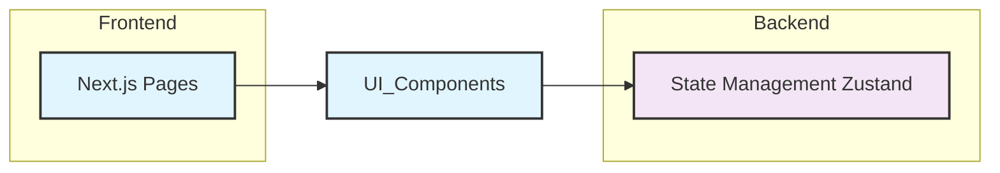

## 📊 System Overview

This project consists of **10 key components** that work together to deliver its functionality. The architecture follows modern software engineering principles with clear separation of concerns and modular design.

### 🎯 Key Architectural Patterns

Based on the codebase analysis, this project demonstrates several important patterns:

- **Modular Architecture**: Components are organized into distinct, focused modules
- **Separation of Concerns**: Different aspects of functionality are cleanly separated
- **Dependency Management**: Clear relationships between components prevent circular dependencies
- **Scalable Design**: Structure supports growth and modification

## 🗺️ Navigation Guide

As you progress through this tutorial, you'll explore each component in detail:

1. **Foundation Concepts** - Essential patterns and structures
2. **Core Components** - Main functional elements
3. **Integration Patterns** - How components work together
4. **Advanced Topics** - Optimization and advanced features

## 🛠️ What You'll Build Understanding Of

By the end of this tutorial series, you'll have comprehensive knowledge of:

- **System Architecture**: How all pieces fit together
- **Component Interactions**: Data flow and dependencies
- **Development Patterns**: Coding standards and best practices
- **Extension Points**: Where and how to add new features

## 🎯 Hands-On Activity

**Exercise: Project Exploration**

Explore the project structure and identify key components

**Steps:**
1. Clone or download the project repository
2. Explore the directory structure using your preferred file explorer or IDE
3. Identify the main entry points and configuration files
4. Map what you see to the architecture diagram above

**Success Check:** Can explain the main architectural layers and component interactions

## 🔗 How This Connects

This overview chapter provides the foundation for all subsequent chapters. Each following chapter will dive deep into specific components you see in the architecture diagram above.

## ✅ Chapter Summary

- ✅ **Architecture Understanding**: You now know the high-level structure
- ✅ **Component Awareness**: You can identify the main building blocks  
- ✅ **Navigation Skills**: You know how to explore the codebase effectively
- ✅ **Learning Path**: You understand what's coming in the tutorial series

## 👉 Up Next

In the next chapter, we'll dive into the foundational components that everything else builds upon. You'll get hands-on experience with the core patterns that make this system work.

---

*Ready to dive deeper? Let's explore the building blocks that make this system tick!* 🚀


---

<a name="chapter-2-javascript-fundamentals:-mastering-the-language-core"></a>

---

# JavaScript Fundamentals: Mastering the Language Core

## 🎯 Chapter Objective
After this chapter, you will be able to write basic JavaScript programs, understand variables, data types, and control flow.

**Time to Complete:** 30 minutes

## 💡 Why This Matters

Understanding JavaScript fundamentals is crucial because it forms the bedrock of web development. You'll use variables, data types, and control flow in every JavaScript program you write, from simple interactive elements on a webpage to complex web applications. Mastering these concepts allows you to build dynamic and engaging user experiences, manipulate data effectively, and create logical program structures. Without a solid grasp of these basics, you'll struggle to build anything beyond the most rudimentary web pages. These concepts are not only applicable to front-end development, but also to back-end with Node.js.

## 🎨 Visual Overview
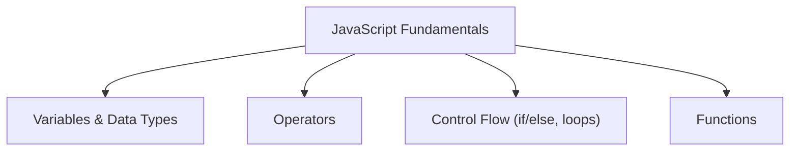

## 🧠 Core Concepts

*   **Variables:** Think of variables as containers that hold data. In JavaScript, you declare variables using `let`, `const`, or `var` (though `var` is older and less recommended).

    *   `let`:  Allows you to reassign the value of the variable.
        ```javascript
        let age = 30;
        age = 31; // Valid, age is now 31
        ```
    *   `const`: Creates a constant variable, meaning its value cannot be reassigned after initialization.
        ```javascript
        const pi = 3.14159;
        // pi = 3.14; // This will cause an error
        ```
    *   `var`: Older way to declare variables. It has function scope, which can lead to unexpected behavior. Use `let` or `const` instead.

*   **Data Types:** JavaScript has several built-in data types:

    *   **String:** Represents textual data.
        ```javascript
        let name = "John Doe";
        ```
    *   **Number:** Represents numeric values (integers and floating-point numbers).
        ```javascript
        let age = 30;
        let price = 99.99;
        ```
    *   **Boolean:** Represents a logical value (true or false).
        ```javascript
        let isAdult = true;
        ```
    *   **Null:** Represents the intentional absence of a value.
        ```javascript
        let user = null;
        ```
    *   **Undefined:** Represents a variable that has been declared but has not been assigned a value.
        ```javascript
        let city; // city is undefined
        ```
    *   **Object:** Represents a collection of key-value pairs.
        ```javascript
        let person = {
          name: "Jane Doe",
          age: 25
        };
        ```
    *   **Array:** Represents an ordered list of values.
        ```javascript
        let colors = ["red", "green", "blue"];
        ```

*   **Operators:** Symbols that perform operations on values (operands).

    *   **Arithmetic Operators:** `+` (addition), `-` (subtraction), `*` (multiplication), `/` (division), `%` (modulus).
    *   **Assignment Operators:** `=` (assignment), `+=` (addition assignment), `-=` (subtraction assignment), etc.
    *   **Comparison Operators:** `==` (equal to), `!=` (not equal to), `>` (greater than), `<` (less than), `>=` (greater than or equal to), `<=` (less than or equal to), `===` (strict equality), `!==` (strict inequality). The strict equality operators (=== and !==) compare both the value and the type, whereas the non-strict operators (== and !=) perform type coercion if the types are different.
    *   **Logical Operators:** `&&` (logical AND), `||` (logical OR), `!` (logical NOT).

*   **Control Flow:** Statements that control the order in which code is executed.

    *   **`if/else` Statements:** Execute different blocks of code based on a condition.
        ```javascript
        let age = 18;
        if (age >= 18) {
          console.log("You are an adult.");
        } else {
          console.log("You are a minor.");
        }
        ```
    *   **`for` Loops:** Execute a block of code repeatedly for a specific number of times.
        ```javascript
        for (let i = 0; i < 5; i++) {
          console.log(i); // Output: 0, 1, 2, 3, 4
        }
        ```
    *   **`while` Loops:** Execute a block of code repeatedly as long as a condition is true.
        ```javascript
        let i = 0;
        while (i < 5) {
          console.log(i); // Output: 0, 1, 2, 3, 4
          i++;
        }
        ```

*   **Functions:** Reusable blocks of code that perform a specific task.

    ```javascript
    function greet(name) {
      console.log("Hello, " + name + "!");
    }

    greet("Alice"); // Output: Hello, Alice!
    ```

## 💻 Code Deep Dive

Let's look at a slightly more complex example combining these concepts:

```javascript
function checkAgeAndGreet(name, age) {
  if (typeof age !== 'number') {
    console.log("Age must be a number.");
    return; // Exit the function if age is not a number
  }

  if (age >= 18) {
    console.log("Welcome, " + name + ". You are an adult.");
  } else {
    console.log("Hello, " + name + ". You are a minor.");
  }
}

checkAgeAndGreet("Bob", 17); // Output: Hello, Bob. You are a minor.
checkAgeAndGreet("Charlie", 25); // Output: Welcome, Charlie. You are an adult.
checkAgeAndGreet("David", "thirty"); // Output: Age must be a number.
```

**Explanation:**

1.  **Function Definition:** We define a function called `checkAgeAndGreet` that takes two parameters: `name` (a string) and `age` (a number).
2.  **Data Type Check:** Inside the function, we first check if `age` is a number using `typeof age !== 'number'`. This is important for preventing errors if the function receives invalid input.
3.  **`if/else` Statement:** We use an `if/else` statement to check if the `age` is greater than or equal to 18.
4.  **Console Output:** Based on the age, we print a different message to the console using `console.log()`.
5.  **Function Calls:** We call the function three times with different arguments to demonstrate its behavior. The third function call demonstrates the data type check.

## 🧑‍💻 Hands-On Practice

**Exercise: Write a JavaScript function to manipulate a string and display it in the console.**

**Steps:**

1.  **Define a function:** Create a function named `stringManipulator` that takes a string as input.
2.  **Convert to uppercase:** Inside the function, convert the input string to uppercase using the `.toUpperCase()` method.
3.  **Reverse the string:** Reverse the uppercase string. You can do this by splitting the string into an array of characters using `.split('')`, reversing the array using `.reverse()`, and then joining the array back into a string using `.join('')`.
4.  **Display in the console:** Use `console.log()` to display the manipulated string in the console.
5.  **Call the function:** Call the `stringManipulator` function with a sample string as an argument.

**Clear, actionable tasks:**

1.  Write the function definition: `function stringManipulator(str) { ... }`
2.  Convert the string to uppercase: `str.toUpperCase()`
3.  Reverse the string: `str.split('').reverse().join('')`
4.  Combine these operations, store the result in a variable, and log it to the console.
5.  Call the function with a test string like `"hello"`

```javascript
function stringManipulator(str) {
  const upperCaseString = str.toUpperCase();
  const reversedString = upperCaseString.split('').reverse().join('');
  console.log(reversedString);
}

stringManipulator("hello"); // Output: OLLEH
stringManipulator("JavaScript"); // Output: TPIRCSAVAJ
```

**Success Check:** Successfully write and execute a basic JavaScript function that takes a string, converts it to uppercase, reverses it, and displays it in the console.

## ✅ Chapter Summary

In this chapter, you've learned the fundamental building blocks of JavaScript: variables, data types, operators, control flow, and functions. You can now declare variables to store data, understand the different types of data JavaScript can handle, use operators to perform calculations and comparisons, control the flow of your code using `if/else` statements and loops, and create reusable blocks of code with functions. You can now write simple JavaScript programs to perform basic tasks.

## 👉 Up Next

Next, we'll explore the Document Object Model (DOM) and how to manipulate HTML elements with JavaScript, allowing you to create interactive web pages.

---

<a name="chapter-3-react-fundamentals:-building-interactive-uis"></a>

---

# React Fundamentals: Building Interactive UIs

## 🎯 Chapter Objective
After this chapter, you will be able to create basic React components, manage state, and render dynamic content.

**Time to Complete:** 45 minutes

## 💡 Why This Matters

Understanding React fundamentals is crucial for building modern, interactive web applications. React's component-based architecture allows you to break down complex UIs into smaller, manageable pieces, making your code more organized and maintainable. Mastering state management enables you to create dynamic and responsive applications that react to user interactions. This is essential for creating features like forms, shopping carts, and real-time updates. Without these fundamentals, building scalable and efficient React applications becomes significantly more difficult.

## 🎨 Visual Overview
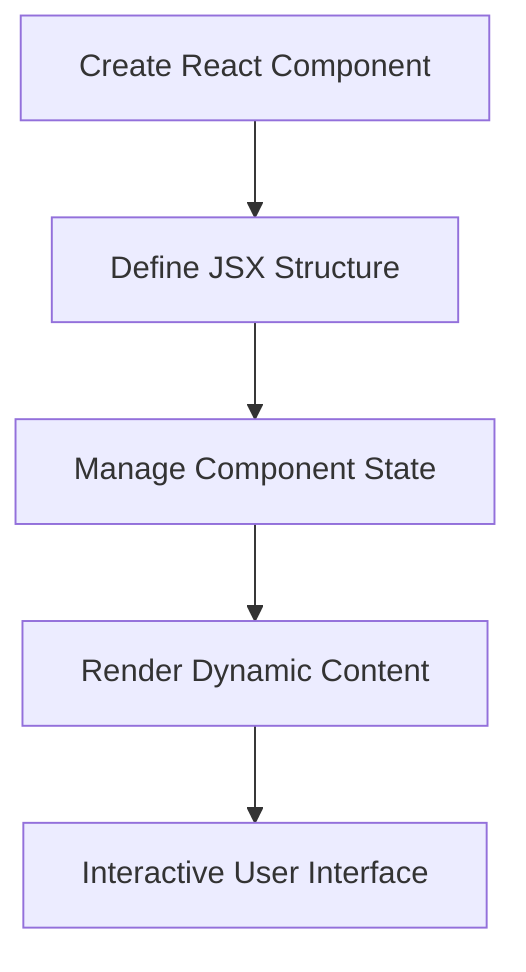

## 🧠 Core Concepts

*   **Components:** Reusable, independent pieces of UI. Think of them as building blocks for your application.  A component can be a function or a class. Function components are simpler and often preferred for presentational purposes.

    ```javascript
    // Functional Component Example
    function Welcome(props) {
      return <h1>Hello, {props.name}</h1>;
    }
    ```

*   **JSX (JavaScript XML):**  A syntax extension to JavaScript that lets you write HTML-like structures within your JavaScript code. It gets transformed into regular JavaScript function calls.

    ```javascript
    // JSX Example
    const element = <h1>Hello, world!</h1>;
    ```

*   **State:** A JavaScript object that holds data specific to a component. When the state changes, React re-renders the component to reflect the updated data. Use the `useState` hook to manage state in functional components.

    ```javascript
    // State Example using useState hook
    import React, { useState } from 'react';

    function Counter() {
      const [count, setCount] = useState(0);

      return (
        <div>
          <p>You clicked {count} times</p>
          <button onClick={() => setCount(count + 1)}>
            Click me
          </button>
        </div>
      );
    }
    ```

*   **Rendering Logic:**  The process of taking your components and their data and displaying them on the screen. React efficiently updates the DOM (Document Object Model) when the data changes.

*   **Props:** Short for "properties," props are used to pass data from a parent component to a child component. They are read-only from the child component's perspective.

    ```javascript
    // Passing Props Example
    function App() {
      return <Welcome name="Sara" />;
    }
    ```

## 💻 Code Deep Dive

Let's break down a simple React component that displays a greeting:

```javascript
import React from 'react';

function Greeting(props) {
  return (
    <div>
      <h1>Hello, {props.name}!</h1>
      <p>Welcome to React.</p>
    </div>
  );
}

export default Greeting;
```

**Explanation:**

1.  `import React from 'react';`: Imports the React library, which is essential for creating React components.
2.  `function Greeting(props) { ... }`: Defines a functional component named `Greeting`. It accepts `props` (properties) as an argument.
3.  `return ( ... )`:  Returns the JSX that defines the structure of the component.
4.  `<div> ... </div>`:  A container element (like a `div`) is used to wrap the JSX.
5.  `<h1>Hello, {props.name}!</h1>`:  Displays a heading with a dynamic name passed as a prop.
6.  `<p>Welcome to React.</p>`:  Displays a paragraph with a static message.
7.  `export default Greeting;`: Makes the component available for use in other parts of the application.

Now, let's examine a component that uses state:

```javascript
import React, { useState } from 'react';

function Counter() {
  const [count, setCount] = useState(0);

  return (
    <div>
      <p>Count: {count}</p>
      <button onClick={() => setCount(count + 1)}>Increment</button>
    </div>
  );
}

export default Counter;
```

**Explanation:**

1.  `import React, { useState } from 'react';`: Imports the `useState` hook from React.
2.  `const [count, setCount] = useState(0);`:  Declares a state variable `count` and a function `setCount` to update it.  `useState(0)` initializes the state to 0.
3.  `<p>Count: {count}</p>`:  Displays the current value of the `count` state variable.
4.  `<button onClick={() => setCount(count + 1)}>Increment</button>`:  A button that, when clicked, calls `setCount` to increment the `count` state.  This triggers a re-render of the component, updating the displayed count.

## 🧑‍💻 Hands-On Practice

**Exercise: Create a React component that displays a counter and updates it when a button is clicked.**

**Steps:**

1.  **Create a new React component file:** Create a file named `Counter.js` in your `src` directory (or any directory where you keep your components).

2.  **Import React and the useState hook:** Add the following import statement to the top of your `Counter.js` file:

    ```javascript
    import React, { useState } from 'react';
    ```

3.  **Define the Counter component:** Create a functional component named `Counter`.

    ```javascript
    function Counter() {
      // Component logic will go here
      return (
        <div>
          {/* JSX structure will go here */}
        </div>
      );
    }

    export default Counter;
    ```

4.  **Initialize the state:** Inside the `Counter` component, use the `useState` hook to initialize a state variable named `count` to 0.

    ```javascript
    const [count, setCount] = useState(0);
    ```

5.  **Create the JSX structure:** Add the following JSX inside the `return` statement of the `Counter` component:

    ```javascript
    <div>
      <p>Count: {count}</p>
      <button onClick={() => setCount(count + 1)}>Increment</button>
    </div>
    ```

6.  **Import and use the Counter component in your App.js (or main component):**

    ```javascript
    import React from 'react';
    import Counter from './Counter'; // Adjust the path if needed

    function App() {
      return (
        <div className="App">
          <Counter />
        </div>
      );
    }

    export default App;
    ```

**Success Check:** Successfully create a React component with state and event handling. You should see a counter displayed on the screen and be able to increment it by clicking the button.

## ✅ Chapter Summary

In this chapter, you've learned the fundamentals of React components, JSX syntax, and state management. You can now:

*   Create basic React components using functional components.
*   Use JSX to define the structure and content of your components.
*   Manage component state using the `useState` hook.
*   Render dynamic content based on state changes.
*   Handle user interactions using event handlers.

## 👉 Up Next

Next, we'll explore React props in more detail and see how to pass data between components to build more complex UIs.

---

<a name="chapter-4-html-&-css-basics:-structuring-and-styling-web-pages"></a>

---

# HTML & CSS Basics: Structuring and Styling Web Pages

## 🎯 Chapter Objective
After this chapter, you will be able to structure a web page using HTML and style it using CSS.

**Time to Complete:** 30 minutes

## 💡 Why This Matters

Understanding HTML and CSS is fundamental to web development. HTML provides the structure and content of a webpage, while CSS controls its visual presentation. Without these technologies, web pages would be plain text documents. Mastering these skills allows you to create visually appealing and user-friendly websites, enhancing user experience and conveying information effectively. This is crucial for front-end development and impacts how users interact with your applications. In real-world scenarios, companies rely on well-structured and styled websites to attract customers, provide information, and facilitate online transactions.

## 🎨 Visual Overview
```mermaid
flowchart TD
    A[HTML: Semantic Structure (Content)] --> B[CSS: Visual Presentation (Styling)]
    B --> C[Web Page: User Experience]
    A --> C
```

## 🧠 Core Concepts

*   **HTML (HyperText Markup Language):** The standard markup language for creating web pages. It uses elements, represented by tags, to define the structure and content of a webpage.

    *   **Example:** `<p>This is a paragraph of text.</p>`

*   **CSS (Cascading Style Sheets):** A style sheet language used for describing the presentation of a document written in HTML. It controls aspects such as layout, colors, fonts, and responsiveness.

    *   **Example:** `p { color: blue; font-size: 16px; }`

*   **Elements and Tags:** HTML elements are the building blocks of a webpage. They are defined by start and end tags.

    *   **Example:** `<h1>This is a heading</h1>`

*   **Attributes:** Provide additional information about HTML elements.

    *   **Example:** `<a href="https://www.example.com">Visit Example</a>`

*   **Selectors:** CSS selectors target specific HTML elements to apply styles.

    *   **Example:** `h1 { color: red; }` (Targets all `<h1>` elements)

*   **Properties and Values:** CSS properties define the style characteristics, and values specify the settings for those properties.

    *   **Example:** `color: red;` (`color` is the property, `red` is the value)

*   **Box Model:** Every HTML element can be thought of as a box with content, padding, border, and margin. Understanding the box model is key to controlling the layout and spacing of elements.

## 💻 Code Deep Dive

Let's create a basic HTML structure and then style it with CSS.

**HTML (index.html):**

```html
<!DOCTYPE html>
<html lang="en">
<head>
    <meta charset="UTF-8">
    <meta name="viewport" content="width=device-width, initial-scale=1.0">
    <title>My First Web Page</title>
    <link rel="stylesheet" href="style.css">
</head>
<body>
    <header>
        <h1>Welcome to My Website</h1>
        <nav>
            <ul>
                <li><a href="#">Home</a></li>
                <li><a href="#">About</a></li>
                <li><a href="#">Contact</a></li>
            </ul>
        </nav>
    </header>
    <main>
        <section>
            <h2>About Me</h2>
            <p>This is a brief introduction about myself.</p>
        </section>
        <section>
            <h2>My Projects</h2>
            <p>Here are some of my projects.</p>
        </section>
    </main>
    <footer>
        <p>&copy; 2024 My Website</p>
    </footer>
</body>
</html>
```

**Explanation:**

1.  `<!DOCTYPE html>`: Declares the document type as HTML5.
2.  `<html lang="en">`: The root element of the HTML page, specifying the language as English.
3.  `<head>`: Contains meta-information about the HTML document, such as character set, viewport settings, title, and linked stylesheets.
4.  `<link rel="stylesheet" href="style.css">`: Links the HTML document to an external CSS file named "style.css."
5.  `<body>`: Contains the visible page content.
6.  `<header>`: Represents the introductory content, including the main heading and navigation.
7.  `<h1>`: Defines the main heading of the page.
8.  `<nav>`: Defines a set of navigation links.
9.  `<ul>` and `<li>`: Create an unordered list for the navigation links.
10. `<main>`: Specifies the main content of the document.
11. `<section>`: Defines a thematic grouping of content.
12. `<h2>`: Defines a heading for each section.
13. `<p>`: Represents a paragraph of text.
14. `<footer>`: Contains the footer content, such as copyright information.

**CSS (style.css):**

```css
body {
    font-family: Arial, sans-serif;
    margin: 0;
    padding: 0;
    background-color: #f4f4f4;
    color: #333;
}

header {
    background-color: #333;
    color: #fff;
    padding: 1em 0;
    text-align: center;
}

nav ul {
    padding: 0;
    list-style: none;
}

nav li {
    display: inline;
    margin: 0 1em;
}

nav a {
    color: #fff;
    text-decoration: none;
}

main {
    padding: 20px;
}

section {
    margin-bottom: 20px;
    background-color: #fff;
    padding: 15px;
    border: 1px solid #ddd;
}

footer {
    text-align: center;
    padding: 1em 0;
    background-color: #333;
    color: #fff;
}
```

**Explanation:**

1.  `body`: Sets the font family, removes default margins and padding, and sets the background and text colors for the entire page.
2.  `header`: Styles the header with a dark background, white text, padding, and centered text.
3.  `nav ul`: Removes default padding and list styles from the navigation list.
4.  `nav li`: Displays list items inline and adds horizontal margin.
5.  `nav a`: Styles the navigation links with white color and removes underlines.
6.  `main`: Adds padding to the main content area.
7.  `section`: Styles each section with a white background, padding, a bottom margin and a border.
8.  `footer`: Styles the footer with centered text, padding, a dark background, and white text.

## 🧑‍💻 Hands-On Practice

**Exercise: Create a simple web page with headings, paragraphs, and styled with CSS.**

**Steps:**

1.  **Create two files:** `index.html` and `style.css` in the same directory.
2.  **Populate `index.html`:** Copy and paste the HTML code provided in the "Code Deep Dive" section into your `index.html` file.
3.  **Populate `style.css`:** Copy and paste the CSS code provided in the "Code Deep Dive" section into your `style.css` file.
4.  **Open `index.html` in your browser:**  Double-click the `index.html` file to open it in your web browser.  You should see a basic webpage with a header, navigation, content sections, and a footer.
5.  **Experiment with CSS:** Modify the `style.css` file to change colors, fonts, and layout.  Refresh the browser to see your changes.  Try changing the background color of the header, the font size of the headings, or the padding around the sections.

**Success Check:** Successfully create and style a basic HTML page. You should be able to modify the CSS and see the changes reflected in your browser.

## ✅ Chapter Summary

You now understand the basic structure of an HTML document and how to apply styles using CSS. You can create headings, paragraphs, navigation menus, and other basic elements. You can also use CSS to control the appearance of these elements, including colors, fonts, and layout. You have learned about HTML elements, tags, attributes, CSS selectors, properties, and values. You can now build simple web pages and customize their appearance using CSS.

## 👉 Up Next

In the next chapter, we will explore more advanced CSS techniques, including selectors, the box model, and responsive design principles.

---

<a name="chapter-5-next.js-page-routing:-navigating-your-application"></a>

---

# Next.js Page Routing: Navigating Your Application

## 🎯 Chapter Objective
After this chapter, you will be able to create new pages in your Next.js application and link them together using the built-in routing system.

**Time to Complete:** 45 minutes

## 💡 Why This Matters
Page routing is the backbone of any web application. Without it, users would be stuck on a single page! In Next.js, the file system is your router. This means creating new pages and linking them together is incredibly intuitive. Understanding this core concept allows you to build multi-page applications with ease, enabling features like user profiles, blog posts, e-commerce product pages, and complex dashboards. Mastering Next.js routing translates directly to creating richer, more engaging user experiences.

## 🎨 Visual Overview
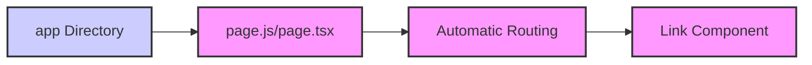

## 🧠 Core Concepts

*   **File-Based Routing:** Next.js uses a file-based routing system. Each file in the `app` directory becomes a route based on its file name. For example, `app/about/page.js` creates a route at `/about`.

*   **`app` Directory:** The `app` directory is where you define your application's routes, layouts, and components. It replaces the older `pages` directory for new Next.js projects.

*   **`page.js` or `page.tsx`:** This file is essential. It defines the UI for a specific route. If you have `app/about/page.js`, the component exported from this file will be rendered when a user navigates to `/about`.

*   **The `<Link>` Component:** The `<Link>` component from `next/link` is used for client-side navigation between routes in your Next.js application. It provides performance optimizations like prefetching.

*   **Dynamic Routes:** Next.js supports dynamic routes using square brackets in the file name. For example, `app/blog/[id]/page.js` creates a route that can handle URLs like `/blog/1`, `/blog/2`, etc. The `id` value can be accessed in your component using `useParams`.

## 💻 Code Deep Dive

Let's say you want to create an "About" page for your application.

1.  **Create the `app/about` directory:**

    ```bash
    mkdir app/about
    ```

2.  **Create `app/about/page.js` (or `page.tsx`):**

    ```javascript
    // app/about/page.js
    export default function AboutPage() {
      return (
        <div>
          <h1>About Us</h1>
          <p>This is the about page of our Next.js application.</p>
        </div>
      );
    }
    ```

3.  **Link to the About page from your home page (`app/page.js` or `app/page.tsx`):**

    ```javascript
    // app/page.js
    import Link from 'next/link';

    export default function HomePage() {
      return (
        <div>
          <h1>Welcome to My Next.js App</h1>
          <p>This is the home page.</p>
          <Link href="/about">
            <a>Go to About Page</a>
          </Link>
        </div>
      );
    }
    ```

**Explanation:**

*   The `AboutPage` component in `app/about/page.js` will be rendered when you navigate to `/about`.
*   The `<Link>` component in `app/page.js` creates a link to the `/about` route.  The `href` prop specifies the destination route. The `<a>` tag is a child of the `<Link>` component, and it's what the user actually sees and clicks.

## 🧑‍💻 Hands-On Practice
**Exercise: Create a new "Contact" page in the `app` directory and link it to the main navigation.**

**Steps:**

1.  **Create a `contact` directory inside the `app` directory.**  This will be the route path: `/contact`.

    ```bash
    mkdir app/contact
    ```

2.  **Inside the `app/contact` directory, create a `page.js` (or `page.tsx`) file.** This file will contain the React component for the Contact page.

    ```javascript
    // app/contact/page.js
    export default function ContactPage() {
      return (
        <div>
          <h1>Contact Us</h1>
          <p>Feel free to reach out to us!</p>
        </div>
      );
    }
    ```

3.  **Import the `Link` component from `next/link` in your `app/page.js` (or `app/page.tsx`) file.** This allows you to create links to other pages within your application.

    ```javascript
    import Link from 'next/link';
    ```

4.  **Add a `<Link>` component to `app/page.js` (or `app/page.tsx`) to link to the new Contact page.**  Use the `href` prop to specify the `/contact` route.

    ```javascript
    // app/page.js
    import Link from 'next/link';

    export default function HomePage() {
      return (
        <div>
          <h1>Welcome to My Next.js App</h1>
          <p>This is the home page.</p>
          <Link href="/about">
            <a>Go to About Page</a>
          </Link>
          <br /> {/* Add a line break for spacing */}
          <Link href="/contact">
            <a>Go to Contact Page</a>
          </Link>
        </div>
      );
    }
    ```

**Success Check:** Successfully create and navigate to a new page in your Next.js application.  After completing these steps, your application should have a "Contact Us" page accessible from the home page via a link. When you click the link, you should be navigated to the `/contact` route and see the content you defined in `app/contact/page.js`.

## ✅ Chapter Summary
In this chapter, you learned how to create and link pages in a Next.js application using the file-based routing system. You now understand the role of the `app` directory, the `page.js` (or `page.tsx`) file, and the `<Link>` component. You can create new routes simply by adding files to the `app` directory and link between them using the `<Link>` component.

## 👉 Up Next
In the next chapter, we will explore dynamic routing and how to create pages that handle different parameters in the URL.

---

<a name="chapter-6-shared-layout-components:-structuring-your-pages"></a>

---

# Shared Layout Components: Structuring Your Pages

## 🎯 Chapter Objective
After this chapter, you will be able to divide the page into sections and place elements within those sections using shared layout components.

**Time to Complete:** 30 minutes

## 💡 Why This Matters

Shared layout components are crucial for building consistent and maintainable user interfaces. Imagine building a website with a header and sidebar that appear on every page. Without shared layouts, you'd have to duplicate the header and sidebar code across all your pages. This leads to code bloat, increased maintenance effort, and inconsistencies in design.

By using shared layout components, you define these common UI elements once and reuse them across your application. This simplifies development, ensures consistency, and makes it easier to update the overall look and feel of your website. For example, if you need to update the company logo in the header, you only need to change it in one place – the shared layout component – and the change will automatically propagate to all pages using that layout. This approach is fundamental for creating scalable and professional web applications.

## 🎨 Visual Overview
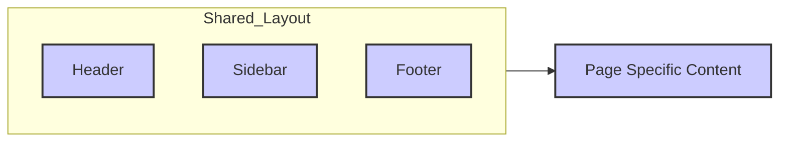

## 🧠 Core Concepts

*   **Component Composition:** React applications are built using component composition. This means combining smaller, reusable components to create larger, more complex UI elements. Shared layout components are a prime example of this, where you compose a layout from components like headers, sidebars, and footers.
    *   **Example:** The `LeftDiv` component imports and uses the `LeftBelowDiv` component:

        ```javascript
        import LeftBelowDiv from './LeftBelowDiv'

        const LeftDiv = ({ title, company, reward, description, difficulty, examples, testCases, shortdescription}) => {
          return (
            <div className='flex w-2/5 flex-col h-full'>
              {/* ... other content ... */}
              <LeftBelowDiv/>
            </div>
          )
        }

        export default LeftDiv
        ```

*   **Props:** Props (properties) are used to pass data from a parent component to a child component. Shared layout components often accept props to customize their appearance or behavior based on the specific page they're being used on.
    *   **Example:** The `LeftDiv` component accepts several props such as `title`, `company`, `reward`, etc. These props are used to populate the content within the left division of the page.

        ```javascript
        const LeftDiv = ({ title, company, reward, description, difficulty, examples, testCases, shortdescription}) => {
          return (
            <div className='flex w-2/5 flex-col h-full'>
              {/* ... Uses title, company, reward, etc. */}
            </div>
          )
        }
        ```

*   **Children Prop:** The `children` prop is a special prop that allows you to pass JSX elements (HTML-like code) directly into a component. This is particularly useful for shared layouts, as it allows you to inject page-specific content into the layout.  While not explicitly used in the provided components, it's a common pattern for layout components. For example:

    ```javascript
    const Layout = ({ children }) => {
      return (
        <div>
          <Header />
          <main>{children}</main>
          <Footer />
        </div>
      );
    };

    // Usage:
    <Layout>
      <p>This is the page-specific content.</p>
    </Layout>
    ```

*   **CSS Styling:** CSS is used to style the layout components and control their appearance. This can be done using inline styles, CSS classes, or CSS-in-JS libraries like styled-components. Tailwind CSS is used in the example components.
    *   **Example:** The `LeftDiv` component uses Tailwind CSS classes for styling:

        ```javascript
        <div className='flex w-2/5 flex-col h-full'>
        ```

        Here, `flex`, `w-2/5`, `flex-col`, and `h-full` are Tailwind CSS classes that define the layout and appearance of the component.

## 💻 Code Deep Dive

Let's analyze the provided code to understand how shared layout components are implemented. We'll focus on the `LeftDiv`, `MiddleTopDiv`, and `RightDiv` components as examples.

1.  **`LeftDiv.tsx`:**

    *   This component represents the left division of the page.
    *   It receives props for the problem title, company, reward, description, difficulty, examples, test cases, and a short description.
    *   It renders these props within a `div` with specific Tailwind CSS classes for styling (e.g., `flex`, `w-2/5`, `flex-col`, `h-full`, `p-4`, `bg-slate-900`, `overflow-auto`, `text-white`).
    *   Crucially, it includes the `LeftBelowDiv` component, demonstrating component composition.

    ```javascript
    const LeftDiv = ({ title, company, reward, description, difficulty, examples, testCases, shortdescription}) => {
      return (
        <div className='flex w-2/5 flex-col h-full'>
          {/* Content using props */}
          <LeftBelowDiv/>
        </div>
      )
    }
    ```

2.  **`MiddleTopDiv.tsx`:**

    *   This component contains the code editor.
    *   It uses the `@monaco-editor/react` library to embed a Monaco Editor instance.
    *   It manages state for the editor's font size, value, and language.
    *   It includes logic for submitting the code and handling the key.

    ```javascript
    import { Editor } from '@monaco-editor/react';
    // ... other imports

    const MiddleTopDiv = () => {
      const [fontSize, setFontSize] = useState(16);
      const [editorValue, setEditorValue] = useState('// Initial code');
      // ... other state

      return (
        <div className="w-full h-5/6 flex flex-col">
          {/* ... other elements */}
          <Editor
            height="100%"
            defaultLanguage="javascript"
            language={useLanguage}
            defaultValue={editorValue}
            theme="vs-dark"
            onChange={(value) => {setEditorValue(value); setUserCode(value); console.log(userCode)}}
            options={{
              automaticLayout: true,
              fontSize: fontSize,
            }}
          />
          {/* ... other elements */}
        </div>
      );
    };
    ```

3.  **`RightDiv.tsx`:**

    *   This component displays the AI chatbot.
    *   It uses the `Textarea` component from the `ui` library for user input.
    *   It manages the chat history using the `chatArray` state variable.
    *   It fetches responses from the Gemini API and displays them in the chat interface.

    ```javascript
    import React, { useEffect, useState } from 'react'
    import { Textarea } from '../ui/textarea'
    // ... other imports

    const RightDiv = () => {
        const [userText, setUserText] = useState('')
        // ... other state

        return (
            <div className='w-2/5 bg-slate-900 flex flex-col h-full'>
                {/* ... chat display */}
                <div>
                    <Textarea 
                        placeholder='Type your question here...'
                        value={userText}
                        onChange={(e) => setUserText(e.target.value)}
                        onKeyDown={handleKeyDown}
                        disabled={loading}
                        className='resize-none'
                    />
                </div>
            </div>
        )
    }
    ```

These components demonstrate how to structure a page using shared layout components. Each component is responsible for a specific section of the page, and they can be combined to create a complete user interface.  The use of Tailwind CSS provides a consistent styling approach across all components.

## 🧑‍💻 Hands-On Practice

**Exercise: Modify the size of a div within a shared layout component to observe the layout change.**

**Steps:**

1.  **Locate the `LeftDiv.tsx` file.** This file contains the code for the left division of the page.
2.  **Find the main `div` element in the `LeftDiv` component.** This is the outermost `div` that wraps all the content of the component:

    ```javascript
    <div className='flex w-2/5 flex-col h-full'>
      {/* ... content ... */}
    </div>
    ```

3.  **Modify the `w-2/5` class to `w-1/5` or `w-3/5`.** This class controls the width of the `div` using Tailwind CSS's width utilities.

    ```javascript
    <div className='flex w-1/5 flex-col h-full'> {/* Modified width */}
      {/* ... content ... */}
    </div>
    ```
    OR
     ```javascript
    <div className='flex w-3/5 flex-col h-full'> {/* Modified width */}
      {/* ... content ... */}
    </div>
    ```

4.  **Save the changes and observe the change in the application's layout.** You should see the left division of the page become narrower (`w-1/5`) or wider (`w-3/5`).

**Success Check:** Successfully modify a shared layout component and observe the change in the application's layout.

## ✅ Chapter Summary

In this chapter, you learned about shared layout components and their importance in structuring React applications. You now understand:

*   The benefits of using shared layouts for consistency and maintainability.
*   How component composition is used to build layouts from smaller components.
*   How props are used to customize layout components.
*   How CSS is used to style layout components.
*   How to modify existing shared layout components to change the look and feel of the application.

## 👉 Up Next

In the next chapter, we'll explore state management in React, focusing on how to use tools like Zustand to manage application state efficiently.

---

<a name="chapter-7-react-server-components-(rsc)-layout-structure:-optimizing-initial-load"></a>

---

# React Server Components (RSC) Layout Structure: Optimizing Initial Load

## 🎯 Chapter Objective
After this chapter, you will be able to utilize React Server Components to define the overall layout and shared elements across different pages.

**Time to Complete:** 45 minutes

## 💡 Why This Matters

React Server Components (RSCs) allow you to render components on the server, significantly improving the initial load time and SEO of your application. By defining your layout (e.g., headers, footers, sidebars) using RSCs, you can avoid sending unnecessary JavaScript to the client, resulting in a faster and more efficient user experience. This approach is especially crucial for content-heavy applications or those targeting users with slower network connections. For example, consider a complex e-commerce site: using RSCs for the header, footer, and product listing structure means only the dynamic parts (like the shopping cart) need client-side JavaScript, drastically speeding up the initial page render.

## 🎨 Visual Overview

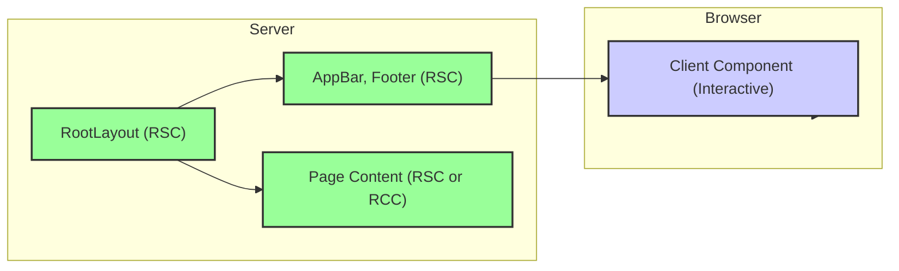

## 🧠 Core Concepts

*   **React Server Components (RSCs):** Components that render on the server during the build process or on-demand. They can fetch data directly from databases or APIs without the need for client-side fetching. RSCs send only the rendered HTML to the client, reducing the JavaScript bundle size.

*   **Root Layout (app/layout.tsx):**  In Next.js, the `app/layout.tsx` file defines the root layout for your application. This layout is a React Server Component, making it ideal for defining shared elements like headers, footers, and overall page structure.

*   **Client Components:** Components that require client-side interactivity or browser APIs (e.g., event handlers, state management). These components are "hydrated" on the client-side, meaning they are transformed from static HTML into interactive components. You must use `'use client'` directive at the top of such components to mark them as client components.

*   **Shared Components:** Reusable components like `AppBar` and `Footer` that are used across multiple pages. These components can be either RSCs or Client Components depending on their functionality. Using RSCs for shared components that primarily display static content optimizes initial load.

**Example:**

In the given code, `app/layout.tsx` is an RSC that defines the basic HTML structure, font, and global styles. `AppBar.tsx` is marked as a client component (`'use client'`) because it uses state management (`useUserStore`) and event handlers (`onClick`). `Footer.tsx` could be an RSC if it only displays static content.

## 💻 Code Deep Dive

Let's analyze the provided code to understand how RSCs are used to structure the layout:

**1. `app/layout.tsx` (Root Layout - RSC):**

```typescript
import type { Metadata } from "next";
import { Work_Sans } from "next/font/google";
import "./globals.css";

const geistSans = Work_Sans({
  weight: '400',
  subsets: ["latin"],
});

export const metadata: Metadata = {
  title: "CodeVibe",
  description: "CodeVibe- Leetcode Killer",
};

export default function RootLayout({
  children,
}: Readonly<{
  children: React.ReactNode;
}>) {
  return (
    <html lang="en">
      <body
        className={`${geistSans.className} h-screen text-white bg-black max-w-full`}
      >
        {children}
      </body>
    </html>
  );
}
```

*   This file defines the root layout of the application.
*   It's an RSC by default (no `'use client'` directive).
*   It sets the `metadata` (title, description) for SEO.
*   It loads the `Work_Sans` font.
*   It renders the `children`, which represents the content of individual pages. This is where your pages will be injected into the layout.
*   The `className` prop is used to apply global styles, setting the background color, text color, and font.

**2. `components/shared/appbar.tsx` (Client Component):**

```typescript
// AppBar.js
'use client'
import useUserStore from '@/store/userStore';
import Link from 'next/link'
import React, { useEffect } from 'react'


const AppBAr = () => {
  const { user, logout, initialize } = useUserStore();
  
  useEffect(() => {
    initialize();
  }, [initialize]);
  
  return (
    <div className='p-4 px-10 bg-slate-900 flex justify-between items-center'>
      <div className='flex items-center space-x-6'>
        <svg xmlns="http://www.w3.org/2000/svg" fill="none" viewBox="0 0 24 24" strokeWidth="1.5" stroke="currentColor" className="h-8 w-8 text-purple-500">
          <path strokeLinecap="round" strokeLinejoin="round" d="M17.25 6.75 22.5 12l-5.25 5.25m-10.5 0L1.5 12l5.25-5.25m7.5-3-4.5 16.5" />
        </svg>
        <Link href={'/'} className='text-2xl font-extrabold'>CodeVibe</Link>
        <Link href={'/contest'} className='text-white'>Contest</Link>
        <Link href={'/discussion'} className='text-white'>Discussion</Link>
        <Link href={'/progress'} className='text-white'>Progress</Link>
      </div>

      {user ?
            <div className='flex items-center space-x-6'>
              <button onClick={logout} className='text-white bg-purple-500 p-2 rounded-lg'>Logout</button>
              <Link href={"/profile"} className='text-white p-2 rounded-full'>Hello!! {user.name}</Link>
            </div>
            :
            <svg xmlns="http://www.w3.org/2000/svg" fill="none" viewBox="0 0 24 24" strokeWidth="1.5" stroke="currentColor" className="h-10 w-10">
              <path strokeLinecap="round" strokeLinejoin="round" d="M17.982 18.725A7.488 7.488 0 0 0 12 15.75a7.488 7.488 0 0 0-5.982 2.975m11.963 0a9 9 0 1 0-11.963 0m11.963 0A8.966 8.966 0 0 1 12 21a8.966 8.966 0 0 1-5.982-2.275M15 9.75a3 3 0 1 1-6 0 3 3 0 0 1 6 0Z" />
            </svg>
        }
    </div>
  )
}

export default AppBAr
```

*   The `'use client'` directive indicates that this is a Client Component.
*   It uses `useUserStore` to manage user authentication state.
*   It uses `useEffect` to initialize the user state on the client-side.
*   It includes interactive elements like the logout button (`onClick`).
*   It conditionally renders content based on the user's authentication status.

**3. `components/shared/footer.tsx` (Potentially RSC):**

```typescript
import React from 'react';

const Footer: React.FC = () => {
  return (
    <footer className="bg-black text-white py-12 border-t border-slate-600">
      <div className="container mx-auto px-6 flex flex-col lg:flex-row justify-between items-start">
        
        <div className="flex flex-col items-center lg:pl-36 w-full lg:w-auto"> 
          <svg xmlns="http://www.w3.org/2000/svg" fill="none" viewBox="0 0 24 24" strokeWidth="1.5" stroke="currentColor" className="h-20 w-20 text-purple-500">
            <path strokeLinecap="round" strokeLinejoin="round" d="M17.25 6.75 22.5 12l-5.25 5.25m-10.5 0L1.5 12l5.25-5.25m7.5-3-4.5 16.5" />
          </svg>
          <p className="mt-4 text-lg text-gray-400 text-center">&copy; 2025 CodeVibe. All rights reserved.</p>
        </div>

        <div className='flex flex-col items-center justify-center flex-1 pt-6 mx-0 lg:mx-12 mt-16 lg:mt-0 w-full lg:w-auto'>
          <div className='flex gap-2 justify-center text-xl'>
            <p className='text-2xl'>Made with</p> 
            <svg xmlns="http://www.w3.org/2000/svg" viewBox="0 0 24 24" fill="currentColor" className="h-6 w-6 text-red-500">
              <path d="m11.645 20.91-.007-.003-.022-.012a15.247 15.247 0 0 1-.383-.218 25.18 25.18 0 0 1-4.244-3.17C4.688 15.36 2.25 12.174 2.25 8.25 2.25 5.322 4.714 3 7.688 3A5.5 5.5 0 0 1 12 5.052 5.5 5.5 0 0 1 16.313 3c2.973 0 5.437 2.322 5.437 5.25 0 3.925-2.438 7.111-4.739 9.256a25.175 25.175 0 0 1-4.244 3.17 15.247 15.247 0 0 1-.383.219l-.022.012-.007.004-.003.001a.752.752 0 0 1-.704 0l-.003-.001Z" />
            </svg>
            <p className='text-2xl'>by</p>
          </div>
          <div className='flex gap-2 justify-center mt-2'>
            <p className='text'>Ganne ka Juice Paglus</p>
          </div>
        </div>

        <div className="flex flex-wrap justify-center lg:justify-start space-x-0 lg:space-x-12 mt-8 lg:mt-0 w-full lg:w-auto lg:pr-52">
          <div className="text-center p-4 lg:text-left mb-8 lg:mb-0">
            <h3 className="text-xl font-semibold mb-3 flex justify-center">Socials</h3>
            <div className='flex gap-4'>
              <ul className="space-y-2 text-gray-400 text-lg">
                <li><a className="hover:text-red-200">Twitter</a></li>
                <li><a className="hover:text-red-200">Discord</a></li>
              </ul>
              <ul className="space-y-2 text-gray-400 text-lg">
                <li><a className="hover:text-red-200">Instagram</a></li>
                <li><a className="hover:text-red-200">LinkedIn</a></li>
              </ul>
            </div>
          </div>
        </div>
      </div>
    </footer>
  );
};

export default Footer;
```

*   This component displays footer content.
*   It currently doesn't have the `'use client'` directive. This means it's treated as an RSC.
*   If you need to add any client-side interactivity to the footer (e.g., a form submission), you would need to add the `'use client'` directive.

## 🧑‍💻 Hands-On Practice

**Exercise: Modify the app bar or footer to include new elements using React Server Components.**

**Steps:**

1.  **Choose a component:** Decide whether to modify the `AppBar` or `Footer`. If you choose the `AppBar`, remember it's already a Client Component, so you'll be adding static content to it. If you choose the `Footer`, ensure you don't need client-side interactivity for the changes you're making, so it can remain an RSC.

2.  **Modify the `Footer` (RSC Example):** Let's add a "Contact Us" link to the footer's social links.

    *   Open `components/shared/footer.tsx`.
    *   Locate the "Socials" section.

    ```html
    <div className="flex flex-wrap justify-center lg:justify-start space-x-0 lg:space-x-12 mt-8 lg:mt-0 w-full lg:w-auto lg:pr-52">
        <div className="text-center p-4 lg:text-left mb-8 lg:mb-0">
            <h3 className="text-xl font-semibold mb-3 flex justify-center">Socials</h3>
            <div className='flex gap-4'>
              <ul className="space-y-2 text-gray-400 text-lg">
                <li><a className="hover:text-red-200">Twitter</a></li>
                <li><a className="hover:text-red-200">Discord</a></li>
              </ul>
              <ul className="space-y-2 text-gray-400 text-lg">
                <li><a className="hover:text-red-200">Instagram</a></li>
                <li><a className="hover:text-red-200">LinkedIn</a></li>
              </ul>
            </div>
        </div>
    </div>
    ```

    *   Add a new list item with a "Contact Us" link:

    ```html
    <div className="flex flex-wrap justify-center lg:justify-start space-x-0 lg:space-x-12 mt-8 lg:mt-0 w-full lg:w-auto lg:pr-52">
        <div className="text-center p-4 lg:text-left mb-8 lg:mb-0">
            <h3 className="text-xl font-semibold mb-3 flex justify-center">Socials</h3>
            <div className='flex gap-4'>
              <ul className="space-y-2 text-gray-400 text-lg">
                <li><a className="hover:text-red-200">Twitter</a></li>
                <li><a className="hover:text-red-200">Discord</a></li>
                <li><a className="hover:text-red-200">Contact Us</a></li>
              </ul>
              <ul className="space-y-2 text-gray-400 text-lg">
                <li><a className="hover:text-red-200">Instagram</a></li>
                <li><a className="hover:text-red-200">LinkedIn</a></li>
              </ul>
            </div>
        </div>
    </div>
    ```

3.  **Modify the `AppBar` (Client Component Example):** Let's add a "Support" link to the app bar.

    * Open `components/shared/appbar.tsx`.
    * Locate the navigation links section.

    ```html
    <div className='flex items-center space-x-6'>
        <svg xmlns="http://www.w3.org/2000/svg" fill="none" viewBox="0 0 24 24" strokeWidth="1.5" stroke="currentColor" className="h-8 w-8 text-purple-500">
          <path strokeLinecap="round" strokeLinejoin="round" d="M17.25 6.75 22.5 12l-5.25 5.25m-10.5 0L1.5 12l5.25-5.25m7.5-3-4.5 16.5" />
        </svg>
        <Link href={'/'} className='text-2xl font-extrabold'>CodeVibe</Link>
        <Link href={'/contest'} className='text-white'>Contest</Link>
        <Link href={'/discussion'} className='text-white'>Discussion</Link>
        <Link href={'/progress'} className='text-white'>Progress</Link>
      </div>
    ```

    * Add a new `Link` component for "Support".

    ```html
    <div className='flex items-center space-x-6'>
        <svg xmlns="http://www.w3.org/2000/svg" fill="none" viewBox="0 0 24 24" strokeWidth="1.5" stroke="currentColor" className="h-8 w-8 text-purple-500">
          <path strokeLinecap="round" strokeLinejoin="round" d="M17.25 6.75 22.5 12l-5.25 5.25m-10.5 0L1.5 12l5.25-5.25m7.5-3-4.5 16.5" />
        </svg>
        <Link href={'/'} className='text-2xl font-extrabold'>CodeVibe</Link>
        <Link href={'/contest'} className='text-white'>Contest</Link>
        <Link href={'/discussion'} className='text-white'>Discussion</Link>
        <Link href={'/progress'} className='text-white'>Progress</Link>
        <Link href={'/support'} className='text-white'>Support</Link>
      </div>
    ```

**Success Check:** Successfully modify the application's layout using React Server Components. Verify that the new element is displayed correctly in the app bar or footer.  If you made changes to the Footer, verify that the component is still functioning as an RSC (no client-side errors).

## ✅ Chapter Summary

In this chapter, you learned how to leverage React Server Components to define the layout structure of your application. You explored the role of `app/layout.tsx` as the root layout, and how to create shared components like `AppBar` and `Footer`. You also practiced modifying these components, understanding the difference between RSCs and Client Components, and how to choose the right type for optimal performance. You now understand the key concepts for optimizing initial load times and improving the overall user experience.

## 👉 Up Next

Next, we'll delve into data fetching with React Server Components, exploring how to efficiently retrieve and display data directly on the server.

---

<a name="chapter-8-ui-component-abstraction-with-radix-ui-and-tailwind-css:-building-reusable-components"></a>

---

# UI Component Abstraction with Radix UI and Tailwind CSS: Building Reusable Components

## 🎯 Chapter Objective
After this chapter, you will be able to create reusable and styled UI components using Radix UI primitives and Tailwind CSS.

**Time to Complete:** 60 minutes

## 💡 Why This Matters

As developers, we strive for efficient and maintainable code. Directly using raw HTML elements and writing custom CSS for every button, input, or dialog box leads to code duplication, inconsistency, and increased maintenance overhead.

Component abstraction using tools like Radix UI and Tailwind CSS solves these problems. Radix UI provides accessible, unstyled UI primitives, and Tailwind CSS offers a utility-first CSS framework. By combining them, we can create reusable, styled components that are consistent across our applications. This results in:

*   **Reduced Code Duplication:** Define a component once and reuse it throughout your project.
*   **Improved Consistency:** Ensure a uniform look and feel across your application.
*   **Easier Maintenance:** Changes to a component's style or behavior are reflected everywhere it's used.
*   **Faster Development:** Leverage pre-built primitives and utility classes to build UIs quickly.
*   **Enhanced Accessibility:** Radix UI primitives are built with accessibility in mind.

This chapter will guide you through creating these reusable components, improving your workflow and the quality of your code.

## 🎨 Visual Overview
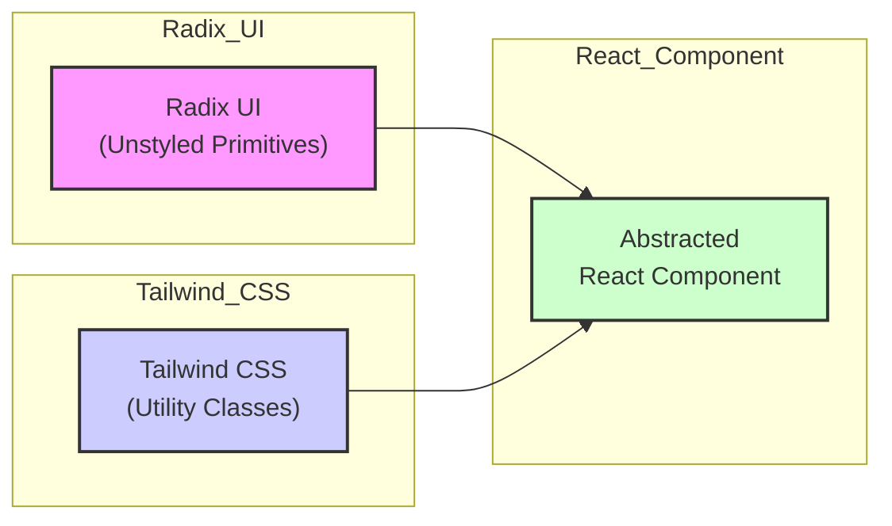

## 🧠 Core Concepts

Let's break down the core concepts involved in UI component abstraction:

*   **UI Primitives:** These are basic, unstyled UI elements that provide the fundamental functionality of a component (e.g., a button, a checkbox, a dialog). Radix UI provides a library of accessible UI primitives.

    *   **Example:** The `DialogPrimitive.Root` and `DialogPrimitive.Trigger` components from `@radix-ui/react-dialog` in the `components/ui/dialog.tsx` file. They provide the basic structure and behavior of a dialog without any styling.

*   **Utility-First CSS:** A CSS approach where styles are applied using small, single-purpose utility classes (e.g., `bg-red-500`, `text-lg`, `font-bold`). Tailwind CSS is a popular utility-first CSS framework.

    *   **Example:** In `components/ui/button.tsx`, Tailwind CSS classes like `bg-primary`, `text-primary-foreground`, and `rounded-md` are used to style the button.

*   **Component Composition:** Combining UI primitives and utility classes to create a higher-level, reusable component.

    *   **Example:** The `Button` component in `components/ui/button.tsx` combines the `Slot` primitive from `@radix-ui/react-slot` (or a standard `<button>` element) with Tailwind CSS classes to create a styled button.

*   **Variants:** Defining different styles or behaviors for a component based on props.

    *   **Example:** The `buttonVariants` function in `components/ui/button.tsx` uses the `class-variance-authority` library to define different variants for the button's `variant` (e.g., "default", "destructive", "outline") and `size` (e.g., "default", "sm", "lg").

*   **`cn` Utility:**  A utility function (often named `cn` or `cx`) that simplifies the process of conditionally applying CSS classes.  It's especially useful when dealing with component variants and dynamic styling. The provided code uses `cn` from `@/lib/utils`.

    *   **Example:** In `components/ui/button.tsx`, `cn(buttonVariants({ variant, size, className }))` combines the base button styles with the styles for the specified variant and size, and any additional classes passed through the `className` prop.

## 💻 Code Deep Dive

Let's analyze the code for the `Button` component in `components/ui/button.tsx` to understand how these concepts are applied:

```typescript
import * as React from "react"
import { Slot } from "@radix-ui/react-slot"
import { cva, type VariantProps } from "class-variance-authority"

import { cn } from "@/lib/utils"

const buttonVariants = cva(
  "inline-flex items-center justify-center gap-2 whitespace-nowrap rounded-md text-sm font-medium transition-[color,box-shadow] disabled:pointer-events-none disabled:opacity-50 [&_svg]:pointer-events-none [&_svg:not([class*='size-'])]:size-4 shrink-0 [&_svg]:shrink-0 outline-none focus-visible:border-ring focus-visible:ring-ring/50 focus-visible:ring-[3px] aria-invalid:ring-destructive/20 dark:aria-invalid:ring-destructive/40 aria-invalid:border-destructive",
  {
    variants: {
      variant: {
        default:
          "bg-primary text-primary-foreground shadow-xs hover:bg-primary/90",
        destructive:
          "bg-destructive text-white shadow-xs hover:bg-destructive/90 focus-visible:ring-destructive/20 dark:focus-visible:ring-destructive/40",
        outline:
          "border border-input bg-background shadow-xs hover:bg-accent hover:text-accent-foreground",
        secondary:
          "bg-secondary text-secondary-foreground shadow-xs hover:bg-secondary/80",
        ghost: "hover:bg-accent hover:text-accent-foreground",
        link: "text-primary underline-offset-4 hover:underline",
      },
      size: {
        default: "h-9 px-4 py-2 has-[>svg]:px-3",
        sm: "h-8 rounded-md gap-1.5 px-3 has-[>svg]:px-2.5",
        lg: "h-10 rounded-md px-6 has-[>svg]:px-4",
        icon: "size-9",
      },
    },
    defaultVariants: {
      variant: "default",
      size: "default",
    },
  }
)

function Button({
  className,
  variant,
  size,
  asChild = false,
  ...props
}: React.ComponentProps<"button"> &
  VariantProps<typeof buttonVariants> & {
    asChild?: boolean
  }) {
  const Comp = asChild ? Slot : "button"

  return (
    <Comp
      data-slot="button"
      className={cn(buttonVariants({ variant, size, className }))}
      {...props}
    />
  )
}

export { Button, buttonVariants }
```

**Explanation:**

1.  **Imports:**
    *   `React`:  Imports the React library.
    *   `Slot`:  From `@radix-ui/react-slot`. Allows the `Button` to be rendered as a different element (e.g., `<a>` tag for links) while maintaining the same styling.
    *   `cva`: From `class-variance-authority`. Used to define component variants (different styles based on props).
    *   `cn`:  From `@/lib/utils`. Used to conditionally apply CSS classes.

2.  **`buttonVariants`:**
    *   Uses `cva` to define the base styles and variants for the button.
    *   The first argument to `cva` is the base class names that are always applied.
    *   The `variants` object defines the different styles based on the `variant` and `size` props.
    *   The `defaultVariants` object specifies the default values for the `variant` and `size` props.

3.  **`Button` Component:**
    *   Takes `className`, `variant`, `size`, and `asChild` props.
    *   `asChild`:  If `true`, the `Button` renders as a `Slot`, allowing you to pass in a different element as a child.
    *   `Comp`: Determines whether to render a `Slot` or a standard `<button>` element.
    *   The `className` prop is combined with the base styles and variant styles using the `cn` utility.

4.  **Return Value:**
    *   Renders a `<Comp>` element (either a `Slot` or a `<button>`) with the combined CSS classes and any other props passed to the component.

## 🧑‍💻 Hands-On Practice

**Exercise: Customize the style of a button using Tailwind CSS classes.**

**Steps:**

1.  **Locate the `Button` component:** Open the `components/ui/button.tsx` file in your project.
2.  **Add a new variant:** Inside the `buttonVariants` function, add a new variant to the `variant` object. Let's call it "special". This variant should have a purple background and white text.

```typescript
variant: {
  default:
    "bg-primary text-primary-foreground shadow-xs hover:bg-primary/90",
  destructive:
    "bg-destructive text-white shadow-xs hover:bg-destructive/90 focus-visible:ring-destructive/20 dark:focus-visible:ring-destructive/40",
  outline:
    "border border-input bg-background shadow-xs hover:bg-accent hover:text-accent-foreground",
  secondary:
    "bg-secondary text-secondary-foreground shadow-xs hover:bg-secondary/80",
  ghost: "hover:bg-accent hover:text-accent-foreground",
  link: "text-primary underline-offset-4 hover:underline",
  special: "bg-purple-500 text-white hover:bg-purple-700" // Add this line
},
```

3.  **Use the new variant:** In your application, import the `Button` component and use the new "special" variant.  For example, in a page component:

```typescript
import { Button } from "@/components/ui/button"

export default function Page() {
  return (
    <Button variant="special">Special Button</Button>
  )
}
```

4. **Test the styling:** Run your application and view the page where you've added the button. You should see a button with a purple background and white text. Experiment with different Tailwind CSS classes to customize the button further.

**Success Check:** Successfully customize the style of a button using Radix UI, `class-variance-authority`, and Tailwind CSS. You should have a new button variant with custom styling.

## ✅ Chapter Summary

In this chapter, you learned how to abstract UI components using Radix UI primitives and Tailwind CSS. You can now:

*   Explain the benefits of component abstraction.
*   Identify and utilize Radix UI primitives.
*   Apply Tailwind CSS utility classes to style components.
*   Create component variants using `class-variance-authority`.
*   Use the `cn` utility to conditionally apply CSS classes.
*   Build reusable UI components that are consistent and maintainable.

## 👉 Up Next

Next, we'll explore advanced component patterns, including compound components and render props, to create even more flexible and reusable UI elements.

---

<a name="chapter-9-centralized-state-management-with-zustand:-sharing-data-between-components"></a>

---

# Centralized State Management with Zustand: Sharing Data Between Components

## 🎯 Chapter Objective
After this chapter, you will be able to manage application state using Zustand, providing a simple solution for sharing data between components.

**Time to Complete:** 45 minutes

## 💡 Why This Matters

Centralized state management is crucial for building maintainable and scalable applications. Without it, passing data between components becomes cumbersome, leading to "prop drilling" and tightly coupled components. Zustand simplifies this process by providing a lightweight and easy-to-use solution for managing application state in a single, accessible location. This makes your code more organized, easier to debug, and allows components to react to state changes without complex prop passing. Imagine building a large e-commerce application; using Zustand can help manage user authentication, shopping cart data, and product details across various components seamlessly.

## 🎨 Visual Overview
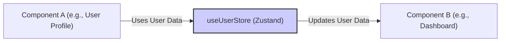

## 🧠 Core Concepts

*   **State Management:** Managing the data that drives your application's UI and behavior.
*   **Centralized Store:** A single source of truth for your application's state, making it accessible to any component.
*   **Zustand:** A small, fast, and unopinionated state management library for React. It uses simplified flux principles.
*   **Store Creation:** Zustand uses the `create` function to define a store. This function accepts a function that returns an object representing the store's state and actions.
*   **Selectors:** Functions that allow components to subscribe to specific parts of the store's state, preventing unnecessary re-renders.
*   **Mutations:** Functions that update the store's state.  In Zustand, these are typically defined directly within the store creation function using the `set` function provided by Zustand.

**Example:**

```javascript
import { create } from 'zustand';

const useMyStore = create((set) => ({
  count: 0,
  increment: () => set((state) => ({ count: state.count + 1 })),
  decrement: () => set((state) => ({ count: state.count - 1 })),
}));

export default useMyStore;
```

In this example:

*   `useMyStore` is a custom hook that provides access to the store.
*   `count` is a state variable.
*   `increment` and `decrement` are actions that modify the `count` state.
*   `set` is a function provided by Zustand that allows you to update the state.

## 💻 Code Deep Dive

Let's analyze the provided `userStore.js` and `codeEditorStore.js` files.

**1. `userStore.js`**

```javascript
// userStore.js
import { create } from 'zustand';

const useUserStore = create((set) => ({
  user: null,
  token: null,

  // Initialize from localStorage
  initialize: () => {
    if (typeof window !== 'undefined') {
      const storedUser = localStorage.getItem('codevibe-user');
      const storedToken = localStorage.getItem('codevibe-token');
      set({ 
        user: storedUser ? JSON.parse(storedUser) : null,
        token: storedToken || null
      });
    }
  },

  // Set both user and token
  setAuth: (user, token) => {
    if (typeof window !== 'undefined') {
      localStorage.setItem('codevibe-user', JSON.stringify(user));
      localStorage.setItem('codevibe-token', token);
    }
    set({ user, token });
  },

  // Update just user data
  setUser: (user) => {
    if (typeof window !== 'undefined') {
      localStorage.setItem('codevibe-user', JSON.stringify(user));
    }
    set({ user });
  },

  // Clear auth data
  logout: () => {
    if (typeof window !== 'undefined') {
      localStorage.removeItem('codevibe-user');
      localStorage.removeItem('codevibe-token');
    }
    set({ user: null, token: null });
  },

  // Add contest to user's contests
  addContest: (contest) => {
    set((state) => {
      if (!state.user) return state;
      
      const updatedUser = {
        ...state.user,
        contests: [...(state.user.contests || []), contest]
      };

      if (typeof window !== 'undefined') {
        localStorage.setItem('codevibe-user', JSON.stringify(updatedUser));
      }

      return { user: updatedUser };
    });
  }
}));

export default useUserStore;
```

*   **`create(callback)`:**  This function from Zustand creates the store. The `callback` function receives `set` as an argument.
*   **`set(updater)`:** This function updates the state.  The `updater` can be either an object representing the new state, or a function that receives the current state as an argument and returns an object representing the new state.
*   **`user` and `token`:** These are state variables that store user information and authentication token.
*   **`initialize()`:** This function initializes the store from `localStorage` when the application loads.  It checks if `window` is defined to ensure it runs in a browser environment.
*   **`setAuth(user, token)`:** This function sets both the `user` and `token` in the store and `localStorage`.
*   **`setUser(user)`:** This function updates the `user` data in the store and `localStorage`.
*   **`logout()`:**  This function clears the `user` and `token` from the store and `localStorage`.
*   **`addContest(contest)`:** This function adds a contest to the user's `contests` array. It also updates the user data in `localStorage`.

**2. `codeEditorStore.js`**

```javascript
import { create } from 'zustand';

const useCodeEditorStore = create((set) => ({
  runCount: 0,
  setRunCount: (count) => set({ runCount: count }),
  useLanguage: "javascript",
  setUseLanguage: (language) => set({ useLanguage: language }),
  userCode: "",
  setUserCode: (code) => set({ userCode: code }),
  adminKey: "",
  setadminKey: (key) => set({ adminKey: key }),
  adminExplaination: "",
  setAdminExplaination: (explanation) => set({ adminExplaination: explanation }),
}));

export default useCodeEditorStore;
```

*   **`runCount`:** Stores the number of times the code has been run.
*   **`useLanguage`:** Stores the selected programming language.
*   **`userCode`:** Stores the user's code.
*   **`adminKey`:** Stores an admin key (likely for authentication or authorization).
*   **`adminExplaination`:** Stores an explanation provided by an admin.
*   The `set[VariableName]` functions update the corresponding state variables. For example, `setRunCount` updates the `runCount` state.

**How to use these stores in a component:**

```javascript
import useUserStore from './store/userStore';
import useCodeEditorStore from './store/codeEditorStore';

function MyComponent() {
  const { user, logout } = useUserStore();
  const { userCode, setUserCode } = useCodeEditorStore();

  return (
    <div>
      {user ? (
        <>
          <p>Welcome, {user.username}!</p>
          <button onClick={logout}>Logout</button>
        </>
      ) : (
        <p>Please login.</p>
      )}
      <textarea value={userCode} onChange={(e) => setUserCode(e.target.value)} />
    </div>
  );
}

export default MyComponent;
```

In this example, `MyComponent` uses the `useUserStore` and `useCodeEditorStore` hooks to access the `user`, `logout`, `userCode`, and `setUserCode` from the stores. It displays a welcome message if the user is logged in and allows the user to enter code in a `textarea`.

## 🧑‍💻 Hands-On Practice

**Exercise: Add a new state variable to the `codeEditorStore` and update it from a component.**

**Steps:**

1.  **Modify `codeEditorStore.js`:** Add a new state variable called `fontSize` with a default value of `14`. Also, add a function to update this variable.

2.  **Create the variable and its setter:** Open `store/codeEditorStore.js` and add the following lines inside the `create` function's callback:

    ```javascript
      fontSize: 14,
      setFontSize: (size) => set({ fontSize: size }),
    ```

3.  **Update a component:** In `MyComponent.js` (or any component where you want to use this state), import `useCodeEditorStore` and use the new `fontSize` state and `setFontSize` function. Add a slider to control the font size.

**Clear, actionable tasks:**

1.  **Open `store/codeEditorStore.js` and add the `fontSize` state and `setFontSize` action.**
2.  **Open `MyComponent.js` (or your chosen component) and import `useCodeEditorStore`.**
3.  **Destructure `fontSize` and `setFontSize` from the hook.**
4.  **Add an input range (`<input type="range" ... />`) to control the `fontSize`.**
5.  **Style the `textarea` (or other code editor component) to use the `fontSize` state.**

**Example `MyComponent.js`:**

```javascript
import useUserStore from './store/userStore';
import useCodeEditorStore from './store/codeEditorStore';

function MyComponent() {
  const { user, logout } = useUserStore();
  const { userCode, setUserCode, fontSize, setFontSize } = useCodeEditorStore();

  return (
    <div>
      {user ? (
        <>
          <p>Welcome, {user.username}!</p>
          <button onClick={logout}>Logout</button>
        </>
      ) : (
        <p>Please login.</p>
      )}
      <input
        type="range"
        min="10"
        max="24"
        value={fontSize}
        onChange={(e) => setFontSize(parseInt(e.target.value))}
      />
      <textarea
        value={userCode}
        onChange={(e) => setUserCode(e.target.value)}
        style={{ fontSize: `${fontSize}px` }}
      />
    </div>
  );
}

export default MyComponent;
```

**Success Check:** Successfully add a new state variable (`fontSize`) to the `codeEditorStore` and update it from a component using a slider, changing the font size of the textarea.

## ✅ Chapter Summary

In this chapter, you learned how to use Zustand for centralized state management. You now understand:

*   The importance of centralized state management for application maintainability.
*   How Zustand simplifies state management with its lightweight and unopinionated approach.
*   How to create Zustand stores using the `create` function.
*   How to define state variables and actions within a Zustand store.
*   How to access and update state from components using the custom hook returned by `create`.
*   How to persist state using localStorage.

You can now create and manage global state in your React applications using Zustand, making your code more organized and easier to maintain.

## 👉 Up Next

In the next chapter, we'll explore advanced Zustand techniques, including middleware and selectors, to further optimize your state management strategy.

---

<a name="chapter-10-code-editor-component-with-dynamic-id-routing:-creating-dynamic-pages"></a>

---

# Code Editor Component with Dynamic ID Routing: Creating Dynamic Pages

## 🎯 Chapter Objective
After this chapter, you will be able to implement a code editor component that is dynamically rendered based on the `id` route parameter.

**Time to Complete:** 60 minutes

## 💡 Why This Matters
Dynamic routing is crucial for building modern web applications. Imagine building a documentation site where each document has its own unique URL. You wouldn't want to manually create a new page for every document! Dynamic routing allows you to create a single "template" page that renders different content based on the URL parameters, significantly reducing development time and improving maintainability. In this chapter, we'll create a code editor that loads and saves code based on a unique ID in the URL. This mimics scenarios like collaborative coding platforms (think CodePen or JSFiddle) or content management systems where each piece of content has its own unique, dynamically generated page.

## 🎨 Visual Overview
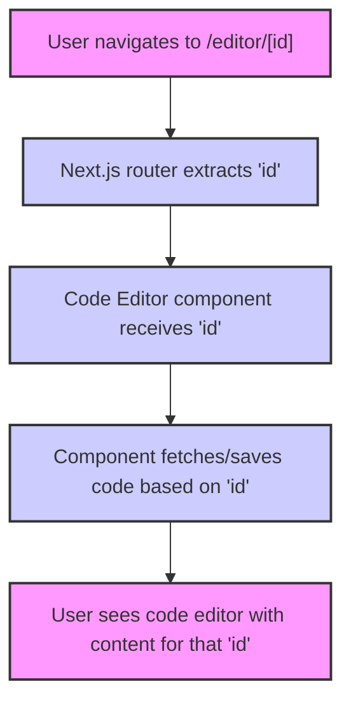

## 🧠 Core Concepts

*   **Dynamic Routing:** The ability to create routes that include parameters. In Next.js, this is achieved using square brackets in the `pages` directory. For example, `pages/editor/[id].js` creates a route where `id` is a dynamic parameter.

    *   **Example:** Visiting `/editor/123` will render the `pages/editor/[id].js` page, and the `id` parameter will be accessible within the page component.

*   **`useRouter` Hook (Next.js):** This hook provides access to the router object, allowing you to access the current route, query parameters, and other router-related information.

    *   **Example:**
        ```javascript
        import { useRouter } from 'next/router';

        function EditorPage() {
          const router = useRouter();
          const { id } = router.query; // Access the 'id' parameter
          // ...
        }
        ```

*   **Component State:** Managing the state of the code editor (the code itself) is important for keeping track of changes and rendering the editor correctly.  React's `useState` hook is a common way to manage local component state.

    *   **Example:**
        ```javascript
        import { useState } from 'react';

        function CodeEditor() {
          const [code, setCode] = useState('');

          const handleCodeChange = (newCode) => {
            setCode(newCode);
          };

          return (
            <textarea value={code} onChange={(e) => handleCodeChange(e.target.value)} />
          );
        }
        ```

## 💻 Code Deep Dive

Let's imagine we have a `pages/editor/[id].js` file in our Next.js project. This file will handle the dynamic routing for our code editor.

```javascript
// pages/editor/[id].js
import { useRouter } from 'next/router';
import { useState, useEffect } from 'react';

function EditorPage() {
  const router = useRouter();
  const { id } = router.query;
  const [code, setCode] = useState('');

  useEffect(() => {
    // This effect runs when the 'id' changes.
    if (id) {
      // Simulate fetching code from a database or local storage
      const storedCode = localStorage.getItem(`code-${id}`) || '';
      setCode(storedCode);
    }
  }, [id]);

  const handleCodeChange = (event) => {
    setCode(event.target.value);
  };

  const handleSave = () => {
    if (id) {
      localStorage.setItem(`code-${id}`, code);
      alert('Code saved!');
    } else {
      alert('No ID provided.');
    }
  };

  if (!id) {
    return <p>Loading...</p>; // Or a more informative message
  }

  return (
    <div>
      <h1>Code Editor for ID: {id}</h1>
      <textarea
        value={code}
        onChange={handleCodeChange}
        style={{ width: '80%', height: '300px' }}
      />
      <button onClick={handleSave}>Save</button>
    </div>
  );
}

export default EditorPage;
```

**Explanation:**

1.  **`import { useRouter } from 'next/router';`**: Imports the `useRouter` hook from Next.js.
2.  **`const router = useRouter();`**:  Initializes the router object.
3.  **`const { id } = router.query;`**: Extracts the `id` parameter from the URL.  The `router.query` object contains all the query parameters.
4.  **`const [code, setCode] = useState('');`**: Initializes the `code` state variable to an empty string. This will hold the code in the editor.
5.  **`useEffect(() => { ... }, [id]);`**: This `useEffect` hook runs whenever the `id` parameter changes. This is crucial for loading the correct code when the user navigates to a different editor ID.
    *   Inside the `useEffect`, we simulate fetching the code from local storage using `localStorage.getItem(\`code-${id}\`)`.  If no code is found for that ID, we default to an empty string.
    *   `setCode(storedCode);` updates the `code` state with the fetched code.
6.  **`handleCodeChange(event)`**: This function is called whenever the user types in the textarea. It updates the `code` state with the new value.
7.  **`handleSave()`**:  This function saves the current code to local storage, using the `id` as the key.
8.  **`if (!id) { return <p>Loading...</p>; }`**: This conditional rendering ensures that the component doesn't try to render before the `id` is available from the router. This prevents potential errors.
9.  The `return` statement renders the UI: a heading displaying the ID, a textarea for the code editor, and a save button.

## 🧑‍💻 Hands-On Practice
**Exercise: Implement a save functionality that persists the code editor content based on its ID.**

**Steps:**

1.  **Create the `pages/editor/[id].js` file:** Create a new file in your Next.js project at `pages/editor/[id].js`.
2.  **Implement the basic component structure:** Start by adding the `EditorPage` component with the `useRouter` hook and a simple "Loading..." message when the `id` is not available.  See the Code Deep Dive section for the initial component structure.
3.  **Implement the `useEffect` hook:**  Add the `useEffect` hook to load the code from `localStorage` based on the `id` parameter.  Use a key like `code-${id}` to store the code for each ID separately.  Initialize the `code` state with the loaded value. If nothing is stored in local storage, default to an empty string.
4.  **Implement the `handleCodeChange` function:**  Create a function that updates the `code` state whenever the textarea's value changes.
5.  **Implement the `handleSave` function:**  Create a function that saves the current `code` to `localStorage` using the `id` as part of the key. Display an alert message "Code saved!" upon successful save.
6.  **Render the textarea and save button:**  Render the textarea with the `value` bound to the `code` state and the `onChange` event handler set to `handleCodeChange`.  Add a "Save" button with an `onClick` event handler set to `handleSave`. Style the textarea to be reasonably large.

**Success Check:** Successfully create a dynamic route and persist the code editor content based on its ID. You should be able to navigate to different `/editor/[id]` URLs (e.g., `/editor/1`, `/editor/2`), edit the code in each editor, save the code, and then refresh the page to see the saved code persist.

## ✅ Chapter Summary
In this chapter, you've learned how to:

*   Create dynamic routes in Next.js using the `pages/[param].js` structure.
*   Use the `useRouter` hook to access route parameters.
*   Implement a code editor component that dynamically loads and saves content based on the `id` parameter in the URL.
*   Use `localStorage` to persist data.
*   Use `useEffect` to perform side effects based on route changes.

You now have a solid foundation for building more complex applications that leverage dynamic routing to create unique and personalized user experiences.

## 👉 Up Next
In the next chapter, we'll explore how to deploy your Next.js application to a production environment.

---

<a name="chapter-11-environment-variable-configuration-with-`next.config.ts`:-managing-application-settings"></a>

---

# Environment Variable Configuration with `next.config.ts`: Managing Application Settings

## 🎯 Chapter Objective
After this chapter, you will be able to configure environment variables and other settings for the Next.js application using `next.config.ts`.

**Time to Complete:** 30 minutes

## 💡 Why This Matters

Environment variables are crucial for managing application settings across different environments (development, staging, production).  Using `next.config.ts` allows you to securely store configuration data, such as API keys, database connection strings, and feature flags, outside of your codebase. This prevents sensitive information from being exposed in your repository and allows you to easily adapt your application's behavior based on the environment it's running in.  For example, you might want to use a mock API endpoint during development and a live API endpoint in production.  By configuring environment variables in `next.config.ts`, you can achieve this without modifying your code.

## 🎨 Visual Overview
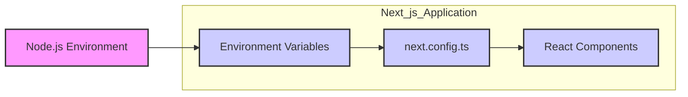

## 🧠 Core Concepts

*   **Environment Variables:** Key-value pairs that store configuration settings outside your application code. These variables are accessible to your application at runtime.

*   **`next.config.ts`:** A Next.js configuration file that allows you to customize the build process, routing, and other aspects of your application. It's the primary place to define environment variables for use in your Next.js application.

*   **`process.env`:** A global object in Node.js that provides access to environment variables. Next.js automatically makes environment variables defined in `.env` files and `next.config.js` accessible through `process.env`.

*   **Public vs. Private Environment Variables:**
    *   **Public:** Accessible in the browser. These should only be used for non-sensitive data. To expose a variable to the browser, prefix it with `NEXT_PUBLIC_`.
    *   **Private:** Only accessible on the server-side. These are used for sensitive data, such as API keys or database credentials.

## 💻 Code Deep Dive

Let's examine how to configure environment variables using `next.config.ts`.

First, modify your `next.config.ts` file to include the `env` property:

```typescript
// next.config.ts
import type { NextConfig } from "next";

const nextConfig: NextConfig = {
  env: {
    API_URL: process.env.API_URL || "http://localhost:3000/api", // Default API URL
    NEXT_PUBLIC_APP_NAME: "My Awesome App", // Public variable
  },
};

export default nextConfig;
```

**Explanation:**

1.  **`env` Property:** This object within `nextConfig` defines the environment variables that will be available to your Next.js application.

2.  **`API_URL`:** This is a private environment variable.  We're using `process.env.API_URL || "http://localhost:3000/api"` to provide a default value if the `API_URL` environment variable is not explicitly set in the environment (e.g., in a `.env` file or through system environment variables).

3.  **`NEXT_PUBLIC_APP_NAME`:** This is a public environment variable because it's prefixed with `NEXT_PUBLIC_`. This variable will be accessible in the browser.

**Accessing Environment Variables:**

*   **Server-Side:** You can access environment variables on the server-side (e.g., in API routes, `getServerSideProps`, or `getStaticProps`) using `process.env`.

    ```typescript
    // pages/api/hello.ts
    import type { NextApiRequest, NextApiResponse } from 'next'

    export default function handler(
      req: NextApiRequest,
      res: NextApiResponse
    ) {
      const apiUrl = process.env.API_URL;
      res.status(200).json({ message: `Hello from the API! API URL: ${apiUrl}` })
    }
    ```

*   **Client-Side (Public Variables Only):**  You can access public environment variables in your React components using `process.env`.

    ```typescript
    // components/MyComponent.tsx
    const MyComponent = () => {
      const appName = process.env.NEXT_PUBLIC_APP_NAME;
      return <div>App Name: {appName}</div>;
    };

    export default MyComponent;
    ```

**Important Considerations:**

*   **`.env` Files:** For local development, you can store environment variables in `.env.local` files.  Next.js automatically loads these variables into `process.env`. Remember to add `.env.local` to your `.gitignore` file to prevent committing sensitive information to your repository.

*   **Deployment Environments:** In production environments (e.g., Vercel, Netlify, AWS), you should configure environment variables through the platform's settings, not by committing `.env` files.

## 🧑‍💻 Hands-On Practice

**Exercise: Add a new environment variable and access it in a component.**

**Steps:**

1.  **Modify `next.config.ts`:** Add a new public environment variable called `NEXT_PUBLIC_FEATURE_FLAG` to your `next.config.ts` file. Set its value to `"enabled"`.

    ```typescript
    // next.config.ts
    import type { NextConfig } from "next";

    const nextConfig: NextConfig = {
      env: {
        API_URL: process.env.API_URL || "http://localhost:3000/api",
        NEXT_PUBLIC_APP_NAME: "My Awesome App",
        NEXT_PUBLIC_FEATURE_FLAG: "enabled", // New feature flag
      },
    };

    export default nextConfig;
    ```

2.  **Create a Component:** Create a new React component (e.g., `components/FeatureComponent.tsx`) that displays a message based on the value of `NEXT_PUBLIC_FEATURE_FLAG`.

    ```typescript
    // components/FeatureComponent.tsx
    const FeatureComponent = () => {
      const featureFlag = process.env.NEXT_PUBLIC_FEATURE_FLAG;

      return (
        <div>
          {featureFlag === "enabled" ? (
            <p>Feature is enabled!</p>
          ) : (
            <p>Feature is disabled.</p>
          )}
        </div>
      );
    };

    export default FeatureComponent;
    ```

3.  **Import and Use the Component:** Import and use the `FeatureComponent` in one of your pages (e.g., `pages/index.tsx`).

    ```typescript
    // pages/index.tsx
    import FeatureComponent from '../components/FeatureComponent';

    const Home = () => {
      return (
        <div>
          <h1>Welcome to my app!</h1>
          <FeatureComponent />
        </div>
      );
    };

    export default Home;
    ```

4.  **Restart the Development Server:**  Stop and restart your Next.js development server (`npm run dev` or `yarn dev`) for the changes to take effect.

**Success Check:** Successfully add and access a new environment variable in a component. You should see "Feature is enabled!" displayed on your page.

## ✅ Chapter Summary

In this chapter, you learned how to configure environment variables in your Next.js application using `next.config.ts`. You now understand the difference between public and private environment variables and how to access them on both the server-side and client-side. You also gained practical experience adding and using environment variables in a React component.

## 👉 Up Next

Next, we'll explore how to configure custom server routes using the `pages/api` directory.

---

<a name="chapter-12-url-manipulation:-working-with-urls"></a>

---

# URL Manipulation: Working with URLs

## 🎯 Chapter Objective
After this chapter, you will be able to manipulate and construct URLs.

**Time to Complete:** 30 minutes

## 💡 Why This Matters
Understanding how to manipulate URLs is crucial for web developers. It allows you to dynamically construct API endpoints, handle user navigation, and manage application state. For example, you might need to add query parameters to a URL to filter data from an API, or change the URL based on a user's selection in a form. Without this knowledge, you'll struggle to build dynamic and interactive web applications. Mastering URL manipulation allows you to build robust, flexible applications that respond intelligently to user input and server-side data. It is also important for security, ensuring you properly encode and decode URL components to prevent vulnerabilities.

## 🎨 Visual Overview
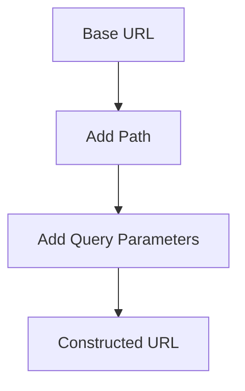

## 🧠 Core Concepts

*   **URL (Uniform Resource Locator):** A reference to a web resource that specifies its location on a computer network and a mechanism for retrieving it. A URL has several parts:
    *   **Protocol:** `https://` (or `http://`) - The communication protocol used.
    *   **Hostname:** `codevibe-backend.onrender.com` - The domain name of the server.
    *   **Path:** `/api/users` - The specific resource being requested.
    *   **Query Parameters:** `?name=john&age=30` - Additional information sent to the server.

*   **URL Manipulation:** The process of modifying parts of a URL to achieve a desired outcome, such as accessing different resources or passing data to the server.

*   **URL Construction:** Building a complete URL from its individual components.

## 💻 Code Deep Dive

Let's look at the provided `lib/url.js` file.

```javascript
const BaseURL = 'https://codevibe-backend.onrender.com'
const LocalURL = 'http://localhost:5001'
module.exports = {
  BASE_URL: BaseURL,
}
```

This file defines a base URL for the application's backend. Now, let's imagine how we can use this to construct more complex URLs.

**Example 1: Appending a Path**

Suppose we want to fetch a specific user from the backend, and the endpoint is `/api/users/:id`. We can construct the URL like this:

```javascript
const { BASE_URL } = require('./lib/url'); // Assuming the file is in the same directory or adjust the path

const userId = '123';
const userEndpoint = `${BASE_URL}/api/users/${userId}`;

console.log(userEndpoint); // Output: https://codevibe-backend.onrender.com/api/users/123
```

In this example, we've taken the `BASE_URL` and appended a specific path `/api/users/` along with a user ID. This creates a complete URL for fetching a specific user.

**Example 2: Adding Query Parameters**

Now let's say we want to fetch users based on certain criteria using query parameters, such as `name` and `age`.

```javascript
const { BASE_URL } = require('./lib/url');

const name = 'john';
const age = 30;

const searchEndpoint = `${BASE_URL}/api/users?name=${name}&age=${age}`;

console.log(searchEndpoint); // Output: https://codevibe-backend.onrender.com/api/users?name=john&age=30
```

Here, we've added query parameters `name` and `age` to the base URL. This allows us to filter the users based on these criteria.

**Important Note:** When constructing URLs with user-provided data, it's crucial to properly encode the data to prevent security vulnerabilities.  Use `encodeURIComponent()` to encode potentially unsafe characters in the query parameters.

```javascript
const { BASE_URL } = require('./lib/url');

const name = 'john doe'; // Contains a space
const age = 30;

const encodedName = encodeURIComponent(name);
const searchEndpoint = `${BASE_URL}/api/users?name=${encodedName}&age=${age}`;

console.log(searchEndpoint); // Output: https://codevibe-backend.onrender.com/api/users?name=john%20doe&age=30
```

## 🧑‍💻 Hands-On Practice
**Exercise: Create a new URL using the url.js file.**

**Steps:**

1.  **Create a new file called `exercise.js`.** This is where you'll write your code.
2.  **Import the `BASE_URL` from `lib/url.js`.** Use `require('./lib/url')` to import the module.
3.  **Define a path for fetching posts: `/api/posts`.**
4.  **Define query parameters: `category=technology` and `sort=recent`.**
5.  **Construct the complete URL** by combining the `BASE_URL`, the path, and the query parameters. Remember to encode the query parameters.
6.  **Print the constructed URL to the console.**

**Success Check:** Successfully create a new URL and print it to the console. The URL should look like this: `https://codevibe-backend.onrender.com/api/posts?category=technology&sort=recent`

**Solution:**

```javascript
const { BASE_URL } = require('./lib/url');

const path = '/api/posts';
const category = 'technology';
const sort = 'recent';

const constructedURL = `${BASE_URL}${path}?category=${encodeURIComponent(category)}&sort=${encodeURIComponent(sort)}`;

console.log(constructedURL);
```

## ✅ Chapter Summary
In this chapter, you learned how to manipulate and construct URLs. You now understand the different parts of a URL and how to combine them to create dynamic endpoints. You also practiced adding paths and query parameters to a base URL, and learned the importance of encoding URL components to prevent security issues. You can now build URLs for different API endpoints and dynamically modify them based on application needs.

## 👉 Up Next
In the next chapter, we'll explore how to make API calls using these constructed URLs.

---

<a name="chapter-13-utility-functions:-creating-reusable-code"></a>

---

# Utility Functions: Creating Reusable Code

## 🎯 Chapter Objective
After this chapter, you will be able to create utility functions.

**Time to Complete:** 30 minutes

## 💡 Why This Matters

Utility functions are like the building blocks of your code. Instead of repeating the same logic over and over, you can encapsulate it into a reusable function. This makes your code cleaner, easier to understand, and much easier to maintain. Imagine you need to format a date in multiple places in your application. Without a utility function, you'd have to write the formatting logic everywhere you need it. With a utility function, you write it once, test it thoroughly, and then reuse it throughout your application. This significantly reduces the risk of errors and makes updates much simpler. For example, the `cn` function in `lib/utils.ts` combines class names, handling conditional logic and Tailwind CSS merging. This avoids repetitive and error-prone string manipulation directly in your components.

## 🎨 Visual Overview
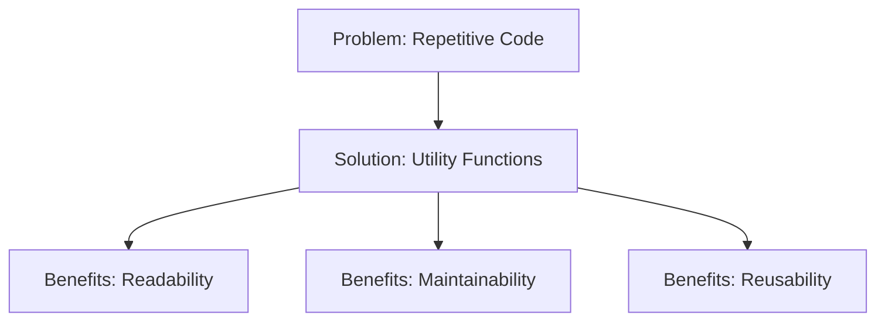

## 🧠 Core Concepts

*   **Utility Function:** A small, reusable function that performs a specific task. It's designed to be used in multiple places within your application, promoting code reuse and reducing redundancy.
*   **DRY Principle (Don't Repeat Yourself):** The core principle behind using utility functions. It advocates for avoiding duplication of code by extracting common logic into reusable components or functions.
*   **Modularity:** Utility functions promote modularity by breaking down complex tasks into smaller, manageable units. This makes your code easier to understand, test, and maintain.
*   **Abstraction:** Utility functions abstract away complex implementation details, allowing you to focus on the higher-level logic of your application.

**Example:**

Consider a function that formats a number as currency:

```typescript
function formatCurrency(amount: number, currency: string = "USD"): string {
  return new Intl.NumberFormat('en-US', {
    style: 'currency',
    currency: currency,
  }).format(amount);
}

// Usage:
const price = 1234.56;
const formattedPrice = formatCurrency(price); // Output: $1,234.56
const formattedEuroPrice = formatCurrency(price, "EUR"); // Output: €1,234.56
```

This function encapsulates the currency formatting logic, allowing you to reuse it throughout your application without repeating the formatting code.

## 💻 Code Deep Dive

Let's analyze the `cn` function in `lib/utils.ts`:

```typescript
import { clsx, type ClassValue } from "clsx"
import { twMerge } from "tailwind-merge"

export function cn(...inputs: ClassValue[]) {
  return twMerge(clsx(inputs))
}
```

*   **`import { clsx, type ClassValue } from "clsx"`:** This line imports the `clsx` function and `ClassValue` type from the `clsx` library. `clsx` is a utility that conditionally joins class names together.  The `ClassValue` type defines the possible types that can be passed as arguments to `clsx`.
*   **`import { twMerge } from "tailwind-merge"`:** This line imports the `twMerge` function from the `tailwind-merge` library. `twMerge` is used to resolve conflicting Tailwind CSS class names, ensuring that the correct styles are applied.
*   **`export function cn(...inputs: ClassValue[]) { ... }`:** This defines a function named `cn` which accepts a variable number of arguments (`...inputs`) of type `ClassValue[]`. This means you can pass multiple class names, or even arrays of class names, to the function.
*   **`return twMerge(clsx(inputs))`:** This line is the core of the function. First, `clsx(inputs)` is called to join the input class names together, handling any conditional logic. Then, `twMerge` is used to merge the resulting class names, resolving any conflicts between Tailwind CSS classes. The final merged string of class names is then returned.

**Example Usage:**

```typescript
import { cn } from "@/lib/utils"

// In a React component:
function MyComponent() {
  return (
    <div className={cn("p-4", "bg-gray-100", { "text-red-500": true })}>
      Hello, world!
    </div>
  )
}
```

In this example, the `cn` function combines the class names "p-4", "bg-gray-100", and "text-red-500" (because the conditional object evaluates to true). The `twMerge` function ensures that if any of these class names conflict, the correct styles are applied according to Tailwind CSS's precedence rules.

## 🧑‍💻 Hands-On Practice

**Exercise: Add a new utility function to the `utils.ts` file.**

**Steps:**

1.  **Open `lib/utils.ts`:** Locate the `utils.ts` file in your project's `lib` directory and open it in your code editor.
2.  **Create a new function:** Add the following function to the file:

```typescript
export function truncate(str: string, maxLength: number): string {
  if (str.length <= maxLength) {
    return str;
  }
  return str.substring(0, maxLength) + "...";
}
```

3.  **Explanation:** This `truncate` function takes a string `str` and a maximum length `maxLength` as input. If the string's length is less than or equal to `maxLength`, it returns the original string. Otherwise, it truncates the string to `maxLength` characters and adds "..." to the end.
4.  **Use the function:** In a React component (or any other part of your application), import and use the `truncate` function:

```typescript
import { truncate } from "@/lib/utils";

function MyComponent() {
  const longText = "This is a very long string that needs to be truncated.";
  const truncatedText = truncate(longText, 20);

  return (
    <div>
      <p>{truncatedText}</p>
    </div>
  );
}
```

5.  **Test the function:** Verify that the `truncate` function correctly truncates the string and adds "..." when the string exceeds the maximum length. Also, check that it returns the original string when it's shorter than the maximum length.

**Success Check:** Successfully add a new utility function `truncate` to `utils.ts` and use it to truncate a string in your application.

## ✅ Chapter Summary

In this chapter, you learned about utility functions, their importance in promoting code reuse and maintainability, and how to create them. You analyzed the `cn` function in `lib/utils.ts` and added a new `truncate` utility function. You now understand how to encapsulate common logic into reusable functions, making your code cleaner, more efficient, and easier to maintain.

## 👉 Up Next

In the next chapter, we'll explore custom hooks and how they can be used to encapsulate stateful logic and side effects, further improving the reusability and maintainability of your React components.

---

<a name="chapter-14-discussion-card:-displaying-discussions"></a>

---

# Discussion Card: Displaying Discussions

## 🎯 Chapter Objective
After this chapter, you will be able to display discussions from the user or bot using discussion cards.

**Time to Complete:** 30 minutes

## 💡 Why This Matters
Discussion cards are a cornerstone of interactive applications. They provide a structured and engaging way to present user-generated content, bot responses, or any form of conversational exchange. Mastering the creation and display of discussion cards allows you to build features like comment sections, forum threads, and chatbot interfaces. Without the ability to display discussions effectively, your application will lack the essential means of user interaction and information sharing. For example, consider a social media platform where users post and comment. Each post and comment is essentially a discussion card. Or think of a customer service chatbot where each message from the bot or user is displayed in a card format. This chapter will equip you with the skills to bring these dynamic interactions to life in your own projects.

## 🎨 Visual Overview
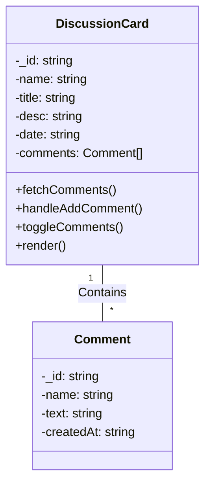

## 🧠 Core Concepts

*   **Discussion Card:** A UI component that encapsulates a discussion topic, including its title, description, author, and associated comments. It serves as a container for all related information, promoting organization and readability.
    *   **Example:** The `DiscussionCard` component in the provided code displays a discussion's title, description, author, and a button to toggle the display of comments.

*   **Props:** Data passed into a component to customize its behavior and appearance. Props are essential for making components reusable and dynamic.
    *   **Example:** The `DiscussionCard` component receives props like `_id`, `name`, `title`, `desc`, and `date`, which determine the content displayed within the card.

*   **State:** Internal data managed by a component that can change over time, triggering re-renders and updating the UI. State allows components to be interactive and responsive to user actions.
    *   **Example:** The `DiscussionCard` component uses state variables like `comments`, `newComment`, `showComments`, `isLoading`, and `error` to manage the display of comments, the input field for new comments, the visibility of the comments section, loading states, and error messages.

*   **Event Handling:** The process of responding to user interactions, such as button clicks or form submissions. Event handlers are functions that execute when a specific event occurs.
    *   **Example:** The `DiscussionCard` component uses the `toggleComments` function to handle clicks on the "View Comments" button and the `handleAddComment` function to handle the submission of new comments.

*   **API Interaction:** Communicating with a backend server to fetch or update data. API interactions are crucial for retrieving and persisting data in a dynamic application.
    *   **Example:** The `DiscussionCard` component uses the `fetchComments` function to retrieve comments from the server and the `handleAddComment` function to send new comments to the server.

## 💻 Code Deep Dive

Let's break down the `DiscussionCard` component:

1.  **Import Statements:**

    ```javascript
    import React, { useEffect, useState } from 'react';
    import { Button } from "@/components/ui/button";
    import { Textarea } from '@/components/ui/textarea';
    import { BASE_URL } from '@/lib/url';
    import useUserStore from '@/store/userStore';
    ```

    *   These lines import necessary modules from React and other custom components. `useState` is a React hook for managing state.
    *   `Button` and `Textarea` are UI components, likely from a library like Radix UI or Shadcn UI, providing pre-styled interactive elements.
    *   `BASE_URL` is a constant defining the base URL for API requests.
    *   `useUserStore` is a custom hook using Zustand or similar state management library to get the current logged-in user information.

2.  **Component Definition:**

    ```javascript
    const DiscussionCard = ({ _id, name, title, desc, date }: {
      _id: string;
      name: string;
      title: string;
      desc: string;
      date: string;
    }) => { ... }
    ```

    *   Defines a functional React component named `DiscussionCard`.
    *   It receives several props: `_id`, `name`, `title`, `desc`, and `date`.

3.  **State Management:**

    ```javascript
    const [comments, setComments] = useState<Comment[]>([]);
    const [newComment, setNewComment] = useState('');
    const [showComments, setShowComments] = useState(false);
    const [isLoading, setIsLoading] = useState(false);
    const [error, setError] = useState<string | null>(null);
    const { user } = useUserStore();
    ```

    *   `comments`: Stores an array of comments associated with the discussion.
    *   `newComment`: Stores the text content of the new comment input field.
    *   `showComments`: A boolean flag indicating whether the comments section is visible.
    *   `isLoading`: A boolean flag indicating whether data is being fetched or submitted.
    *   `error`: Stores any error messages that occur during API requests.
    *   `user`: Gets the current user information from the user store.

4.  **Fetching Comments (`fetchComments`):**

    ```javascript
    const fetchComments = async () => {
        setIsLoading(true);
        setError(null);
        try {
          console.log(`Fetching comments for post ${_id}`);
          const response = await fetch(`${BASE_URL}/api/v1/discussion/${_id}/comments`, {
            headers: {
              'ngrok-skip-browser-warning': 'true'
            }
          });
          
          if (!response.ok) {
            const errorData = await response.json().catch(() => ({}));
            throw new Error(errorData.message || 'Failed to fetch comments');
          }
      
          const data = await response.json();
          console.log('Received comments:', data);
          setComments(Array.isArray(data) ? data : []);
        } catch (error) {
          console.error('Error fetching comments:', error);
          setError(error instanceof Error ? error.message : 'Failed to fetch comments');
          setComments([]);
        } finally {
          setIsLoading(false);
        }
      };
    ```

    *   Fetches comments from the API endpoint associated with the discussion's `_id`.
    *   Handles potential errors and updates the `comments` state.
    *   Sets `isLoading` to `true` during the fetch and `false` when it's complete.

5.  **Adding a Comment (`handleAddComment`):**

    ```javascript
    const handleAddComment = async (e: React.FormEvent) => {
        e.preventDefault();
        
        if (!user) {
          setError('You must be logged in to comment');
          return;
        }

        if (!newComment.trim()) {
          setError('Comment cannot be empty');
          return;
        }

        setIsLoading(true);
        setError(null);
        try {
          const response = await fetch(`${BASE_URL}/api/v1/discussion/${_id}/comments`, {
            method: 'POST',
            headers: {
              'Content-Type': 'application/json',
              'Authorization': `Bearer ${localStorage.getItem('token')}`,
              'ngrok-skip-browser-warning': 'true'
            },
            body: JSON.stringify({ 
              name: user.name,
              text: newComment,
              postTitle : title,
              userId: user._id // Include user ID
            }),
          });

          if (!response.ok) {
            throw new Error('Failed to add comment');
          }

          const addedComment = await response.json();
          setComments(prev => [addedComment, ...prev]);
          setNewComment('');
        } catch (error) {
          console.error('Error adding comment:', error);
          setError(error instanceof Error ? error.message : 'Failed to add comment');
        } finally {
          setIsLoading(false);
        }
      };
    ```

    *   Handles the submission of a new comment.
    *   Sends a POST request to the API to add the comment to the discussion.
    *   Updates the `comments` state with the newly added comment.
    *   Includes user authentication using a token stored in `localStorage`.

6.  **Toggling Comments (`toggleComments`):**

    ```javascript
    const toggleComments = () => {
        if (!showComments) {
          fetchComments();
        }
        setShowComments(!showComments);
      };
    ```

    *   Toggles the visibility of the comments section.
    *   Calls `fetchComments` only when the comments section is being opened for the first time.

7.  **JSX Structure (Rendering):**

    ```javascript
    return (
        <div className='bg-slate-800 p-4 rounded-lg shadow-md flex space-x-4 mb-4'>
          <div>
            <p className='bg-purple-500 p-4 rounded-full'>
              {name[0].toUpperCase() + (name[1] ? name[1].toUpperCase() : '')}
            </p>
          </div>
          <div className="flex-1">
            <div className='space-y-2'>
              <p className='font-bold'>{name}</p>
              <p className='text-xl font-bold'>{title}</p>
              <p className=''>{desc}</p>
              <p className='text-sm text-gray-400'>
                {new Date(date).toLocaleString()}
              </p>
              
              <Button 
                onClick={toggleComments}
                variant="outline"
                className="mt-2 text-sm bg-gray-700 hover:bg-gray-600"
                disabled={isLoading}
              >
                {isLoading ? 'Loading...' : `${showComments ? 'Hide' : 'View'} Comments`}
                <svg xmlns="http://www.w3.org/2000/svg" fill="none" viewBox="0 0 24 24" strokeWidth="1.5" stroke="currentColor" className="h-6 w-6">
                  <path strokeLinecap="round" strokeLinejoin="round" d="M20.25 8.511c.884.284 1.5 1.128 1.5 2.097v4.286c0 1.136-.847 2.1-1.98 2.193-.34.027-.68.052-1.02.072v3.091l-3-3c-1.354 0-2.694-.055-4.02-.163a2.115 2.115 0 0 1-.825-.242m9.345-8.334a2.126 2.126 0 0 0-.476-.095 48.64 48.64 0 0 0-8.048 0c-1.131.094-1.976 1.057-1.976 2.192v4.286c0 .837.46 1.58 1.155 1.951m9.345-8.334V6.637c0-1.621-1.152-3.026-2.76-3.235A48.455 48.455 0 0 0 11.25 3c-2.115 0-4.198.137-6.24.402-1.608.209-2.76 1.614-2.76 3.235v6.226c0 1.621 1.152 3.026 2.76 3.235.577.075 1.157.14 1.74.194V21l4.155-4.155" />
                </svg> 
              </Button>
    
              {error && (
                <div className="text-red-500 mt-2 text-sm">{error}</div>
              )}
    
              {showComments && (
                <div className="mt-4 border-t border-gray-700 pt-4">
                  <div className="space-y-3 mb-4">
                    {isLoading && comments.length === 0 ? (
                      <div>Loading comments...</div>
                    ) : comments.length === 0 ? (
                      <div className="text-gray-400">No comments yet</div>
                    ) : (
                      comments.map((comment) => (
                        <div key={comment._id} className="bg-gray-700 p-3 rounded-lg">
                          <div className="font-semibold">{comment.name}</div>
                          <p className="text-gray-300">{comment.text}</p>
                          <div className="text-xs text-gray-400 mt-1">
                            {new Date(comment.createdAt).toLocaleString()}
                          </div>
                        </div>
                      ))
                    )}
                  </div>
    
                  {user ? (
                    <form onSubmit={handleAddComment} className="space-y-2">
                      <div className="text-sm text-gray-300">
                        Commenting as: <span className="font-semibold">{user.name}</span>
                      </div>
                      <Textarea
                        placeholder="Write a comment..."
                        value={newComment}
                        onChange={(e) => setNewComment(e.target.value)}
                        required
                        disabled={isLoading}
                        className="bg-gray-700 border-gray-600"
                      />
                      <Button
                        type="submit"
                        disabled={isLoading || !newComment.trim()}
                        className="bg-purple-600 hover:bg-purple-500"
                      >
                        {isLoading ? 'Posting...' : 'Add Comment'}
                      </Button>
                    </form>
                  ) : (
                    <div className="text-gray-400 text-sm">
                      Please log in to leave a comment
                    </div>
                  )}
                </div>
              )}
            </div>
          </div>
        </div>
      );
    ```

    *   This JSX code defines the structure and appearance of the `DiscussionCard` component.
    *   It displays the discussion title, description, author, date, and a button to toggle comments.
    *   It also includes a form for adding new comments and displays existing comments.

## 🧑‍💻 Hands-On Practice

**Exercise: Add a new discussion card to the page.**

For this exercise, assume you have a parent component that renders a list of `DiscussionCard` components. Your task is to add a new hardcoded `DiscussionCard` to this list.

**Steps:**

1.  **Locate the Parent Component:** Find the component where `DiscussionCard` components are currently being rendered. This component likely fetches or defines an array of discussion data. Let's assume this parent component is called `DiscussionList`.

2.  **Create Sample Data:** Create a new JavaScript object representing the data for your new discussion card.

    ```javascript
    const newDiscussion = {
      _id: "new-discussion-123",
      name: "Test User",
      title: "A New Discussion",
      desc: "This is a test discussion card added for practice.",
      date: new Date().toISOString()
    };
    ```

3.  **Update the Discussion Data:** Modify the `DiscussionList` component to include this new discussion data.  If the data is fetched from an API, you would ideally POST to the API and refetch.  For this exercise, we will assume the data is a simple array initialized as follows:

    ```javascript
    const DiscussionList = () => {
      const [discussions, setDiscussions] = useState([
        {
          _id: "existing-discussion-1",
          name: "Existing User",
          title: "Existing Discussion",
          desc: "This is an existing discussion card.",
          date: new Date().toISOString()
        }
      ]);

      const newDiscussion = {
        _id: "new-discussion-123",
        name: "Test User",
        title: "A New Discussion",
        desc: "This is a test discussion card added for practice.",
        date: new Date().toISOString()
      };

      useEffect(() => {
        setDiscussions(prev => [...prev, newDiscussion]);
      }, []);


      return (
        <div>
          {discussions.map(discussion => (
            <DiscussionCard key={discussion._id} {...discussion} />
          ))}
        </div>
      );
    };
    ```

    Here, we use `useState` to manage the array of discussions. We create our `newDiscussion` object, and then use the `useEffect` hook to append this new discussion to the existing `discussions` array when the component mounts.  This ensures it only runs once, preventing infinite re-renders.

4.  **Verify the Display:** Run your application and check that the new discussion card is rendered along with the existing ones.

**Success Check:** Successfully add a new discussion card to the page. You should see the new discussion card displayed with the title "A New Discussion" and the description "This is a test discussion card added for practice."

## ✅ Chapter Summary

In this chapter, you learned how to display discussions using discussion cards in React. You gained an understanding of the core concepts behind discussion cards, including props, state, event handling, and API interaction. You also analyzed the code for a `DiscussionCard` component and practiced adding a new discussion card to a page. Now you know how to create and display engaging discussions in your applications.

## 👉 Up Next

Next, we will explore how to style and customize discussion cards to match your application's design.
