# Tutorial: Understanding the Repository

---


# 🚀 Welcome to Your Comprehensive Codebase Tutorial!

## What You'll Achieve
By the end of this 11-chapter journey, you'll have **deep, practical understanding** of this codebase and be ready to contribute effectively from day one. This isn't just documentation - it's your complete onboarding experience.

## ⏱️ Time Investment
**Total Time:** 410-415 minutes (approximately 6.0-6.0 hours)
**Recommended Pace:** 1-2 chapters per study session for optimal learning

## 🎯 Learning Path Overview
We've carefully designed this tutorial using proven instructional design principles:

**🏗️ Foundation (3 chapters):** Essential concepts and mental models
**⚙️ Core Functionality (4 chapters):** Primary features and patterns  
**🔬 Advanced Topics (1 chapters):** Complex integrations and optimizations

## 📚 What Makes This Tutorial Special
- **Hands-on Learning:** Every chapter includes practical exercises you can try immediately
- **Real-world Focus:** Learn patterns and practices actually used in this codebase
- **Progressive Building:** Each chapter builds naturally on previous knowledge
- **Immediate Value:** Gain practical skills you can apply right away

## 🗺️ Your Learning Journey
We'll start with **"Project Overview"** to build your foundation, then progressively advance through the architecture until we reach **"Admin Dashboard with Protected Routes: Controlling Access"** where you'll see how everything integrates.

Each chapter follows a proven structure:
- 🎯 **Clear Learning Objectives** - Know exactly what you'll accomplish
- 🔍 **Real-world Context** - Understand why this matters for your work
- 💻 **Code Walkthroughs** - Deep dives into actual implementation
- 🚀 **Hands-on Practice** - Immediate application of concepts
- ✅ **Success Validation** - Confirm your understanding before moving on

## 💡 How to Get the Most Value
1. **Set aside focused time** - Each chapter deserves your full attention
2. **Actually try the exercises** - Passive reading won't build real skills
3. **Connect concepts** - Notice how each chapter builds on previous learning
4. **Experiment beyond the examples** - The best learning happens when you explore

## 🎯 Your Success Goal
After completing this tutorial, you'll be able to:
- Navigate the codebase confidently
- Understand the architectural decisions and patterns
- Implement new features following established conventions
- Debug issues using your deep system knowledge
- Contribute meaningfully to the project

**Ready to become an expert in this codebase? Let's dive in!** 🚀


---

# Table of Contents
- [Chapter 1: Project Overview](#chapter-1-project-overview)
- [Chapter 2: Mastering Next.js Routing: Building a Solid Foundation for Navigation](#chapter-2-mastering-next.js-routing:-building-a-solid-foundation-for-navigation)
- [Chapter 3: Crafting Reusable UI Components: Radix UI and Tailwind CSS](#chapter-3-crafting-reusable-ui-components:-radix-ui-and-tailwind-css)
- [Chapter 4: Building Utility Functions: Streamlining Your Code](#chapter-4-building-utility-functions:-streamlining-your-code)
- [Chapter 5: Managing Application State with Zustand: A Simplified Approach](#chapter-5-managing-application-state-with-zustand:-a-simplified-approach)
- [Chapter 6: Dynamic Routes in Next.js: Accessing Specific Resources](#chapter-6-dynamic-routes-in-next.js:-accessing-specific-resources)
- [Chapter 7: Displaying Data with Reusable Cards: Creating Engaging User Interfaces](#chapter-7-displaying-data-with-reusable-cards:-creating-engaging-user-interfaces)
- [Chapter 8: Form Handling with React Hook Form and Zod: Validating User Input](#chapter-8-form-handling-with-react-hook-form-and-zod:-validating-user-input)
- [Chapter 9: Authentication Flows: Securing Your Application](#chapter-9-authentication-flows:-securing-your-application)
- [Chapter 10: Creating Dynamic Carousels: Showcasing Your Content](#chapter-10-creating-dynamic-carousels:-showcasing-your-content)
- [Chapter 11: Admin Dashboard with Protected Routes: Controlling Access](#chapter-11-admin-dashboard-with-protected-routes:-controlling-access)

---

<a name="chapter-1-project-overview"></a>

---

# Project Overview

## 🎯 Chapter Objective
Understand the overall architecture and key components of Project

**Time to Complete:** 15-20 minutes

---

## 🏗️ Project Architecture

Understanding the big picture is crucial before diving into specifics. Here's how Project is structured:

```mermaid
flowchart LR
  %% Top‑level structure
  subgraph App_Directory["App Directory (Next.js)"]
    direction TB

    subgraph Auth_Routes["(auth)"]
      signin["signin/page.tsx"]
      signup["signup/page.tsx"]
      forgot_password["forgot‑password/page.tsx"]
      reset_password["[id]/page.tsx"]
    end

    subgraph Root_Routes["(root)"]
      direction LR

      subgraph Admin_Routes["admin"]
        admin_courses["admin‑courses/page.tsx"]
        admin_courses_id["[id]/page.tsx"]
        course_upload["course‑upload/page.tsx"]
        admin_layout["layout.tsx"]
      end

      backup_hackathonopp["backup‑hackathonopp/page.tsx"]
      blog["blog/page.tsx"]

      subgraph Courses_Routes["courses"]
        courses_id["[id]/page.tsx"]
        find_courses["find‑courses/page.tsx"]
        courses_page["page.tsx"]
      end

      domain["domain/page.tsx"]
      editor["editor/page.tsx"]

      subgraph Hackathon_Routes["hackathon"]
        hackathon_id["[id]/page.tsx"]
        hackathon_reg["[id]/page.tsx"]
        hackathon_page["page.tsx"]
      end

      host_opportunity["host‑opportunity/page.tsx"]

      subgraph Internship_Routes["internship"]
        internship_id["[id]/page.tsx"]
        internship_applying_page["[id]/applying‑page/page.tsx"]
        find_internship["find‑internship/page.tsx"]
        internship_publishing["internship‑publishing/page.tsx"]
        internship_page["page.tsx"]
      end

      subgraph Mentorship_Routes["mentorship"]
        mentorship_id["[id]/page.tsx"]
        mentor_registeration["mentor‑registeration/page.tsx"]
        mentorship_page["page.tsx"]
      end

      root_layout["layout.tsx"]
      root_page["page.tsx"]

      subgraph Profile_Routes["profile"]
        profile_page["page.tsx"]

        subgraph Profile_Hackathons["profile‑hackathons"]
          profile_hackathons_id["[id]/page.tsx"]
          profile_hackathons_page["page.tsx"]
        end

        subgraph Profile_Internships["profile‑internships"]
          profile_internships_id["[id]/page.tsx"]
          profile_internships_page["page.tsx"]
        end

        subgraph Profile_Mentorships["profile‑mentorships"]
          profile_mentorships_id["[id]/page.tsx"]
          profile_mentorships_page["page.tsx"]
        end
      end

      quiz["quiz/page.tsx"]
    end

    app_layout["layout.tsx"]
  end

  subgraph Components_Directory["Components"]
    direction TB
    subgraph Shared_Components["shared"]
      appbar["appbar.tsx"]
      subgraph Cards["cards"]
        competitioncard["competitioncard.tsx"]
        coursecard["coursecard.tsx"]
        coursecategorycard["coursecategorycard.tsx"]
        hackathoncard["hackathoncard.tsx"]
        interncategorycard["interncategorycard.tsx"]
        internshipcard["internshipcard.tsx"]
        mentorcard["mentorcard.tsx"]
        numberscard["numberscard.tsx"]
        optioncard["optioncard.tsx"]
        profilecategorycard["profilecategorycard.tsx"]
        subgraph Sliders["sliders"]
          carouselslider_course["carouselslider‑course.tsx"]
          carouselslider_hackathon["carouselslider‑hackathon.tsx"]
          carouselslider_intern["carouselslider‑intern.tsx"]
          carouselslider_mentor["carouselslider‑mentor.tsx"]
        end
      end
      footer["footer.tsx"]
      resetPassword["resetPassword.tsx"]
    end

    subgraph UI_Components["ui"]
      alert_dialog["alert-dialog.tsx"]
      badge["badge.tsx"]
      button["button.tsx"]
      calendar["calendar.tsx"]
      card["card.tsx"]
      carousel["carousel.tsx"]
      checkbox["checkbox.tsx"]
      dialog["dialog.tsx"]
      dropdown_menu["dropdown-menu.tsx"]
      form["form.tsx"]
      input["input.tsx"]
      label["label.tsx"]
      popover["popover.tsx"]
      select["select.tsx"]
      separator["separator.tsx"]
      sheet["sheet.tsx"]
      sonner["sonner.tsx"]
      table["table.tsx"]
      textarea["textarea.tsx"]
    end
  end

  subgraph Lib_Directory["Lib"]
    utils["utils.ts"]
  end

  subgraph Store_Directory["Store"]
    internshipStore["internshipStore.js"]
    signUpStore["signUpStore.js"]
  end

  %% Connections
  appbar --> UI_Components
  admin_courses --> UI_Components
  admin_courses_id --> UI_Components
  course_upload --> UI_Components
  signin --> UI_Components
  signup --> UI_Components
  forgot_password --> UI_Components
  reset_password --> UI_Components
  courses_id --> UI_Components
  find_courses --> UI_Components
  hackathon_id --> UI_Components
  hackathon_reg --> UI_Components
  internship_id --> UI_Components
  internship_applying_page --> UI_Components
  find_internship --> UI_Components
  internship_publishing --> UI_Components
  mentorship_id --> UI_Components
  mentor_registeration --> UI_Components
  profile_hackathons_id --> UI_Components
  profile_internships_id --> UI_Components
  profile_mentorships_id --> UI_Components
  quiz --> UI_Components
  Components_Directory --> Lib_Directory
  mentor_registeration --> form
  internshipStore --> Lib_Directory
  signUpStore --> Lib_Directory
```



## 📊 System Overview

This project consists of **10 key components** that work together to deliver its functionality. The architecture follows modern software engineering principles with clear separation of concerns and modular design.

### 🎯 Key Architectural Patterns

Based on the codebase analysis, this project demonstrates several important patterns:

- **Modular Architecture**: Components are organized into distinct, focused modules
- **Separation of Concerns**: Different aspects of functionality are cleanly separated
- **Dependency Management**: Clear relationships between components prevent circular dependencies
- **Scalable Design**: Structure supports growth and modification

## 🗺️ Navigation Guide

As you progress through this tutorial, you'll explore each component in detail:

1. **Foundation Concepts** - Essential patterns and structures
2. **Core Components** - Main functional elements
3. **Integration Patterns** - How components work together
4. **Advanced Topics** - Optimization and advanced features

## 🛠️ What You'll Build Understanding Of

By the end of this tutorial series, you'll have comprehensive knowledge of:

- **System Architecture**: How all pieces fit together
- **Component Interactions**: Data flow and dependencies
- **Development Patterns**: Coding standards and best practices
- **Extension Points**: Where and how to add new features

## 🎯 Hands-On Activity

**Exercise: Project Exploration**

Explore the project structure and identify key components

**Steps:**
1. Clone or download the project repository
2. Explore the directory structure using your preferred file explorer or IDE
3. Identify the main entry points and configuration files
4. Map what you see to the architecture diagram above

**Success Check:** Can explain the main architectural layers and component interactions

## 🔗 How This Connects

This overview chapter provides the foundation for all subsequent chapters. Each following chapter will dive deep into specific components you see in the architecture diagram above.

## ✅ Chapter Summary

- ✅ **Architecture Understanding**: You now know the high-level structure
- ✅ **Component Awareness**: You can identify the main building blocks  
- ✅ **Navigation Skills**: You know how to explore the codebase effectively
- ✅ **Learning Path**: You understand what's coming in the tutorial series

## 👉 Up Next

In the next chapter, we'll dive into the foundational components that everything else builds upon. You'll get hands-on experience with the core patterns that make this system work.

---

*Ready to dive deeper? Let's explore the building blocks that make this system tick!* 🚀


---

<a name="chapter-2-mastering-next.js-routing:-building-a-solid-foundation-for-navigation"></a>

---

# Mastering Next.js Routing: Building a Solid Foundation for Navigation

## 🎯 Chapter Objective
After this chapter, you will be able to define routes using the Next.js `app` directory structure and navigate between pages using the `<Link>` component.

**Time to Complete:** 30 minutes

## 💡 Why This Matters

Routing is the backbone of any web application. It allows users to navigate between different sections and access specific content. In Next.js, a robust and intuitive routing system is crucial for creating a seamless user experience. Understanding how to define routes using the `app` directory and navigate between them using the `<Link>` component is fundamental for building complex and dynamic web applications.  Without a solid grasp of routing, you'll struggle to create multi-page applications, implement dynamic content loading, and provide a user-friendly navigation experience. Mastering Next.js routing empowers you to structure your application effectively, improve SEO, and ultimately deliver a better user experience.

## 🎨 Visual Overview

Imagine your website as a city, and each page is a building. Routing is the street network that allows people to travel between those buildings.

*   **`app` directory:** This is the city planning department where you define the structure of your streets (routes).
*   **Folders:** Each folder inside the `app` directory represents a route segment.
*   **`page.tsx`:**  The `page.tsx` file inside a folder is like the entrance to a building, defining the content displayed at that route.
*   **`<Link>` component:**  This is like a signpost or a bus stop, allowing users to navigate from one building (page) to another.

## 🧠 Core Concepts

Let's break down the key concepts involved in Next.js routing:

1.  **`app` Directory:**  Next.js 13 introduced the `app` directory as the primary way to define routes.  It's a file-system-based router, meaning the structure of your folders and files directly translates into your application's routes.

2.  **Route Segments:** Each folder within the `app` directory represents a route segment. For example, `app/blog/posts/` would correspond to the route `/blog/posts`.

3.  **`page.tsx` (or `page.js`):**  A file named `page.tsx` (or `page.js` for JavaScript) inside a route segment folder defines the UI for that route.  This file *must* exist for a route to be accessible.

4.  **`Link` Component:** The `<Link>` component from `next/link` is the preferred way to navigate between pages in a Next.js application.  It provides client-side navigation, making transitions faster and smoother because it avoids full page reloads.

5.  **Dynamic Routes:**  Next.js allows you to create dynamic routes using square brackets `[]` in folder names. For example, `app/blog/[slug]/page.tsx` would create a route where `slug` is a dynamic parameter, accessible within the `page.tsx` file.  The provided example uses `app/(root)/courses/[id]/page.tsx` which is a dynamic route.

## 💻 Code Deep Dive

Let's analyze the provided code snippets to understand how these concepts are applied in practice.

**1. `app/(root)/courses/[id]/page.tsx` (Dynamic Route)**

```typescript
"use client";

import { useParams } from "next/navigation";
import { useEffect, useState } from "react";
// ... other imports

export default function CourseDetails() {
  const { id } = useParams();
  const [course, setCourse] = useState(null);

  useEffect(() => {
    // ... Fetch course data based on the 'id'
  }, [id]);

  // ... Component logic
}
```

*   **`"use client";`**: This directive tells Next.js that this component is a client-side component, meaning it will be rendered in the browser.  This is necessary because it uses hooks like `useState` and `useEffect`.
*   **`useParams()`**:  This hook from `next/navigation` is crucial for accessing dynamic route parameters. In this case, it retrieves the `id` from the URL.  For example, if the URL is `/courses/123`, `id` will be `"123"`.
*   **`useEffect()`**: This hook is used to fetch the course data based on the `id` parameter.  The dependency array `[id]` ensures that the effect runs only when the `id` changes, preventing unnecessary re-fetches.
*   **Fetching Data:** The code then uses `fetch` to retrieve course details from an API endpoint based on the `id`.
*   **Dynamic Content:**  The fetched course data is used to dynamically render the course details on the page.

**2. `app/(root)/page.tsx` (Home Page) - Using `<Link>`**

```typescript
import Link from "next/link";
// ... other imports

const Home = () => {
  // ... Component logic

  return (
    // ... JSX Structure
    <Link
      href={"/courses"}
      className="flex gap-2 underline text-slate-400 hover:text-slate-700 transition-all duration-100 sm:ml-auto items-center"
    >
      {/* ... SVG Icon and Text */}
      View All
    </Link>
    // ... other JSX Structure
  );
};

export default Home;
```

*   **`import Link from "next/link";`**:  This line imports the `<Link>` component, which is essential for client-side navigation.
*   **`<Link href="/courses">`**:  This creates a link to the `/courses` route. When the user clicks this link, Next.js will perform a client-side navigation to that page, without a full page reload.
*   **`className` prop:** The `className` prop is used to apply CSS styles to the link.

**3. `app/layout.tsx` (Layout File)**

This file defines the layout that wraps all pages in your application.  It's not directly related to routing but is important for setting up the overall structure.  It includes global styles and components like the `Toaster`.

**Key Takeaways from the Code:**

*   The `app` directory structure defines the routes.
*   `page.tsx` files render the content for each route.
*   `useParams()` allows you to access dynamic route parameters.
*   The `<Link>` component provides efficient client-side navigation.

## 🧑‍💻 Hands-On Practice

**Exercise: Create three new pages in your Next.js application and link them together using the `<Link>` component. Verify navigation between the pages.**

**Steps:**

1.  **Create the Pages:** Inside your `app` directory, create three new folders: `about`, `contact`, and `services`.
2.  **Add `page.tsx` to each folder:**  In each folder, create a `page.tsx` file. Add some basic content to each file, like a heading:

    ```typescript
    // app/about/page.tsx
    export default function AboutPage() {
      return <h1>About Us</h1>;
    }

    // app/contact/page.tsx
    export default function ContactPage() {
      return <h1>Contact Us</h1>;
    }

    // app/services/page.tsx
    export default function ServicesPage() {
      return <h1>Our Services</h1>;
    }
    ```

3.  **Link the Pages:**  In your `app/(root)/page.tsx` (home page), add `<Link>` components to navigate to these new pages:

    ```typescript
    // app/(root)/page.tsx
    import Link from "next/link";

    const Home = () => {
      return (
        <div>
          <h1>Welcome to our Website!</h1>
          <Link href="/about">About Us</Link>
          <Link href="/contact">Contact Us</Link>
          <Link href="/services">Our Services</Link>
        </div>
      );
    };

    export default Home;
    ```

4.  **Verify Navigation:** Run your Next.js application (`npm run dev` or `yarn dev`) and navigate to the home page. Click on the links you created. You should be able to navigate seamlessly between the "About Us", "Contact Us", and "Our Services" pages.

**Success Check:** Successfully create and link multiple pages, demonstrating an understanding of Next.js routing.

## ✅ Chapter Summary

In this chapter, you've learned the fundamentals of Next.js routing using the `app` directory.  You've seen how the file system structure defines routes, how to create dynamic routes, and how to use the `<Link>` component for client-side navigation.  You've also gained hands-on experience creating and linking pages in a Next.js application.  This knowledge forms a crucial foundation for building more complex and interactive web applications.

## 👉 Up Next

In the next chapter, we will dive deeper into advanced routing techniques, including route groups, layouts, and handling more complex navigation scenarios.

---

<a name="chapter-3-crafting-reusable-ui-components:-radix-ui-and-tailwind-css"></a>

---

# Crafting Reusable UI Components: Radix UI and Tailwind CSS

## 🎯 Chapter Objective
After this chapter, you will be able to create and customize reusable UI components using Radix UI primitives and Tailwind CSS for styling.

**Time to Complete:** 30 minutes

## 🤔 Why This Matters

In modern web development, reusability is key. Writing the same UI elements repeatedly is inefficient and makes maintaining your codebase a nightmare. Reusable components promote consistency, reduce redundancy, and make your application easier to update and scale. Radix UI provides unstyled, accessible UI primitives, and Tailwind CSS offers a utility-first approach to styling, making them a powerful combination for building robust and maintainable UI libraries. This approach ensures your components are both functional and visually appealing, while also being accessible to users with disabilities.

## 🎨 Visual Overview

Imagine a library of building blocks for your website. These blocks (components) can be used and reused across your site. For example, a button component can be used in the header, the body, and the footer, all with a consistent look and feel. Radix UI provides the basic structure and functionality of these blocks, while Tailwind CSS lets you paint and decorate them with beautiful and consistent styles.

## 🧠 Core Concepts

Let's break down the core concepts:

*   **UI Primitives:** These are basic, unstyled UI elements that provide the fundamental functionality of a component. Radix UI focuses on providing these primitives, ensuring accessibility and behavior without dictating the visual appearance. Examples include buttons, dropdowns, checkboxes, and modals.

*   **Utility-First CSS:** Tailwind CSS is a utility-first CSS framework. Instead of writing custom CSS rules, you compose styles by applying pre-defined utility classes directly in your HTML. This promotes consistency and speeds up development.  For example, `bg-blue-500` sets the background color to blue, and `text-white` sets the text color to white.

*   **Component Composition:** This involves combining smaller, reusable components to build more complex UI elements.  By composing Radix UI primitives and styling them with Tailwind CSS, you can create highly customizable and reusable components.

*   **`class-variance-authority` (cva):** This library is used to manage component variants. It allows you to define different styles for a component based on its props (e.g., different button sizes or colors).  It simplifies the process of creating components with multiple variations.

*   **`@radix-ui/react-slot`:** This library provides the `<Slot>` component which allows you to render different elements based on a prop. It is commonly used to create polymorphic components.

## 💻 Code Deep Dive

Let's analyze the provided code, focusing on the `Button` component:

```tsx
import * as React from "react"
import { Slot } from "@radix-ui/react-slot"
import { cva, type VariantProps } from "class-variance-authority"

import { cn } from "@/lib/utils"

const buttonVariants = cva(
  "inline-flex items-center justify-center gap-2 whitespace-nowrap rounded-md text-sm font-medium transition-all disabled:pointer-events-none disabled:opacity-50 [&_svg]:pointer-events-none [&_svg:not([class*='size-'])]:size-4 shrink-0 [&_svg]:shrink-0 outline-none focus-visible:border-ring focus-visible:ring-ring/50 focus-visible:ring-[3px] aria-invalid:ring-destructive/20 dark:aria-invalid:ring-destructive/40 aria-invalid:border-destructive",
  {
    variants: {
      variant: {
        default:
          "bg-primary text-primary-foreground shadow-xs hover:bg-primary/90",
        destructive:
          "bg-destructive text-white shadow-xs hover:bg-destructive/90 focus-visible:ring-destructive/20 dark:focus-visible:ring-destructive/40 dark:bg-destructive/60",
        outline:
          "border bg-background shadow-xs hover:bg-accent hover:text-accent-foreground dark:bg-background dark:border-input dark:hover:bg-input/50",
        secondary:
          "bg-secondary text-secondary-foreground shadow-xs hover:bg-secondary/80",
        ghost:
          "hover:bg-accent hover:text-accent-foreground dark:hover:bg-accent/50",
        link: "text-primary underline-offset-4 hover:underline",
      },
      size: {
        default: "h-9 px-4 py-2 has-[>svg]:px-3",
        sm: "h-8 rounded-md gap-1.5 px-3 has-[>svg]:px-2.5",
        lg: "h-10 rounded-md px-6 has-[>svg]:px-4",
        icon: "size-9",
      },
    },
    defaultVariants: {
      variant: "default",
      size: "default",
    },
  }
)

function Button({
  className,
  variant,
  size,
  asChild = false,
  ...props
}: React.ComponentProps<"button"> &
  VariantProps<typeof buttonVariants> & {
    asChild?: boolean
  }) {
  const Comp = asChild ? Slot : "button"

  return (
    <Comp
      data-slot="button"
      className={cn(buttonVariants({ variant, size, className }))}
      {...props}
    />
  )
}

export { Button, buttonVariants }
```

*   **Imports:**  The code imports necessary modules from React, `@radix-ui/react-slot`, `class-variance-authority`, and a utility function `cn` (likely for conditional class names).

*   **`buttonVariants` (cva):** This is where the magic happens. `cva` defines the different visual styles for the `Button` component.

    *   The first argument is a string of base CSS classes that apply to all button variants.
    *   The second argument is an object defining the variants.  In this case, there are `variant` and `size` variants.
    *   `variant` defines different button styles (default, destructive, outline, secondary, ghost, link). Each style is associated with a set of Tailwind CSS classes.
    *   `size` defines different button sizes (default, sm, lg, icon).
    *   `defaultVariants` sets the default values for the `variant` and `size` props.

*   **`Button` Component:** This is the React component that renders the button.

    *   It accepts props like `className`, `variant`, `size`, and `asChild`.
    *   `asChild` uses the `<Slot>` component to conditionally render the button as a different element, allowing you to pass in a custom element like a `Link` from `next/link`.
    *   The `cn` function combines the base CSS classes, the variant-specific CSS classes (determined by the `variant` and `size` props), and any additional `className` passed to the component. This allows for flexible customization.
    *   The component returns either a standard `<button>` element or the element passed in using the `<Slot>` component, with the appropriate CSS classes applied.

## 🧑‍💻 Hands-On Practice

**Exercise: Create a custom button component using Radix UI's `<Button>` primitive and style it using Tailwind CSS classes. Modify the button's appearance and behavior.**

**Instructions:**

1.  **Review the existing `Button` component:** Understand how the `cva` function is used to define variants and how the `Button` component renders the button with the appropriate classes.
2.  **Modify the `buttonVariants`:**
    *   **Add a new `variant` called "primary-alt"**:  Give it a different background color and text color. For example: `primary-alt: "bg-green-500 text-white hover:bg-green-700"`.
    *   **Add a new `size` called "xl"**:  Make it larger than the `lg` size. For example: `xl: "h-12 rounded-md px-8 text-lg"`.
3.  **Use the new variants in your application:**  Import the `Button` component and use it with the `variant="primary-alt"` and `size="xl"` props.  For example:

    ```tsx
    import { Button } from "@/components/ui/button";

    function MyComponent() {
      return (
        <Button variant="primary-alt" size="xl">
          Click Me!
        </Button>
      );
    }
    ```

4.  **Experiment with other Tailwind CSS classes:**  Modify the existing variants or add new ones to further customize the button's appearance. Try changing the font, padding, margin, or border radius.

**Success Check:** Successfully create and style a custom UI component using Radix UI and Tailwind CSS, and successfully render it in your application. The button should visually reflect the changes you made to the `buttonVariants`.

## ✅ Chapter Summary

In this chapter, you learned how to create reusable UI components using Radix UI primitives and Tailwind CSS. Key takeaways include:

*   Radix UI provides unstyled, accessible UI primitives.
*   Tailwind CSS offers a utility-first approach to styling.
*   `class-variance-authority` (cva) simplifies managing component variants.
*   Combining these technologies allows you to build robust, maintainable, and visually appealing UI libraries.
*   Reusability is crucial for efficient web development.

## 👉 Up Next

In the next chapter, we'll dive deeper into state management using Zustand, allowing you to create more interactive and dynamic UI components.

---

<a name="chapter-4-building-utility-functions:-streamlining-your-code"></a>

---

# Building Utility Functions: Streamlining Your Code

## 🎯 Chapter Objective
After this chapter, you will be able to create and use utility functions for common tasks like date formatting and string manipulation.

**Time to Complete:** 20 minutes

## 🤔 Why This Matters

As your projects grow in complexity, you'll often find yourself repeating the same code snippets across different components and modules. This not only makes your codebase larger and harder to maintain but also increases the risk of introducing bugs when you need to make changes. Utility functions are reusable, independent modules that encapsulate common tasks, promoting code reusability, maintainability, and readability. They help you adhere to the DRY (Don't Repeat Yourself) principle, leading to cleaner, more efficient code. Think of them as small, specialized tools in your developer toolkit.

## 🎨 Visual Overview

Imagine a toolbox filled with specialized tools. Each tool (utility function) performs a specific task, such as formatting a date, manipulating a string, or validating input. Instead of building these tools from scratch every time you need them, you simply reach into your toolbox and grab the appropriate one. This saves you time and ensures consistency across your project.

[Insert Visual: A picture of a toolbox with labeled tools like "DateFormat", "StringTrim", "EmailValidator", etc.]

## 🧠 Core Concepts

*   **Utility Function:** A reusable, self-contained function that performs a specific task. It should ideally be independent of any particular component or module, making it easy to use in different parts of your application.
*   **DRY (Don't Repeat Yourself):** A principle of software development aimed at reducing repetition of code. Utility functions are a key tool for achieving DRY.
*   **Modularity:** Breaking down your code into smaller, independent modules (like utility functions) makes it easier to understand, test, and maintain.
*   **Reusability:** Utility functions can be used in multiple components or modules, saving you time and effort.
*   **Consistency:** Using utility functions ensures that common tasks are performed consistently throughout your application. For example, all dates will be formatted in the same way.

## 💻 Code Deep Dive

Let's examine the provided `lib/utils.ts` file. It already contains a utility function:

```typescript
import { clsx, type ClassValue } from "clsx"
import { twMerge } from "tailwind-merge"

export function cn(...inputs: ClassValue[]) {
  return twMerge(clsx(inputs))
}
```

**Explanation:**

*   **`import { clsx, type ClassValue } from "clsx"`:** This line imports the `clsx` function and `ClassValue` type from the `clsx` library. `clsx` is a utility for conditionally joining class names together, which is very useful when working with CSS.
*   **`import { twMerge } from "tailwind-merge"`:** This line imports the `twMerge` function from the `tailwind-merge` library. `tailwind-merge` is specifically designed to resolve Tailwind CSS class conflicts, ensuring that the correct styles are applied.
*   **`export function cn(...inputs: ClassValue[]) { ... }`:** This defines a function named `cn` (short for "class names") that accepts a variable number of arguments (`...inputs`). The `ClassValue[]` type indicates that these arguments should be values that can be used as CSS class names (e.g., strings, objects, arrays).
*   **`return twMerge(clsx(inputs))`:** This is the core of the function. It first uses `clsx(inputs)` to combine all the input arguments into a single string of class names, handling any conditional logic. Then, it passes this string to `twMerge`, which resolves any Tailwind CSS class conflicts. The final result is a string containing the merged and conflict-resolved class names, ready to be applied to an HTML element.

**How it works:**

Imagine you have a button component and you want to conditionally apply different styles based on its state. You could use the `cn` function like this:

```typescript
import { cn } from "@/lib/utils"

function Button({ primary, children }: { primary?: boolean; children: React.ReactNode }) {
  return (
    <button className={cn("px-4 py-2 rounded", primary ? "bg-blue-500 text-white" : "bg-gray-200 text-gray-700")}>
      {children}
    </button>
  )
}
```

In this example, the `cn` function combines the base class names (`px-4 py-2 rounded`) with the conditional class names based on the `primary` prop. `twMerge` ensures that if there are any conflicting Tailwind classes (e.g., different padding values), the correct ones are applied.  This makes managing CSS classes much cleaner and easier.

## 🧑‍💻 Hands-On Practice

**Exercise: Create a utility function to format dates into a user-friendly format. Use this function to display dates in a component.**

**Steps:**

1.  **Create a `formatDate` function in `lib/utils.ts`:**

```typescript
import { clsx, type ClassValue } from "clsx"
import { twMerge } from "tailwind-merge"

export function cn(...inputs: ClassValue[]) {
  return twMerge(clsx(inputs))
}

export function formatDate(date: Date | string | number): string {
  const d = new Date(date);
  const year = d.getFullYear();
  const month = String(d.getMonth() + 1).padStart(2, '0');
  const day = String(d.getDate()).padStart(2, '0');
  return `${year}-${month}-${day}`;
}
```

2.  **Import and use the `formatDate` function in a component:**  Let's assume you have a component called `MyComponent`.

```typescript
// components/MyComponent.tsx
import { formatDate } from "@/lib/utils";

interface MyComponentProps {
    date: Date | string | number;
}

const MyComponent: React.FC<MyComponentProps> = ({ date }) => {
  const formattedDate = formatDate(date);

  return (
    <div>
      <p>Formatted Date: {formattedDate}</p>
    </div>
  );
};

export default MyComponent;
```

3.  **Pass a date to the component:**

```typescript
// Example usage in a page or another component:
import MyComponent from "@/components/MyComponent";

export default function Page() {
  const myDate = new Date(); // Current date
  return (
    <div>
      <MyComponent date={myDate} />
    </div>
  );
}
```

**Explanation:**

*   The `formatDate` function takes a `Date` object, a date string, or a timestamp as input.
*   It creates a new `Date` object from the input.
*   It extracts the year, month, and day from the `Date` object.
*   It formats the date as `YYYY-MM-DD`.
*   The component imports the `formatDate` function and uses it to format the date before displaying it.

**Success Check:** Successfully create and use a utility function to format data. Your component should display the formatted date in the `YYYY-MM-DD` format.  Try changing the format inside the `formatDate` function to see how it affects the output.

## ✅ Chapter Summary

In this chapter, you learned about the importance of utility functions in streamlining your code. You explored the concepts of reusability, modularity, and the DRY principle. You also practiced creating and using a utility function to format dates, demonstrating how these functions can improve code maintainability and readability.

## 👉 Up Next

In the next chapter, we'll delve into **Handling API Requests: Fetching and Displaying Data**, where you will learn how to make API requests to fetch data and display it in your components. This will build upon your understanding of utility functions by showing how they can be used to process API responses.

---

<a name="chapter-5-managing-application-state-with-zustand:-a-simplified-approach"></a>

---

# Managing Application State with Zustand: A Simplified Approach

## 🎯 Chapter Objective
After this chapter, you will be able to manage application state using Zustand, including creating stores, defining state variables, and updating state from components.

**Time to Complete:** 30 minutes

## 💡 Why This Matters

Managing application state effectively is crucial for building robust and maintainable web applications. Traditional state management solutions like Redux can be complex and require significant boilerplate code. Zustand offers a simpler, more streamlined approach, reducing the learning curve and development time. By understanding Zustand, you can efficiently handle application state in React components with minimal code, leading to cleaner, more readable, and easier-to-maintain applications.  It's particularly beneficial for smaller to medium-sized projects, or even within specific modules of larger projects, where the complexity of Redux might be overkill.

## 🎨 Visual Overview

Imagine a central "store" that holds all the important data for your application. Components can "subscribe" to this store to get updates whenever the data changes.  When a component needs to change the data, it can "dispatch" an action to the store, which updates the data and notifies all the subscribed components. Zustand simplifies this process by providing a hook-based API for creating and interacting with the store.

[Visualize a diagram showing a central Zustand store with components subscribing to it and dispatching updates. Show arrows indicating data flow.]

## 🧠 Core Concepts

Zustand revolves around a few core concepts:

*   **Store:** The central container for your application's state. It holds the data and the functions (actions) that modify the data.

*   **State:** The actual data that your application uses. This can be anything from user information to UI settings.

*   **Actions:** Functions that update the state. These are typically triggered by user interactions or asynchronous operations.

*   **`create` function:** Zustand's main function for creating a store. It takes a function that defines the store's initial state and actions.

*   **Hooks:** Zustand uses React hooks to allow components to easily access and update the state in the store.  You create a custom hook using the `create` function.

*   **Selectors:** Optional functions that allow you to select specific parts of the state from the store. This can improve performance by preventing components from re-rendering when only a small part of the state changes.

*   **`set` function:** Provided within the `create` function's callback, `set` is used to update the state.  It can accept a new state object or a function that receives the current state and returns the new state.  The latter approach is crucial for dealing with asynchronous updates and avoiding race conditions.

*   **`get` function:** (Less commonly used but still important) Provided within the `create` function's callback, `get` allows you to access the current state within your actions. This can be useful for complex state updates that depend on the current state.

*   **Middleware:** Zustand supports middleware, which are functions that wrap around the `set` function, allowing you to add functionality like logging, persistence, or undo/redo functionality.  The `persist` middleware shown in the provided code is a prime example.

## 💻 Code Deep Dive

Let's examine the provided code snippets to understand how Zustand works in practice.

**File: `store/internshipStore.js`**

```javascript
// store/internshipStore.ts
import { create } from 'zustand';

export const useInternshipStore = create((set) => ({
  internships: [],
  currentDraft: {},
  addInternship: (internship) =>
    set((state) => ({
      internships: [...state.internships, internship],
      currentDraft: {},
    })),
  updateDraft: (data) =>
    set((state) => ({
      currentDraft: { ...state.currentDraft, ...data },
    })),
  clearDraft: () => set({ currentDraft: {} }),
}));
```

*   **`import { create } from 'zustand';`**: This line imports the `create` function from the Zustand library.

*   **`export const useInternshipStore = create((set) => ({ ... }));`**: This is where the store is created.  `create` takes a function as an argument. This function receives the `set` function, which is used to update the state. The return value of this function is an object that defines the initial state and actions of the store.  The store is exported as a custom hook `useInternshipStore`.

*   **`internships: [], currentDraft: {}`**: This defines the initial state of the store.  `internships` is an array that will hold internship objects, and `currentDraft` is an object used to store data while creating a new internship.

*   **`addInternship: (internship) => set((state) => ({ internships: [...state.internships, internship], currentDraft: {}, }))`**: This defines the `addInternship` action. It takes an `internship` object as an argument and uses the `set` function to update the `internships` array by adding the new internship to it.  Crucially, it uses the functional form of `set` `set((state) => ...)` which receives the current state as an argument. This is the recommended approach for updating state based on previous state, as it avoids potential race conditions. It also clears the `currentDraft` after adding the internship.

*   **`updateDraft: (data) => set((state) => ({ currentDraft: { ...state.currentDraft, ...data } }))`**: This defines the `updateDraft` action. It takes a `data` object as an argument and uses the `set` function to update the `currentDraft` object by merging the new data with the existing data.  Again, it uses the functional form of `set` for safe state updates.

*   **`clearDraft: () => set({ currentDraft: {} })`**: This defines the `clearDraft` action. It uses the `set` function to reset the `currentDraft` object to an empty object.  This version of `set` uses the direct object replacement which is fine since it doesn't rely on the previous state.

**File: `store/signUpStore.js`**

```javascript
import { create } from 'zustand';
import { persist } from 'zustand/middleware';

export const useUserStore = create(
  persist(
    (set, get) => ({
      users: [],
      currentUser: null,

      addUser: (userData) => set((state) => ({ 
        users: [...state.users, userData] 
      })),

      setCurrentUser: (user) => set({ currentUser: user }),

      updateUser: (updatedUser) =>
        set((state) => ({
          currentUser: updatedUser,
          users: state.users.map((user) =>
            user._id === updatedUser._id ? updatedUser : user
          ),
        })),

      logout: () => {
        set({ currentUser: null });
        localStorage.removeItem('user-storage');
        localStorage.removeItem('authToken');
        localStorage.removeItem('userId');
      },
    }),
    {
      name: 'user-storage',
      storage: {
        getItem: (name) => {
          const str = localStorage.getItem(name);
          if (!str) return null;
          const { state } = JSON.parse(str);
          return {
            state: {
              ...state,
              currentUser: state.currentUser ? JSON.parse(state.currentUser) : null,
            },
          };
        },
        setItem: (name, value) => {
          localStorage.setItem(
            name,
            JSON.stringify({
              ...value,
              state: {
                ...value.state,
                currentUser: JSON.stringify(value.state.currentUser),
              },
            })
          );
        },
        removeItem: (name) => localStorage.removeItem(name),
      },
    }
  )
);
```

*   **`import { persist } from 'zustand/middleware';`**: This imports the `persist` middleware from Zustand. Middleware allows you to extend the functionality of your store.

*   **`persist(...)`**: This wraps the store creation function with the `persist` middleware. This middleware automatically saves the store's state to local storage and rehydrates it when the application reloads. This allows the user's data to persist across sessions.

*   **`name: 'user-storage'`**: This specifies the key used to store the state in local storage.

*   **`storage: { ... }`**: This configures how the state is stored and retrieved from local storage.  The custom `getItem` and `setItem` functions handle serializing and deserializing the `currentUser` to ensure correct data type handling. This is a critical detail when dealing with complex objects in local storage.

*   **`users: [], currentUser: null`**: This defines the initial state. `users` is an array of user objects, and `currentUser` represents the currently logged-in user.

*   **`addUser: (userData) => set((state) => ({ users: [...state.users, userData] }))`**: Adds a new user to the `users` array.

*   **`setCurrentUser: (user) => set({ currentUser: user })`**: Sets the `currentUser` state. This uses the direct object replacement.

*   **`updateUser: (updatedUser) => set((state) => ({ currentUser: updatedUser, users: state.users.map((user) => user._id === updatedUser._id ? updatedUser : user), }))`**: Updates an existing user in the `users` array and updates the `currentUser` if it's the same user. It uses `.map` to find and replace the user based on their `_id`.

*   **`logout: () => { ... }`**: Logs the user out by setting `currentUser` to `null` and removing the user-related data from local storage.  It's important to clear all relevant local storage keys to ensure a clean logout.

**Using the stores in a component (example):**

```javascript
import { useInternshipStore } from './store/internshipStore';
import { useUserStore } from './store/signUpStore';

function MyComponent() {
  const internships = useInternshipStore((state) => state.internships);
  const addInternship = useInternshipStore((state) => state.addInternship);
  const currentUser = useUserStore((state) => state.currentUser);
  const logout = useUserStore((state) => state.logout);

  const handleAddInternship = () => {
    const newInternship = { title: "Software Engineer Intern", company: "Acme Corp" };
    addInternship(newInternship);
  };

  const handleLogout = () => {
    logout();
  };

  return (
    <div>
      <h2>Internships</h2>
      <ul>
        {internships.map((internship, index) => (
          <li key={index}>{internship.title} at {internship.company}</li>
        ))}
      </ul>
      <button onClick={handleAddInternship}>Add Internship</button>

      {currentUser && (
        <div>
          <p>Logged in as: {currentUser.name}</p>
          <button onClick={handleLogout}>Logout</button>
        </div>
      )}
    </div>
  );
}

export default MyComponent;
```

This example shows how to use the custom hooks `useInternshipStore` and `useUserStore` to access the state and actions from the stores. Note the use of selectors `(state) => state.internships` to subscribe to only the specific parts of the state that the component needs. This helps optimize performance by preventing unnecessary re-renders.

## 🧑‍💻 Hands-On Practice

**Exercise: Create a Zustand store to manage a simple counter. Implement buttons to increment and decrement the counter, updating the state in the store.**

1.  **Create a new file named `store/counterStore.js` (or `.ts` if using TypeScript).**
2.  **Import the `create` function from Zustand.**
3.  **Create a store using the `create` function. The store should have the following:**
    *   An initial state with a `count` variable set to 0.
    *   An `increment` action that increments the `count` variable.
    *   A `decrement` action that decrements the `count` variable.
4.  **Export a custom hook named `useCounterStore` that uses the created store.**
5.  **In a React component (e.g., `App.js`), import the `useCounterStore` hook.**
6.  **Use the hook to access the `count`, `increment`, and `decrement` values from the store.**
7.  **Display the current `count` value in the component.**
8.  **Create two buttons: one for incrementing and one for decrementing the counter. Attach the `increment` and `decrement` actions to the buttons' `onClick` handlers.**

**Example `store/counterStore.js`:**

```javascript
import { create } from 'zustand';

export const useCounterStore = create((set) => ({
  count: 0,
  increment: () => set((state) => ({ count: state.count + 1 })),
  decrement: () => set((state) => ({ count: state.count - 1 })),
}));
```

**Example `App.js`:**

```javascript
import { useCounterStore } from './store/counterStore';

function App() {
  const count = useCounterStore((state) => state.count);
  const increment = useCounterStore((state) => state.increment);
  const decrement = useCounterStore((state) => state.decrement);

  return (
    <div>
      <h1>Counter: {count}</h1>
      <button onClick={increment}>Increment</button>
      <button onClick={decrement}>Decrement</button>
    </div>
  );
}

export default App;
```

**Success Check:** Successfully create and use a Zustand store to manage application state. You should be able to increment and decrement the counter by clicking the buttons, and the displayed count should update accordingly.

## ✅ Chapter Summary

In this chapter, you learned how to use Zustand for managing application state. You covered the core concepts of Zustand, including stores, state, actions, and hooks. You also analyzed code examples demonstrating how to create and use Zustand stores in a React application, including the use of the `persist` middleware. Finally, you completed a hands-on exercise to solidify your understanding of Zustand by building a simple counter application. You now understand how Zustand provides a simpler and more efficient alternative to more complex state management libraries.

## 👉 Up Next

In the next chapter, we will explore advanced techniques for using Zustand, including selectors, middleware, and how to handle asynchronous operations. We'll also dive deeper into best practices for structuring your Zustand stores and optimizing performance.

---

<a name="chapter-6-dynamic-routes-in-next.js:-accessing-specific-resources"></a>

---

# Dynamic Routes in Next.js: Accessing Specific Resources

## 🎯 Chapter Objective
After this chapter, you will be able to create and use dynamic route parameters to access specific resources, such as courses or hackathons.

**Time to Complete:** 30 minutes

## 🤔 Why This Matters

Dynamic routes are a cornerstone of modern web applications. Imagine building an e-commerce site; you wouldn't want to create a separate page for *every* product. Instead, you'd use a dynamic route like `/products/[productId]` to display information based on the specific `productId`. This approach significantly reduces code duplication, improves maintainability, and provides a more scalable solution. Understanding dynamic routing allows you to build complex, data-driven applications with Next.js in an efficient and organized manner.  It enables you to create reusable page templates that adapt to different data, making your application more flexible and user-friendly. This is crucial for creating a seamless user experience when navigating through resources like courses, blog posts, or product listings.

## 🎨 Visual Overview

[Imagine a diagram here.  It would ideally illustrate the following:]

A user clicks on a course card on the `/courses` page. The link points to `/courses/[courseId]`. Next.js recognizes the `[courseId]` as a dynamic segment. The `courseId` (e.g., "123") is extracted from the URL. This ID is then used to fetch the specific course data from a database or API. The fetched data is rendered on the `/courses/[courseId]` page, showing the details of the selected course. The same process would apply to Hackathons, Internships or any other resource you would like to display.

## 🧠 Core Concepts

*   **Dynamic Route Segments:** In Next.js, you create dynamic routes using square brackets `[]` in your file system-based router. For example, a file named `[id].js` (or `[id]/page.tsx` in the `app` directory) within the `pages/courses` directory will create a route like `/courses/:id`, where `:id` is a dynamic parameter.
*   **`useParams()` Hook:** The `useParams()` hook (from `next/navigation` in the `app` directory) allows you to access the values of dynamic route parameters within your components.  It returns an object containing the parameter names and their corresponding values from the URL.
*   **Fetching Data Based on Route Parameters:** The typical workflow involves using the `useParams()` hook to get the dynamic parameter, then using that parameter to fetch data from an API or database. This data is then used to render the page content.
*   **Route Grouping:**  In the `app` directory, parentheses `()` can be used to create route groups for organization without affecting the URL structure.  For example, `app/(root)/courses/[id]/page.tsx` means the route is still `/courses/[id]` but the file is organized within the `(root)` route group.
*   **Error Handling:** It's important to handle cases where the data for a specific ID is not found or if there are errors during the data fetching process. Displaying informative error messages or redirecting the user to a relevant page is crucial for a good user experience.

## 💻 Code Deep Dive

Let's analyze the provided code for `app/(root)/courses/[id]/page.tsx`:

```typescript
"use client";

import { Button } from "@/components/ui/button";
import {
  ChevronLeft,
  Clock,
  User,
  BookOpen,
  CalendarDays,
  Mail,
  Phone,
} from "lucide-react";
import { Badge } from "@/components/ui/badge";
import { Separator } from "@/components/ui/separator";
import Link from "next/link";
import { useParams } from "next/navigation";
import { useEffect, useState } from "react";
import { useUserStore } from "@/store/signUpStore";
import { toast } from "sonner";
import { BASE_URL } from "@/utils/constants";

export default function CourseDetails() {
  const { id } = useParams(); // Access the dynamic route parameter 'id'
  const [course, setCourse] = useState(null); // State to store course data

  useEffect(() => {
    const fetchCourse = async () => {
      try {
        const res = await fetch(`${BASE_URL}/api/v1/courses/${id}`); // Fetch course data using the 'id'
        if (!res.ok) throw new Error("Course not found");
        const data = await res.json();
        setCourse({
          title: data.courseTitle,
          coverPhoto: data.coverPhotoUrl,
          courseLink: data.courseLink,
          tutors: data.tutorNames,
          postedDate: data.createdAt,
          specialization: data.specialization,
          duration: data.duration,
          level: "Beginner", // Static or dynamic if needed
          startDate: data.createdAt, // Or separate field if available
          beneficialFor:
            typeof data.beneficialFor === "string"
              ? data.beneficialFor.split(",")
              : data.beneficialFor,
          description: data.courseDetails,
          learningOutcomes: [], // If not available in schema
          prerequisites: [], // If not available in schema
          contact: {
            email: data.email,
            phone: data.mobile,
          },
        });
      } catch (err) {
        console.error(err);
        toast.error("Failed to load course details.");
      }
    };
    if (id) fetchCourse();
  }, [id]);

  // ... rest of the component
}
```

**Explanation:**

1.  **`"use client";`**: This directive indicates that this is a Client Component, allowing the use of React hooks.
2.  **`useParams()`**:  The `useParams()` hook is used to access the `id` parameter from the URL. This `id` will correspond to the filename `[id]` in the `app/(root)/courses/[id]/page.tsx` route.
3.  **`useEffect()`**:  The `useEffect()` hook is used to fetch the course data when the component mounts or when the `id` parameter changes. The dependency array `[id]` ensures that the effect runs only when the `id` changes, preventing unnecessary API calls.
4.  **Data Fetching**: Inside the `useEffect` hook, the `fetchCourse` function makes an API call to retrieve the course data using the `id` parameter.  The `BASE_URL` constant is used to construct the API endpoint. Error handling is included in the `try...catch` block, displaying a toast notification if the course is not found or if there is an error during the fetching process.
5.  **State Management**: The `useState` hook is used to store the fetched course data.  The component initially sets `course` to `null`, and then updates it with the fetched data.
6.  **Rendering**:  The component renders the course details using the data stored in the `course` state.  It displays information such as the course title, cover photo, tutors, specialization, duration, description, and contact information. The component also includes logic for formatting dates and handling enrollment.
7.  **Loading State:** Before the data is fetched, a loading message is displayed.
8.  **Enrollment:** There is logic to handle course enrollment, which requires the user to be logged in and sends a PATCH request to the backend to register the user for the course.

The code for `app/(root)/hackathon/[id]/page.tsx` and `app/(root)/internship/[id]/page.tsx` follows a similar pattern:

*   Using `useParams()` to extract the `id`
*   Using `useEffect()` to fetch data based on the `id`
*   Using `useState()` to manage the fetched data
*   Rendering the data dynamically

## 🧑‍💻 Hands-On Practice

**Exercise: Create a dynamic route for displaying course details (e.g., `/courses/[id]`). Fetch dummy course data based on the `id` parameter and display it on the page.**

**Instructions:**

1.  **Create the Dynamic Route:**  If you don't already have it, create a file named `[id]/page.tsx` inside the `app/(root)/courses/` directory.  (If you're starting from scratch, you might also want to create a `courses` directory and a page to list all courses which links to these detail pages.)
2.  **Implement `useParams()`:** In your `[id]/page.tsx` file, import the `useParams` hook from `next/navigation` and use it to extract the `id` parameter.
3.  **Create a Data Fetching Function:**  Create an asynchronous function (using `async` and `await`) to fetch dummy course data based on the `id` parameter. For simplicity, you can use a hardcoded JavaScript object or array of objects as your "data source."  For example:

    ```javascript
    const dummyCourses = [
      { id: "1", title: "Introduction to React", description: "A beginner-friendly course on React." },
      { id: "2", title: "Advanced Next.js", description: "Learn advanced Next.js features." },
    ];

    const fetchCourse = async (id) => {
      return dummyCourses.find((course) => course.id === id);
    };
    ```

4.  **Use `useEffect()` to Fetch Data:**  Use the `useEffect` hook to call your data fetching function when the component mounts or when the `id` parameter changes. Store the fetched data in a state variable using `useState()`.
5.  **Display the Data:**  Render the course details on the page using the data stored in the state variable.  Handle the case where the data is still loading (e.g., display a "Loading..." message) and the case where the course is not found (e.g., display a "Course not found" message).
6.  **Test Your Route:**  Navigate to `/courses/1` and `/courses/2` in your browser. You should see the details for the corresponding courses. Try navigating to `/courses/3`. You should see your "Course not found" message or handle the error gracefully.

**Success Check:** Successfully create and use a dynamic route parameter to fetch and display data.

## ✅ Chapter Summary

In this chapter, you learned how to:

*   Create dynamic routes in Next.js using the `[]` syntax.
*   Access dynamic route parameters using the `useParams()` hook.
*   Fetch data based on dynamic route parameters.
*   Display data dynamically on the page.
*   Handle loading and error states.

## 👉 Up Next

In the next chapter, we will delve into client-side data fetching techniques to optimize performance and enhance the user experience. We will explore different strategies for fetching data in client components and discuss their trade-offs.

---

<a name="chapter-7-displaying-data-with-reusable-cards:-creating-engaging-user-interfaces"></a>

---

# Displaying Data with Reusable Cards: Creating Engaging User Interfaces

## 🎯 Chapter Objective
After this chapter, you will be able to create and customize reusable card components to display data related to courses, hackathons, and internships.

**Time to Complete:** 45 minutes

## 🤔 Why This Matters

As developers, we frequently need to present information in a clear, concise, and visually appealing manner. Reusable card components are a fundamental building block for creating user interfaces. They allow us to display data in a structured way, making it easy for users to digest and interact with. Mastering card components enhances code maintainability, reduces redundancy, and improves the overall user experience. By creating reusable cards, you avoid writing the same code repeatedly, making your codebase cleaner and easier to update. This is essential for large projects and collaborative development. Furthermore, well-designed cards contribute significantly to a positive user experience, guiding the user through the information effectively.

## 🎨 Visual Overview

Imagine a website displaying a list of courses. Each course is presented within a card, containing the course title, a brief description, instructor name, and a visually prominent "Enroll Now" button. Similarly, hackathons can be showcased in cards with details like dates, location, prizes, and registration links.  Internship cards might feature company logos, job titles, descriptions, and application deadlines. The key is a consistent visual structure across these cards, achieved through reusable components.

## 🧠 Core Concepts

*   **Component Reusability:** The principle of writing code once and using it multiple times. Card components are a prime example.  Instead of writing the HTML and CSS for each individual course, hackathon, or internship display, we create a single, configurable card component.
*   **Props (Properties):**  Props are inputs that we pass to a component, allowing us to customize its content and appearance. For example, a `CourseCard` component might accept props like `courseTitle`, `description`, `instructor`, and `imageUrl`.
*   **Data Mapping:**  Iterating over a dataset (e.g., an array of course objects) and rendering a card component for each item in the dataset.  This is often achieved using the `map()` method in JavaScript.
*   **Tailwind CSS:** A utility-first CSS framework that provides a set of pre-defined classes for styling HTML elements. It enables rapid UI development and consistent styling across the application.
*   **Component Composition:** Building complex UIs by combining smaller, reusable components. For example, a page displaying courses might consist of a layout component, a header component, and multiple `CourseCard` components.

## 💻 Code Deep Dive

Let's examine the provided code snippets to understand how these concepts are implemented.

**1. `app/(root)/courses/page.tsx`:**

This file represents the Courses page.

*   **Data Fetching:**  The `useEffect` hook fetches course data from an API endpoint (`${BASE_URL}/api/v1/courses`). The `useState` hook is used to manage the `courses` data and the `loading` state.
*   **Category Grouping:** The code filters the courses array into different categories (Technology, Business, Arts & Design, Science, Health) based on the `specialization` property.
*   **Rendering:**  The `map()` method (implicitly used by `<CarouselSliderCourse courses={techCourses} />` and others) iterates over each category's courses and renders a `CourseCard` for each course.
*   **Category Navigation:**  The `scrollToCategory` function handles scrolling to specific category sections when the category cards are clicked.

**2. `components/shared/cards/coursecard.tsx`:**

This file defines the `CourseCard` component.

*   **Props:**  The component accepts a `course` prop, which is an object containing the course data.
*   **Data Destructuring:** The `course` object's properties (e.g., `courseTitle`, `description`, `instructor`, `imageUrl`) are accessed and used to populate the card's content.
*   **Conditional Rendering:**  The code handles cases where the `coverPhotoUrl` is missing or invalid by providing a default image URL. It also handles cases where tutor names are in array format.
*   **Tailwind CSS:**  Tailwind CSS classes are used extensively to style the card's appearance, including its layout, typography, colors, and shadows.
*   **Navigation:**  The `useRouter` hook from `next/navigation` is used to navigate to the course details page when the "Enroll Now" button is clicked.

**Key Tailwind CSS Classes in `CourseCard`:**

*   `border border-gray-200 rounded-lg overflow-hidden shadow-sm hover:shadow-md transition-shadow duration-200 h-full flex flex-col`:  Defines the card's border, rounded corners, shadow, hover effect, height, and flex layout.
*   `p-4 flex-grow`:  Adds padding and allows the content area to grow vertically.
*   `text-lg font-bold text-gray-900 line-clamp-1`:  Styles the course title with a large font size, bold weight, and limits it to one line.
*   `bg-green-600 hover:bg-green-700`: Styles the button with green background color and hover effect.

**3. `components/shared/cards/hackathoncard.tsx`:**

This file defines the `HackathonCard` component.

*   **Props:** The component takes a `hackathon` prop, which is an object containing hackathon data.
*   **Conditional Rendering:**  Handles cases where the `logo` is missing by displaying a "No Logo" message.
*   **Date Formatting:** The `formatDate` function formats the date strings into a user-friendly format.
*   **Dynamic Type Display:** Uses a mapping to display the correct hackathon type based on the `hackathonType` property.
*   **Tailwind CSS:** Similar to `CourseCard`, Tailwind CSS is used extensively for styling.

**Key Tailwind CSS Classes in `HackathonCard`:**

*   `bg-white rounded-lg shadow-md overflow-hidden hover:shadow-lg transition-shadow duration-300`:  Defines the card's background, rounded corners, shadow, hover effect, and overflow behavior.
*   `h-40 bg-gradient-to-r from-blue-500 to-purple-600 flex items-center justify-center`: Styles the header area with a gradient background and centers the content.
*   `text-xl font-bold text-gray-900 mb-2 line-clamp-2`:  Styles the hackathon title with a large font size, bold weight, and limits it to two lines.

## 🙌 Hands-On Practice

**Exercise: Create a new type of card component to display mentor information. Customize the card's styling and layout using Tailwind CSS. Integrate it into the application.**

**Steps:**

1.  **Create a new file:** Create a new file named `components/shared/cards/mentorcard.tsx`.
2.  **Define the component:**  Create a functional component named `MentorCard`.  It should accept a `mentor` prop, which is an object containing mentor data (e.g., `name`, `title`, `description`, `imageUrl`, `linkedinUrl`).
3.  **Structure the card:**  Use HTML elements to structure the card, including an image, name, title, description, and a "Connect on LinkedIn" button.
4.  **Apply Tailwind CSS:** Use Tailwind CSS classes to style the card's appearance. Consider the following:
    *   Use a background color and rounded corners.
    *   Add a shadow effect.
    *   Style the image, name, title, and description with appropriate font sizes, colors, and weights.
    *   Style the "Connect on LinkedIn" button.
    *   Use flexbox or grid to arrange the elements within the card.
5.  **Add a Link:** Use next/link to wrap the "Connect on LinkedIn" button, linking to the mentor's LinkedIn profile.
6.  **Integrate the component:** Import the `MentorCard` component into a page in your application (e.g., a "Mentors" page) and render it with sample mentor data.  You can create a mock array of mentor objects for testing purposes.
7.  **Customize:** Experiment with different Tailwind CSS classes to customize the card's styling and layout.

**Example `MentorCard` component code:**

```tsx
import Link from 'next/link';
import Image from 'next/image';

const MentorCard = ({ mentor }) => {
  return (
    <div className="bg-white rounded-lg shadow-md overflow-hidden hover:shadow-lg transition-shadow duration-300">
      <div className="relative h-48 w-full">
        <Image
          src={mentor.imageUrl || "/default-profile.png"} // Replace with a default image
          alt={mentor.name}
          fill
          style={{ objectFit: 'cover' }}
          className="rounded-t-lg"
        />
      </div>
      <div className="p-4">
        <h3 className="text-lg font-semibold text-gray-900 mb-1">{mentor.name}</h3>
        <p className="text-sm text-gray-500 mb-2">{mentor.title}</p>
        <p className="text-gray-600 text-sm mb-3 line-clamp-3">{mentor.description}</p>
        <Link href={mentor.linkedinUrl} target="_blank" rel="noopener noreferrer">
          <div className="w-full py-2 px-4 border border-transparent rounded-md shadow-sm text-sm font-medium text-white bg-blue-600 hover:bg-blue-700 focus:outline-none focus:ring-2 focus:ring-offset-2 focus:ring-blue-500 text-center">
            Connect on LinkedIn
          </div>
        </Link>
      </div>
    </div>
  );
};

export default MentorCard;
```

**Example Usage (in a page):**

```tsx
import MentorCard from '@/components/shared/cards/mentorcard';

const mentors = [
  {
    name: 'Alice Johnson',
    title: 'Senior Software Engineer',
    description: 'Experienced software engineer specializing in React and Node.js.',
    imageUrl: '/alice.jpg', // Replace with an actual image URL
    linkedinUrl: 'https://www.linkedin.com/in/alicejohnson',
  },
  {
    name: 'Bob Williams',
    title: 'Data Scientist',
    description: 'Passionate data scientist with expertise in machine learning and data visualization.',
    imageUrl: '/bob.jpg', // Replace with an actual image URL
    linkedinUrl: 'https://www.linkedin.com/in/bobwilliams',
  },
];

const MentorsPage = () => {
  return (
    <div className="grid grid-cols-1 md:grid-cols-2 lg:grid-cols-3 gap-4">
      {mentors.map((mentor) => (
        <MentorCard key={mentor.name} mentor={mentor} />
      ))}
    </div>
  );
};

export default MentorsPage;
```

**Success Check:** Successfully create and integrate a new type of card component into the application. You should see the mentor cards displayed with the specified styling and functionality.

## ✅ Chapter Summary

In this chapter, we explored the importance of reusable card components for building engaging user interfaces. We learned how to create and customize card components using props and Tailwind CSS. We examined existing `CourseCard` and `HackathonCard` components to understand best practices. Finally, we practiced creating a new `MentorCard` component and integrating it into the application.  The key takeaways are:

*   **Reusability:** Write components once and use them multiple times.
*   **Props:** Use props to customize the content and appearance of components.
*   **Tailwind CSS:** Leverage Tailwind CSS for rapid and consistent styling.
*   **Data Mapping:**  Use `map()` to render multiple components from a dataset.

## 👉 Up Next

In the next chapter, we will delve into form creation and data handling, exploring how to build interactive forms and process user input.

---

<a name="chapter-8-form-handling-with-react-hook-form-and-zod:-validating-user-input"></a>

---

```markdown
# Form Handling with React Hook Form and Zod: Validating User Input

## 🎯 Chapter Objective
After this chapter, you will be able to implement form handling and validation using React Hook Form and Zod for managing form state and defining data schemas.

**Time to Complete:** 45 minutes

## 💡 Why This Matters

Form handling and validation are crucial aspects of any web application that interacts with user input.  Without proper validation, you risk accepting malformed data, which can lead to errors, security vulnerabilities (like injection attacks), and a poor user experience.  React Hook Form simplifies form management and reduces boilerplate code. Integrating it with Zod, a powerful schema declaration and validation library, allows you to define clear data structures and ensure the data you receive conforms to your expectations.  This combination results in cleaner, more robust, and easier-to-maintain forms. It also improves user experience by providing immediate and relevant feedback on input errors.

## 🎨 Visual Overview

Imagine a registration form with fields like name, email, and password.

*   **Without Validation:**  The user can enter anything, even invalid data, and the form might submit without any feedback. This leads to errors on the backend or a corrupted database.
*   **With React Hook Form and Zod:**
    1.  The user enters data into the form fields.
    2.  As the user types or when the form attempts to submit, React Hook Form triggers validation based on the Zod schema.
    3.  If the data is invalid (e.g., an invalid email format or a password that's too short), Zod returns validation errors.
    4.  React Hook Form displays these errors next to the corresponding form fields, providing immediate feedback to the user.
    5.  The form only submits if all fields pass validation.

## 🧠 Core Concepts

*   **React Hook Form:** A library for simplifying form management in React. It uses uncontrolled components and refs to improve performance and reduce re-renders.  It provides hooks for managing form state, handling submission, and validating input.

*   **Zod:** A TypeScript-first schema declaration and validation library.  You define a schema that describes the expected structure and types of your data. Zod can then be used to validate data against this schema, providing detailed error messages if the data doesn't conform.

*   **Schema:** A formal description of the structure and type of data. In the context of Zod, a schema defines what properties are expected, their types (e.g., string, number, boolean), and any validation rules (e.g., minimum length, email format).

*   **Validation:** The process of checking whether data conforms to a predefined schema or set of rules.  Zod performs validation and returns errors if the data is invalid.

*   **Uncontrolled Components:** React components where the form data is handled by the DOM itself, rather than being controlled by React's state.  React Hook Form leverages uncontrolled components for performance benefits.

*   **Controller:**  A component provided by React Hook Form that bridges the gap between uncontrolled components and the `useForm` hook. It allows you to connect your input fields to the form state and validation logic.

*   **FormProvider:**  A component provided by React Hook Form that makes the `useForm` methods available to all the form's children.

## 💻 Code Deep Dive

Let's examine how to integrate React Hook Form and Zod. We will use the code provided, and create a small example that uses the provided components.

First, let's define a Zod schema for a simple registration form:

```typescript
import { z } from "zod";

const registrationSchema = z.object({
  username: z.string().min(3, { message: "Username must be at least 3 characters." }),
  email: z.string().email({ message: "Invalid email address." }),
  password: z.string().min(8, { message: "Password must be at least 8 characters." }),
});

type RegistrationSchemaType = z.infer<typeof registrationSchema>;
```

**Explanation:**

1.  **`import { z } from "zod";`**: Imports the Zod library.
2.  **`registrationSchema = z.object({...})`**: Creates a Zod object schema.
3.  **`username: z.string().min(3, ...)`**: Defines the `username` field as a string with a minimum length of 3 characters. The `message` option provides a custom error message.
4.  **`email: z.string().email(...)`**: Defines the `email` field as a string and uses the `email()` method to validate that it's a valid email address.
5.  **`password: z.string().min(8, ...)`**: Defines the `password` field as a string with a minimum length of 8 characters.
6.  **`type RegistrationSchemaType = z.infer<typeof registrationSchema>;`**: Creates a Typescript type based on the Zod schema. This is useful for type safety when working with the form data.

Now, let's create a React component that uses React Hook Form and the Zod schema:

```tsx
"use client"

import { useForm } from "react-hook-form";
import { zodResolver } from "@hookform/resolvers/zod";
import { z } from "zod";
import {
  Form,
  FormField,
  FormItem,
  FormLabel,
  FormControl,
  FormMessage,
} from "@/components/ui/form";
import { Input } from "@/components/ui/input";
import { Button } from "@/components/ui/button";

const registrationSchema = z.object({
  username: z.string().min(3, { message: "Username must be at least 3 characters." }),
  email: z.string().email({ message: "Invalid email address." }),
  password: z.string().min(8, { message: "Password must be at least 8 characters." }),
});

type RegistrationSchemaType = z.infer<typeof registrationSchema>;

export function RegistrationForm() {
  const form = useForm<RegistrationSchemaType>({
    resolver: zodResolver(registrationSchema),
    defaultValues: {
      username: "",
      email: "",
      password: "",
    },
  });

  function onSubmit(values: RegistrationSchemaType) {
    // Do something with the form values.
    // ✅ This will be type-safe and validated.
    console.log(values);
  }

  return (
    <Form {...form}>
      <form onSubmit={form.handleSubmit(onSubmit)} className="space-y-4">
        <FormField
          control={form.control}
          name="username"
          render={({ field }) => (
            <FormItem>
              <FormLabel>Username</FormLabel>
              <FormControl>
                <Input placeholder="Username" {...field} />
              </FormControl>
              <FormMessage />
            </FormItem>
          )}
        />
        <FormField
          control={form.control}
          name="email"
          render={({ field }) => (
            <FormItem>
              <FormLabel>Email</FormLabel>
              <FormControl>
                <Input placeholder="Email" {...field} />
              </FormControl>
              <FormMessage />
            </FormItem>
          )}
        />
        <FormField
          control={form.control}
          name="password"
          render={({ field }) => (
            <FormItem>
              <FormLabel>Password</FormLabel>
              <FormControl>
                <Input placeholder="Password" type="password" {...field} />
              </FormControl>
              <FormMessage />
            </FormItem>
          )}
        />
        <Button type="submit">Submit</Button>
      </form>
    </Form>
  );
}

```

**Explanation:**

1.  **`import { useForm } from "react-hook-form";`**: Imports the `useForm` hook from React Hook Form.
2.  **`import { zodResolver } from "@hookform/resolvers/zod";`**: Imports the `zodResolver` from `@hookform/resolvers/zod`.  This is a connector that allows React Hook Form to use Zod for validation.
3.  **`const form = useForm<RegistrationSchemaType>({...})`**: Initializes the `useForm` hook.
    *   **`resolver: zodResolver(registrationSchema)`**:  Configures React Hook Form to use Zod for validation. It passes the `registrationSchema` to the `zodResolver`.
    *   **`defaultValues`**: Sets the initial values for the form fields.
4.  **`onSubmit(values: RegistrationSchemaType)`**:  A function that will be called when the form is submitted and the validation passes.  The `values` argument will be an object containing the validated form data, typed according to the `RegistrationSchemaType`.
5.  **`<Form {...form}>`**:  Wraps the form with the `Form` component to provide the form context.
6.  **`<form onSubmit={form.handleSubmit(onSubmit)}>`**:  The HTML form element.  The `onSubmit` prop is set to `form.handleSubmit(onSubmit)`, which handles the form submission and calls the `onSubmit` function if the validation is successful.
7.  **`<FormField ...>`**:  Uses the `FormField` component to connect each input field to the form.
    *   **`control={form.control}`**:  Passes the `control` object from `useForm` to the `FormField`.
    *   **`name="username"`**:  Specifies the name of the form field, which corresponds to a key in the `registrationSchema`.
    *   **`render={({ field }) => ...}`**:  A render prop that receives the `field` object from React Hook Form.  The `field` object contains the necessary props to connect the input field to the form state (e.g., `onChange`, `onBlur`, `value`, `name`).
8.  **`<FormItem>`, `<FormLabel>`, `<FormControl>`, `<FormMessage>`**: These are components from the provided `components/ui/form.tsx` file that are used to structure the form and display error messages.  `<FormMessage>` automatically displays the validation error message for the corresponding field.
9.  **`<Input placeholder="Username" {...field} />`**:  An input component, likely from a UI library, that receives the `field` props from React Hook Form.  The spread operator (`{...field}`) applies the necessary props to the input field.

## 🧑‍💻 Hands-On Practice

**Exercise: Implement form validation for a registration form using Zod. Define schemas for each form field and display error messages to the user.**

Using the provided code components, extend the example to include:

1.  **Confirm Password Field:** Add a "Confirm Password" field to the registration form.
2.  **Zod Validation:** Update the Zod schema to include the "Confirm Password" field and validate that it matches the "Password" field. Implement this using Zod's `refine` function.
3.  **Error Display:** Ensure that the error message for the "Confirm Password" field is displayed correctly if the passwords don't match.

**Hints:**

*   Use the `z.string()` type for the "Confirm Password" field in the Zod schema.
*   Use the `refine` method on the Zod schema to compare the "Password" and "Confirm Password" fields.  The `refine` method takes a validation function and an error message.
*   Add a new `<FormField>` component for the "Confirm Password" field in the React component.

**Solution:**

```tsx
"use client"

import { useForm } from "react-hook-form";
import { zodResolver } from "@hookform/resolvers/zod";
import { z } from "zod";
import {
  Form,
  FormField,
  FormItem,
  FormLabel,
  FormControl,
  FormMessage,
} from "@/components/ui/form";
import { Input } from "@/components/ui/input";
import { Button } from "@/components/ui/button";

const registrationSchema = z.object({
  username: z.string().min(3, { message: "Username must be at least 3 characters." }),
  email: z.string().email({ message: "Invalid email address." }),
  password: z.string().min(8, { message: "Password must be at least 8 characters." }),
  confirmPassword: z.string().min(8, { message: "Confirm Password must be at least 8 characters." }),
}).refine((data) => data.password === data.confirmPassword, {
  message: "Passwords do not match",
  path: ["confirmPassword"], // path of error
});

type RegistrationSchemaType = z.infer<typeof registrationSchema>;

export function RegistrationForm() {
  const form = useForm<RegistrationSchemaType>({
    resolver: zodResolver(registrationSchema),
    defaultValues: {
      username: "",
      email: "",
      password: "",
      confirmPassword: ""
    },
  });

  function onSubmit(values: RegistrationSchemaType) {
    // Do something with the form values.
    // ✅ This will be type-safe and validated.
    console.log(values);
  }

  return (
    <Form {...form}>
      <form onSubmit={form.handleSubmit(onSubmit)} className="space-y-4">
        <FormField
          control={form.control}
          name="username"
          render={({ field }) => (
            <FormItem>
              <FormLabel>Username</FormLabel>
              <FormControl>
                <Input placeholder="Username" {...field} />
              </FormControl>
              <FormMessage />
            </FormItem>
          )}
        />
        <FormField
          control={form.control}
          name="email"
          render={({ field }) => (
            <FormItem>
              <FormLabel>Email</FormLabel>
              <FormControl>
                <Input placeholder="Email" {...field} />
              </FormControl>
              <FormMessage />
            </FormItem>
          )}
        />
        <FormField
          control={form.control}
          name="password"
          render={({ field }) => (
            <FormItem>
              <FormLabel>Password</FormLabel>
              <FormControl>
                <Input placeholder="Password" type="password" {...field} />
              </FormControl>
              <FormMessage />
            </FormItem>
          )}
        />
        <FormField
          control={form.control}
          name="confirmPassword"
          render={({ field }) => (
            <FormItem>
              <FormLabel>Confirm Password</FormLabel>
              <FormControl>
                <Input placeholder="Confirm Password" type="password" {...field} />
              </FormControl>
              <FormMessage />
            </FormItem>
          )}
        />
        <Button type="submit">Submit</Button>
      </form>
    </Form>
  );
}
```

**Success Check:** Successfully implement form validation using React Hook Form and Zod.

## ✅ Chapter Summary

In this chapter, you learned how to integrate React Hook Form and Zod to handle form validation effectively. You explored the core concepts of React Hook Form, Zod schemas, and the validation process. You also learned how to define Zod schemas, connect them to React Hook Form using `zodResolver`, and display error messages to the user using the provided `ui/form` components.

## 👉 Up Next

In the next chapter, we will explore how to handle more complex form scenarios, such as dynamic forms with nested fields and conditional validation.
```

---

<a name="chapter-9-authentication-flows:-securing-your-application"></a>

---

```markdown
# Authentication Flows: Securing Your Application

## 🎯 Chapter Objective
After this chapter, you will be able to implement user registration, login, and password reset functionality in your Next.js application.

**Time to Complete:** 60 minutes

## 📌 Why This Matters

Authentication is the cornerstone of most web applications.  It's how you verify a user's identity and ensure they have the appropriate permissions to access resources. Without proper authentication, your application is vulnerable to security breaches, data leaks, and unauthorized access.  Understanding authentication flows is crucial for building secure and reliable applications.  This chapter will guide you through implementing essential authentication features like registration, login, and password resets, giving you a solid foundation for securing your Next.js projects.  A well-implemented authentication system builds user trust and protects sensitive data, which is paramount for any successful application.

## 🎨 Visual Overview

(Imagine a diagram here depicting the following authentication flows)

*   **Registration:** User fills out a form -> Form data sent to server -> Server validates data -> User is created in the database -> User is logged in (optional)
*   **Login:** User enters credentials -> Credentials sent to server -> Server authenticates user -> Server returns authentication token -> Token stored in client (e.g., localStorage)
*   **Forgot Password:** User requests password reset -> Server generates reset token and sends email -> User clicks link in email -> User enters new password -> Server validates token and updates password.
*   **Reset Password:** User enters new password and confirms it -> New password sent to server along with token -> Server validates token and updates password in database.

## 🧠 Core Concepts

Let's break down the key concepts involved in building authentication flows:

*   **Registration/Signup:** The process of creating a new user account. This usually involves collecting user information like username, email, and password.  Crucially, the password should *never* be stored in plain text. It should be hashed using a secure algorithm like bcrypt.
*   **Login/Signin:** The process of verifying a user's identity using their credentials (usually username/email and password). The provided password is hashed and compared to the stored hash in the database. If they match, the user is authenticated.
*   **Authentication Token:** A secure string that represents an authenticated user.  Commonly used tokens are JSON Web Tokens (JWTs).  These tokens contain information about the user and are used to authorize access to protected resources. They are typically stored on the client-side (e.g., in localStorage or cookies) and sent with each request to the server.
*   **Hashing:** A one-way function that transforms a password into a seemingly random string of characters. It's impossible (or computationally very difficult) to reverse the hashing process and recover the original password.  Salting adds a unique random value to each password before hashing, further increasing security.
*   **Password Reset:** A process that allows users to regain access to their accounts if they forget their passwords. This usually involves generating a unique, time-sensitive token, sending it to the user's email address, and allowing the user to set a new password via a dedicated reset password page.
*   **Zod Validation:**  A TypeScript-first schema declaration and validation library.  It's used here to define the expected structure and types of the data received from the client, ensuring data integrity and preventing unexpected errors.
*   **React Hook Form:** A library that simplifies form management in React applications. It provides hooks for handling form state, validation, and submission.

## 💻 Code Deep Dive

Let's examine the provided code snippets and understand how they implement these concepts:

**1. Signup (app/(auth)/signup/page.tsx):**

*   **Form Handling:**  The `useForm` hook from `react-hook-form` is used to manage the signup form. The `zodResolver` integrates Zod for schema validation.
*   **Schema Definition:** The `formSchema` defines the structure and validation rules for the signup form data using Zod.  It includes validation for username length, email format, mobile number, password strength, and password confirmation.
*   **API Call:** The `onSubmit` function handles form submission. It sends a POST request to the `/api/v1/auth/signup` endpoint with the form data.
*   **Error Handling:** The `try...catch` block handles potential errors during the API call and displays error messages using `sonner` toasts.
*   **User Store Update:** On successful signup, the `addUser` and `setCurrentUser` methods from the `useUserStore` are used to update the application's state with the new user data.  The authentication token and user ID are also stored in `localStorage`.
*   **UI:** The component renders a form with fields for user type, username, email, mobile, gender, password, and confirm password.  It uses `shadcn-ui` components for styling and accessibility.

**2. Signin (app/(auth)/signin/page.tsx):**

*   **Form Handling:** Similar to signup, `useForm` and `zodResolver` are used for form management and validation.
*   **Schema Definition:** The `formSchema` defines the schema for the login form, requiring a username/email and password.
*   **API Call:** The `onSubmit` function sends a POST request to the `/api/v1/auth/login` endpoint with the login credentials.
*   **Authentication:** The server-side logic (not shown in the provided code) would authenticate the user by comparing the provided password (after hashing) with the stored password hash.
*   **Token Storage:** If authentication is successful, the server returns an authentication token, which is then stored in `localStorage`.
*   **User Store Update:** The `setCurrentUser` method is used to update the application's state with the logged-in user's data.
*   **UI:** The component renders a form with fields for username/email and password, along with a link to the "forgot password" page.

**3. Forgot Password (app/(auth)/forgot-password/page.tsx):**

*   **Form Handling:** Uses `useForm` and `zodResolver` for form management and email validation.
*   **Schema Definition:** The `formSchema` requires a valid email address.
*   **API Call:** The `onSubmit` function sends a POST request to the `/api/v1/forgot-password` endpoint with the user's email address.
*   **Password Reset Token Generation (Server-Side - Not Shown):** On the server, a unique, time-sensitive token would be generated and associated with the user's account. This token is typically stored in the database.
*   **Email Sending (Server-Side - Not Shown):** An email is sent to the user's email address containing a link to the reset password page, including the generated token as a parameter in the URL.
*   **UI:**  The component renders a form with an email field.

**4. Reset Password (app/(auth)/reset-password/[id]/page.tsx):**

*   **Route Parameter:** The `useParams` hook from `next/navigation` is used to extract the reset token from the URL (`[id]` represents the dynamic route parameter).
*   **Form Handling:**  Uses `useForm` and `zodResolver` for form management and validation of the new password and confirmation.
*   **Schema Definition:** The `formSchema` requires a password and confirmPassword field, both with a minimum length of 8 characters, and ensures that the two fields match.
*   **API Call:** The `onSubmit` function sends a POST request to the `/api/v1/reset-password/${token}` endpoint with the new password.
*   **Token Validation (Server-Side - Not Shown):** The server-side logic would validate the reset token to ensure it's valid and hasn't expired.
*   **Password Update (Server-Side - Not Shown):** If the token is valid, the server updates the user's password in the database (after hashing it, of course!).
*   **UI:** The component renders a form with fields for the new password and confirmation.

## 🧑‍💻 Hands-On Practice

**Exercise: Implement the password reset functionality, including generating a reset token, sending an email, and updating the password in the database (using a mock database for simplicity).**

**Since we are working on the frontend, we will focus on the logic of generating a token, and simulating sending an email and updating the password in the database. We will mock these functionalities.**

**Steps:**

1.  **Create a mock database object:**

    ```javascript
    // utils/mock-db.ts
    const mockDatabase = {
        users: [
            {
                id: "1",
                email: "test@example.com",
                username: "testuser",
                passwordHash: "hashed_password", // In real app, use bcrypt here
                resetToken: null,
                resetTokenExpiry: null,
            },
        ],
    };

    export default mockDatabase;
    ```

2.  **Create API endpoint `/api/v1/forgot-password`:**

    ```javascript
    // app/api/v1/forgot-password/route.ts
    import { NextResponse } from 'next/server';
    import mockDatabase from '@/utils/mock-db';
    import { v4 as uuidv4 } from 'uuid';

    export async function POST(request: Request) {
        try {
            const { email } = await request.json();

            const user = mockDatabase.users.find((u) => u.email === email);

            if (!user) {
                return NextResponse.json({ message: "User not found" }, { status: 404 });
            }

            // Generate reset token
            const resetToken = uuidv4();
            const resetTokenExpiry = new Date(Date.now() + 3600000); // Token expires in 1 hour

            // Store reset token and expiry in mock database
            user.resetToken = resetToken;
            user.resetTokenExpiry = resetTokenExpiry;

            // Simulate sending email (in real app, use a service like SendGrid)
            console.log(`Simulating sending email to ${email} with reset link: /reset-password/${resetToken}`);

            return NextResponse.json({ message: "Reset link sent successfully" }, { status: 200 });

        } catch (error: any) {
            console.error("Forgot password error:", error);
            return NextResponse.json({ message: error.message || "Failed to process request" }, { status: 500 });
        }
    }
    ```

3.  **Create API endpoint `/api/v1/reset-password/[token]`:**

    ```javascript
    // app/api/v1/reset-password/[token]/route.ts
    import { NextResponse } from 'next/server';
    import mockDatabase from '@/utils/mock-db';
    import bcrypt from 'bcryptjs';

    export async function POST(
        request: Request,
        { params }: { params: { token: string } }
    ) {
        try {
            const { token } = params;
            const { password } = await request.json();

            const user = mockDatabase.users.find((u) => u.resetToken === token && u.resetTokenExpiry > new Date());

            if (!user) {
                return NextResponse.json({ message: "Invalid or expired token" }, { status: 400 });
            }

            // Hash the new password
            const salt = await bcrypt.genSalt(10);
            const hashedPassword = await bcrypt.hash(password, salt);

            // Update password in mock database
            user.passwordHash = hashedPassword;
            user.resetToken = null;
            user.resetTokenExpiry = null;

            console.log(`Password reset successfully for user: ${user.email}`);

            return NextResponse.json({ message: "Password reset successfully" }, { status: 200 });

        } catch (error: any) {
            console.error("Reset password error:", error);
            return NextResponse.json({ message: error.message || "Failed to reset password" }, { status: 500 });
        }
    }
    ```

4.  **Install necessary packages:**

    ```bash
    npm install uuid bcryptjs
    ```

5.  **Update `BASE_URL` in `utils/constants.ts` to `http://localhost:3000`:**

    ```javascript
    export const BASE_URL = "http://localhost:3000";
    ```

**Success Check:** Successfully implement the complete password reset flow. You should be able to enter your email on the forgot password page, see a simulated email link in the console, click the link (manually navigate to `/reset-password/{token}` with the token from the console), and reset your password.  You'll see confirmation messages in the console from the API routes.

## ✅ Chapter Summary

In this chapter, we covered the fundamental concepts of authentication flows, including:

*   User registration and login
*   Authentication tokens and their importance
*   Password hashing for security
*   The password reset process
*   Using Zod for data validation and React Hook Form for form management.

You've gained hands-on experience implementing these flows in a Next.js application. While the exercise used a mock database, the principles and code structure are directly applicable to real-world scenarios with a database integration.

## 👉 Up Next

In the next chapter, we'll explore authorization, which builds upon authentication to control what resources users can access based on their roles and permissions. We will delve into role-based access control (RBAC) and learn how to implement it in our application.
```

---

<a name="chapter-10-creating-dynamic-carousels:-showcasing-your-content"></a>

---

# Creating Dynamic Carousels: Showcasing Your Content

## 🎯 Chapter Objective
After this chapter, you will be able to implement a carousel slider to showcase courses, hackathons, internships, and mentors.

**Time to Complete:** 45 minutes

## 🤔 Why This Matters

Carousels, also known as sliders, are an incredibly valuable tool for web developers because they allow you to present a lot of information in a compact and engaging way. They are especially useful for:

*   **Highlighting Key Content:** Carousels draw the user's eye to important content like featured courses, upcoming events, or testimonials.
*   **Improving User Experience:** By organizing related content into a slideshow, you can prevent overwhelming the user with too much information at once. This makes it easier for them to browse and find what they're looking for.
*   **Optimizing Space:** Carousels are great for mobile devices where screen real estate is limited.
*   **Increasing Engagement:** Interactive elements like carousels can keep users engaged and encourage them to explore your website further.

In the context of a learning platform, carousels can be used to showcase the best courses, promote upcoming hackathons, advertise internship opportunities, and feature mentors. Mastering carousels is a key skill for any front-end developer looking to create visually appealing and user-friendly web applications.

## 🎨 Visual Overview

Imagine a section on your homepage featuring a rotating display of course cards.  Each card slides into view, displaying course information like title, description, and instructor.  Navigation arrows on either side allow users to manually browse the courses.  This is the essence of what we'll be building.  Similar carousels can be used for hackathons, internships, and mentor profiles.

## 🧠 Core Concepts

Before diving into the code, let's clarify some core concepts:

*   **Carousel Structure:** A carousel typically consists of a container (`Carousel` component) holding the slides (`CarouselItem` components).
*   **Carousel Content:** The `CarouselContent` component is what handles the actual sliding of the items.
*   **Carousel Items:** Each `CarouselItem` contains the content you want to display in the slider (e.g., a `CourseCard`, `HackathonCard`).  The `basis-full sm:basis-1/2 md:basis-1/3 lg:basis-1/4` classes control how many items are visible at different screen sizes.  `basis-full` means one item fills the width on extra small screens.  `sm:basis-1/2` means two items will be visible on small screens and so on.
*   **Navigation:**  `CarouselPrevious` and `CarouselNext` components provide navigation buttons to move between slides.
*   **Styling:** CSS classes are used to style the carousel and its elements, controlling appearance, spacing, and responsiveness.
*   **Component Reusability:**  We create separate carousel components (`CarouselSliderCourse`, `CarouselSliderHackathon`) to promote reusability and maintainability.  Each component is responsible for displaying a specific type of content.
*   **Data Mapping:** The `map()` function is used to iterate over an array of data (e.g., `courses`, `hackathons`) and render a `CarouselItem` for each item in the array.
*   **UI Library Components:** The provided code uses components from a UI library (likely Radix UI or Shadcn UI). These components provide pre-built, accessible UI elements that simplify development.

## 💻 Code Deep Dive

Let's examine the provided code snippets to understand how the carousel is implemented.

**`components/shared/cards/sliders/carouselslider-course.tsx`**

```typescript
// components/shared/cards/sliders/carouselslider-course.tsx
import {
  Carousel,
  CarouselContent,
  CarouselItem,
  CarouselNext,
  CarouselPrevious,
} from "@/components/ui/carousel";
import CourseCard from '@/components/shared/cards/coursecard';


export function CarouselSliderCourse({ courses }) {
  return (
    <Carousel
      opts={{
        align: "start",
      }}
      className="w-full p-4 rounded-lg"
    >
      <CarouselContent>
        {courses.map((course) => (
          <CarouselItem key={course._id} className="basis-full sm:basis-1/2 md:basis-1/3 lg:basis-1/4">
            <div className="p-1 h-full">
              <CourseCard course={course} />
            </div>
          </CarouselItem>
        ))}
      </CarouselContent>
      <CarouselPrevious className="-left-4" />
      <CarouselNext className="-right-4" />
    </Carousel>
  );
}
```

*   **Imports:** Imports necessary components from the UI library (`Carousel`, `CarouselContent`, `CarouselItem`, `CarouselNext`, `CarouselPrevious`) and the `CourseCard` component.  The `@` symbol usually refers to the `src` directory of your project.
*   **`CarouselSliderCourse` Component:** This functional component accepts a `courses` prop, which is expected to be an array of course objects.
*   **`Carousel` Component:** The main carousel container.
    *   `opts={{ align: "start" }}`:  This option likely controls the alignment of the items within the carousel. `align: "start"` means the items will align to the left.
    *   `className="w-full p-4 rounded-lg"`:  Applies CSS classes to style the carousel. `w-full` makes it take up the full width of its parent, `p-4` adds padding, and `rounded-lg` adds rounded corners.
*   **`CarouselContent` Component:**  Wraps the carousel items and handles the sliding behavior.
*   **`courses.map()`:** Iterates over the `courses` array. For each `course`:
    *   **`CarouselItem` Component:**  Represents a single slide in the carousel.
        *   `key={course._id}`:  A unique key is required for each item in a list when rendering in React.  Using the course's `_id` is a good practice.
        *   `className="basis-full sm:basis-1/2 md:basis-1/3 lg:basis-1/4"`: Sets the width of each slide based on screen size.
        *   `<CourseCard course={course} />`: Renders the `CourseCard` component, passing the current `course` object as a prop.
*   **`CarouselPrevious` and `CarouselNext` Components:**  Render the navigation buttons. The `className="-left-4"` and `className="-right-4"` classes likely adjust the position of the buttons slightly.

**`components/shared/cards/sliders/carouselslider-hackathon.tsx`**

```typescript
// components/shared/cards/sliders/carouselslider-hackathon.tsx
"use client";

import {
  Carousel,
  CarouselContent,
  CarouselItem,
  CarouselNext,
  CarouselPrevious,
} from "@/components/ui/carousel";
import HackathonCard from "../hackathoncard";

export function CarouselSliderHackathon({ hackathons }) {
  return (
    <Carousel
      opts={{
        align: "start",
      }}
      className="w-full p-4 rounded-lg"
    >
      <CarouselContent>
        {hackathons.map((hackathon) => (
          <CarouselItem key={hackathon._id} className="basis-full sm:basis-1/2 md:basis-1/3 lg:basis-1/4">
            <div className="p-1">
              <HackathonCard hackathon={hackathon} />
            </div>
          </CarouselItem>
        ))}
      </CarouselContent>
      <CarouselPrevious className="-left-4"/>
      <CarouselNext className="-right-4"/>
    </Carousel>
  );
}
```

This component is very similar to `CarouselSliderCourse`. The key differences are:

*   It imports the `HackathonCard` component instead of `CourseCard`.
*   It accepts a `hackathons` prop instead of `courses`.
*   It passes the `hackathon` object to the `HackathonCard` component.
*   `"use client";` directive indicates this is a client-side component (required in Next.js when using interactive elements).

## 🧑‍💻 Hands-On Practice

**Exercise: Customize the carousel slider's styling and add navigation arrows. Integrate the carousel slider into the homepage to display featured courses.**

**Steps:**

1.  **Styling Customization:**
    *   **Change Colors:** Modify the `className` prop of the `Carousel`, `CarouselPrevious`, and `CarouselNext` components in `carouselslider-course.tsx` to change the background color, text color, and button colors to match your application's theme.  Use Tailwind CSS classes for easy styling. For example, add `bg-blue-500 text-white` to the Carousel's `className` to make it blue with white text.
    *   **Adjust Spacing:** Modify the padding (`p-4`) in the `Carousel`'s `className` to adjust the spacing around the carousel content.
    *   **Customize Arrows:** Look at the documentation for the UI library you are using for the `CarouselPrevious` and `CarouselNext` components. There may be props you can pass to customize the appearance of the arrows (e.g., size, color, shape).  If not, you can try overriding the default styles with your own CSS.

2.  **Arrow Customization (Advanced):**
    *   **Replace with Icons:** Instead of the default arrows, replace them with custom SVG icons.  You'll need to import the icons and render them within the `CarouselPrevious` and `CarouselNext` components. You might need to adjust the styling to position the icons correctly.

3.  **Homepage Integration:**
    *   **Import the Component:** In your homepage component (e.g., `pages/index.tsx` or `app/page.tsx` in Next.js), import the `CarouselSliderCourse` component.
    *   **Fetch Course Data:**  You'll need to fetch the course data to display in the carousel. This could involve fetching data from an API, a database, or a static data file.  For simplicity, you can start with a hardcoded array of course objects.
    *   **Render the Carousel:** Render the `CarouselSliderCourse` component in your homepage, passing the fetched course data as the `courses` prop.

    ```typescript
    // Example in your homepage component
    import { CarouselSliderCourse } from '@/components/shared/cards/sliders/carouselslider-course';

    const featuredCourses = [
      { _id: '1', title: 'Intro to React', description: 'Learn the basics of React', instructor: 'John Doe' },
      { _id: '2', title: 'Advanced JavaScript', description: 'Master advanced JS concepts', instructor: 'Jane Smith' },
      { _id: '3', title: 'Node.js Fundamentals', description: 'Build server-side applications with Node', instructor: 'Peter Jones' },
      { _id: '4', title: 'Full-Stack Development', description: 'Become a full-stack developer', instructor: 'Alice Brown'}
    ];

    export default function Home() {
      return (
        <div>
          <h1>Welcome to our Learning Platform</h1>
          <h2>Featured Courses</h2>
          <CarouselSliderCourse courses={featuredCourses} />
          {/* ... other content ... */}
        </div>
      );
    }
    ```

**Success Check:** Successfully customize and integrate a carousel slider into the application. You should see the carousel on your homepage, displaying the featured courses with your customized styling. The navigation arrows should allow you to browse through the courses.

## ✅ Chapter Summary

In this chapter, you learned how to create dynamic carousels to showcase content in your web application. You explored the core concepts of carousel structure, styling, and data mapping. You also gained hands-on experience customizing the carousel's appearance and integrating it into your homepage. Key takeaways include:

*   Carousels are a powerful tool for presenting information in a compact and engaging way.
*   UI libraries provide pre-built carousel components that simplify development.
*   CSS classes can be used to customize the appearance of the carousel.
*   Data mapping allows you to dynamically render carousel items from an array of data.

## 👉 Up Next

In the next chapter, we will delve into form handling and user input validation, enabling you to create interactive forms for user registration, login, and more.

---

<a name="chapter-11-admin-dashboard-with-protected-routes:-controlling-access"></a>

---

# Admin Dashboard with Protected Routes: Controlling Access

## 🎯 Chapter Objective
After this chapter, you will be able to create an admin dashboard with protected routes to restrict access to authorized users.

**Time to Complete:** 60 minutes

## 🤔 Why This Matters

Protecting sensitive areas of your application, like an admin dashboard, is crucial for security.  Without proper access control, unauthorized users could potentially modify data, access private information, or disrupt the application's functionality.  This chapter teaches you how to implement protected routes, ensuring only authorized users (admins, in this case) can access the admin dashboard and perform privileged actions. This is a fundamental aspect of building secure and robust web applications.

## 🎨 Visual Overview

Imagine a website with two sections: a public storefront accessible to everyone and an admin dashboard for managing products and users.  This chapter focuses on building a gatekeeper for the admin dashboard.  A regular user visiting `/admin` would be redirected to their profile page, while an admin would be granted access to the dashboard.  The visual representation is a locked door (admin dashboard) with a key (admin user role) needed to unlock it.

## 🧠 Core Concepts

*   **Protected Routes:** These are routes within your application that require authentication and authorization before access is granted. This means a user must be logged in (authenticated) and have the correct permissions (authorized) to view the content.

*   **Authentication:** Verifying the identity of a user. This usually involves checking if they have an account and providing valid credentials (username/password, token, etc.).

*   **Authorization:** Determining what an authenticated user is allowed to do. This is based on their role (e.g., admin, editor, viewer) or specific permissions.

*   **Client-Side Routing:**  Using JavaScript (in this case, within a Next.js application) to handle navigation and route changes within the browser. This allows for a more responsive user experience, as pages don't need to be fully reloaded from the server for every navigation.

*   **Role-Based Access Control (RBAC):** A common authorization method where access rights are assigned based on a user's role. For example, only users with the "admin" role can access the admin dashboard.

## 💻 Code Deep Dive

Let's break down the provided code and understand how it creates an admin dashboard with protected routes.  We'll focus on the `app/(root)/admin/layout.tsx` file, as that is where the protected route logic lives.

```typescript
'use client';
import { useUserStore } from "@/store/signUpStore";
import { useRouter } from "next/navigation";
import { useEffect, useState } from "react";

export default function RootLayout({
  children,
}: Readonly<{
  children: React.ReactNode;
}>) {
  const router = useRouter();
  const [isAuthenticated, setIsAuthenticated] = useState<boolean | null>(null);
    const {currentUser} = useUserStore();
  useEffect(() => {
    if (currentUser.userType === "admin") {
      setIsAuthenticated(true);
    } else {
      setIsAuthenticated(false);
      router.push("/profile"); // replace with your login route
    }
  }, []);

  if (isAuthenticated === null) {
    // still checking
    return (
      <div className="min-h-screen flex items-center justify-center">
        Loading...
      </div>
    );
  }

  if (!isAuthenticated) {
    // redirected already
    return null;
  }
  return <>{children}</>;
}
```

**Explanation:**

1.  **`'use client';`**: This directive tells Next.js that this is a client-side component, meaning it will be rendered in the browser. This is necessary because we're using `useEffect` and `useRouter`, which are client-side hooks.

2.  **Import Statements:**
    *   `useUserStore`:  This imports a custom hook from a store (`@/store/signUpStore`).  We assume this store manages user authentication state, including the currently logged-in user's information and user type.
    *   `useRouter`: This is a hook from `next/navigation` that allows us to programmatically navigate between routes.
    *   `useEffect` and `useState`: Standard React hooks for managing side effects and component state.

3.  **`RootLayout` Component:** This component wraps all pages within the `app/(root)/admin` directory. It acts as the gatekeeper for the admin dashboard.

4.  **`useState(null)`**: Initializes a state variable `isAuthenticated` to `null`. This is a crucial first step.  It represents that the authentication check hasn't completed yet.

5.  **`useUserStore` Hook**: The `const {currentUser} = useUserStore();` line retrieves the current user's data from the `useUserStore`.

6.  **`useEffect` Hook:** This hook runs once when the component mounts.  It's responsible for checking the user's authentication status and redirecting them if necessary.
    *   **Authentication Check:** `if (currentUser.userType === "admin") { setIsAuthenticated(true); } else { ... }` This checks if the `currentUser` object exists and if their `userType` property is equal to `"admin"`.  If so, it sets `isAuthenticated` to `true`.
    *   **Redirection:** `router.push("/profile");` If the user is *not* an admin, they are redirected to the `/profile` route.  This assumes you have a profile page for regular users.
    *   **Setting `isAuthenticated` to `false`:**  Critically, the `setIsAuthenticated(false)` line tells the component the user is not authorized *before* the redirect happens.

7.  **Conditional Rendering:**
    *   **Loading State:** `if (isAuthenticated === null) { ... }`  While the authentication check is in progress (`isAuthenticated` is `null`), a "Loading..." message is displayed.
    *   **Unauthorized State:** `if (!isAuthenticated) { return null; }` If the user is *not* authenticated (i.e., `isAuthenticated` is `false`), the component returns `null`. This effectively prevents the admin dashboard content from rendering.  Since the redirect already happened in the `useEffect`, this line primarily prevents a brief flash of the admin dashboard *before* the redirect.
    *   **Authorized State:** `return <>{children}</>;` If the user *is* authenticated (i.e., `isAuthenticated` is `true`), the component renders its `children`.  The `children` prop represents the content of the admin dashboard pages (e.g., `admin-courses/page.tsx`, `course-upload/page.tsx`).

**How it Works:**

When a user tries to access a route within the `app/(root)/admin` directory, the `RootLayout` component is rendered first. The `useEffect` hook checks if the user is an admin. If they are, `isAuthenticated` is set to `true`, and the admin dashboard content is rendered. If they are not, `isAuthenticated` is set to `false`, and the user is redirected to their profile page.  The conditional rendering ensures that the admin dashboard content is only displayed to authorized users.

## 🧑‍💻 Hands-On Practice

**Exercise: Implement a new feature in the admin dashboard, such as the ability to edit course details. Implement role-based access control to restrict access to the editing feature to administrators only.**

**Steps:**

1.  **Create an Edit Course Page:** Create a new page, for example, `app/(root)/admin/edit-course/[courseId]/page.tsx`. This page should include a form to edit course details, pre-populated with the existing course data fetched using the `courseId` parameter.  You can reuse elements from the `course-upload/page.tsx` component to get you started.

2.  **Add Edit Button:** Add an "Edit" button to the `CourseCard` component in `app/(root)/admin/admin-courses/page.tsx`.  This button should link to the new edit course page, passing the `course._id` as the `courseId` parameter.

3.  **Implement Role-Based Access Control on Edit Page:**
    *   In `app/(root)/admin/edit-course/[courseId]/page.tsx`, use the `useUserStore` hook to get the current user's role.
    *   Wrap the entire edit form in a conditional statement:

    ```typescript
    'use client';

    import { useUserStore } from "@/store/signUpStore";
    import { useRouter } from "next/navigation";
    import { useEffect } from "react";

    export default function EditCoursePage({ params }: { params: { courseId: string } }) {
        const { currentUser } = useUserStore();
        const router = useRouter();

        useEffect(() => {
            if (!currentUser || currentUser.userType !== "admin") {
                router.push("/profile"); // Redirect non-admins
            }
        }, [currentUser, router]);


        if (!currentUser || currentUser.userType !== "admin") {
            return null; // Or display a "Not Authorized" message
        }

        // Otherwise, render the form:
        return (
          <div>
            <h1>Edit Course</h1>
            {/* Your edit course form goes here, pre-populated with course data */}
            <p>Editing course with ID: {params.courseId}</p>
          </div>
        );
    }

    ```

    *   This code first checks if `currentUser` exists and if their `userType` is "admin". If not, it redirects them to the `/profile` page.  It also returns `null` to prevent the edit form from rendering if the user is not authorized.

4.  **Update API Endpoint (Optional):** If you implemented a course editing API, ensure that the API endpoint also verifies the user's role on the server-side before allowing updates to the course data.  This is important for security, as client-side checks can be bypassed.

**Success Check:** Successfully implement a new feature in the admin dashboard and restrict access based on user roles.  Non-admin users should be redirected when attempting to access the edit course page. Admin users should be able to view and edit the course details.

## ✅ Chapter Summary

In this chapter, you learned how to implement protected routes in a Next.js application to secure an admin dashboard. You explored the core concepts of authentication and authorization, and how to use Role-Based Access Control (RBAC) to restrict access to specific features based on user roles. You also gained practical experience in protecting routes using client-side logic and explored the importance of server-side validation for API endpoints.

## 👉 Up Next

In the next chapter, we'll delve into more advanced authentication techniques, such as integrating with third-party authentication providers (like Google or Facebook) and implementing more robust session management.
